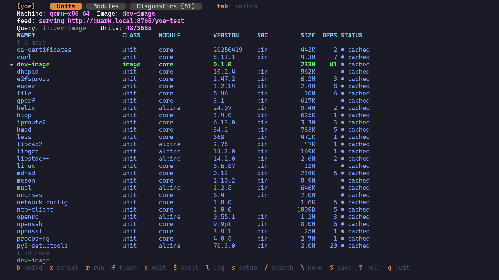

<p align="center">
  <a href="https://yoebuild.org/">
    
  </a>
</p>

# `[yoe]` _next generation_

**Fast tooling and builds. No cross-compiling headaches. Easy to
customize/upgrade/debug. One tool for both system engineers and application
developers to ship products faster.**

`[yoe]` _next generation_ is a build system (focused on Embedded Linux for now)
for teams shipping modern edge products. Components in Go, Rust, Zig, Python,
JS/TS, and C/C++ are supported. `[yoe]` releases often and tracks upstream
closely. The configuration language is easily processed by humans and AI. Build
on your laptop, on native hardware, or in cloud CI — one integrated tool, same
config, same results.

We took what we learned from many years of maintaining and building products
with the [Yoe Distribution](https://yoedistro.org/), started over, and built the
tool we always wanted.

_Note: Not everything in the documentation has been implemented yet as this
project is in the early stages._

## Is `[yoe]` Right for You?

`[yoe]` is not for everyone. If you are building a mission-critical system that
requires bit-for-bit reproducible builds, long-term release freezes, or
extensive compliance certification, use [Yocto](https://www.yoctoproject.org/) —
it is battle-tested for those requirements.

`[yoe]` is designed for edge systems that behave more like cloud systems — AI
workloads and modern-language applications — and for teams that track upstream
closely and prioritize fast iteration over strict reproducibility. If your
product ships frequent updates, runs containerized services, or depends heavily
on Go/Rust/Python ecosystems, `[yoe]` may be a better fit.

## 🚀 Getting Started

Prerequisites: Linux or macOS with Git and Docker installed. Windows users:
install WSL2 and use the Linux binary (Linux x86_64/Docker is the most tested
configuration). Claude Code is highly recommended, but not required.

```sh
# Download the yoe binary (Linux x86_64)
curl -L https://github.com/yoebuild/yoe/releases/latest/download/yoe-Linux-x86_64 -o yoe
# For other platforms, download from https://github.com/yoebuild/yoe/releases/latest

chmod +x yoe
mkdir -p ~/bin
mv yoe ~/bin/
# Make sure ~/bin is in your PATH (add to ~/.bashrc or ~/.zshrc if needed)
export PATH="$HOME/bin:$PATH"

# Create a new project
yoe init yoe-test
cd yoe-test

# Start the TUI (see screenshot below)
yoe

# Navigate to the base-image and press 'b' to build

# When build is complete, press 'r' to run (requires `qemu-system-x86_64` installed on your host)

# Log in a user: root, no password

# Power off when finished (inside running image)
poweroff
```

The TUI user interface:



`dev-image` is another included image with a few more things in it. Press the
`s` key to and configure the image. The '/' key modifies the unit query to
change what is displayed.

There are also CLI variants of the above commands (`build`, `run`, etc.).

**What just happened:**

1. `yoe init` created a project with a `PROJECT.star` config and a default
   x86_64 QEMU machine.
2. On first build, `yoe` automatically built a Docker container with the
   toolchain (gcc, make, etc.) and fetched the default unit modules from GitHub.
3. It built ~10 packages from source (busybox, linux kernel, openssl, etc.)
   inside the container, each isolated in its own bubblewrap sandbox.
4. It assembled a bootable disk image from those packages.
5. `yoe run` launched the image in QEMU with KVM acceleration.

Everything is in the project directory — no global state, no hidden caches
outside the tree.

## 🔧 Why This Is Possible Now

A decade ago, this combination wasn't realistic. Several things have changed:

1. **ARM and RISC-V hardware is fast enough to build natively.** Modern ARM
   boards and cloud instances (AWS Graviton, Hetzner CAX) build at full speed.
   For development, QEMU user-mode emulation runs ARM containers on x86 — no
   cross-toolchain needed.
2. **Modern languages bring their own package managers.** Go, Rust, Zig, and
   Python already handle dependency resolution, reproducible builds, and
   caching. `[yoe]` doesn't reinvent any of that — application developers use
   the same Cargo, Go modules, or pip they already know.
3. **AI can guide developers through the system.** The hardest part of embedded
   Linux is knowing what to configure and why. `[yoe]`'s metadata is structured
   Starlark — queryable, not buried in shell scripts — so an AI assistant can
   create units, diagnose build failures, and audit security without the
   developer memorizing the build system's quirks.

## 🧭 Values

1. **Be Pragmatic**. Leverage what already exists where it makes sense. We don't
   have any religion that everything needs to be built from source, or that we
   all need to build our own toolchains.
1. **The product developer experience is the top priority**. Other solutions are
   often not optimized for developers building products. This includes
   application developers as well as system engineers. Clear and concise
   communication is essential when things go wrong. Unintelligible stack traces
   are unacceptable.
1. **Optimized for small teams**. `[yoe]` is a tool for small teams to do big
   things. Large enterprises are welcome, but not our exclusive focus. There are
   plenty of enterprise tools (Bazel, Buck2, Maven, etc.); we will use ideas
   from these tools, but `[yoe]` aims to be something different.
1. **Scope is not limited to Embedded Linux**. Although Embedded Linux is our
   current focus, a tool like `[yoe]` could be used for any problem where you
   pull a lot of pieces together. At its heart, `[yoe]` is a tool for building
   complex systems.
1. **Track upstream closely.** Modern edge systems are more like the cloud than
   traditional embedded systems — they are connected, updated regularly, and
   expected to receive security patches throughout their lifetime. `[yoe]`
   assumes you will track upstream releases closely rather than freezing on a
   version for years. Updating a package should be easy and routine, not a
   high-risk event that requires a dedicated engineering effort.
1. **Vendor Neutral.** `[yoe]` is a vendor neutral project and welcomes BSPs and
   other units from any vendor. The goal is to build an integrated ecosystem
   like Zephyr.

## 🤖 Why AI-Native

Embedded Linux is hard not because the concepts are complex, but because there
are _many_ concepts that interact in non-obvious ways: toolchain flags,
dependency ordering, kernel configuration, package splitting, module
composition, image assembly, device trees, bootloaders. Traditional build
systems manage this complexity through complexity.

`[yoe]` takes a different approach: **Simplify things as much as possible.**
Starlark units are readable by both humans and AI. The dependency graph is
queryable. Build logs are structured. An AI assistant that understands all of
this can:

- **Create units from a URL or description** —
  `/new-unit https://github.com/example/myapp`
- **Diagnose build failures** by reading logs and the dependency graph —
  `/diagnose openssh`
- **Trace why a package is in your image** — `/why libssl`
- **Simulate changes before building** — `/what-if remove networkmanager`
- **Audit for CVEs and license compliance** — `/cve-check`, `/license-audit`
- **Generate machine definitions from board names** —
  `/new-machine "Raspberry Pi 5"`

See [AI Skills](docs/ai-skills.md) for the full catalog of AI-driven workflows.

## 💡 Inspirations

`[yoe]` draws selectively from existing systems, taking the best ideas from each
while avoiding their respective pain points:

- **Yocto** — machine abstraction, image composition, module architecture, OTA
  integration. Leave behind BitBake, sstate, cross-compilation complexity.
- **Buildroot** — the principle that simpler is better. Leave behind monolithic
  images and full-rebuild-on-config-change.
- **Arch** — rolling release, minimal base, PKGBUILD-style simplicity,
  documentation culture. Leave behind x86-centrism and manual administration.
- **Alpine** — apk package manager, busybox, minimal footprint, security
  defaults. Leave behind lack of BSP support.
- **Nix** — content-addressed caching, declarative configuration, hermetic
  builds, atomic rollback. Leave behind the Nix language and store-path
  complexity.
- **Google GN** — two-phase resolve-then-build model, config propagation through
  the dependency graph, build introspection commands, label-based target
  references for composability. Leave behind the C++-specific build model and
  Ninja generation.
- **Bazel** — Starlark as a build configuration language, hermetic sandboxed
  actions, content-addressed action caching, and remote build execution. Leave
  behind the monorepo bias, JVM runtime, and BUILD-file verbosity that make
  Bazel heavy for small teams.

See [Comparisons](docs/comparisons.md) for detailed analysis of how `[yoe]`
relates to each of these (and other) systems, including when you should use them
instead.

## ⚙️ Design

### 🏗️ A Single Tool

At its heart, `[yoe]` is a single tool — one Go binary that handles the entire
build flow, from fetching sources to assembling bootable images. It exposes
three interfaces: AI conversation, an interactive TUI, and a traditional CLI.
All three do the same things; use whichever fits the moment.

The tool handles:

- **TUI** — run `yoe` with no arguments for an interactive unit list with inline
  build status, background builds, search, and quick actions (edit, diagnose,
  clean).
- **Build orchestration** — invoke language-native build tools in the right
  order, manage caching, assemble outputs. Multiple images and targets live in a
  single build tree (like Yocto). No global lock or global resource: concurrent
  `yoe` invocations run in parallel, which is essential for rapid AI-driven
  development.
- **Machine/distro configuration** — define target boards and distribution
  profiles in Starlark — Python-like, deterministic, sandboxed.

See [The `yoe` Tool](docs/yoe-tool.md) for the full CLI reference,
[Unit & Configuration Format](docs/metadata-format.md) for the unit and config
spec, and [Build Languages](docs/build-languages.md) for the Starlark rationale.

Why Go: single static binary with no runtime dependencies, fast compilation,
excellent cross-compilation support (useful for shipping the tool itself), and a
strong standard library for file manipulation, process execution, and
networking.

### 🚫 No Cross Compilation

Instead of maintaining cross-toolchains, `[yoe]` targets native builds:

- **QEMU user-mode emulation** — build ARM64 or RISC-V images on any x86_64
  workstation. The build runs inside a genuine foreign-arch Docker container,
  transparently emulated via binfmt_misc. One command to set up
  (`yoe container binfmt`), then `--machine qemu-arm64` just works. ~5-20x
  slower than native, but fine for iterating on a few packages.
- **Native hardware** — build on the target architecture directly (ARM64 dev
  boards, RISC-V boards).
- **Cloud CI** — use native architecture runners (e.g., ARM64 GitHub Actions
  runners, AWS Graviton, Hetzner ARM boxes) for full-speed CI builds.
- **Per-unit build environment** — each unit runs in its own Docker container
  with bubblewrap sandboxing. Architecture is determined per unit, not globally,
  and build dependencies don't pollute the host or leak between units.

This eliminates an entire class of build issues (sysroot management, host
contamination, cross-pkg-config, etc.).

### 📦 Native Language Package Managers

Each language ecosystem manages its own dependencies:

| Language   | Package Manager | Lock File           |
| ---------- | --------------- | ------------------- |
| Go         | Go modules      | `go.sum`            |
| Rust       | Cargo           | `Cargo.lock`        |
| Python     | pip / uv        | `requirements.lock` |
| JavaScript | npm / pnpm      | `package-lock.json` |
| Zig        | Zig build       | `build.zig.zon`     |

`[yoe]` plays nicely with existing language caching infrastructure so builds are
fast and repeatable without re-downloading the internet.

### 🖥️ Kernel and System Image Tooling

While application builds use native language tooling, the system-level pieces
still need orchestration:

- **Kernel builds** — configure, build, and package kernels for target boards.
- **Root filesystem assembly** — combine built artifacts into a bootable image
  (ext4, squashfs, etc.).
- **Device tree / bootloader management** — board-specific configuration.
- **OTA / update support** — image-based device management (full image updates,
  OSTree, BDiff) integrated with update frameworks (RAUC, SWUpdate, etc.).
  Container workloads on the target device are on the roadmap.

This is where `[yoe]` tooling (written in Go and Starlark) provides value —
similar to what `bitbake` and `wic` do in Yocto, but simpler and more
opinionated.

### 📋 Package Management: apk

`[yoe]` uses [apk](https://wiki.alpinelinux.org/wiki/Alpine_Package_Keeper)
(Alpine Package Keeper) as its package manager. It is important to distinguish
between **units** and **packages** — these are separate concepts:

- **Units** are build-time definitions (Starlark `.star` files in the project
  tree) that describe _how_ to build software. See
  [Unit & Configuration Format](docs/metadata-format.md).
- **Packages** are installable artifacts (`.apk` files) that units produce. They
  are what gets installed into root filesystem images and onto devices.

This separation means units are a development/CI concern, while packages are a
deployment/device concern. You can build packages once and install them on many
devices without needing the unit tree. Rebuilding from source is first class but
not required — every package is fully traceable to its unit, with no golden
images.

Why apk over apt and dnf:

- **Speed** — apk operations are near-instantaneous. Install, remove, and
  upgrade are measured in milliseconds, not seconds.
- **Simple format** — an `.apk` package is a signed tar.gz with a `.PKGINFO`
  metadata file. No complex archive-in-archive wrapping.
- **Small footprint** — apk-tools is tiny, appropriate for embedded targets.
- **Active development** — apk 3.x adds content-addressed storage and atomic
  transactions, aligning with `[yoe]`'s Nix-inspired reproducibility goals.
- **Works with glibc** — apk is not tied to musl; it works with any libc.
  `[yoe]` runs its own package repositories, not Alpine's.
- **On-device package management** — devices can pull updates from a `[yoe]`
  package repository, enabling incremental OTA updates (install only changed
  packages) alongside full image updates.

The `[yoe]` build tooling invokes units to produce `.apk` packages, which are
published to a repository. Image assembly then uses `apk` to install packages
into a root filesystem, just as Alpine does.

### 🧱 Base System

The base userspace today is **busybox** on top of a C library (musl today, glibc
targeted), with busybox's built-in init as PID 1:

- **C library** — the project currently uses musl (inherited from Alpine's
  toolchain), with a planned move to glibc for maximum compatibility with
  pre-built binaries, language runtimes (Go, Rust, Python, Node.js), and
  third-party libraries.
- **busybox** — provides the core userspace utilities (sh, coreutils, etc.) and
  init in a single small binary. Keeps the base image minimal while still giving
  a functional shell environment for debugging and scripting.
- **Init (current: busybox init)** — busybox's built-in init handles PID 1
  duties today. **systemd will be an option in the future**: it is
  well-understood, has rich service management, and provides integrated journal
  logging, network management, device management (udev), and container
  integration. The trade-off is size and complexity.

This combination gives a small but fully functional base system that can run
real-world services without surprises.

### 🔒 Reproducibility

`[yoe]` targets **functional equivalence**, not bit-for-bit reproducibility.
Same inputs produce functionally identical outputs — same behavior, same files,
same permissions — but the bytes may differ due to embedded timestamps, archive
member ordering, or compiler non-determinism.

This is a deliberate trade-off:

- **Bit-for-bit reproducibility** (what Nix aspires to) requires patching
  upstream build systems to eliminate timestamps (`__DATE__`, `.pyc` mtime),
  enforce file ordering in archives, and strip or fix build IDs. This is
  enormous effort — Nix still hasn't fully achieved it after 20 years — and the
  primary benefit (verifying a binary matches its source by rebuilding) is
  relevant mainly for high-assurance supply-chain contexts.
- **Functional equivalence** gets the practical benefits — reliable caching,
  hermetic builds, provenance tracking — without the patching burden. Bubblewrap
  isolation prevents host contamination. Content-addressed input hashing —
  combining hashes of the unit, its source, and its dependencies — ensures cache
  hits are reliable. Starlark evaluation is deterministic by design. The
  remaining non-determinism (timestamps, ordering within packages) doesn't
  affect functionality or caching.

The caching model does not depend on output determinism. Cache keys are computed
from _inputs_ (unit content, source hash, dependency `.apk` hashes, build
flags), not _outputs_. If inputs haven't changed, the cached output is used
regardless of whether a fresh build would produce identical bytes.

## 📚 Documentation

- [AI Skills](docs/ai-skills.md) — AI-driven workflows for unit creation, build
  debugging, security auditing, and more
- [The `yoe` Tool](docs/yoe-tool.md) — CLI reference for building, imaging, and
  flashing
- [Unit & Configuration Format](docs/metadata-format.md) — Starlark unit and
  configuration spec
- [Naming and Resolution](docs/naming-and-resolution.md) — how modules, units,
  and dependencies are named, referenced, and resolved
- [File Templates](docs/file-templates.md) — moving inline file content out of
  Starlark units into external templates
- [Starlark Packaging and Image Assembly](docs/starlark-packaging-images.md) —
  composable Starlark tasks for packaging and image assembly
- [Build Dependencies and Caching](docs/build-dependencies-and-caching.md) —
  containers for host tools, apk sysroot for libraries, language-native package
  managers for everything else
- [Build Environment](docs/build-environment.md) — bootstrap, host tools, and
  build isolation
- [Build Languages](docs/build-languages.md) — analysis of Starlark, CUE, Nix,
  and other embeddable languages for unit definitions
- [Development Environments](docs/dev-env.md) — the no-SDK model, `yoe shell`
  for interactive dev, and `yoe bundle` for air-gapped distribution
- [Testing](docs/testing.md) — testing strategy across Go logic, package QA,
  image smoke tests, and on-device test runs
- [apk Signing](docs/signing.md) — keypair generation, signature verification,
  and on-device trust
- [On-Device Package Management](docs/on-device-apk.md) — using `apk` on booted
  yoe systems to install and upgrade packages
- [Feed Server and `yoe deploy`](docs/feed-server.md) — dev-loop for serving the
  project apk repo and installing units on running devices
- [Containers on yoe Images](docs/containers.md) — design for running Docker /
  Podman / containerd workloads on yoe-built devices
- [libc, init, and the Rootfs Base](docs/libc-and-init.md) — the default base of
  musl, busybox, and OpenRC, and the path to glibc/systemd for edge-AI hardware
- [module-alpine](docs/module-alpine.md) — wrapping prebuilt Alpine packages as
  yoe units
- [Comparisons](docs/comparisons.md) — how `[yoe]` relates to Yocto, Buildroot,
  Alpine, Arch, and NixOS
- [Roadmap](docs/roadmap.md) — existing units and what's needed for a complete
  base system

## 🤝 Contributing

Contributions are welcome — especially BSPs for new boards and units for new
packages. AI-assisted contributions are fine; just make sure the result actually
works, and keep PRs small and reviewable.

## 💚 Sponsors

`[yoe]` is supported by:

<a href="https://bec-systems.com/">
  
</a>

## 📄 License

`[yoe]` is licensed under the [Apache License 2.0](LICENSE).
