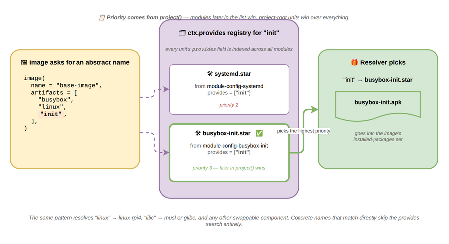
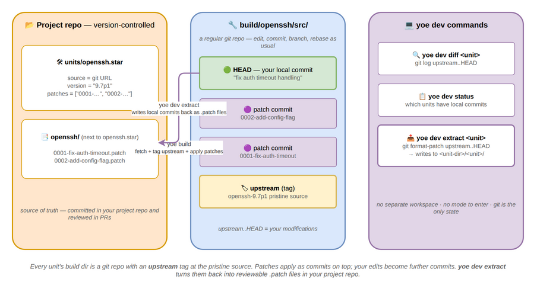

# Architecture

This page introduces yoe's core concepts and traces a unit through its lifecycle
— **build**, **packaging**, **deployment**, and **development**. Use it as a map
before diving into the reference docs.

## Core concepts

The four nouns at the heart of yoe: **project**, **module**, **unit**, and
**package**.

### Project

The **project** is the top of the tree. It is a directory containing a
`PROJECT.star` file, which declares:

- which **modules** the project uses (and at what Git ref),
- the **machine** to build for,
- any `prefer_modules` resolution pins,
- project-local **units** under `units/` and machines under `machines/`.

A project is what you check into version control for a specific product. It is
what `yoe init` scaffolds and what the `yoe` CLI operates on from your working
directory.

See [Unit & Configuration Format](metadata-format.md) for the full
`PROJECT.star` surface and [Naming and Resolution](naming-and-resolution.md) for
how module references and prefer-rules work.

### Modules

A **module** is a Git repository (or a subdirectory of one) that provides
reusable building blocks: classes, units, machine definitions, container
definitions, and image definitions. Projects compose modules to get the pieces
they need.

Typical modules:

- `module-core` — base classes (autotools, cmake, go), common units (busybox,
  openssl, openssh, kernel), and reference images.
- `module-bsp` and `module-jetson` — BSP modules with machine definitions
  (Raspberry Pi 4/5, BeaglePlay, NVIDIA Jetson) and the matching kernel /
  bootloader / firmware units.
- `module-alpine` — passthrough access to upstream Alpine `.apk` packages.
- `module-debian` — passthrough access to upstream Debian `.deb` packages
  (experimental; see [module-debian.md](module-debian.md) for current status and
  limitations).

Modules are referenced by URL and Git ref in `PROJECT.star`. The `[yoe]` CLI
clones them into the project's cache. See
[Naming and Resolution](naming-and-resolution.md) for module naming, directory
structure, and load-path semantics.

### Units

A **unit** is a `.star` file describing _how to build_ a single piece of
software. Units live in a module's `units/` directory (or the project's own
`units/`), and they call into a **class** (`autotools`, `cmake`, `go`, …) that
encodes the build pattern.

A unit declares its source, version, dependencies, and any build-time
configuration. The `[yoe]` build system resolves the DAG of units, runs each in
its own sandboxed build environment, and installs results into the build sysroot
so downstream units can find them.

Units are inputs to the build system: developer-edited, version-controlled, and
a CI concern. See [Unit & Configuration Format](metadata-format.md) for the
unit, class, and machine API.

### Packages

A **package** is the build output — an `.apk` for alpine-targeted units or a
`.deb` for debian-targeted units. Packages are content-addressed, cached,
signed, and published to a repository. They are consumed by `apk` (alpine
images) or `dpkg` / `apt` (debian images) at image-assembly time and by the
on-device package manager for over-the-air updates.

One unit produces one package today — `.apk` or `.deb` is chosen per the
consuming image's distro, not per unit. A small set of subpackage splits
(`-dev`, `-dbg`) is planned for cases where the runtime image should not carry
headers or debug info. See
[metadata-format.md#units-vs-packages](metadata-format.md#units-vs-packages) for
the contract between units and packages, [apk Signing](signing.md) for the
alpine pipeline, [module-debian.md](module-debian.md) for the debian pipeline,
and [Feed Server](feed-server.md) for how packages get published and deployed.

### How they fit together

The build flow is **unit → build → .apk → repository → image / device**. The
conceptual flow is **project references modules, modules provide units, units
produce packages, packages assemble into images**:

| Concept | Lives in            | Produced by              | Consumed by                 |
| ------- | ------------------- | ------------------------ | --------------------------- |
| Project | Your product repo   | You                      | The `yoe` CLI               |
| Module  | A Git repo          | Module authors           | Projects                    |
| Unit    | A module or project | Module / project authors | The build system            |
| Package | A package repo      | The build system         | `apk` (image and on-device) |

For an explanation of why this split exists — versus Yocto's recipe/layer model
— see [Comparisons](comparisons.md). For the language used to express units and
configuration, see [Build & Configuration Languages](build-languages.md).

## Build

Building a unit means turning declared inputs into a packaged artifact. Three
angles matter: the environment the build runs in, the inputs that feed it, and
how an abstract name like `linux` finds a concrete provider.

### The build environment

Builds run on the host through a tiered environment. The host provides only
`yoe` and a container runtime; everything else is nested inside the container
that `yoe` spawns:

Each unit builds inside its own bwrap sandbox with only its declared deps
visible. See [Build Environment](build-environment.md) for the tier-by-tier
details, the bootstrap process, and the rationale behind bwrap-over-Docker for
per-unit isolation.

### Dependency sources

A unit pulls inputs from four independent sources, each managed by the right
tool for the job:

Host tools (compilers, language runtimes) come from Docker containers; library
deps from the apk sysroot built up by other yoe units; distro packages (full
libraries, runtime services, applications) come from prebuilt upstream apks via
`module-alpine`; and language-native deps (Go modules, Cargo crates, pip wheels)
are handled by each language's own package manager inside the container. See
[Build Dependencies and Caching](build-dependencies-and-caching.md) for why this
split exists and how it interacts with the build cache, and
[Alpine apk Passthrough](apk-passthrough.md) for the prebuilt-apk path.

### Abstract-name resolution

An image's `artifacts` list and a unit's `runtime_deps`/`build_deps` can
reference _abstract_ names like `linux` or `init`. The resolver matches each
abstract name against a registry of `provides` claims from every unit across
every module, with module declaration order in `project()` deciding ties:

This is what makes images machine- and project-portable: an image asks for
`linux`, and a Raspberry Pi machine config points `linux` at `linux-rpi4` while
a Jetson machine points it at a Tegra kernel — same image, different hardware.
Concrete names that match directly skip the registry.

For multi-distro projects, resolution is also distro-aware: a unit tagged for
one distro is invisible to images of another, and virtuals like `toolchain`
route to the matching toolchain unit (`toolchain-musl` for alpine,
`toolchain-glibc` for debian) via the same `provides` mechanism. See
[Naming and Resolution](naming-and-resolution.md) for collision rules, name
shadowing, and the `replaces` mechanism, and
[Catalog and Materialization](catalog.md) for the in-memory data structures that
hold units while a project is being evaluated, how synthetic feed units
materialize lazily, the distro visibility filter, and the working-set sizes the
resolver operates at.

## Packaging

Every artifact published by yoe — whether built from source or repacked from a
distro — flows through one of two parallel format pipelines, both signed by the
project key. The pipelines mirror each other: same content-addressed cache, same
source paths, same `yoe build` invocation; only the on-disk format and signing
mechanism differ to match the consuming image's distro.

- **`.apk` pipeline** — used by alpine images. Per-`.apk` RSA-SHA1 signature
  plus a signed `APKINDEX.tar.gz` per arch. Verified on-device by apk-tools.
- **`.deb` pipeline** — used by debian images. Per-`.deb` SHA256 in the
  `Packages` file plus a clearsign-GPG `InRelease` per suite. Verified on-device
  by apt with `Signed-By:` scoped to the project keyring. Experimental — see
  [module-debian.md](module-debian.md) for current status.

A single project can have both — one image targeting alpine and another
targeting debian — and each lands in its own per-distro repository subtree.

### Distro passthrough

`module-alpine` units don't rebuild Alpine packages — they repack each upstream
`.apk`, swapping the signature so the device's apk-tools verifies against the
project key like any other yoe-built package:

The control segment (PKGINFO, install scripts, file checksums) and data segment
pass through byte-for-byte, so apk-tools on the device sees Alpine's metadata,
install behavior, and shared-library deps unchanged. Only the signature changes.
See [Alpine apk Passthrough](apk-passthrough.md) for the two-metadata-systems
story (`.star` fields drive the yoe resolver; PKGINFO drives apk-tools at
install time) and the noarch routing details.

`module-debian` follows a parallel but distinct pattern. Upstream `.deb` files
are mirrored verbatim (no repack), and only the project's `InRelease` is
re-signed with the project's GPG key. Each downloaded `.deb`'s SHA256 is
verified at mirror time against the upstream-signed `Packages` entry, and the
device's apt trust is scoped to the project key via deb822 `Signed-By:` — so the
per-`.deb` upstream signature isn't on the trust path at all, only the
project-signed `InRelease` and the per-`.deb` SHA256 inside it. See
[module-debian.md](module-debian.md) for the verbatim-mirror rationale and the
`Valid-Until` posture.

### Signing and trust

Each pipeline has its own signing primitive, but both anchor on the same
per-project key bootstrapped under `~/.config/yoe/keys/<project>/`:

- **apk pipeline** — RSA-SHA1 per-`.apk` signature + signed `APKINDEX.tar.gz`,
  public half shipped in the rootfs via `base-files`.

  

- **deb pipeline** — clearsign-GPG `InRelease` per suite, public key staged at
  `/etc/apt/keyrings/<project>.gpg` and referenced from the deb822 `.sources`
  file's `Signed-By:` field (scoping trust to the project source only, not the
  system-wide trust store). HTTPS-only URLs enforced at evaluation. Experimental
  status applies.

For both: the private key never leaves the workstation, and the public key
travels through two independent channels (the project repo for inspection, the
rootfs for verification). See [apk Signing](signing.md) for the alpine key
generation / rotation surface and the exact apk bytes that get signed. See
[module-debian.md](module-debian.md) for the deb trust details.

## Deployment

A unit's job ends when its package lands on a running device. The same apk repo
and signing key serve image-time installs, the dev loop, and on-device OTA, so
there's only one delivery mechanism to understand.

### Reaching a running device

Built packages flow from the workstation to a running yoe device through a small
set of orthogonal channels: mDNS for discovery, HTTP for the apk pull, and SSH
for orchestration. The same apk repo, signing key, and `APKINDEX` serve
image-time installs, the dev loop, and on-device OTA:

`yoe serve` is the long-lived HTTP + mDNS server, `yoe device repo add` does the
one-time `/etc/apk/repositories` setup, and `yoe deploy` orchestrates the whole
"build → ship → install" round trip. See
[Feed Server and yoe deploy](feed-server.md) for the workflows, command
reference, and trust model.

## Development

When a unit needs local changes — a fix to upstream, a vendored patch, an
experimental tweak — yoe leans on plain git rather than a separate "dev mode."

### Source modifications round-trip

Every unit's build directory is a regular git repo. Upstream source is checked
out at the version pinned by the unit and tagged `upstream`; any patches the
unit declares are applied as commits on top; your local edits become further
commits. There's no separate workspace, no mode to enter:

`yoe dev extract` turns the commits above `upstream` back into reviewable
`.patch` files in your project repo — `git format-patch` under the hood — so the
source of truth stays version-controlled even when iteration happens in the
build dir. See [`yoe dev`](yoe-tool.md#yoe-dev) for the command surface and the
upstream-rebase workflow.
