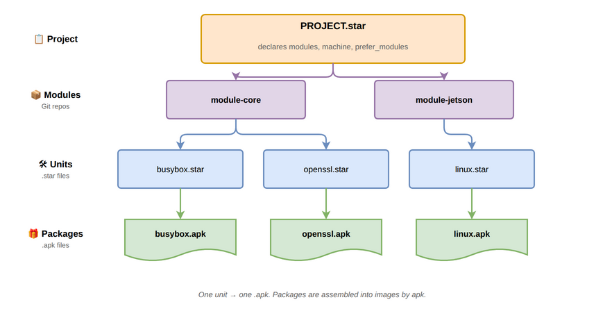

# Architecture

This page introduces the four core concepts in `[yoe]` — **project**,
**module**, **unit**, and **package** — and how they relate. Use it as a map
before diving into the reference docs.

## Project

The **project** is the top of the tree. It is a directory containing a
`PROJECT.star` file, which declares:

- which **modules** the project uses (and at what Git ref),
- the **machine** to build for,
- any `prefer_modules` resolution pins,
- project-local **units** under `units/` and machines under `machines/`.

A project is what you check into version control for a specific product. It is
what `yoe init` scaffolds and what the `yoe` CLI operates on from your working
directory.

See [Unit & Configuration Format](metadata-format.md) for the full
`PROJECT.star` surface and [Naming and Resolution](naming-and-resolution.md) for
how module references and prefer-rules work.

## Modules

A **module** is a Git repository (or a subdirectory of one) that provides
reusable building blocks: classes, units, machine definitions, container
definitions, and image definitions. Projects compose modules to get the pieces
they need.

Typical modules:

- `module-core` — base classes (autotools, cmake, go), common units (busybox,
  openssl, openssh, kernel), and reference images.
- A BSP module (e.g. `module-jetson`, `module-rpi`) — machine definitions and
  hardware-specific units for a board family.
- `module-alpine` — passthrough access to upstream Alpine `.apk` packages.

Modules are referenced by URL and Git ref in `PROJECT.star`. The `[yoe]` CLI
clones them into the project's cache. See
[Naming and Resolution](naming-and-resolution.md) for module naming, directory
structure, and load-path semantics.

## Units

A **unit** is a `.star` file describing _how to build_ a single piece of
software. Units live in a module's `units/` directory (or the project's own
`units/`), and they call into a **class** (`autotools`, `cmake`, `go`, …) that
encodes the build pattern.

A unit declares its source, version, dependencies, and any build-time
configuration. The `[yoe]` build system resolves the DAG of units, runs each in
its own sandboxed build environment, and installs results into the build sysroot
so downstream units can find them.

Units are inputs to the build system: developer-edited, version-controlled, and
a CI concern. See [Unit & Configuration Format](metadata-format.md) for the
unit, class, and machine API.

## Packages

A **package** is the build output — an `.apk` file that the unit produces.
Packages are content-addressed, cached, signed, and published to a repository.
They are consumed by `apk` at image-assembly time and by the on-device package
manager for over-the-air updates.

One unit produces one `.apk` today. A small set of subpackage splits (`-dev`,
`-dbg`) is planned for cases where the runtime image should not carry headers or
debug info. See
[metadata-format.md#units-vs-packages](metadata-format.md#units-vs-packages) for
the contract between units and packages, and [apk Signing](signing.md) /
[Feed Server](feed-server.md) for how packages get published and deployed.

## How they fit together

The build flow is **unit → build → .apk → repository → image / device**. The
conceptual flow is **project references modules, modules provide units, units
produce packages, packages assemble into images**:

| Concept | Lives in            | Produced by              | Consumed by                 |
| ------- | ------------------- | ------------------------ | --------------------------- |
| Project | Your product repo   | You                      | The `yoe` CLI               |
| Module  | A Git repo          | Module authors           | Projects                    |
| Unit    | A module or project | Module / project authors | The build system            |
| Package | A package repo      | The build system         | `apk` (image and on-device) |

For an explanation of why this split exists — versus Yocto's recipe/layer model
— see [Comparisons](comparisons.md). For the language used to express units and
configuration, see [Build & Configuration Languages](build-languages.md).
