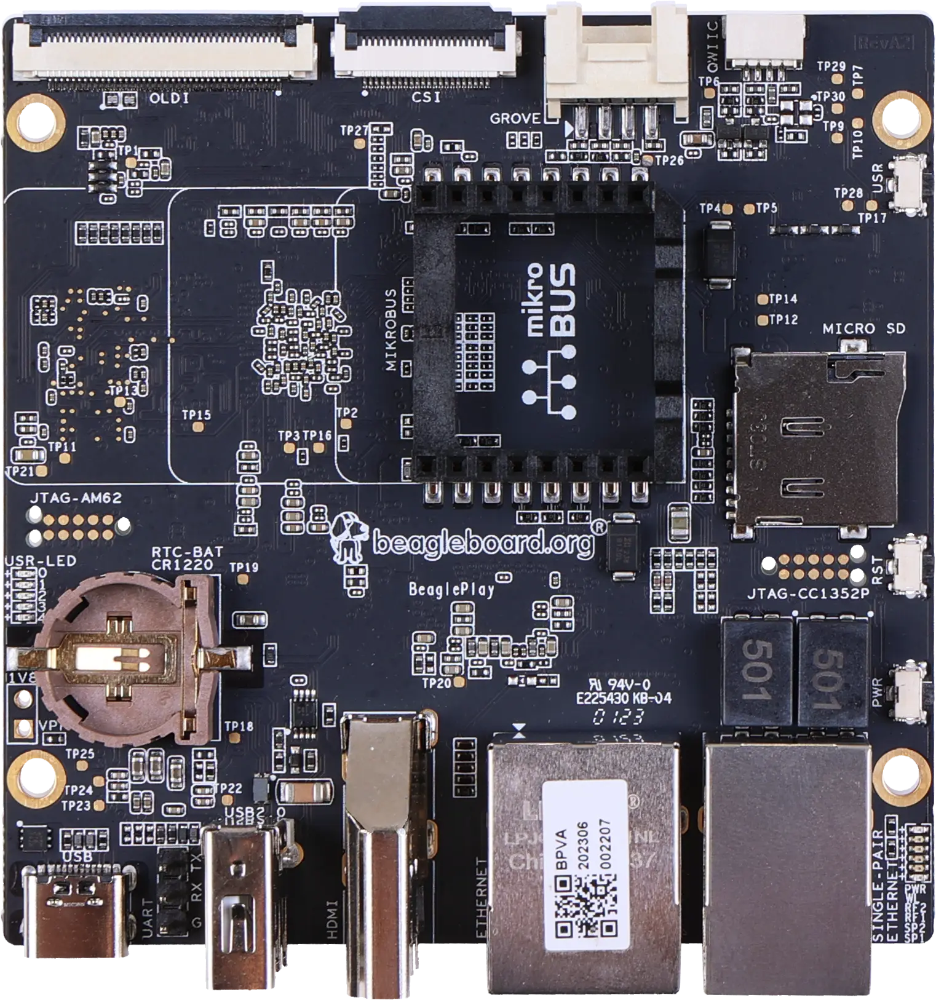

# BeaglePlay BSP

This page documents the BeaglePlay board support in yoe: which units make up the
BSP, how they cooperate at build time, and how the resulting artifacts are
arranged on the SD card or eMMC.

The hardware is BeagleBoard.org's BeaglePlay, built on TI's AM625 SoC (quad
Cortex-A53 application cores, a Cortex-R5F MCU island, and a Cortex-M4F dead-man
core). The cores run with help from TI's K3 security firmware ("TIFS" / "SYSFW")
and a small device-manager ("DM") payload — both shipped as signed blobs by TI.

The machine descriptor lives at `modules/module-bsp/machines/beagleplay.star`;
everything below is built by units under `modules/module-bsp/units/bsp/`.



_Photo: [BeagleBoard.org](https://docs.beagleboard.org/boards/beagleplay/), CC
BY-SA 4.0._

## Running it on hardware

After `yoe build --machine beagleplay base-image` (or whatever image you've
picked), yoe produces a single disk image under
`build/<image>.beagleplay/disk.img` (the exact path depends on the image's
`disk` task). The next steps are: write it to a microSD card, connect serial

- power, and power on.

Authoritative hardware reference for everything below:
<https://docs.beagleboard.org/boards/beagleplay/>. The notes here cover the
yoe-specific bits and a quick start; for pinouts, mechanical layout, and silicon
details, defer to BeagleBoard.org's docs.

### Writing the image to a microSD card

Two ways:

- **TUI** — open `yoe` (no arguments), highlight the image unit, press `f`. The
  flash UI shows the candidate removable devices and you pick one. This is the
  fast path during development.
- **CLI** — `yoe flash <image-unit> <device>`. List candidates first:

  ```
  yoe flash list
  ```

  That prints the `/dev/sdN` (or `/dev/mmcblkN`) entries with size and model so
  you can identify the card. Then write:

  ```
  yoe flash --machine beagleplay base-image /dev/sdN
  ```

  Swap `base-image` for whichever image unit you built (`jukebox-image`, your
  own, …). `--dry-run` shows what it would do without touching the device;
  `--yes` skips the confirmation prompt for scripted flows.

Either path picks the right disk image from the build tree, refuses to write to
anything mounted or anything that looks like an internal disk, and confirms
before overwriting. If a partition on the target is mounted (most desktops
auto-mount removable media on insert), the flash exits with a message — unmount
the partitions and retry. **Read the device path it's about to write to**;
flashing the wrong block device will silently overwrite it.

### Choosing boot media (SD vs eMMC)

The AM625 ROM checks boot sources in a sequence set by the SYSBOOT straps on the
board. On BeaglePlay the default boot order looks at the on-board 16 GB eMMC
first.

To boot from microSD instead, **hold the `USR` button while applying power or
pressing reset**. That overrides the ROM's boot search to start at the SD slot.
Release the button once you see the SPL banner on the serial console (~1
second). The override is per-boot — power-cycling without the button reverts to
eMMC.

For development you typically want microSD boot: it's easy to re-flash, hard to
brick, and leaves the eMMC's contents alone. For production you'd flash a known
image into eMMC (either by booting an SD-based installer or over USB-DFU) and
ship without an SD card.

The yoe image is identical for both paths — the boot chain on eMMC and on SD
comes from the same `tiboot3.bin` / `tispl.bin` / `u-boot.img` artifacts. yoe's
`uEnv.txt` hardcodes `root=/dev/mmcblk1p2` (eMMC); if you boot off SD without
re-flashing eMMC, the kernel will still try to mount the eMMC's rootfs. Either
flash both, or edit `bootargs` to `root=/dev/mmcblk0p2` for SD-only.

### Power

BeaglePlay takes 5 V over USB-C on the dedicated power connector. A phone-class
5 V / 1 A supply is enough for the board itself idling. Plan for **at least 3
A** in practice — a class-compliant USB-C charger (a laptop / phone charger that
negotiates 5 V / 3 A) is the cheapest path. Underpowering shows up as kernel
crashes during DRAM stress, WiFi disconnects under load, or the board silently
rebooting once anything is plugged into USB.

The power connector is not the same physical port as the debug serial-USB. Read
the silkscreen.

### Serial console

The kernel and U-Boot both use the SoC's `UART0` (Linux `ttyS2`) at **115200
8N1**, no flow control. This is the same setting `uEnv.txt` expects and what
`am62xx.inc` upstream uses, so any client targeting "BeaglePlay serial console"
will be at 115200 by default.

BeaglePlay does **not** have an on-board USB-to-serial bridge. The debug UART is
brought out on a 3-pin header wired in the **Raspberry Pi USB-to-TTL serial
cable** pinout — the same `GND` / `RXD` / `TXD` layout the standard Pi debug
cables use. You'll need an external adapter:

- **Recommended: FTDI TTL-232R-RPi**
  ([product page](https://ftdichip.com/products/ttl-232r-rpi/) ·
  [Digi-Key](https://www.digikey.com/en/products/detail/ftdi-future-technology-devices-international-ltd/TTL-232R-RPI/4382044)).
  Purpose-built for the Pi-style header, 3.3 V signals, genuine FTDI silicon (so
  the host's `ftdi_sio` driver picks it up reliably and you don't fight
  knock-off CP210x / CH340 driver quirks). Plug-and-play with no wiring
  decisions.
- Any other 3.3 V USB-TTL adapter (Adafruit 954, generic FTDI/CP210x/CH340
  dongles) works too — connect three jumpers, leave the 5 V lead disconnected
  since the board has its own power.

Wiring is "cross-over": the cable's **TX goes to the board's RX**, and vice
versa. `GND` to `GND`. Check the silkscreen on the BeaglePlay header for `RX` /
`TX` markings — those refer to the board's signals.

Once wired, plug the USB end into the host; it enumerates as `/dev/ttyUSB0`
(FTDI / CH340 / CP210x) or `/dev/ttyACM0` (some CDC ACM adapters). Open it at
115200 with [tio](https://github.com/tio/tio):

```
tio -b 115200 /dev/ttyUSB0
```

If nothing appears after power-on:

- Swap RX/TX. The single most common mistake.
- Confirm the adapter is **3.3 V**, not 5 V. A 5 V adapter on the AM625's UART
  pins is the fastest way to brick the SoC's UART block.
- `dmesg | tail` on the host — the USB-TTL adapter should enumerate within a
  second or two of plugging in. If it doesn't, the cable / dongle is the issue,
  not the board.

### First boot

A successful boot prints (roughly, abbreviated):

```
U-Boot SPL 2025.10 ...                  ← R5 SPL (from tiboot3.bin)
Trying to boot from MMC1                 ← reading tispl.bin
U-Boot SPL 2025.10 ...                  ← A53 SPL (from tispl.bin)
NOTICE:  BL31: ...                       ← TF-A handoff
I/TC: OP-TEE version: 4.9.0 ...          ← OP-TEE handoff
U-Boot 2025.10 ...                       ← U-Boot proper
Hit any key to stop autoboot:
...
Booting Linux on physical CPU 0x...      ← kernel
...
Welcome to <hostname>
<hostname> login:
```

The default credentials from `base-files-*` are `root` (no password) and `user`
/ `password`. **Change them before connecting the board to any network you don't
fully control** — the OpenSSH unit defaults to enabled once the package lands in
the image.

If the boot stops at U-Boot's `Hit any key` prompt and never autoboots, either
`uEnv.txt` wasn't found on the boot partition, or `uenvcmd` failed mid-way. Drop
to the U-Boot shell, `ls mmc 1:1` to see what's on the FAT partition, and re-run
the load commands one by one to see which one errors.

## Boot chain at a glance

The AM625 boot ROM expects a multi-stage handoff. Each blob feeds the next, and
most of the blobs are themselves FIT images that bundle code from several
upstream projects.

```
ROM (AM625)
  └── tiboot3.bin                  ← U-Boot R5 SPL + TIFS + DM
        └── tispl.bin              ← U-Boot A53 SPL + BL31 (TF-A) + BL32 (OP-TEE) + DM
              └── u-boot.img       ← U-Boot proper (A53)
                    └── Image      ← Linux kernel (arm64) + DTB
                          └── init ← OpenRC (busybox PID 1)
```

Each arrow is "loads and jumps to". Two CPU clusters take turns: the R5F brings
the secure firmware up first, then hands the SoC over to the A53s for the rest
of the chain.

## The units

| Unit                   | Produces                                                     | Stage        | Notes                         |
| ---------------------- | ------------------------------------------------------------ | ------------ | ----------------------------- |
| `ti-linux-firmware`    | `/lib/firmware/{ti-sysfw,ti-dm,...}/`                        | binman input | TI blobs, no compile          |
| `u-boot-beagleplay-r5` | `boot/tiboot3.bin`                                           | ROM →        | R5F SPL, embeds TIFS + DM     |
| `tfa-k3`               | `/lib/firmware/bl31.bin`                                     | binman input | EL3 secure monitor            |
| `optee-k3`             | `/lib/firmware/bl32.bin`                                     | binman input | Trusted Execution Environment |
| `u-boot-beagleplay`    | `boot/tispl.bin`, `boot/u-boot.img`                          | tiboot3 →    | A53 SPL + U-Boot proper       |
| `linux-beagleplay`     | `boot/Image`, `boot/k3-am625-beagleplay.dtb`, kernel modules | u-boot.img → | Beagle's 6.12 fork            |
| `beagleplay-config`    | `boot/uEnv.txt`                                              | u-boot reads | bootargs + boot script        |

Sources and pinning:

- **`ti-linux-firmware`** — `git://git.ti.com/...` branch `ti-linux-firmware`,
  prebuilt blobs only. Cadence/PRU/etc. also ship through this unit so other
  rootfs units can pick what they need without re-cloning.
- **`tfa-k3`** — `git.trustedfirmware.org/TF-A` `master`. K3 platform support
  lives only on master (no per-release tag), and meta-ti pins to a master
  SRCREV; we follow the same branch so future syncs roll forward.
- **`optee-k3`** — upstream `OP-TEE/optee_os` at tag `4.9.0`, mirroring
  meta-ti's `optee-os-ti-version.inc`.
- **`u-boot-beagleplay` / `u-boot-beagleplay-r5`** — both build from
  `github.com/beagleboard/u-boot` branch `v2025.10-Beagle`. Same tree, two
  defconfigs (`_a53_` and `_r5_`), so they share the dep chain for build tools.
- **`linux-beagleplay`** — `github.com/beagleboard/linux` branch
  `v6.12.43-ti-arm64-r54`, the AM625 device tree + cape overlays that meta-
  beagle ships.
- **`beagleplay-config`** — local Starlark, generates `uEnv.txt` only.

All units build in the `toolchain-musl` container with
`container_arch = "target"`, i.e. the aarch64 Alpine container under QEMU
user-mode. There is no cross-compilation in the conventional sense — the build
sees the target ISA as native. The R5 SPL is the one exception (Cortex-R5F is
armv7-R, an ISA the aarch64 toolchain can't emit) and pulls Alpine's
`gcc-arm-none-eabi` cross toolchain via `module-alpine`.

## Stage-by-stage walkthrough

### Stage 0: ROM

The AM625 ROM is masked silicon. On power-up it reads `tiboot3.bin` from the
configured boot media (SD MMC0 / eMMC MMC1 / OSPI, selected by SYSBOOT straps).
The file is a FIT image: the ROM walks it, verifies signatures against TI's keys
(or, on a GP — General-Purpose — part, accepts a self-signed blob), and starts
execution on the R5F.

### Stage 1: R5F SPL — `tiboot3.bin`

Built by `u-boot-beagleplay-r5`. The output `tiboot3.bin` packs three things via
binman:

1. **R5 SPL** — early U-Boot, runs on the Cortex-R5F.
2. **TIFS / SYSFW** — `ti-sysfw/ti-fs-firmware-am62x-gp-acl.bin` from
   `ti-linux-firmware`. The R5 SPL hands the SoC over to TIFS; from that point
   on, every privileged operation (power, clock, security) is brokered through
   TIFS via the TI SCI mailbox protocol.
3. **DM firmware** — `ti-dm/am62xx/...xer5f` from `ti-linux-firmware`. The
   "Device Manager" runs alongside TIFS on the R5 cluster and handles non-secure
   resource management once Linux is up.

The R5 SPL initializes DDR through the K3 DDR driver, sets up the first SD/eMMC
controller, and loads the next stage off the FAT partition.

### Stage 2: A53 SPL — `tispl.bin`

Built by `u-boot-beagleplay`. Another binman-assembled FIT, this time holding:

1. **A53 SPL** — second-stage U-Boot, runs on Cortex-A53.
2. **BL31** — `tfa-k3`'s `bl31.bin`, the Arm TF-A secure monitor (runs at EL3,
   owns SMCs, dispatches to OP-TEE).
3. **BL32** — `optee-k3`'s `bl32.bin` (= `tee-pager_v2.bin`), the OP-TEE OS
   running in the secure world (S-EL1).
4. **DM firmware** — same `ti-dm` payload, reused here because the A53 SPL
   re-loads it once it has full access to system memory.

These resolve through the merged sysroot — `tfa-k3` and `optee-k3` install their
outputs to `/lib/firmware/bl{31,32}.bin`, and `u-boot-beagleplay`'s make line
names them with `BL31=` / `TEE=` / `TI_DM=` / `BINMAN_INDIRS=`. binman then
sucks them into the FIT.

After loading, the A53 SPL parks BL31 at EL3 and BL32 in the secure world, then
jumps to U-Boot proper at EL2.

### Stage 3: U-Boot proper — `u-boot.img`

Same `u-boot-beagleplay` build, second output. This is the full U-Boot shell —
environment, distro_bootcmd, network, USB, FAT/EXT drivers. By default it
sources `uEnv.txt` from the FAT partition and runs `uenvcmd`.

### Stage 4: Linux — `Image` + DTB

`linux-beagleplay` builds the BeagleBoard fork of 6.12 with `defconfig` plus a
small fragment that turns on container runtime support (cgroups v2, overlay,
namespaces — same fragment used by the Raspberry Pi units, kept in
`linux-beagleplay/container.cfg`).

The kernel and the BeaglePlay-specific DTB (`k3-am625-beagleplay.dtb`) land on
the FAT partition; modules go to the rootfs at `/lib/modules/<ver>/`.

### Stage 5: userspace

The kernel pivots to `/dev/mmcblk1p2`, busybox `init` reads `/etc/inittab`,
which fires OpenRC's `sysinit` → `boot` → `default` runlevels. See
[libc, init, and the Rootfs Base](libc-and-init.md) for how that base shapes up.

## Build-time dependency layering

Within the BSP, dep order matters because binman pulls inputs out of the merged
per-unit sysroot:

```
ti-linux-firmware ─┐
                   ├─→ u-boot-beagleplay-r5  → tiboot3.bin
                   │
                   ├─→ u-boot-beagleplay    → tispl.bin, u-boot.img
tfa-k3 ────────────┤      (also embeds bl31, bl32, DM)
optee-k3 ──────────┘
linux-beagleplay   (independent — kernel + DTB)
beagleplay-config  (independent — generates uEnv.txt)
```

`u-boot-beagleplay` declares `ti-linux-firmware`, `tfa-k3`, and `optee-k3` as
deps so their `/lib/firmware/...` outputs are visible in its sysroot at build
time. The R5 SPL declares only `ti-linux-firmware` (it doesn't embed BL31 or
BL32).

Both U-Boot units also pull a substantial Python/host-tools chain through
`module-alpine` — binman is a Python program with optional dependencies on
`pyelftools`, `pyyaml`, `jsonschema`, `yamllint`, and friends. Which ones get
exercised depends on the defconfig: the A53 build uses a smaller subset, the R5
build's binman config invokes the `ti-board-config` entry type which drags in
the full schema-validation stack. The dep lists in the two `.star` files reflect
that — they intentionally differ.

## Image assembly

The machine descriptor declares two partitions:

```python
partitions = [
    partition(label = "boot",   type = "vfat", size = "128M",
              contents = ["tiboot3.bin", "tispl.bin", "u-boot.img",
                          "Image", "k3-am625-beagleplay.dtb",
                          "uEnv.txt"]),
    partition(label = "rootfs", type = "ext4", size = "1G", root = True),
]
```

Image assembly scans the assembled rootfs (built from all `packages`) and
matches each `contents` glob against `/boot/`. Every file listed lands in the
FAT partition at the root level (yoe's vfat assembly flattens paths currently —
that's why `uEnv.txt` is at the partition root, not under `extlinux/`).

The MMC layout the AM625 ROM expects:

| Partition | Type | Contents                                                           |
| --------- | ---- | ------------------------------------------------------------------ |
| 1         | vfat | `tiboot3.bin`, `tispl.bin`, `u-boot.img`, `Image`, DTB, `uEnv.txt` |
| 2         | ext4 | Linux rootfs (musl + busybox + OpenRC + apps)                      |

The kernel command line in `uEnv.txt` resolves `root=/dev/mmcblk1p2`, which is
the ext4 partition on the on-board eMMC (`mmc 1` in U-Boot, `mmcblk1` in Linux —
`mmc 0` is the SD slot).

## U-Boot environment

`beagleplay-config` writes `uEnv.txt` to `/boot/`:

```
bootargs=console=ttyS2,115200 earlycon=ns16550a,mmio32,0x02800000 \
  root=/dev/mmcblk1p2 rootfstype=ext4 rootwait rw
loadaddr=0x82000000
fdt_addr_r=0x88000000
uenvcmd=load mmc 1:1 ${loadaddr} Image; \
  load mmc 1:1 ${fdt_addr_r} k3-am625-beagleplay.dtb; \
  booti ${loadaddr} - ${fdt_addr_r}
```

`ttyS2` is BeaglePlay's debug UART (the same one meta-ti's `am62xx.inc` names in
`SERIAL_CONSOLES`). The DRAM load addresses keep the kernel and DTB clear of the
SPL/U-Boot's own footprint.

## Notable build choices

A few things are non-obvious and worth knowing if you go to change a unit:

- **`ARCH=arm`, not `ARCH=arm64`, for U-Boot and OP-TEE.** Both upstreams keep
  all ARM code (32- and 64-bit) under `arch/arm/` in their source tree. The
  64-bit secure world / kernel selection happens via `CONFIG_*` or
  `CFG_ARM64_core=y`, not via the directory layout. yoe exports `ARCH=arm64` as
  the target arch in the build env, so each unit's make line overrides it
  explicitly.
- **No `CROSS_COMPILE` prefix in the A53 builds.** Inside the `target` Alpine
  container, plain `gcc`/`ld`/`ar` already target aarch64; there is no
  `aarch64-linux-musl-` triplet binary. The R5 SPL is the exception because it
  needs `arm-none-eabi-` to emit armv7-R code.
- **TF-A overrides every per-tool variable.** TF-A's toolchain-detection
  searches for `aarch64-none-elf-gcc` / `aarch64-linux-gnu-gcc` by default. The
  `tfa-k3` unit passes `CC=gcc LD=gcc AS=gcc AR=gcc-ar OC=objcopy OD=objdump` on
  the make line so detection finds the Alpine native tools. It also passes
  `CFLAGS= CPPFLAGS=` empty, because TF-A's `cflags.mk` merges the env values
  into its compile line and yoe's `-I/build/sysroot/usr/include` would trip
  `-Werror=missing-include-dirs`.
- **OP-TEE TAs restricted to 64-bit.** `CFG_USER_TA_TARGETS=ta_arm64` skips
  building 32-bit Trusted Applications. With `CFG_ARM64_core=y` the default
  would be both 32 and 64, which requires a separate `arm-linux-gnueabihf-`
  toolchain that we don't carry. AM62x runs a 64-bit secure world so 32-bit TAs
  aren't needed.
- **U-Boot's host tools want a sysroot.** `mkeficapsule` (and other
  signing/binman helpers) link against gnutls/openssl. yoe's env doesn't reach
  U-Boot's `HOSTCC`/`HOSTLD` path, so both U-Boot units pass
  `HOSTCFLAGS=-I/build/sysroot/usr/include` and
  `HOSTLDFLAGS=-L/build/sysroot/usr/lib` on the make command line. They also
  export `SWIG_LIB` to redirect Alpine's swig binary at the merged sysroot for
  pylibfdt generation.

## When something fails

The boot chain is long and each stage is opinionated about exactly what it
accepts from the previous one. Common breakage modes:

- **ROM rejects `tiboot3.bin`.** Wrong TIFS variant for the silicon (GP vs HS-FS
  vs HS-SE), or the FIT signature is bad. Confirm the `ti-sysfw/...-gp-acl.bin`
  selection in `u-boot-beagleplay-r5`'s binman config matches the part you have.
- **`tispl.bin` loads but jumps into nothing.** Usually BL31/BL32 didn't land in
  the FIT — check that `tfa-k3` and `optee-k3` actually built and their outputs
  exist under `/build/sysroot/lib/firmware/`.
- **DM firmware "not found".** binman's `BINMAN_INDIRS` resolution: make sure
  the path matches `/build/sysroot/lib/firmware`. The TI_DM filename embeds the
  silicon revision (`am62xx`) — if you bump SoC variant, that filename changes
  too.
- **Kernel boots but no console.** `console=ttyS2` and the matching `earlycon=`
  in `uEnv.txt` must reach the kernel. Older BeaglePlay docs use
  `ttyAMA0`/`ttymxc*`/etc. — those are different SoCs.
