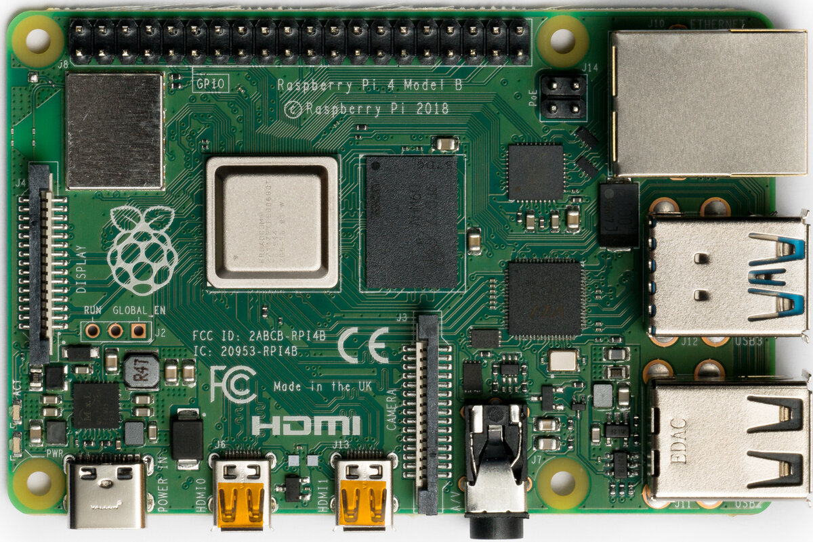
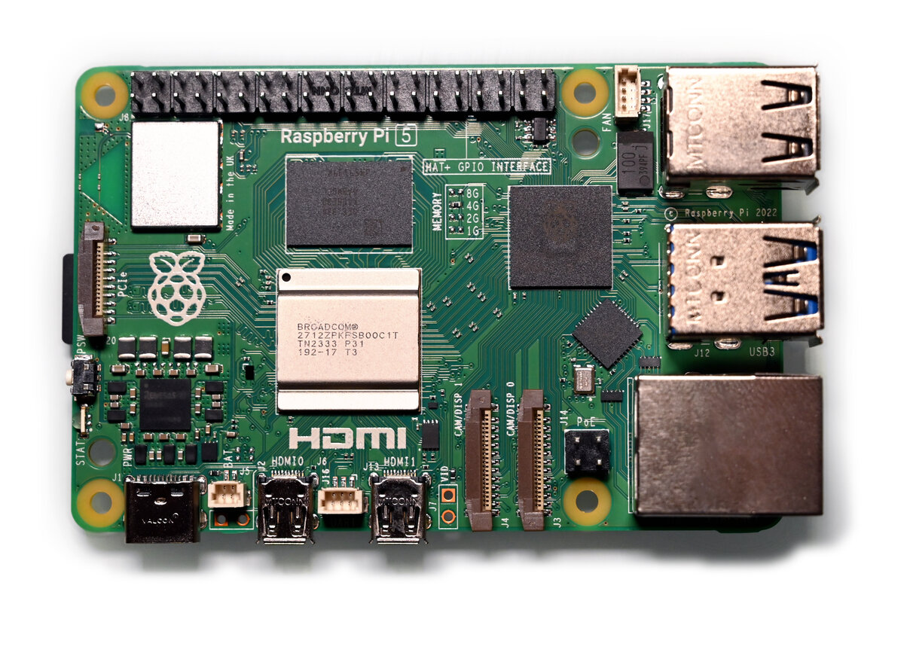

# Raspberry Pi BSP (RPi4, RPi5)

yoe supports the Raspberry Pi 4 (BCM2711) and the Raspberry Pi 5 (BCM2712)
through the `raspberrypi4` and `raspberrypi5` machines. Both target the 64-bit
application cores and share the same firmware unit, the same config-file
mechanism, and the same partition layout — they differ mainly in which kernel
image and DTB land on the boot partition.

Machine descriptors:

- `modules/module-bsp/machines/raspberrypi4.star`
- `modules/module-bsp/machines/raspberrypi5.star`

Units under `modules/module-bsp/units/bsp/`:

- `rpi-firmware` — shared GPU bootloader blobs
- `linux-rpi4`, `linux-rpi5` — per-board kernel builds
- `rpi4-config`, `rpi5-config` — per-board `config.txt` + `cmdline.txt`



_Raspberry Pi 4 Model B. Photo: Laserlicht / Wikimedia Commons, CC BY-SA 4.0._



_Raspberry Pi 5. Photo: SimonWaldherr / Wikimedia Commons, CC BY 4.0._

## Running it on hardware

After `yoe build --machine raspberrypi4 base-image` (or `raspberrypi5`, or
whatever image you've picked), yoe produces a single disk image under
`build/<image>.raspberrypi{4,5}/disk.img`. The next steps are: write it to a
microSD card, connect serial + power, and power on.

Authoritative hardware reference for everything below:
<https://www.raspberrypi.com/documentation/>. The notes here cover the
yoe-specific bits and a quick start; for pinouts, mechanical layout, and silicon
details, defer to the Foundation's docs.

### Writing the image to a microSD card

Two ways:

- **TUI** — open `yoe` (no arguments), highlight the image unit, press `f`. The
  flash UI shows the candidate removable devices and you pick one. This is the
  fast path during development.
- **CLI** — `yoe flash <image-unit> <device>`. List candidates first:

  ```
  yoe flash list
  ```

  That prints the `/dev/sdN` (or `/dev/mmcblkN`) entries with size and model so
  you can identify the card. Then write:

  ```
  yoe flash --machine raspberrypi4 base-image /dev/sdN
  ```

  Swap `base-image` for whichever image unit you built and `raspberrypi4` for
  `raspberrypi5` as appropriate. `--dry-run` shows what it would do without
  touching the device; `--yes` skips the confirmation prompt for scripted flows.

Either path picks the right disk image from the build tree, refuses to write to
anything mounted or anything that looks like an internal disk, and confirms
before overwriting. If a partition on the target is mounted (most desktops
auto-mount removable media on insert), the flash exits with a message — unmount
the partitions and retry. **Read the device path it's about to write to**;
flashing the wrong block device will silently overwrite it.

### Power

- **RPi4** takes 5 V over USB-C. Plan for **5 V / 3 A** in practice — the
  official 15 W USB-C supply or a class-compliant laptop / phone charger that
  negotiates 5 V / 3 A. Underpowering shows up as the lightning-bolt under-volt
  warning in dmesg, SD card corruption, WiFi disconnects under load, or the
  board silently rebooting once anything is plugged into USB.
- **RPi5** takes 5 V over USB-C with USB-PD. The official 27 W supply
  negotiates 5 V / 5 A and is required for full peripheral current on the USB
  ports; a 5 V / 3 A PD supply boots fine but the firmware caps USB current
  unless you set `usb_max_current_enable=1` in `config.txt`.

### Serial console

The kernel and the GPU firmware both bring up a UART on the GPIO header when
`enable_uart=1` is in `config.txt`. Settings are **115200 8N1**, no flow
control, on three pins of the 40-pin header:

| Pin | Signal |
| --- | ------ |
| 6   | `GND`  |
| 8   | `TXD`  |
| 10  | `RXD`  |

The Linux device name differs between boards:

- **RPi4** — mini-UART on `ttyS0` (cmdline.txt's `console=ttyS0,115200`)
- **RPi5** — PL011 on `ttyAMA10` (cmdline.txt's `console=ttyAMA10,115200`)

Raspberry Pi boards do **not** have an on-board USB-to-serial bridge. The
header is wired in the standard **Raspberry Pi USB-to-TTL serial cable** pinout,
so you'll need an external 3.3 V adapter:

- **Recommended: FTDI TTL-232R-RPi**
  ([product page](https://ftdichip.com/products/ttl-232r-rpi/) ·
  [Digi-Key](https://www.digikey.com/en/products/detail/ftdi-future-technology-devices-international-ltd/TTL-232R-RPI/4382044)).
  Purpose-built for this header, 3.3 V signals, genuine FTDI silicon (so the
  host's `ftdi_sio` driver picks it up reliably and you don't fight knock-off
  CP210x / CH340 driver quirks). Plug-and-play with no wiring decisions.
- Any other 3.3 V USB-TTL adapter (Adafruit 954, generic FTDI/CP210x/CH340
  dongles) works too — connect three jumpers, leave the 5 V lead disconnected
  since the board has its own power.

Wiring is "cross-over": the cable's **TX goes to the board's RX** (pin 10), and
the cable's **RX goes to the board's TX** (pin 8). `GND` to `GND` (pin 6).

Once wired, plug the USB end into the host; it enumerates as `/dev/ttyUSB0`
(FTDI / CH340 / CP210x) or `/dev/ttyACM0` (some CDC ACM adapters). Open it at
115200 with [tio](https://github.com/tio/tio):

```
tio -b 115200 /dev/ttyUSB0
```

If nothing appears after power-on:

- Confirm `enable_uart=1` made it into `config.txt` on the boot partition.
- Swap RX/TX. The single most common mistake.
- Confirm the adapter is **3.3 V**, not 5 V. A 5 V adapter on the SoC's UART
  pins is the fastest way to brick that GPIO.
- `dmesg | tail` on the host — the USB-TTL adapter should enumerate within a
  second or two of plugging in. If it doesn't, the cable / dongle is the issue,
  not the board.

### First boot

A successful boot prints (roughly, abbreviated):

```
[    0.000000] Booting Linux on physical CPU 0x...
[    0.000000] Linux version 6.12.x ...
...
Welcome to <hostname>
<hostname> login:
```

(The GPU firmware stage is silent on the UART — the first thing you see is the
kernel's earlycon output.)

The default credentials from `base-files-*` are `root` (no password) and `user`
/ `password`. **Change them before connecting the board to any network you don't
fully control** — the OpenSSH unit defaults to enabled once the package lands in
the image.

If you get a rainbow splash and nothing else, the GPU firmware loaded but
couldn't find a kernel. See [When something fails](#when-something-fails) below.

## The Raspberry Pi boot chain

Raspberry Pi boards do not use a conventional CPU-side bootloader. The boot
sequence is GPU-first:

```
RPi4:  GPU ROM ─ reads ─→ bootcode.bin (SD) ─ loads ─→ start4.elf ─ reads ─→ config.txt + kernel + DTB ─ starts ARM cores
RPi5:  EEPROM  ────────────────────────────────────────────→ (same flow, no bootcode.bin, kernel_2712.img)
```

The VideoCore GPU is the first thing alive on the SoC. On RPi4, the on-board ROM
is minimal and reads `bootcode.bin` from the SD card to bring the rest of the
GPU firmware online. On RPi5, all that early code lives in an EEPROM on the
board, so there is no `bootcode.bin` on the SD — the GPU goes straight from
EEPROM to reading `config.txt`.

From there the flow is identical on both:

1. GPU firmware (`start4.elf` on RPi4, the EEPROM image on RPi5) parses
   `config.txt`.
2. It loads the kernel image named by `config.txt`'s `kernel=` line plus the
   matching DTB.
3. It reads `cmdline.txt` and passes it as the kernel command line.
4. It releases the ARM cores at the kernel entry point.

There is no U-Boot, no SPL, no TF-A in this chain by default. (You can
chain-load U-Boot from the GPU firmware if you want EFI semantics, but yoe
doesn't.)

## Shared units

### `rpi-firmware`

```python
unit(
    name = "rpi-firmware",
    source = "https://github.com/raspberrypi/firmware.git",
    tag = "1.20250305",
)
```

Prebuilt blobs only — no compilation. Installs the GPU firmware files the RPi
family needs on the FAT boot partition:

| File           | Used by | Purpose                                                                         |
| -------------- | ------- | ------------------------------------------------------------------------------- |
| `bootcode.bin` | RPi4    | first-stage GPU loader (RPi5 in EEPROM)                                         |
| `start4.elf`   | RPi4    | main GPU firmware (also `start4x.elf`, `start4cd.elf`, `start4db.elf` variants) |
| `fixup4.dat`   | RPi4    | memory split / DRAM tuning (matching `4x`, `4cd`, `4db` variants)               |

RPi5 doesn't need any of these on the SD card (the EEPROM ships them), but yoe
stages them anyway — installed packages are uniform across both boards and the
extra ~10 MB on the FAT partition is harmless.

### `linux-rpi4` / `linux-rpi5`

Both kernels build from `github.com/raspberrypi/linux` on branch `rpi-6.12.y` —
the Raspberry Pi Foundation's downstream tree carrying Broadcom GPU drivers, the
wireless stack, and out-of-tree patches that aren't yet in mainline.

The two units differ in defconfig and output naming:

| Aspect          | `linux-rpi4`                                                        | `linux-rpi5`          |
| --------------- | ------------------------------------------------------------------- | --------------------- |
| SoC             | BCM2711                                                             | BCM2712               |
| `defconfig`     | `bcm2711_defconfig`                                                 | `bcm2712_defconfig`   |
| Kernel filename | `kernel8.img`                                                       | `kernel_2712.img`     |
| DTBs installed  | `bcm2711-rpi-4-b.dtb`, `bcm2711-rpi-400.dtb`, `bcm2711-rpi-cm4.dtb` | `bcm2712-rpi-5-b.dtb` |

Both run a defconfig merge step that folds in `container.cfg` — a small fragment
that enables overlayfs, cgroups v2, netfilter, namespaces, and the eBPF cgroup
hooks needed to make Docker / Podman / runc work out of the box. The same
fragment is also used by `linux-beagleplay`; see
[BeaglePlay](machine-beagleplay.md) for the parallel.

Overlays go to `/boot/overlays/*.dtbo`. Kernel modules install into the rootfs
under `/lib/modules/<kver>/`, with `DEPMOD=true` skipping depmod at build time
(the build container doesn't have it; the target runs `depmod -a` at first boot
via OpenRC).

### `rpi4-config` / `rpi5-config`

Two-file boot config: `config.txt` for the GPU firmware, `cmdline.txt` for the
kernel.

**`config.txt` (RPi4 / RPi5 differences):**

```
# RPi4
arm_64bit=1
enable_uart=1
kernel=kernel8.img
dtoverlay=vc4-kms-v3d
disable_splash=1
```

```
# RPi5
arm_64bit=1
enable_uart=1
kernel=kernel_2712.img
dtoverlay=vc4-kms-v3d-pi5
disable_splash=1
```

- `arm_64bit=1` flips the GPU firmware into 64-bit kernel mode (it defaults to
  32-bit for legacy compatibility).
- `enable_uart=1` brings up the mini-UART on RPi4 / the PL011 on the GPIO header
  so you get a serial console.
- `kernel=` matches what the per-board kernel unit installed.
- `dtoverlay=vc4-kms-v3d` selects the modern KMS DRM driver for the VideoCore
  GPU (the `-pi5` variant on RPi5 targets VC6 / RP1).
- `disable_splash=1` skips the rainbow boot logo.

**`cmdline.txt`:**

```
RPi4: console=ttyS0,115200 root=/dev/mmcblk0p2 rootfstype=ext4 rootwait rw
RPi5: console=ttyAMA10,115200 root=/dev/mmcblk0p2 rootfstype=ext4 rootwait rw
```

- RPi4 uses the BCM2711 mini-UART, exposed as `ttyS0`.
- RPi5 uses a different UART (PL011 routed differently in the BCM2712 GPIO
  multiplexer), exposed as `ttyAMA10`.
- Both root from `/dev/mmcblk0p2` — second partition on the SD card.

## Image assembly

Both machines use the same partition layout:

```python
partitions = [
    partition(label = "boot",   type = "vfat", size = "64M",
              contents = ["kernel", "dtbs", "firmware"]),
    partition(label = "rootfs", type = "ext4", size = "1G", root = True),
]
```

The `contents` patterns are name-based selectors that map to file globs under
`/boot/` in the assembled rootfs:

| Selector   | Matches                                      |
| ---------- | -------------------------------------------- |
| `kernel`   | `kernel8.img` / `kernel_2712.img` / etc.     |
| `dtbs`     | `*.dtb`, `*.dtbo` (including `overlays/`)    |
| `firmware` | `bootcode.bin`, `start4*.elf`, `fixup4*.dat` |

The `config.txt` and `cmdline.txt` written by the per-board config unit land in
`/boot/` too and are matched by the firmware/dtbs/kernel selectors as
appropriate.

SD card layout the GPU expects:

| Partition | Type | Contents                                                            |
| --------- | ---- | ------------------------------------------------------------------- |
| 1         | vfat | Firmware blobs, kernel, DTBs, overlays, `config.txt`, `cmdline.txt` |
| 2         | ext4 | Linux rootfs (musl + busybox + OpenRC + apps + modules)             |

The GPU firmware doesn't care about partition labels or GPT — it reads the first
FAT partition off the MMC. Linux mounts the same FAT at `/boot` and uses
partition 2 as `/`.

## What's the same and what differs across boards

**Shared:**

- Same upstream kernel tree, same branch, same container.cfg fragment.
- Same `rpi-firmware` package (RPi5 ignores the SD copies but they're harmless).
- Same partition layout and root device.
- Same OpenRC / busybox / apk userspace.

**Per-board:**

- `linux-rpi4` vs `linux-rpi5` (defconfig, kernel image name, DTBs).
- `rpi4-config` vs `rpi5-config` (kernel image name in `config.txt`, KMS overlay
  variant, serial console device).
- The machine descriptor (which kernel unit to use, which config unit).

If you're adding a Raspberry Pi 3 or Pi Zero 2 W, the work is mostly mechanical:
clone the per-board kernel + config unit, swap defconfig and DTB names, and add
a machine descriptor. The firmware unit and the partition layout don't need to
change.

## Self-hosting yoe builds on the RPi5

The `selfhost-image` turns a Raspberry Pi 5 into a standalone yoe build
host — yoe CLI, Go, Docker, git, helix, and the rest of the dev image, all
on one bootable card or NVMe SSD. See
[Self-Host on RPi5](selfhost-rpi5.md) for the build, flash, first-boot, and
NVMe setup walkthrough.

## When something fails

- **Rainbow screen, no kernel boot.** GPU firmware loaded but couldn't find the
  kernel. Check `config.txt`'s `kernel=` line and confirm the named file is on
  the FAT partition.
- **Black screen, never sees UART.** `enable_uart=1` missing from `config.txt`,
  or the wrong `console=` in `cmdline.txt` for the board.
- **Kernel boots but no rootfs.** SD card not the only block device the kernel
  sees, or `rootwait` not in the cmdline — partition probing can race the
  kernel.
- **WiFi / Bluetooth missing.** The Foundation kernel pulls in `brcmfmac`
  firmware blobs that aren't yet in this BSP. Add them via a separate unit if
  needed; the `linux-firmware` tree on the Foundation GitHub has them under
  `brcm/`.
