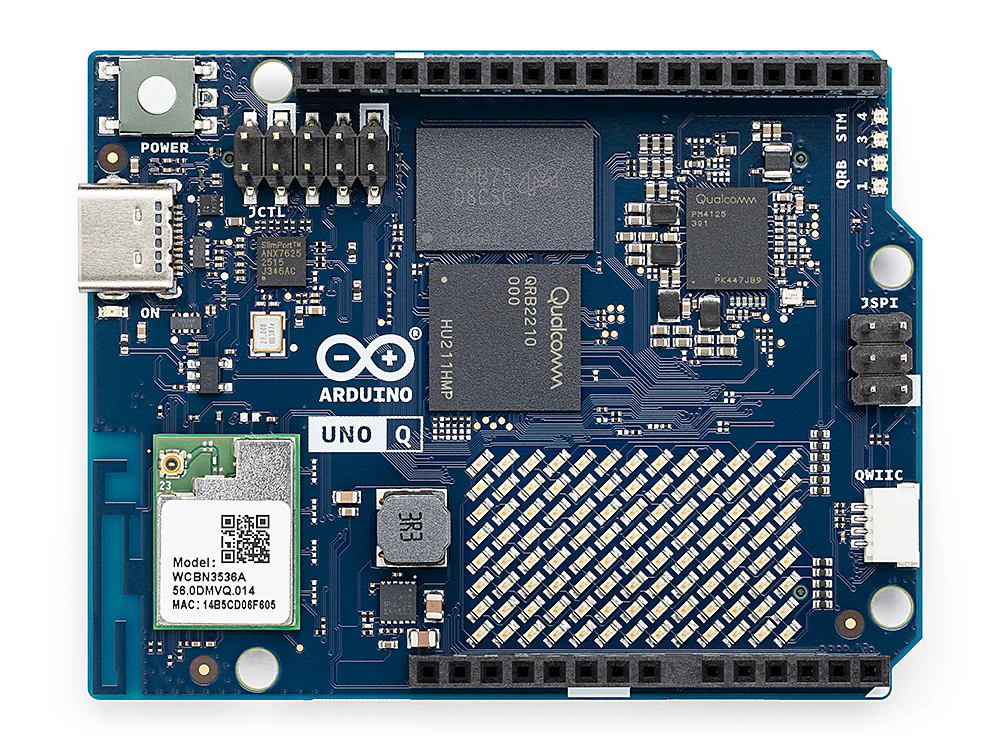
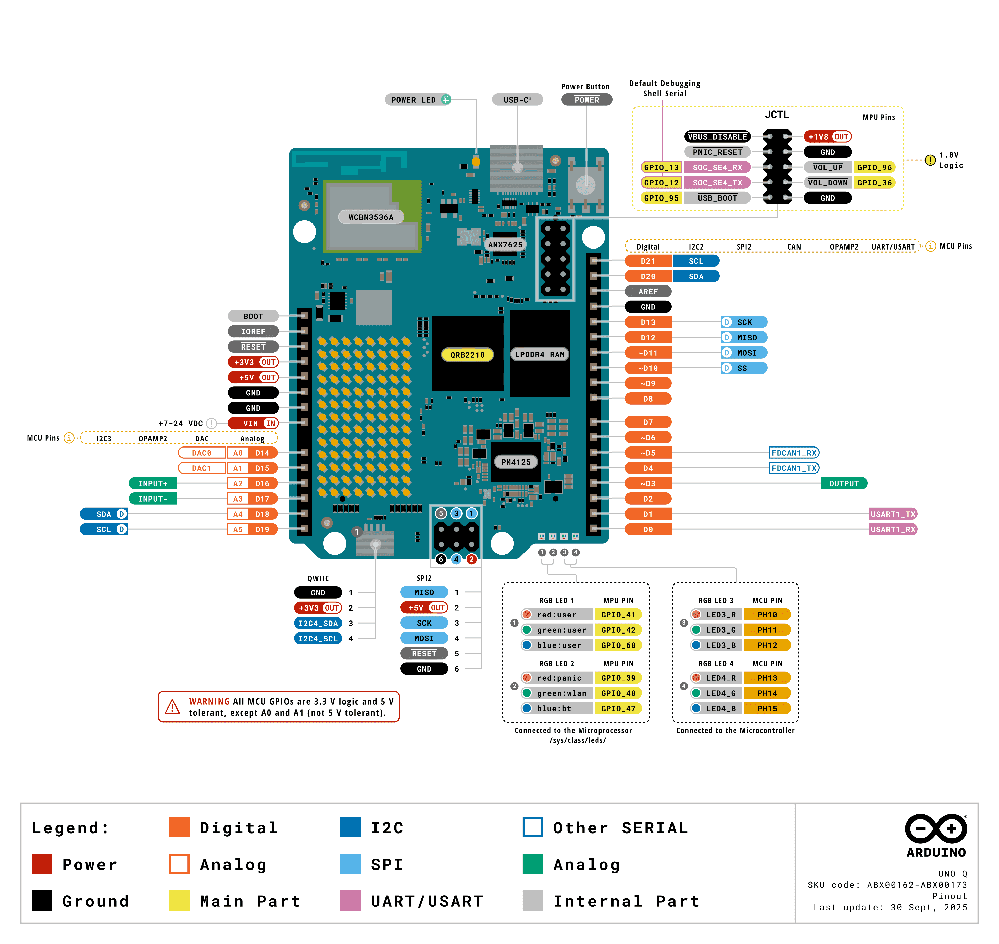
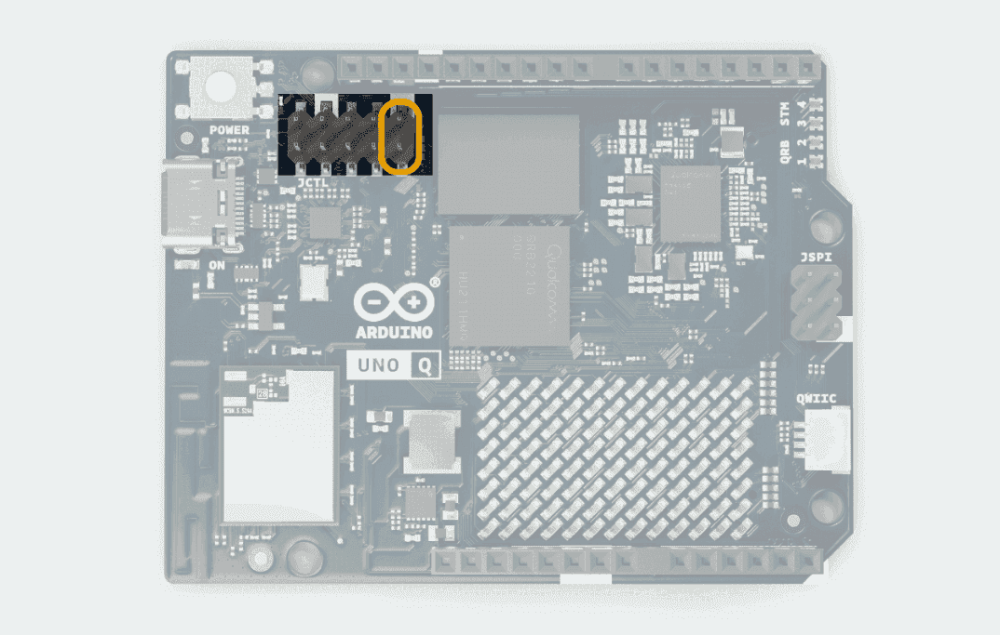

# Arduino UNO Q (QRB2210) (planned)

> **Status (planned):** yoe has no `uno-q` machine descriptor or BSP units yet.
> Nothing under `modules/module-bsp/machines/` targets this board, so
> `yoe build --machine uno-q …` does not work today. What follows is a working
> reference for the hardware — how to reach a terminal, how to flash it, and how
> its boot chain is arranged — together with a sketch of the shape a yoe BSP
> would take. The hardware sections are accurate and usable now with the stock
> Arduino image; the yoe-specific sections describe future work.

The Arduino UNO Q is a dual-processor board in the UNO form factor. Arduino
calls the two processors "brains":

- **High-level brain** — Qualcomm Dragonwing QRB2210, four Cortex-A53 cores at
  2.0 GHz, Adreno 702 GPU, 2 GB or 4 GB LPDDR4, 16 GB or 32 GB eMMC. This runs
  Linux (Debian in Arduino's stock image) and is the part yoe would target.
- **Real-time brain** — STM32U585, a Cortex-M33 at 160 MHz with 2 MB flash and
  786 KB SRAM, running Zephyr. It owns the classic UNO headers.

A WCBN3536A module provides dual-band Wi-Fi 5 and Bluetooth 5.1 with onboard
antennas. Power comes in over USB-C at 5 V / 3 A, or through the `VIN` pin at
7–24 VDC.



_Arduino UNO Q. The JCTL debug header sits at the upper left, next to the USB-C
port; the QRB2210 and the WCBN3536A radio module are labelled on the board.
Photo: [Arduino](https://store.arduino.cc/products/uno-q) via
[Wikimedia Commons](https://commons.wikimedia.org/wiki/File:Arduino_UNO_Q.webp),
CC BY 3.0._

Authoritative hardware reference: <https://docs.arduino.cc/hardware/uno-q/>. The
notes below cover a quick start and the details that matter for building your
own Linux image; for pinouts, mechanical layout, and silicon details, defer to
Arduino's documentation.

## Getting a terminal

### `adb shell` over USB-C

This is the everyday path, and the one to reach for first. The stock image runs
an ADB daemon exposed over the USB-C data port, so a shell is one command away:

```
adb devices
adb shell
```

Install `adb` from your distribution (`android-tools` on Alpine and Arch,
`android-tools-adb` on Debian and Ubuntu). On Linux you also need a udev rule so
the device is reachable without root; Arduino's documentation covers the rule
set for the board's USB IDs.

`adb` gives you a shell, file transfer (`adb push` / `adb pull`), and port
forwarding — including the forward used to debug the STM32U585 (see
[The real-time brain](#the-real-time-brain) below). What it does not give you is
anything before userspace comes up: no bootloader prompt, no kernel log from a
boot that fails early, and no way in when networking or the ADB daemon itself is
broken. That is what the serial console is for.

### Serial console on the JCTL connector

The QRB2210's console UART is brought out on the 10-pin **JCTL** header (`A1` /
`JCTL1`), which also carries the board's boot-mode, reset, and low-power wake
signals. The console is the SoC's **SE4** UART, which appears in Linux as
**`ttyMSM0` at 115200 8N1**, no flow control. Arduino reserves SE4 as the system
console — it is separate from the application UARTs and should not be
repurposed.

#### JCTL pinout

| Pin | Designation    | Net / function            | Domain | Notes                  |
| --- | -------------- | ------------------------- | ------ | ---------------------- |
| 1   | `GND`          | Ground                    | Power  | —                      |
| 2   | `USB_BOOT`     | Boot strap                | 1.8 V  | Forced USB boot (EDL)  |
| 3   | `VOL_DOWN`     | `GPIO_36`                 | 1.8 V  | GPIO                   |
| 4   | `SOC_SE4_TX`   | Console UART TX (SE4)     | 1.8 V  | System console         |
| 5   | `VOL_UP`       | `GPIO_96`                 | 1.8 V  | GPIO                   |
| 6   | `SOC_SE4_RX`   | Console UART RX (SE4)     | 1.8 V  | System console         |
| 7   | `GND`          | Ground                    | Power  | —                      |
| 8   | `PMIC_RESET`   | PM4125 reset              | 1.8 V  | —                      |
| 9   | `+1V8 OUT`     | `VREG_L15A_1P8V`          | Power  | 1.8 V reference        |
| 10  | `VBUS_DISABLE` | VBUS power-switch disable | 1.8 V  | Controls the VBUS path |

Source:
[UNO Q datasheet](https://docs.arduino.cc/resources/datasheets/ABX00162-ABX00173-datasheet.pdf),
§9.5.



_The full UNO Q pinout. The JCTL header is at the upper right; the
"Default Debugging Shell Serial" callout marks `SOC_SE4_RX` / `SOC_SE4_TX`, and
the whole header is flagged **1.8 V Logic**. Image:
[Arduino](https://docs.arduino.cc/hardware/uno-q/)._

> **The signals are 1.8 V, not 3.3 V.** A standard 3.3 V USB-TTL adapter — the
> kind that works on a BeaglePlay or a Raspberry Pi — can damage the SoC here.
> Use a 1.8 V-capable adapter, or one with a selectable `VCCIO` reference you
> can tie to pin 9. Verify the level before connecting anything.

#### Choosing an adapter

- **Recommended: Arduino BugHopper**
  ([product page](https://store-usa.arduino.cc/products/bughopper) ·
  [datasheet](https://docs.arduino.cc/resources/datasheets/ABX00156-datasheet.pdf)).
  Purpose-built for this board's JCTL connector: a USB-C to UART bridge (FTDI
  FT230XQ) on a 1.27 mm 2×5 header that matches the JCTL pitch, so it mates
  directly with no jumper wires and derives its logic level from the target.
  This is the path of least resistance, and it removes any chance of putting a
  3.3 V signal on a 1.8 V pin.
- **Generic alternative: DSD TECH SH-U09C2**
  ([Amazon](https://www.amazon.com/DSD-TECH-SH-U09C2-Debugging-Programming/dp/B07TXVRQ7V)).
  A USB-to-TTL adapter built on a genuine FTDI FT232RL, with the logic level
  **jumper-selectable between 1.8 V, 3.3 V, and 5 V** — set the jumper to **1.8
  V** before connecting anything to the JCTL header. The FTDI silicon means the
  host's `ftdi_sio` driver picks it up cleanly. Wire only `GND` / `RX` / `TX`
  per the table below and leave the rest disconnected.

With a jumper-wired adapter, three wires are enough for a console:

| JCTL pin         | Adapter |
| ---------------- | ------- |
| 1 or 7 (`GND`)   | `GND`   |
| 4 (`SOC_SE4_TX`) | `RX`    |
| 6 (`SOC_SE4_RX`) | `TX`    |

Wiring follows the usual cross-over: the board's TX goes to the adapter's RX,
and vice versa. Leave the adapter's supply lead disconnected — the board has its
own power. Pin 9 is an output, so use it only as a `VCCIO` reference for a
level-shifting adapter, never as a supply to drive the board.

Once wired, the adapter enumerates on the host as `/dev/ttyUSB0` (FTDI, CP210x,
CH340) or `/dev/ttyACM0` (CDC ACM). Open it with
[tio](https://github.com/tio/tio):

```
tio -b 115200 /dev/ttyUSB0
```

If nothing appears after power-on:

- Swap RX and TX. This is the most common mistake.
- Confirm the adapter is running at **1.8 V**.
- Check `dmesg | tail` on the host — the adapter should enumerate within a
  second or two of being plugged in. If it does not, the problem is the cable,
  not the board.

## Boot chain

The QRB2210 boots through Qualcomm's standard multi-stage chain, with U-Boot
chainloaded at the end so that a conventional Linux image can be booted:

```
PBL (masked ROM)
  └── XBL                       ← Qualcomm firmware, signed
        └── TrustZone / Hypervisor
              └── ABL           ← Qualcomm Android bootloader
                    └── U-Boot  ← chainloaded, provides extlinux/sysboot
                          └── Image + DTB
                                └── init
```

Two consequences matter when building images for this board:

- **ABL rewrites U-Boot's load addresses.** It overwrites `kernel_addr_r`,
  `fdt_addr_r`, and `ramdisk_addr_r` at runtime, so a boot script has to set
  those explicitly — into the 0xC0000000 RAM bank — before loading anything.
  Relying on U-Boot's compiled-in defaults will not work here.
- **The GPT is large and mostly firmware.** The Qualcomm layout carries roughly
  67 firmware partitions ahead of anything you care about. In the layouts in use
  today, partition 67 is the EFI system partition holding the boot script, and
  partition 68 is the rootfs. Those firmware partitions are signed Qualcomm
  blobs; a Linux image replaces the tail of the table, not the whole thing.

Because the rootfs partition sits at the end of a fixed table with an empty
`userdata` partition behind it, ordinary first-boot resize tooling tends to
misbehave. Expect to need a resize step that understands this layout.

## Flashing a Linux image

The board flashes over **EDL** (Emergency Download Mode), Qualcomm's ROM-level
recovery protocol, using the `qdl` tool. There is no removable boot medium — the
eMMC is the only boot storage, so EDL is both the normal install path and the
unbrick path.

### Entering EDL mode

1. Power the board off completely — disconnect USB-C.
2. Place a jumper across **JCTL pins 1 and 2** — `GND` and `USB_BOOT`. Tying the
   boot strap low is what forces the ROM into USB download mode. The two pins
   sit at one end of the header, so a plain 2.54 mm jumper shunt works.
3. Connect USB-C to the host.



_The two JCTL boot-strap pins to jumper for EDL, highlighted in orange. Image:
[Arduino](https://docs.arduino.cc/tutorials/uno-q/user-manual/)._

The board should now enumerate as `05c6:9008` (Qualcomm HS-USB QDLoader 9008).
Confirm with `lsusb`. If you see the normal ADB device instead, the jumper is
not making contact or the board was not fully powered down.

### Host setup

`qdl` needs raw USB access. Without a udev rule you will see
`qdl: unable to open USB device`. Create
`/etc/udev/rules.d/51-arduino-uno-q.rules`:

```
SUBSYSTEM=="usb", ATTR{idVendor}=="05c6", ATTR{idProduct}=="9008", MODE="0666", GROUP="plugdev"
```

Then reload:

```
sudo udevadm control --reload-rules && sudo udevadm trigger
```

### Writing the image

Arduino's `arduino-flasher-cli` wraps the whole flow, including fetching the
image:

```
./arduino-flasher-cli flash latest
```

To drive `qdl` directly against an unpacked image directory:

```
cd arduino-images/flash
qdl --allow-missing --storage emmc prog_firehose_ddr.elf rawprogram0.xml patch0.xml
```

`prog_firehose_ddr.elf` is the signed programmer the ROM loads first; the
`rawprogram*.xml` and `patch*.xml` files describe the partition table and the
images that fill it. `--allow-missing` lets a partial image set flash without
every firmware partition present.

### Afterwards

Remove the JCTL jumper and power-cycle the board. Leaving the jumper in place
sends it straight back into EDL on the next boot, which reads as "the board no
longer starts."

Keep a known-good stock image on hand. Because EDL lives in masked ROM, a bad
Linux image is always recoverable — but only if you have something to flash
back.

## A yoe BSP for this board (planned)

> **Status (planned):** none of the units below exist. This section records the
> shape the work would take, so the design is visible before anyone starts.

Mapping the board onto yoe's machine model:

| Piece                | Where it would come from                                      |
| -------------------- | ------------------------------------------------------------- |
| Qualcomm firmware    | Prebuilt signed blobs, mirrored by a unit that only installs  |
| U-Boot               | Chainloaded build with the extlinux/sysboot patches           |
| Kernel               | Arduino's `qcom-v6.19.0-unoq` branch, or mainline as it lands |
| Device tree          | `qrb2210-rb1.dtb` on mainline; a board-specific DTB otherwise |
| Boot script          | Sets the 0xC0000000 load addresses, then `booti`              |
| GPU / DSP / Wi-Fi FW | Qualcomm firmware blobs installed into the rootfs             |

Two things make this board different from the boards yoe supports today, and
both need design decisions rather than a straight port of an existing BSP:

- **`yoe flash` writes disk images to removable block devices.** That model does
  not fit a board whose only install path is a ROM-level protocol against a
  fixed 69-entry partition table. Supporting the UNO Q means either invoking
  `qdl` from the flash path or producing a rootfs artifact that is installed by
  other means.
- **Image assembly assumes yoe owns the partition table.** Here it owns two
  entries near the end of a table Qualcomm defines. The machine descriptor would
  need to express "populate these partitions," not "lay out this disk."

Mainline Linux support for the QRB2210 is progressing — the SoC boots to a login
shell on recent mainline kernels using the `qrb2210-rb1` device tree, with GPU
and Bluetooth held back pending firmware packaging. Tracking mainline rather
than a vendor branch is the preferable target once the gaps close.

## The real-time brain

The STM32U585 runs Zephyr, and the QRB2210 acts as its SWD debug adapter through
an `openocd` binary on the board. From a host with `adb`:

```
adb forward tcp:3333 tcp:3333
adb shell arduino-debug
```

That exposes OpenOCD on the host's port 3333, so a normal Zephyr workflow
applies:

```
west build -b arduino_uno_q samples/basic/blinky
```

Internal UART and SPI buses connect the two processors, which is how application
code on the MCU reaches the Linux side. Zephyr's board documentation is the
reference here:
<https://docs.zephyrproject.org/latest/boards/arduino/uno_q/doc/index.html>.

## References

- [UNO Q product documentation](https://docs.arduino.cc/hardware/uno-q/) —
  Arduino
- [UNO Q user manual](https://docs.arduino.cc/tutorials/uno-q/user-manual/) —
  pinout, JCTL, ADB setup
- [UNO Q datasheet (ABX00162 / ABX00173)](https://docs.arduino.cc/resources/datasheets/ABX00162-ABX00173-datasheet.pdf)
  — connector pin maps, power domains
- [Arduino UNO Q in Zephyr](https://docs.zephyrproject.org/latest/boards/arduino/uno_q/doc/index.html)
- [Armbian UNO Q support](https://github.com/armbian/build/pull/9623) — boot
  chain, partition layout, qdl flow
- [Arduino BugHopper](https://store-usa.arduino.cc/products/bughopper) — JCTL
  debug adapter
  ([datasheet](https://docs.arduino.cc/resources/datasheets/ABX00156-datasheet.pdf))
- [DSD TECH SH-U09C2](https://www.amazon.com/DSD-TECH-SH-U09C2-Debugging-Programming/dp/B07TXVRQ7V)
  — FTDI USB-to-TTL adapter, jumper-selectable 1.8 / 3.3 / 5 V (Amazon)
