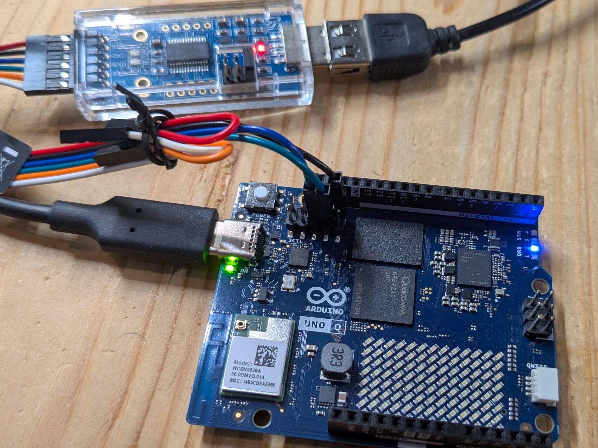

# Arduino UNO Q (QRB2210)

The Arduino UNO Q is a dual-processor board in the UNO form factor. Arduino
calls the two processors "brains":

- **High-level brain** — Qualcomm Dragonwing QRB2210, four Cortex-A53 cores at
  2.0 GHz, Adreno 702 GPU, 2 GB or 4 GB LPDDR4, 16 GB or 32 GB eMMC. This runs
  Linux (Debian in Arduino's stock image) and is the part yoe would target.
- **Real-time brain** — STM32U585, a Cortex-M33 at 160 MHz with 2 MB flash and
  786 KB SRAM, running Zephyr. It owns the classic UNO headers.

A WCBN3536A module provides dual-band Wi-Fi 5 and Bluetooth 5.1 with onboard
antennas. Power comes in over USB-C at 5 V / 3 A, or through the `VIN` pin at
7–24 VDC.


_Arduino UNO Q. The JCTL debug header sits at the upper left, next to the USB-C
port; the QRB2210 and the WCBN3536A radio module are labelled on the board.
Photo: [Arduino](https://store.arduino.cc/products/uno-q) via
[Wikimedia Commons](https://commons.wikimedia.org/wiki/File:Arduino_UNO_Q.webp),
CC BY 3.0._

Authoritative hardware reference: <https://docs.arduino.cc/hardware/uno-q/>. The
notes below cover a quick start and the details that matter for building your
own Linux image; for pinouts, mechanical layout, and silicon details, defer to
Arduino's documentation.

## Getting a terminal

### `adb shell` over USB-C

This is the everyday path, and the one to reach for first. The stock image runs
an ADB daemon exposed over the USB-C data port, so a shell is one command away:

```
adb devices
adb shell
```

Install `adb` from your distribution (`android-tools` on Alpine and Arch,
`android-tools-adb` on Debian and Ubuntu). On Linux you also need a udev rule so
the device is reachable without root; Arduino's documentation covers the rule
set for the board's USB IDs.

`adb` gives you a shell, file transfer (`adb push` / `adb pull`), and port
forwarding — including the forward used to debug the STM32U585 (see
[The real-time brain](#the-real-time-brain) below). What it does not give you is
anything before userspace comes up: no bootloader prompt, no kernel log from a
boot that fails early, and no way in when networking or the ADB daemon itself is
broken. That is what the serial console is for.

### Serial console on the JCTL connector

The QRB2210's console UART is brought out on the 10-pin **JCTL** header (`A1` /
`JCTL1`), which also carries the board's boot-mode, reset, and low-power wake
signals. The console is the SoC's **SE4** UART, which appears in Linux as
**`ttyMSM0` at 115200 8N1**, no flow control. Arduino reserves SE4 as the system
console — it is separate from the application UARTs and should not be
repurposed.

#### JCTL pinout

| Pin | Designation    | Net / function            | Domain | Notes                  |
| --- | -------------- | ------------------------- | ------ | ---------------------- |
| 1   | `GND`          | Ground                    | Power  | —                      |
| 2   | `USB_BOOT`     | Boot strap                | 1.8 V  | Forced USB boot (EDL)  |
| 3   | `VOL_DOWN`     | `GPIO_36`                 | 1.8 V  | GPIO                   |
| 4   | `SOC_SE4_TX`   | Console UART TX (SE4)     | 1.8 V  | System console         |
| 5   | `VOL_UP`       | `GPIO_96`                 | 1.8 V  | GPIO                   |
| 6   | `SOC_SE4_RX`   | Console UART RX (SE4)     | 1.8 V  | System console         |
| 7   | `GND`          | Ground                    | Power  | —                      |
| 8   | `PMIC_RESET`   | PM4125 reset              | 1.8 V  | —                      |
| 9   | `+1V8 OUT`     | `VREG_L15A_1P8V`          | Power  | 1.8 V reference        |
| 10  | `VBUS_DISABLE` | VBUS power-switch disable | 1.8 V  | Controls the VBUS path |

Source:
[UNO Q datasheet](https://docs.arduino.cc/resources/datasheets/ABX00162-ABX00173-datasheet.pdf),
§9.5.


_The full UNO Q pinout. The JCTL header is at the upper right; the "Default
Debugging Shell Serial" callout marks `SOC_SE4_RX` / `SOC_SE4_TX`, and the whole
header is flagged **1.8 V Logic**. Image:
[Arduino](https://docs.arduino.cc/hardware/uno-q/)._

> **The signals are 1.8 V, not 3.3 V.** A standard 3.3 V USB-TTL adapter — the
> kind that works on a BeaglePlay or a Raspberry Pi — can damage the SoC here.
> Use a 1.8 V-capable adapter, or one with a selectable `VCCIO` reference you
> can tie to pin 9. Verify the level before connecting anything.

#### Choosing an adapter

- **Recommended: Arduino BugHopper**
  ([product page](https://store-usa.arduino.cc/products/bughopper) ·
  [datasheet](https://docs.arduino.cc/resources/datasheets/ABX00156-datasheet.pdf)).
  Purpose-built for this board's JCTL connector: a USB-C to UART bridge (FTDI
  FT230XQ) on a 1.27 mm 2×5 header that matches the JCTL pitch, so it mates
  directly with no jumper wires and derives its logic level from the target.
  This is the path of least resistance, and it removes any chance of putting a
  3.3 V signal on a 1.8 V pin.
- **Generic alternative: DSD TECH SH-U09C2**
  ([Amazon](https://www.amazon.com/DSD-TECH-SH-U09C2-Debugging-Programming/dp/B07TXVRQ7V)).
  A USB-to-TTL adapter built on a genuine FTDI FT232RL, with the logic level
  **jumper-selectable between 1.8 V, 3.3 V, and 5 V** — set the jumper to **1.8
  V** before connecting anything to the JCTL header. The FTDI silicon means the
  host's `ftdi_sio` driver picks it up cleanly. Wire only `GND` / `RX` / `TX`
  per the table below and leave the rest disconnected.

With a jumper-wired adapter, three wires are enough for a console:

| JCTL pin         | Adapter |
| ---------------- | ------- |
| 1 or 7 (`GND`)   | `GND`   |
| 4 (`SOC_SE4_TX`) | `RX`    |
| 6 (`SOC_SE4_RX`) | `TX`    |

Wiring follows the usual cross-over: the board's TX goes to the adapter's RX,
and vice versa. Leave the adapter's supply lead disconnected — the board has its
own power. Pin 9 is an output, so use it only as a `VCCIO` reference for a
level-shifting adapter, never as a supply to drive the board.



_A jumper-wired console on the UNO Q. The SH-U09C2 adapter is at the top left,
with its level-select jumper on the board next to the USB connector — set that
to 1.8 V before making any connection. Only the `GND`, `RX`, and `TX` leads
reach the JCTL header just above the QRB2210; the remaining leads are tied back
and left unconnected. The board takes its own power from the USB-C port on the
left, so the adapter's supply lead stays out of the circuit._

Once wired, the adapter enumerates on the host as `/dev/ttyUSB0` (FTDI, CP210x,
CH340) or `/dev/ttyACM0` (CDC ACM). Open it with
[tio](https://github.com/tio/tio), which defaults to 115200 8N1:

```
tio /dev/ttyUSB0
```

If nothing appears after power-on:

- Swap RX and TX. This is the most common mistake.
- Confirm the adapter is running at **1.8 V**.
- Check `dmesg | tail` on the host — the adapter should enumerate within a
  second or two of being plugged in. If it does not, the problem is the cable,
  not the board.

## Boot chain

The QRB2210 boots through Qualcomm's standard multi-stage chain, with U-Boot
taking the place of Qualcomm's Android bootloader as the final firmware stage.
U-Boot presents itself as UEFI firmware rather than using its own boot commands,
so the tail of the chain is a conventional UEFI Linux boot:

```
PBL (masked ROM)
  └── XBL                             ← Qualcomm firmware, signed
        └── TrustZone / RPM / Hypervisor
              └── U-Boot              ← in the abl slot; presents UEFI 2.11
                    └── systemd-boot  ← ESP:/EFI/BOOT/BOOTAA64.EFI
                          └── Boot Loader Specification type#1 entry
                                └── vmlinuz + initrd
                                      └── init
```

On a stock board this reports itself as `Das U-Boot 8230.256` providing
`UEFI 2.110`, chainloading `systemd-boot 257.8`.

Three consequences matter when building images for this board:

- **The kernel is selected by a BLS entry, not a boot script.** Entries live in
  `loader/entries/<machine-id>-<version>.conf` on the ESP, with the kernel and
  initrd under `<machine-id>/<version>/`. Debian's stock `kernel-install` hooks
  generate all of this on a running system. Multiple kernel generations coexist,
  each with its own entry, which gives rollback for free.
- **The device tree comes from U-Boot, not from the BLS entry.** There is no
  `devicetree` line in the entry. U-Boot loads
  `/boot/efi/dtb/qcom/qrb2210-arduino-imola.dtb` off the ESP, which is what
  makes the carrier-board overlay mechanism below work.
- **The GPT is large and mostly firmware.** The table has 69 entries; the first
  66 are signed Qualcomm blobs (`xbl`, `tz`, `rpm`, `hyp`, `uefi`, `abl`,
  `devcfg`, `modemst`, `persist`, `splash`, …). Partition 67 is the EFI system
  partition mounted at `/boot/efi`, 68 is the rootfs, and 69 is `userdata`,
  mounted at `/home/arduino`. A Linux image replaces the tail of the table, not
  the whole thing.

Because the rootfs partition sits mid-table with a populated `userdata`
partition behind it, ordinary first-boot resize tooling tends to misbehave — it
expects free space after the filesystem it is growing. Expect to need a resize
step that understands this layout, or to size the rootfs correctly up front.

### A/B slots: a boot is provisional until userspace says otherwise

Every vendor partition on this board is paired (`xbl_a`/`xbl_b`,
`abl_a`/`abl_b`, …), and the Qualcomm boot firmware treats each boot as
provisional. Userspace has to mark the slot good, or the firmware exhausts its
retry count, switches to the other slot, and the board stops booting.

`qbootctl` does that marking. Its service runs `qbootctl -m` after
`boot-complete.target`; Debian ships the package in `trixie/main` and its
postinst enables the service. The `arduino-uno-q` machine therefore carries
`qbootctl` as a board-essential package, alongside the firmware.

This failure mode is worth internalizing before building a custom image: it does
not appear on the boot that caused it. An image missing `qbootctl` comes up
fine, works normally, and then stops booting several reboots later — which
presents as a hardware brick rather than a packaging mistake. Recovery is EDL,
so it is recoverable, but the diagnosis is not obvious.

### Carrier boards and device-tree overlays

The board composes its device tree at runtime rather than shipping one DTB per
hardware combination. `arduino-linux-config carrier enable …` merges the
selected `.dtbo` overlays onto `qrb2210-arduino-imola-base.dtb` with
`fdtoverlay` and writes the result to `qrb2210-arduino-imola.dtb`, taking effect
on the next boot. Overlays exist for the media carrier, IMX219 cameras on either
CSI port at two or four lanes, and 5/8/10-inch DSI touch panels.

Pending state is kept in `/var/lib/arduino-linux-config/status`, which is why
`carrier show` reports `[current: …]` and `[next: …]` separately. One image
therefore serves every carrier, camera, and panel combination — the variation is
resolved at runtime, with no per-carrier build fork.

## Flashing a Linux image

The board flashes over **EDL** (Emergency Download Mode), Qualcomm's ROM-level
recovery protocol, using the `qdl` tool. There is no removable boot medium — the
eMMC is the only boot storage, so EDL is both the normal install path and the
unbrick path.

### Entering EDL mode

1. Power the board off completely — disconnect USB-C.
2. Place a jumper across **JCTL pins 1 and 2** — `GND` and `USB_BOOT`. Tying the
   boot strap low is what forces the ROM into USB download mode. The two pins
   sit at one end of the header, so a plain 2.54 mm jumper shunt works.
3. Connect USB-C to the host.


_The two JCTL boot-strap pins to jumper for EDL, highlighted in orange. Image:
[Arduino](https://docs.arduino.cc/tutorials/uno-q/user-manual/)._

The board should now enumerate as `05c6:9008` (Qualcomm HS-USB QDLoader 9008).
Confirm with `lsusb`. If you see the normal ADB device instead, the jumper is
not making contact or the board was not fully powered down.

### Host setup

`yoe flash` supplies its own `qdl` — a version-pinned unit that runs inside a
container, so nothing needs installing on the host beyond the container runtime
yoe already requires. What follows applies when driving `qdl` by hand; the udev
rule and the ModemManager note apply either way.

Install `qdl` from your distribution — Debian and Ubuntu package the upstream
[linux-msm/qdl](https://github.com/linux-msm/qdl) as `qdl`:

```
sudo apt install qdl
```

**Stop ModemManager before flashing.** It claims the `05c6:9008` device and
makes the flash fail in ways that look nothing like the cause:

```
sudo systemctl stop ModemManager
```

`qdl` needs raw USB access. Without a udev rule you will see
`qdl: unable to open USB device`. Create
`/etc/udev/rules.d/51-arduino-uno-q.rules`:

```
SUBSYSTEM=="usb", ATTR{idVendor}=="05c6", ATTR{idProduct}=="9008", MODE="0666", GROUP="plugdev"
```

Then reload:

```
sudo udevadm control --reload-rules && sudo udevadm trigger
```

### Writing a stock Arduino image

Arduino's `arduino-flasher-cli` wraps the whole flow, including fetching the
image:

```
./arduino-flasher-cli flash latest
```

To drive `qdl` directly against an unpacked image directory:

```
cd arduino-images/flash
qdl --allow-missing --storage emmc prog_firehose_ddr.elf rawprogram0.xml patch0.xml
```

`prog_firehose_ddr.elf` is the signed programmer the ROM loads first; the
`rawprogram*.xml` and `patch*.xml` files describe the partition table and the
images that fill it. `--allow-missing` lets a partial image set flash without
every firmware partition present.

### Writing a yoe image

`yoe flash` drives `qdl` for this machine rather than writing to a block device.
The board must already be in EDL:

```
yoe flash dev-image --programmer /path/to/prog_firehose_ddr.elf
```

yoe writes only the two partitions it owns — `efi` and `rootfs`. Vendor firmware
and `userdata` are left untouched, so a reflash preserves `/home/arduino`. The
confirmation prompt names the partitions before anything is written; `--yes`
skips it and `--dry-run` reports what would happen.

The programmer is a signed vendor blob and is not redistributed with yoe. Point
at a copy from Arduino's image bundle.

### Updating a running board without reflashing

Reflashing is for when the rootfs changes shape. For package-level change,
`yoe deploy` installs a unit onto a running board over SSH:

```
yoe deploy my-unit bec-uno-q.local
```

That is a seconds-long loop against a multi-gigabyte rootfs rewrite, and it does
not need EDL, a jumper, or a power cycle.

### Afterwards

Remove the JCTL jumper and power-cycle the board. Leaving the jumper in place
sends it straight back into EDL on the next boot, which reads as "the board no
longer starts."

Keep a known-good stock image on hand. Because EDL lives in masked ROM, a bad
Linux image is always recoverable — but only if you have something to flash
back.

## The yoe BSP for this board

Board support lives in **`module-qcom`**, which is named for the SoC vendor
rather than the board — Qualcomm's own RB1/RB2 and Arduino's sibling Ventun Q
would reuse most of it.

The board runs stock Debian trixie. Everything board-specific comes from one
small vendor apt repo, `apt-repo.arduino.cc`, wrapped as a single feed:

| Piece                | Where it comes from                                                                       |
| -------------------- | ----------------------------------------------------------------------------------------- |
| Rootfs               | Debian trixie, via `@module-debian`'s feeds                                               |
| Kernel + device tree | `linux-image-7.0.0-g122c2c22d838` from the vendor feed, carrying `qrb2210-arduino-imola*` |
| Qualcomm firmware    | `firmware-qcom-soc` (Debian non-free-firmware) — adsp, modem, wlanmdsp, GPU zap           |
| Wi-Fi / BT firmware  | `firmware-atheros`, plus `arduino-unoq-radio-firmware` for per-PCB board data             |
| Carrier overlays     | `arduino-linux-config`                                                                    |
| Audio                | `alsa-ucm-conf`, vendor-patched for the QRB2210 audio path                                |
| A/B slot blessing    | `qbootctl` (Debian main) — see above; omitting it eventually stops the board booting      |
| Boot firmware        | Factory-provisioned; yoe does not build or write it                                       |

The machine descriptor is `machines/arduino-uno-q.star`. It models the two
partitions yoe owns — `efi` (vfat, 512M) and `rootfs` (ext4, 10G) — at the
factory GPT's sizes, so each partition image can be written straight into its
slot. `userdata` is deliberately absent: it holds user data and is meant to
survive a reflash, so it is provisioned once and never image content.

Two kernel command-line arguments are mandatory rather than tuning:
`clk_ignore_unused` and `pd_ignore_unused`. TrustZone and the always-on firmware
hold clocks and power domains the kernel cannot refcount, and gating them at
`late_initcall` hangs the board.

The machine pins the kernel package by its exact versioned name, because the
vendor feed publishes no `linux-image-arm64`-style metapackage to track instead.
A kernel bump changes that name, so `yoe update-feeds` in `module-qcom` and the
machine descriptor move together.

### Known limitation: all-apt projects only

The kernel and every board package come from a Debian-format feed, so this
machine can only build Debian images. yoe resolves a machine's kernel eagerly,
for every image in every loaded module, as soon as the machine is selected — so
a project that selects `arduino-uno-q` while also loading a module that defines
Alpine images fails during evaluation, before any build starts. Keep UNO Q work
in a project whose images are all apt-based.

### Mainline

Mainline Linux support for the QRB2210 is progressing — the SoC boots to a login
shell on recent mainline kernels using the `qrb2210-rb1` device tree, with GPU
and Bluetooth held back pending firmware packaging. Tracking mainline rather
than a vendor branch is the preferable target once the gaps close, and it would
remove the versioned-kernel-package pin above.

## The real-time brain

The STM32U585 runs Zephyr, and the QRB2210 acts as its SWD debug adapter through
an `openocd` binary on the board. From a host with `adb`:

```
adb forward tcp:3333 tcp:3333
adb shell arduino-debug
```

That exposes OpenOCD on the host's port 3333, so a normal Zephyr workflow
applies:

```
west build -b arduino_uno_q samples/basic/blinky
```

Internal UART and SPI buses connect the two processors, which is how application
code on the MCU reaches the Linux side. Zephyr's board documentation is the
reference here:
<https://docs.zephyrproject.org/latest/boards/arduino/uno_q/doc/index.html>.

## References

- [UNO Q product documentation](https://docs.arduino.cc/hardware/uno-q/) —
  Arduino
- [UNO Q user manual](https://docs.arduino.cc/tutorials/uno-q/user-manual/) —
  pinout, JCTL, ADB setup
- [UNO Q datasheet (ABX00162 / ABX00173)](https://docs.arduino.cc/resources/datasheets/ABX00162-ABX00173-datasheet.pdf)
  — connector pin maps, power domains
- [Arduino UNO Q in Zephyr](https://docs.zephyrproject.org/latest/boards/arduino/uno_q/doc/index.html)
- [Armbian UNO Q support](https://github.com/armbian/build/pull/9623) — boot
  chain, partition layout, qdl flow
- [Arduino BugHopper](https://store-usa.arduino.cc/products/bughopper) — JCTL
  debug adapter
  ([datasheet](https://docs.arduino.cc/resources/datasheets/ABX00156-datasheet.pdf))
- [DSD TECH SH-U09C2](https://www.amazon.com/DSD-TECH-SH-U09C2-Debugging-Programming/dp/B07TXVRQ7V)
  — FTDI USB-to-TTL adapter, jumper-selectable 1.8 / 3.3 / 5 V (Amazon)
