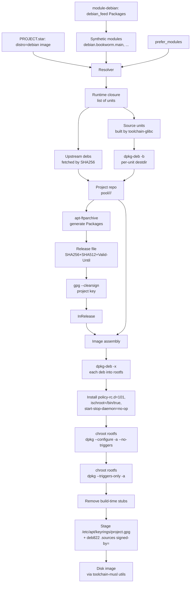

# feat: Debian backend — module-debian, glibc toolchain, apt-on-target

## Summary

Implement the Debian backend as 19 units across 6 phases: format-named Go
internals (`internal/dpkg`, `internal/deb`, `internal/repo/deb_emitter.go`), a
parallel `toolchain-glibc` container unit, a `debian_feed()` Starlark builtin
that materializes synthetic units against the existing feeds-as-modules
infrastructure, a Debian-format signed-repo emitter via `apt-ftparchive` +
`gpg` shell-out, image assembly that runs `dpkg --configure -a` under binfmt
with policy-rc.d / ischroot stubs, on-device trust via `signed-by=` to
`/etc/apt/keyrings/<project>.gpg` with HTTPS-only sources, and a separate
`module-debian` git repo holding the bootstrap Debian keyring + committed
`Packages` snapshots.

**Hard prerequisite: feeds-as-modules ships first.** The synthetic-module
infrastructure (loader integration, lazy synthesis, on-disk parsed-index
cache, TUI filter-first, format-agnostic `Module`/`Unit` types) lives in
`docs/specs/2026-05-13-feeds-as-modules.md` and its forthcoming plan. This
plan consumes that machinery; it does not rebuild it. The one-mechanism
commitment (alpine_pkg.star deleted, `*_feed` is the only path for distro
package consumption) means feeds-as-modules and the Debian backend share the
same resolver/loader/cache path from day one. Implementation order:
feeds-as-modules lands first, then this plan starts.

---

## Problem Frame

Customer-shipped need plus broader industry expectation: yoe needs to produce
Debian-rootfs embedded images with `apt-get install`/`apt-get upgrade` working
post-flash. Full motivation, trust model, and product scope live in the origin
spec (`docs/specs/2026-05-25-module-debian.md`). This plan covers HOW the
implementation executes — file boundaries, library choices, sequencing,
integration points, test scenarios — without re-litigating product shape.

---

## Requirements

This plan implements all 26 requirements of the origin spec. R-IDs below match
the spec's numbering directly; the unit listing under "Implementation Units"
attributes each unit to the specific R-IDs it satisfies. See origin for full
requirement text.

- R1–R5 (module surface, `debian_feed`, synthetic modules, `module-debian` repo,
  format-agnostic internals) → Phases 2, 6. **R3 (synthetic-module mechanism)
  and the loader integration are delivered by feeds-as-modules upstream; this
  plan consumes the existing machinery for `debian_feed` materialization.**
- R6–R7 (internal dpkg/apt machinery, resolver dep-syntax) → Phase 1, Phase 2
- R8–R9 (`toolchain-glibc` container, class toolchain selection) → Phase 1
- R10–R11 (in-tree `Packages` storage, `yoe update-feeds`) → Phase 5
- R12–R14 (`.deb` build, repo emitter, project repo layout) → Phase 3
- R15–R17 (mirror-verbatim, InRelease signing, dual keyring) → Phase 3, Phase 5
- R18–R19 (image-build `dpkg --configure -a`, service enablement) → Phase 4
- R20 (sources.list deb822 + `signed-by=`) → Phase 5
- R21–R22 (image `distro` field, foreign-arch via QEMU) → Phase 1, Phase 4
- R23 (documentation) → Phase 6
- R24 (`Valid-Until` emit + validate) → Phase 3, Phase 5
- R25 (bootstrap keyring + allow-list) → Phase 5, Phase 6
- R26 (HTTPS-only repo URL) → Phase 5

**Origin actors:** A1 (module maintainer), A2 (project user), A3 (resolver), A4
(image assembler), A5 (packager), A6 (apt-tools on target). **Origin flows:** F1
(resolve units), F2 (refresh feed), F3 (image assembly), F4 (project deb
publish), F5 (target install/upgrade). **Origin acceptance examples:** AE1–AE10
— each maps to test scenarios in the implementation units below.

---

## Scope Boundaries

- Synthetic-module infrastructure itself: loader integration, lazy synthesis,
  on-disk parsed-index cache, TUI filter-first, format-agnostic
  `Module`/`Unit` types. All of this is delivered by feeds-as-modules upstream
  (`docs/specs/2026-05-13-feeds-as-modules.md`, R3 + R5 + R20-R23). This plan
  consumes that machinery via `debian_feed`; U5 is a fixture-driven
  integration check, not new infrastructure.
- `alpine_feed()` and the `module-alpine` migration off `alpine_pkg.star`
  (covered by feeds-as-modules' implementation plan; ships before this plan
  starts Phase 2).
- `module-ubuntu` and `ubuntu_feed()` (design accommodates; separate spec/plan).
- Migrating `module-alpine`'s 1000+ `alpine_pkg.star` files to synthetic modules
  (covered by feeds-as-modules rollout).
- `debsig-verify` per-`.deb` signature path (Debian doesn't use it; trust model
  in origin Key Decisions).
- Per-image "no-scripts" / stripped-maintainer-script mode (origin Outstanding
  Question, deferred to follow-up work).
- Pure-Go replacement for `apt-ftparchive` (shell-out is fine for v1).
- Zstd compression for `.deb` payloads (xz default; zstd is a follow-up once
  dpkg minimum on consuming devices supports it).
- Cross-suite project support (one Debian suite per project enforced; origin
  Scope Boundaries).
- A `pulling-debian-packages` Claude skill modeled on `pulling-alpine-packages`
  (recommend as future follow-up after v1 stabilizes).
- Reproducible-builds `.buildinfo` emission (yoe's content-addressed cache
  provides functional reproducibility).
- Maintenance ownership / Debian release-bump cadence (explicitly skipped during
  origin spec review).
- Broader migration of hardcoded toolchain references beyond the 7
  `toolchain-musl:15` callsites in `internal/image/disk.go` (U14 fixes those;
  broader registry-based lookup is out of scope).
- Migrating `RepackAPK` re-sign path (covered by
  `docs/specs/2026-05-18-mirror-alpine-keep-keys.md`).
- `STRATEGY.md`-level positioning of yoe as a multi-distro toolkit (FYI from
  origin doc review; plan executes the bet but doesn't re-litigate it).

### Deferred to Follow-Up Work

- Per-image `no-scripts` mode for locked-down deployments: spec Outstanding
  Question; revisit if a customer requests it.
- Zstd compression for project `.deb` payloads: revisit when consuming devices
  ship dpkg ≥ 1.21.18 broadly.
- Pure-Go `apt-ftparchive` replacement: revisit only if shell-out hermeticity
  becomes a real concern.
- `pulling-debian-packages` skill: write after v1 ships and the manual workflow
  has stabilized.
- Registry-based lookup for all hardcoded toolchain image references: revisit
  when a third toolchain (e.g. `toolchain-glibc-clang`) lands.

---

## Context & Research

### Relevant Code and Patterns

- **APK artifact path** (the analog the Debian path mirrors structurally):
  - `internal/artifact/apk.go` —
    `CreateAPK(unit, destDir, sysroot, outputDir, arch, commit, signer)`,
    `RepackAPK(unit, srcAPK, outputDir, signer)`, `materializeServiceSymlinks`
    (for `services=[...]` baking).
  - `internal/artifact/sign.go` — `Signer` (RSA-SHA1 for apk; Debian needs a
    sibling `internal/deb/sign.go` for GPG).
- **Repo emitter** (analog for the Debian emitter):
  - `internal/repo/index.go` — `GenerateIndex(repoDir, signer)`, walks `.apk`
    and emits signed `APKINDEX.tar.gz`.
  - `internal/repo/local.go` — `RepoDir`, `Publish`, `WritePublicKey`,
    per-project scoping.
- **Container unit pattern** (exact template for `toolchain-glibc`):
  - `modules/module-core/classes/container.star` — `container()` class,
    `docker buildx build --platform linux/<arch>` plumbing.
  - `modules/module-core/containers/toolchain-musl.star` — 6-line `container()`
    invocation.
  - `modules/module-core/containers/toolchain-musl/Dockerfile` — bootstrap
    Alpine toolchain.
  - `internal/build/executor.go:819-840` —
    `resolveContainerImage(unitName) → yoe/<container>:<version>-<arch>`.
- **Starlark builtin registration** (where `debian_feed` plugs in):
  - `internal/starlark/builtins.go:13-46` — builtins map; add
    `"debian_feed": starlark.NewBuiltin("debian_feed", e.fnDebianFeed)`.
- **Module loader** (synthetic-module integration point):
  - `internal/starlark/loader.go:137-460` — `LoadProjectFromRoot`, phases
    1/2a/2b, module priority.
  - `internal/starlark/loader.go:486-512` — `locateModulePath` +
    `peekModuleName`; synthetic modules short-circuit filesystem lookup.
- **Resolver and provides table**:
  - `internal/resolve/runtime.go:25-59` — `RuntimeClosure(proj, roots)`.
  - `internal/starlark/builtins.go:215-228` — `reservedUnitKwargs`; add `distro`
    typed field on images.
- **Hash gating** (CLAUDE.md rule):
  - `internal/resolve/hash.go:73-77` (gated `src_state`), `:117-121` (gated
    `Extra`) — pattern for adding `distro:` line conditionally.
- **Image assembly**:
  - `internal/image/rootfs.go:16-53` — `Assemble`; the path that gets a
    deb-branch.
  - `internal/image/rootfs.go:88-115` — `installPackages` (current
    `tar xzf $apk -C $rootfs` loop).
  - `internal/image/rootfs.go:145-179` — `applyConfig` (the dead systemd-symlink
    loop that U13 removes).
  - `internal/image/disk.go:23-120` — `GenerateDiskImage`; the 7 hardcoded
    `toolchain-musl:15` strings U14 fixes.
- **binfmt + cross-arch**:
  - `internal/container.go:212-260` — `CheckBinfmt`, `RegisterBinfmt`.
  - `internal/container.go:156-206` — `containerRunArgs` with
    `--platform linux/<arch>`.
- **`yoe build` source fetcher** (reusable for upstream `.deb` mirroring):
  - `internal/source/fetch.go` — handles HTTP/git, SHA256 verification.
- **External-module sync** (how `module-debian` cache lands):
  - `internal/module/fetch.go:30-80` — `Sync(modules, w)`;
    `git fetch && git checkout FETCH_HEAD`.

### Institutional Learnings

- **No `docs/solutions/` directory in this repo** — institutional learnings are
  inferred from spec history and `apk-passthrough.md`. The cache-key gating rule
  and noarch-routing four-part fix deserve permanent homes in `docs/solutions/`
  (Phase 6 work, U19).
- **noarch routing four-part fix** (`docs/apk-passthrough.md` lines 110-140) —
  applies directly to `Architecture: all` debs: file location, index location,
  cache-validity directory lookup, per-arch reindex-on-publish. U8 plans for it
  up front.
- **Alpine `-dev` split lesson** (`docs/apk-passthrough.md` lines 169-232) —
  bias hard toward "use Debian or use source-built, not both for the same
  library family". The single-distro-per-image rule (origin Scope Boundaries) is
  the architectural answer.
- **Services follow packages** (`CLAUDE.md`, supersedes
  `docs/specs/2026-04-07-unit-services.md`) — `services=[...]` on units bakes
  symlinks/postinst into the package at package time; no `enable_services=[...]`
  on images.
- **Content-addressed-cache gating rule** (`CLAUDE.md`,
  `internal/resolve/hash.go`) — gate every new `fmt.Fprintf` in hash.go on a
  non-empty check to avoid invalidating every existing unit's hash.

### External References

- Debian repository format spec —
  <https://wiki.debian.org/DebianRepository/Format>
- apt deb822 sources format —
  <https://manpages.debian.org/bookworm/apt/sources.list.5.en.html>
- apt-secure (Valid-Until, InRelease) —
  <https://manpages.debian.org/bookworm/apt/apt-secure.8.en.html>
- apt-ftparchive —
  <https://manpages.debian.org/bookworm/apt-utils/apt-ftparchive.1.en.html>
- dpkg-deb — <https://manpages.debian.org/bookworm/dpkg/dpkg-deb.1.en.html>
- Debian Policy 4.6.2 (bookworm) —
  <https://www.debian.org/doc/debian-policy/ch-controlfields.html>
- debian-archive-keyring (bookworm) —
  <https://packages.debian.org/bookworm/all/debian-archive-keyring/filelist>
- `pault.ag/go/debian` — <https://pkg.go.dev/pault.ag/go/debian> (control,
  dependency, version, deb-read)
- `ProtonMail/go-crypto` — <https://github.com/ProtonMail/go-crypto> (OpenPGP
  clearsign verify; replacement for archived `golang.org/x/crypto/openpgp`)
- `policy-rc.d` build-time stub spec —
  <https://people.debian.org/~hmh/invokerc.d-policyrc.d-specification.txt>
- Phased updates (`APT::Get::Never-Include-Phased-Updates`) —
  <https://documentation.ubuntu.com/project/how-ubuntu-is-made/concepts/phased-updates/>
- Foreign-arch debootstrap under binfmt — <https://wiki.debian.org/Arm64Qemu>,
  <https://muxup.com/2024q4/rootless-cross-architecture-debootstrap>

### isar as stuck-reference

A local clone of [isar](https://github.com/ilbers/isar) lives at
`/scratch4/yoe/isar`. When stuck during implementation on the Debian-specific
mechanics — chroot setup discipline, mount handling, apt configuration, dpkg
behavior in foreign-arch chroots, preset/divert patterns, repo emission,
maintainer-script quirks, multi-arch resolution — grep through that tree
**before re-deriving from manpages**. isar has shaken these out in production
for years.

Highest-leverage files for "I'm stuck, what does isar do":

- `meta/recipes-core/isar-mmdebstrap/files/chroot-setup.sh` — canonical
  divert-based stub setup/cleanup. The reference for U12's chroot hygiene.
- `meta/classes-recipe/rootfs.bbclass` — mount discipline, rootfs cleanup
  postprocess steps (`ROOTFS_POSTPROCESS_COMMAND` chain), apt config baked
  into the image. The reference for U12 + U16.
- `meta/classes-recipe/image.bbclass` — `ROOTFS_FEATURES` defaults
  (clean-package-cache, clean-pycache, generate-manifest); image-level
  composition.
- `meta/classes-recipe/dpkg-raw.bbclass` — the destdir-to-deb path (closest
  isar analog to yoe's project-deb build model). Reference for U2.
- `meta/classes-recipe/multiarch.bbclass` — `Multi-Arch: foreign|same`
  handling in dep resolution. Reference for U7.
- `meta/classes-recipe/repository.bbclass` — apt-ftparchive shell-out
  patterns. Reference for U8.
- `scripts/mount_chroot.sh`, `scripts/umount_chroot.sh` — mount/unmount
  ordering with idempotency. Reference for U12 mount discipline.

Caveats: do NOT copy isar's architecture (BitBake recipes, layers, BBCLASSEXTEND
machinery, `debootstrap`-based bootstrap, schroot-based package builds). Those
are the things yoe deliberately replaces. **Borrow tactical solutions** where
the underlying Debian behavior is what matters; **reject the surrounding
metadata model**.

### Sibling specs (must coordinate)

- `docs/specs/2026-05-13-feeds-as-modules.md` — synthetic-module infrastructure
  shared with `alpine_feed`. This plan implements the **shared mechanism** (U5)
  plus `debian_feed()` (U6); the corresponding `alpine_feed` work and
  `module-alpine` migration stay in feeds-as-modules' scope.
- `docs/specs/2026-05-18-mirror-alpine-keep-keys.md` — Alpine's mirror-verbatim
  posture. This plan adopts the analog for Debian (mirror-verbatim,
  project-key-signs-index-only) but the trust mechanics differ (Debian has no
  per-`.deb` signatures).
- `docs/specs/2026-05-20-starlark-unprivileged-only.md` — moves image+container
  assembly off Starlark into Go. This plan designs the Debian rootfs assembly as
  Go from day one (Phase 4), aligning with that direction.
- `docs/specs/2026-03-31-cross-arch-qemu-usermode.md` — foreign-arch under QEMU
  user-mode + binfmt. U12 reuses this verbatim.
- `docs/specs/2026-04-04-container-units.md` — `container()` class pattern. U3
  follows it verbatim.

---

## Key Technical Decisions

- **`distro` is per image-bearing artifact — not per project, not per unit.**
  Every image-bearing artifact declares its own `distro = "alpine" | "debian"`:
  host disk images today, deployable container images
  (`docs/specs/2026-05-25-deployable-containers.md`) tomorrow. The constraint
  enforced at evaluation time is single-distro *per artifact* (no apks and debs
  mixed in one rootfs); multi-distro *projects* are explicitly supported and
  expected — a Debian host baking in an Alpine container workload (or the
  reverse) is the canonical case. Module includes are therefore not mutually
  exclusive: a project may include `module-alpine` and `module-debian` together
  to feed its respective artifacts. Unit-level `distro` would multiply the
  cache surface needlessly (per CLAUDE.md "one unit, one .apk; resolve variation
  at runtime"). Per-artifact `distro` instead propagates through
  `ctx.machine_config` to classes (toolchain choice) and to the packager
  dispatch (`.apk` vs `.deb`), with the build target tuple `(arch, distro)`
  doing the cache-key disambiguation the same way `arch` does today. A source
  unit consumed by artifacts of different distros builds once per target, each
  with its own toolchain and artifact format, cached independently.
- **Internal code lives under `internal/dpkg/` and `internal/deb/`, named by
  format.** Future `module-ubuntu` imports these unchanged. `internal/repo/`
  gains a `deb_emitter.go` sibling to `index.go`.
- **Go dependencies added (only two):**
  - `pault.ag/go/debian` — BSD-3 / MIT, mature, the de-facto Go Debian toolbelt.
    Used for `Packages` parsing, dep-syntax, version comparison, deb-read.
  - `github.com/ProtonMail/go-crypto/openpgp/clearsign` — BSD-3, canonical
    replacement for the archived `golang.org/x/crypto/openpgp`. Used for
    in-process `InRelease` verification at `yoe update-feeds` time.
- **Shell out for everything else:** `dpkg-deb -b/--contents/--info`,
  `apt-ftparchive`, `gpg --clearsign`, `debootstrap`, `dpkg --configure -a`,
  `ar` (via `dpkg-deb -x` for extraction). All available in `toolchain-glibc`.
  Matches yoe's existing posture of shelling to `apk-tools`, `bwrap`, `mkfs`,
  etc.
- **Mirror-verbatim, project-key-signs-index-only.** Copy upstream debs
  byte-for-byte; rewrite only the `Filename:` field in the merged `Packages` to
  point inside the project repo. The project key signs `InRelease` (the sole
  runtime trust anchor on the device); the Debian keyring is only consulted at
  module-refresh time (`yoe update-feeds`).
- **`signed-by=`-scoped key, not `/etc/apt/trusted.gpg.d/`.** Project key lives
  at `/etc/apt/keyrings/<project>.gpg` and is referenced from the deb822
  `.sources` file's `Signed-By:` field, scoping its trust to the project source
  only.
- **`dpkg --configure -a` under binfmt at image build, not deferred to first
  boot.** Matches the debootstrap model. R18 in origin already commits to this.
  Mandatory build-time hygiene: `/usr/sbin/policy-rc.d` returning 101,
  `/usr/bin/ischroot` symlinked to `/bin/true`, `/sbin/start-stop-daemon` no-op
  wrapper. Stubs are installed before `dpkg --configure -a` and removed at image
  finalize.
- **`dpkg --configure -a --no-triggers` first, then `dpkg --triggers-only -a`
  once at the end.** Deduplicates trigger work; matches debian-installer
  convention.
- **`Valid-Until` 90-day default** (project-configurable) — embedded fleets may
  be offline for stretches; 90 days is the friendliest default that still
  signals real staleness. The upstream Debian archive's 7-day default is
  irrelevant because yoe re-signs the project `InRelease` and chooses its own
  window.
- **Phased updates disabled on target:**
  `APT::Get::Never-Include-Phased-Updates "true";` baked into the image.
  Embedded fleets roll atomically.
- **xz compression for project `.deb` data and control tars** (Debian bookworm
  default). Zstd deferred.
- **One Debian suite per project** — enforced at evaluation by the resolver.
  Multi-suite support requires a suite axis in the toolchain cache key and is
  out of scope.
- **`yoe update-feeds` is a yoe CLI subcommand**, not a per-module script. Tests
  uniformly in Go.
- **The 7 hardcoded `toolchain-musl:15` strings in `internal/image/disk.go` get
  fixed in U14** by resolving the toolchain image tag from the container unit's
  metadata at runtime. Broader registry-based lookup deferred.
- **`Signer` in `internal/artifact/sign.go` stays Alpine-only.** A sibling
  `internal/deb/sign.go` type owns GPG signing of `InRelease` (shell out to
  `gpg --clearsign`). The two signers do not share an interface in v1 — the
  operations differ enough (RSA-SHA1 over a control segment vs OpenPGP clearsign
  over a Release file) that a forced abstraction would leak.

---

## Open Questions

### Resolved During Planning

- `distro` field scope (per-project vs per-image-artifact) → **per
  image-bearing artifact**. Each host image and each deployable container image
  carries its own `distro`. Multi-distro *projects* are supported and expected
  (e.g. Debian host with Alpine container payload, or the reverse); module
  includes are not mutually exclusive. The constraint enforced at evaluation
  is single-distro per artifact, not per project. The build target tuple
  `(arch, distro)` keys the cache so a unit consumed by artifacts of different
  distros builds once per target without collision. Classes and the packager
  dispatch share the same signal — no parallel field for libc or package
  format.
- `pault.ag/go/debian` vs hand-rolled Debian parsers → use the library.
- Shell out to `dpkg-deb -b` for `.deb` building vs pure-Go (`xor-gate/debpkg`
  etc.) → shell out; pure-Go libraries are immature and gzip-only.
- `apt-ftparchive` vs reprepro / aptly for index emission → `apt-ftparchive`
  shell-out; reprepro is whole-repo-manager-shaped, aptly is heavy and not
  designed as a library.
- `InRelease` only vs `Release` + `Release.gpg` legacy pair → `InRelease` only
  (apt prefers it since 1.1, released 2015).
- SHA256+SHA512 vs SHA256-only in `Release` → both (matches modern Debian;
  SHA256 is the minimum apt accepts).
- v1 architecture matrix: amd64 + arm64.

### Deferred to Implementation

- Exact `Filename:` rewriting strategy: rewrite in-memory at index emit time, or
  pre-rewrite during mirror copy. Implementer picks based on whether the pool
  layout decision moves between the two.
- Whether to ship `apt-utils` package on the device (provides `apt-ftparchive`)
  or only in the build container. v1 default: build-container only; device gets
  `apt` proper but not `apt-utils`.
- Exact GPG key-generation invocation for the project's `InRelease` signing key
  (probably `gpg --batch --quick-generate-key` with a 4096-bit RSA primary).
  Defer to implementation; matches existing yoe RSA key generation pattern in
  `internal/artifact/sign.go`.
- Whether the v1 mirror tool emits `by-hash` directories alongside canonical
  `Packages.{gz,xz}` paths. Lean toward yes (apt-secure best practice), but a
  v1.0 skip is acceptable; revisit during U8 if it adds material complexity.
- Exact Dockerfile content for `toolchain-glibc`: which apt packages to
  bootstrap (gcc, g++, make, autoconf, automake, libtool, pkgconf, bison, flex,
  dpkg-dev, apt-utils, debootstrap, gpg, fakeroot, plus binfmt prerequisites).
  Iteratively converge during U3.
- Where the project GPG key lives at rest in the developer's environment (yoe's
  RSA key path is `~/.config/yoe/keys/<project>.rsa`; GPG analog is
  `~/.config/yoe/keys/<project>.gpg` plus a corresponding entry in the user's
  `gpg-agent` keyring). Implementer decides during U9.
- How to convey "this image's debian-archive-keyring is X" between
  `module-debian` and image assembly. Options: explicit `keyring_path` field on
  the debian feed, or convention-driven `keys/debian-archive-keyring.gpg`. Lean
  toward convention (less Starlark surface).
- Cache layer for parsed `Packages` files: in-memory per-build vs on-disk keyed
  by file hash. The origin spec flagged this; defer to U1 implementation.

---

## High-Level Technical Design

> _This illustrates the intended approach and is directional guidance for
> review, not implementation specification. The implementing agent should treat
> it as context, not code to reproduce._

**Dependency-and-data flow at build time (Debian path):**



**Trust chain at install time on the device:**

```
sources.list.d/<project>.sources
   ├── Signed-By: /etc/apt/keyrings/<project>.gpg
   └── URIs: https://feeds.example.com/.../debian

apt fetch InRelease → gpg verify against /etc/apt/keyrings/<project>.gpg → REJECT if Valid-Until expired
apt fetch Packages → SHA256 verified against InRelease
apt fetch <pkg>.deb → SHA256 verified against Packages
                    → install + run maintainer scripts via dpkg
```

**Repo layout on the project host:**

```
repo/<project>/
  alpine/               # existing APK tree (unchanged)
    <arch>/<apks>
    APKINDEX.tar.gz
  debian/               # new Debian tree
    dists/
      bookworm/
        InRelease
        Release
        main/
          binary-amd64/Packages{.gz,.xz}
          binary-arm64/Packages{.gz,.xz}
          binary-all/Packages{.gz,.xz}
        bookworm-security/
          ... (separate feed entry per debian_feed call)
    pool/
      main/
        o/openssl/openssl_3.0.11-1~deb12u2_arm64.deb        # mirrored verbatim
        f/foo-project/foo_1.0-1_arm64.deb                    # project-built
```

---

## Implementation Units

Units are organized by phase. Each phase is shippable independently and earns a
CHANGELOG entry on merge.

### Phase 1 — Foundation: format-named libraries, container, image field

#### U1. internal/dpkg package — Packages parser, dep-syntax, version comparison

**Goal:** Wrap `pault.ag/go/debian` into a `internal/dpkg` package that yoe's
resolver and emitter consume. Establish the parser layer that everything else
depends on.

**Requirements:** R6, R7.

**Dependencies:** None (first phase, foundational).

**Files:**

- Create: `internal/dpkg/packages.go` —
  `ParsePackagesIndex(r io.Reader) ([]PackageEntry, error)` wrapping
  `control.ParseBinaryIndex`.
- Create: `internal/dpkg/deps.go` —
  `ParseDependency(s string) (*Dependency, error)`,
  `SatisfyDependency(*Dependency, providesTable, arch) (string, error)`
  returning the resolved unit name or empty if unsatisfied.
- Create: `internal/dpkg/version.go` — thin wrappers around
  `pault.ag/go/debian/version` (`Compare`, `Parse`).
- Create: `internal/dpkg/provides.go` —
  `BuildProvidesTable(entries []PackageEntry) ProvidesTable`; handles virtual
  packages.
- Modify: `go.mod`, `go.sum` — add `pault.ag/go/debian`.
- Test: `internal/dpkg/packages_test.go`, `deps_test.go`, `version_test.go`,
  `provides_test.go`.

**Approach:**

- Thin wrapper layer; do not re-implement parsing. The
  `pault.ag/go/debian/control` library handles deb822 stanzas;
  `pault.ag/go/debian/dependency` handles the dep-syntax AST including
  `:any`/`:native`/`:<arch>` qualifiers, build profiles, and the
  alternative-bar.
- One small wrinkle: `BinaryIndex.Provides` is not a typed field on the library
  struct; expose a small helper that pulls `Paragraph.Values["Provides"]` and
  feeds it through `dependency.Parse`.
- Cache parsed `Packages` files in-memory per `Engine` instance (each
  `yoe build` parses each file once). On-disk cache deferred.

**Patterns to follow:**

- `internal/source/fetch.go` — for the "small library wrapping an external
  concern with yoe-friendly types" pattern.
- `internal/resolve/runtime.go` — for the "build a provides table once, query it
  many times" pattern.

**Test scenarios:**

- Happy path: parse a snippet of real Debian bookworm `Packages`
  (binary-arm64/Packages slice) and assert entry count, top-level fields on a
  known package (openssl).
- Happy path: parse `libssl3 (>= 3.0.0) | libssl1.1` and assert the AST
  structure (1 Relation, 2 Possibilities, version constraint on first).
- Edge case: parse a `Depends:` with an arch qualifier (`libc6:any (>= 2.31)`)
  and confirm the qualifier surfaces.
- Edge case: parse a `Provides:` line with versioned virtual packages
  (`Provides: libfoo-abi-1 (= 1.0)`) — confirm the version is preserved.
- Error path: malformed stanza (missing `Package:`) returns a clear error naming
  the line.
- Integration: `BuildProvidesTable` over a small set of entries with one virtual
  provider returns a map that `SatisfyDependency` resolves correctly.
- Edge case: `version.Compare("1.0~rc1", "1.0")` returns -1 (tilde sorts before
  nothing); `Compare("1:1.0", "99.0")` returns +1 (epoch dominates).

**Verification:**

- `go test ./internal/dpkg/...` passes.
- The library size in `go.sum` is reasonable (`pault.ag/go/debian` plus
  transitive ≈ a few MB of vendored code).

---

#### U2. internal/deb package — .deb reader and .deb writer

**Goal:** Read and write `.deb` files. Reader: extract `data.tar` for image
assembly + extract `control.tar` for indexing. Writer: build a `.deb` from a
staged destdir plus a control file.

**Requirements:** R6, R12, R15.

**Dependencies:** U1 (for control-file parsing).

**Files:**

- Create: `internal/deb/reader.go` — `ReadDeb(path string) (*Deb, error)` using
  `pault.ag/go/debian/deb`. Exposes `Control` and `Data` (`*tar.Reader`).
- Create: `internal/deb/extract.go` —
  `ExtractDataTar(deb *Deb, destRoot string) error` — streams `data.tar` entries
  into the rootfs preserving permissions, ownership.
- Create: `internal/deb/writer.go` —
  `BuildDeb(destDir, controlFile string, output string, compression string) error`
  — shells out to `dpkg-deb --build` (compression default `xz`; `gzip` and
  `zstd` accepted). Also bakes `multi-user.target.wants/<svc>.service` symlinks
  into the staged destdir before invoking `dpkg-deb` when the unit declares
  `services=[...]` (per U13's per-unit service-baking model; parallel to the
  Alpine `materializeServiceSymlinks` path).
- Create: `internal/deb/control.go` —
  `WriteControl(w io.Writer, c Control) error` — emits the deb822 control file.
- Create: `internal/deb/sign.go` —
  `SignInRelease(releaseBytes []byte, gpgKeyID string) ([]byte, error)` — shells
  out to `gpg --clearsign`. (Used by U9.)
- Test: `internal/deb/{reader,extract,writer,control,sign}_test.go`.

**Approach:**

- Reader uses `pault.ag/go/debian/deb` directly; the library handles `ar`
  framing and per-tar compression detection (gz/xz/zst).
- Writer shells out to `dpkg-deb --build` because the pure-Go alternatives are
  immature (gzip-only, low-activity).
- `BuildDeb` accepts a staged destdir already populated with the unit's
  installed files; the function adds `DEBIAN/control` + `DEBIAN/md5sums` +
  optional `DEBIAN/conffiles`, bakes any per-unit `services=[...]` symlinks into
  the staged destdir (U13), then invokes `dpkg-deb --build`.
- `md5sums` is computed by the writer (sorted by path for determinism).
- `WriteControl` emits required fields (Package, Version, Architecture,
  Maintainer, Description) plus optional fields (Section, Priority,
  Installed-Size, Depends, Pre-Depends, Recommends, Suggests, Conflicts,
  Provides, Replaces, Breaks, Multi-Arch).
- No `preinst`/`postinst`/`prerm`/`postrm` generation for project debs in v1 —
  service enablement is baked as direct symlinks in `data.tar` per U13. If a
  future unit genuinely needs a custom maintainer script, the unit ships it in
  its destdir at `DEBIAN/postinst` and the writer copies it verbatim (no code
  generation).

**Patterns to follow:**

- `internal/artifact/apk.go:CreateAPK` — overall shape: stage destdir, write
  metadata, invoke external tool, produce single artifact.
- `internal/artifact/apk.go:materializeServiceSymlinks` — service-into-package
  baking pattern. U13 extends it to handle systemd `.service` files in addition
  to OpenRC init scripts; the Debian writer mirrors the extended behavior by
  baking symlinks directly into `data.tar`.

**Test scenarios:**

- Happy path: round-trip a tiny synthetic destdir (`/usr/bin/hello` → `BuildDeb`
  → `ReadDeb` → control fields match, `data.tar` lists `./usr/bin/hello`).
- Happy path: build a `.deb` from a unit shipping
  `/lib/systemd/system/foo.service` with `services=["foo"]`; the resulting
  `data.tar` contains `./etc/systemd/system/multi-user.target.wants/foo.service`
  symlinked to `/lib/systemd/system/foo.service`. No `DEBIAN/postinst` is
  generated.
- Edge case: build a `.deb` with `Architecture: all` and confirm `dpkg-deb -I`
  reads it as a no-arch package.
- Edge case: build a `.deb` with no `Depends:` field; confirm install via
  `dpkg -i` in a throwaway chroot succeeds.
- Edge case: empty `services=[]` produces no service symlinks in `data.tar`.
- Error path: missing required control field (`Package`) returns a clear error
  before invoking `dpkg-deb`.
- Error path: `dpkg-deb` not on PATH returns a clear `dpkg-deb missing` error.
- Integration: a `.deb` carrying a service symlink in `data.tar`, when installed
  via `dpkg -i` and followed by `systemctl daemon-reload`, results in
  `foo.service` enabled and started on next boot. Covers AE8.
- Determinism: building the same destdir twice with the same `SOURCE_DATE_EPOCH`
  produces byte-identical `.deb` output.

**Verification:**

- `go test ./internal/deb/...` passes.
- A `.deb` built by `BuildDeb` from a sample destdir passes `dpkg-deb -I` and
  `dpkg-deb --contents` without warning.
- A round-trip read of an upstream-mirrored deb (e.g.
  `coreutils_9.1-1_arm64.deb` from bookworm) exposes the same control fields as
  `dpkg-deb -I` reports.

---

#### U3. toolchain-glibc container unit

**Goal:** Add a new `container()` unit `toolchain-glibc` based on
`debian:bookworm-slim`, parallel to `toolchain-musl`. Used by
`autotools`/`cmake`/`go` classes when the consuming image's `distro = "debian"`.

**Requirements:** R8, R22.

**Dependencies:** None (independent of U1/U2; can land in parallel).

**Files:**

- Create: `modules/module-core/containers/toolchain-glibc.star` — 6-line
  `container(name="toolchain-glibc", version="1", description="Tools-only build container for Debian/glibc target")`.
- Create: `modules/module-core/containers/toolchain-glibc/Dockerfile` —
  `FROM debian:bookworm-slim`,
  `apt-get install --no-install-recommends -y <bootstrap toolchain + dpkg-dev + apt-utils + debootstrap + gpg + fakeroot + eatmydata + bubblewrap + dosfstools + mtools + ...>`.
  Include `eatmydata` explicitly — U12 wraps the `dpkg --configure -a`
  invocation with it to no-op `fsync`/`fdatasync` during image-build configure
  (isar-proven optimization: ~10x speedup on configure-heavy images; the image
  is archived wholesale so fsync during build is wasted work).

**Approach:**

- Mirror `toolchain-musl`'s structure: one `.star` file, one Dockerfile, no
  extra build logic.
- Bootstrap toolchain (gcc, g++, make, binutils, autoconf, automake, libtool,
  pkgconf, bison, flex, perl, sed, gawk) plus Debian-specific tooling (dpkg-dev,
  apt-utils, debootstrap, gpg, fakeroot, eatmydata) plus yoe-side helpers
  (bubblewrap, dosfstools, mtools, e2fsprogs, sfdisk equivalent — `util-linux`
  is already a Debian dep).
- Carveout from CLAUDE.md "no installing packages in the container": the
  Dockerfile bootstraps a minimal toolchain via apt-get, matching
  toolchain-musl's `apk add` carveout. Document this in the Dockerfile comment
  block, identical posture to `toolchain-musl/Dockerfile` lines 7-21.
- Pin to `debian:bookworm-slim` matching the runtime rootfs Debian release (per
  origin Dependencies/Assumptions: toolchain-glibc release == runtime rootfs
  release in v1).
- Builds for amd64 + arm64 via existing
  `docker buildx build --platform linux/<arch>` plumbing in
  `internal/build/executor.go`.

**Patterns to follow:**

- `modules/module-core/containers/toolchain-musl.star` and `Dockerfile` — exact
  template.

**Test scenarios:**

- Test expectation: none — pure infrastructure unit, no behavioral logic.
  Coverage comes through e2e (U20) building a debian image and observing
  toolchain-glibc:1-arm64 was used.
- Verification by hand: `docker images | grep yoe/toolchain-glibc` after a build
  run shows the expected tag.
- Integration (in U20's e2e): a `cmake` unit consumed by a `distro=debian` image
  builds successfully inside the resolved `yoe/toolchain-glibc:1-arm64`
  container with no errors about missing tools.

**Verification:**

- `yoe build toolchain-glibc` produces `yoe/toolchain-glibc:1-<arch>` Docker
  images for amd64 and arm64.
- Image size is reasonable (~600 MB compressed for arm64, comparable to
  toolchain-musl).
- The image contains `dpkg`, `dpkg-deb`, `apt-utils`, `apt-ftparchive`, `gpg`,
  `debootstrap`, `fakeroot`, `eatmydata`, plus the bootstrap toolchain.

---

#### U4. `distro` field on image-bearing artifacts + class-level toolchain/packager dispatch

**Goal:** Make `distro = "alpine" | "debian"` a typed field on every
image-bearing artifact (host disk images today; deployable container images
when that spec lands — same dispatch shape applies to both). Classes
(`autotools`, `cmake`, `go`) read it from the consuming artifact's
machine_config and pick `toolchain-musl` vs `toolchain-glibc`; the packager
dispatch reads the same signal to pick `.apk` vs `.deb`. A project may declare
multiple image-bearing artifacts of different distros; the build target tuple
`(arch, distro)` keys the cache so a unit consumed by both an alpine artifact
and a debian artifact builds twice with no collision.

**Requirements:** R8, R9, R21.

**Dependencies:** U3 (toolchain-glibc must exist for the selector to mean
anything).

**Files:**

- Modify: `internal/starlark/types.go` — `Unit` struct gains nothing (distro is
  image-only); add `Distro string` to the image-only block.
- Modify: `internal/starlark/builtins.go:215-228` — `reservedUnitKwargs` gains
  `"distro"` so it routes to the typed field.
- Modify: `internal/resolve/hash.go` — add a **gated**
  `fmt.Fprintf(h, "distro:%s\n", unit.Distro)` in the image-only block per the
  CLAUDE.md gating rule. Gate: `if unit.Distro != ""`.
- Modify: `modules/module-core/classes/autotools.star`, `cmake.star`, `go.star`,
  plus any other build-class — branch on `ctx.machine_config.distro` (or
  equivalent image-level signal) when picking `container=` and adding the
  container dep.
- Modify: `internal/starlark/loader.go` — surface the image's `distro` to the
  classes via context (today: `ctx.machine_config`).
- Modify: validation pass — error at evaluation if a `distro=debian` image
  targets a `libc=musl` machine or vice versa; canonical pairing only in v1.
- Test: `internal/starlark/loader_test.go` (new cases),
  `internal/resolve/hash_test.go` (assert hash changes when distro toggles, hash
  unchanged when distro is empty).

**Approach:**

- The `distro` field is per image-bearing artifact (host disk images today;
  deployable container images when that spec lands); classes read it from
  context at unit-evaluation time, where the context reflects which artifact
  is consuming the unit.
- Libc selector is derived from distro (alpine→musl, debian→glibc), not declared
  separately. Origin spec R21 + Key Decision.
- Validation: enforce single-distro-per-artifact (no apks-and-debs mix in one
  rootfs) and canonical libc pairing (`(alpine, musl)` and `(debian, glibc)`
  the only v1 combinations). Both surface as evaluation errors against the
  offending artifact. Multi-distro *projects* (different artifacts with
  different distros) are explicitly supported and not flagged.
- Packager dispatch (`.apk` for alpine, `.deb` for debian) reads the same
  `distro` signal at the build-target boundary — the executor threads
  `(arch, distro)` everywhere it currently threads `arch`, and the artifact
  step branches on `distro`. The toolchain selection and the packager
  selection consume one field; no parallel knob.
- Represent the build target as a `BuildTarget` struct (`{Arch, Distro}`), not
  as a naked tuple or paired positional args. Mechanical insurance: if a
  future axis lands (e.g., heterogeneous compute units — MCU/DSP firmware
  alongside the Linux AP — flagged as out-of-scope and deferred to its own
  spec), it's a field-add, not a refactor of every signature in
  `internal/build/` and `internal/image/`.
- `yoe build` scope stays at the currently-selected machine (unchanged from
  today). `distro` joins `arch` as part of the machine's target tuple, not as
  a new cross-project enumeration axis. To build the same unit for a different
  distro, select the corresponding machine first — same UX as today's
  multi-machine projects. Within a single selected machine that owns multiple
  image-bearing artifacts of different distros (e.g., a Debian host whose
  payload includes an Alpine container, per
  `docs/specs/2026-05-25-deployable-containers.md`), a unit consumed by both
  artifacts builds for each artifact's `(arch, distro)` — that multiplicity
  lives within the machine's scope, not across machines.
- Hash gating: add the `distro:` line only when non-empty so existing alpine
  projects (which don't yet set `distro`) don't suffer a cache invalidation when
  this lands. Once feeds-as-modules forces alpine artifacts to also set
  `distro="alpine"` explicitly, the line activates everywhere — but by then the
  rollout has been amortized.

**Patterns to follow:**

- `internal/resolve/hash.go:73-77` (gated `src_state`) and `:117-121` (gated
  `Extra`) — gating pattern.
- `internal/starlark/loader.go:264-404` — class context plumbing.

**Test scenarios:**

- Happy path: an artifact declares `distro="debian"`; a unit it consumes runs
  through `autotools`; the resolved container is `toolchain-glibc`, not
  `toolchain-musl`, and the packager emits `.deb`. Covers AE5.
- Happy path: an artifact declares `distro="alpine"` (or omits, defaulting to
  alpine for back-compat during transition); classes pick `toolchain-musl` and
  the packager emits `.apk`. No behavior change for existing projects.
- Edge case: an artifact declares `distro="debian"` on a machine whose
  machine_config says `libc=musl` → evaluation error with a clear message naming
  the conflict.
- Edge case: missing `distro` field on a new artifact — evaluation error per
  "explicit over implicit" CLAUDE rule. (Validate this happens only for new
  schema-aware artifacts, not for legacy.)
- Integration (multi-distro project, parallel machines): a project with an
  alpine-host machine and a debian-host machine, including `module-alpine` and
  `module-debian` respectively. Selecting the alpine machine + building a
  shared source unit produces the `.apk` via `toolchain-musl`; switching the
  selected machine to the debian one + rebuilding the same unit produces the
  `.deb` via `toolchain-glibc`. Two unit hashes, two cached artifacts, no
  collision. Validates the multi-distro-project shape under the existing
  current-machine scope.
- Integration (single machine, host + container): one selected machine is a
  debian host whose payload includes a deployable alpine container artifact
  (per `docs/specs/2026-05-25-deployable-containers.md`). Building the machine
  triggers both artifact assemblies; a source unit consumed by both builds
  twice in a single invocation — once through `toolchain-glibc` emitting
  `.deb` for the host, once through `toolchain-musl` emitting `.apk` for the
  container. Covers the canonical multi-distro use case and the within-machine
  artifact multiplicity.
- Cache: when `distro` is empty (transitional), unit hashes are unchanged from
  the pre-U4 baseline. Confirmed by hash-stability test against a golden hash
  from before the change.

**Verification:**

- `go test ./internal/starlark/... ./internal/resolve/...` passes.
- A unit built once with `distro=""` (pre-U4 baseline) and again with
  `distro="alpine"` after U4 produces the same artifact (identical hash for
  identical inputs).

---

### Phase 2 — `debian_feed` builtin on top of feeds-as-modules infrastructure

#### U5. Feeds-as-modules integration validation

**Goal:** Confirm that feeds-as-modules' synthetic-module infrastructure
(`internal/starlark/synthetic_module.go`, loader hooks, on-disk parsed-index
cache, TUI filter-first behavior, format-agnostic `Module`/`Unit` types) is
sufficient for `debian_feed`'s needs before building U6 on top of it. This is
not new code — it's a fixture-driven smoke test against the existing
feeds-as-modules API that catches API gaps before they bite during U6.

**Requirements:** R3, R5 (origin spec). Note: R3 is delivered by
feeds-as-modules upstream; this unit verifies the integration.

**Dependencies:** feeds-as-modules has shipped. U1 (dpkg parser available for
the fixture).

**Files:**

- Create: `internal/starlark/synthetic_module_debian_test.go` — table-driven
  fixture test that calls feeds-as-modules' synthetic-module API with
  debian-shaped inputs (one fake `Packages` entry per row, multi-arch, virtual
  providers, alt-bar deps). Exercises:
  - Composed name `debian.<suite>.<component>` works as a synthetic module
    name (e.g. `debian.bookworm.main`).
  - `prefer_modules = {"openssl": "debian.bookworm.main"}` resolves to the
    synthetic unit.
  - Lazy materialization: requesting one unit by name materializes only that
    unit; the unmaterialized siblings stay deferred (assertion via internal
    instrumentation counter or memory measurement).
  - On-disk parsed-index cache: second load against same fixture is faster
    than first; cache file exists in the expected location.

**Approach:**

- Reuses feeds-as-modules' loader and types verbatim. No yoe-core changes
  beyond a fixture-only `debian_feed_test_only(...)` builtin if needed for the
  test (preferable: register the synthetic module directly via the Go API
  exposed by feeds-as-modules, no Starlark surface).
- If the test surfaces an API gap (something `debian_feed` needs that
  feeds-as-modules didn't anticipate), the fix lives in feeds-as-modules, not
  here. Treat U5 as the integration gate: if it can't pass, U6 doesn't start.

**Patterns to follow:**

- The synthetic-module test fixtures introduced by feeds-as-modules.

**Test scenarios:**

- Happy path: register a fixture debian synthetic module with two synthetic
  units; resolver produces a closure containing them when artifacts reference
  them.
- Happy path: same setup with a non-feed module also declaring `openssl` →
  source-built wins (synthetic ranks below). Covers AE1.
- Happy path: same setup with
  `prefer_modules = {"openssl": "debian.bookworm.main"}` → synthetic wins.
  Covers AE2.
- Lazy materialization assertion: register a synthetic module with 1000
  fixture entries; reference only 3; instrumented counter shows only 3 `*Unit`
  values were constructed. Catches a feeds-as-modules regression early.
- Cache assertion: load the fixture twice within the test; second load
  bypasses re-parse and is observably faster (timer or counter check).

**Verification:**

- `go test ./internal/starlark/...` passes including the new fixture.
- No new code in `internal/starlark/synthetic_module.go` or `loader.go` —
  feeds-as-modules' implementation is consumed unchanged. If U5 needs core
  changes, they file upstream against feeds-as-modules and ship there.

<!--
Original U5 (build synthetic-module infrastructure in the loader) moved
upstream to docs/specs/2026-05-13-feeds-as-modules.md (R3, R5, R20-R23) and
its forthcoming plan. The Debian backend now consumes that infrastructure
verbatim. The feeds-as-modules planner should pick up the original U5's test
scenarios (synthetic-module-vs-real-module precedence, prefer_modules
matching, collision detection, multi-feed priority ordering) — they apply
equally to alpine_feed and debian_feed.

References to U5 in later units' Dependencies sections should be read as
"feeds-as-modules has shipped AND U5's integration check has passed."
-->

---

#### U6. `debian_feed()` Starlark builtin

**Goal:** New built-in `debian_feed(...)` that, at evaluation time, parses one
or more in-tree `Packages` files and emits a synthetic module with one synthetic
unit per `Packages` entry. The unit's runtime deps are resolved via the dpkg dep
parser plus the feed's own provides table.

**Requirements:** R1, R2, R7.

**Dependencies:** U1, U5.

**Files:**

- Modify: `internal/starlark/builtins.go:13-46` — add
  `"debian_feed": starlark.NewBuiltin("debian_feed", e.fnDebianFeed)`.
- Create: `internal/starlark/builtin_debian_feed.go` — `fnDebianFeed`
  implementation: parses kwargs (`name`, `url`, `suite`, `components` list,
  `arches` list, `keys` list, `index` directory path), reads the in-tree
  `Packages` files, calls `internal/dpkg.ParsePackagesIndex` +
  `BuildProvidesTable`, emits one `*Unit` per entry into a `SyntheticModule`,
  registers via `registerSyntheticModule`.
- Modify: `internal/resolve/hash.go` — fold the per-package SHA256 (from the
  entry's `SHA256:` field) into the unit's input hash, gated as new field per
  the gating rule. Replaces APKINDEX `C:` checksum role on the Debian side.
- Test: `internal/starlark/builtin_debian_feed_test.go` using a fixture
  `Packages` file.

**Approach:**

- The builtin runs at evaluation time, inside the Starlark interpreter. Heavy
  work (parsing large `Packages` files) happens once per `Engine` instance, with
  results cached in U1's in-memory table.
- Each synthetic unit gets: `name` (from `Package:`), `version` (from
  `Version:`), `runtime_deps` (resolved from `Depends:` + `Pre-Depends:` via
  U1's resolver + the feed's provides table), `provides` (from `Provides:`),
  `replaces` (from `Replaces:`), `passthrough_deb` (a new field; the upstream
  `.deb` URL composed from `url + Filename:`, with SHA256 pinned to the entry's
  `SHA256:`).
- `passthrough_deb` is the Debian analog of `passthrough_apk`; same shape,
  different fetcher. Reuses `internal/source/fetch.go` for the actual download.
- The synthetic module name is `<distro>.<suite>.<component>`: e.g.
  `debian.bookworm.main`, `debian.bookworm-security.main`,
  `debian.bookworm.contrib`.
- One `debian_feed` call may declare multiple components and arches; the builtin
  emits one synthetic module per `(suite, component)` and one synthetic unit per
  `(name, arch)` pair, scoped to the project's active arches.
- The feed's signing keys (passed via `keys=[...]`) are NOT used during
  synthetic-module emission; they are recorded in module metadata and used only
  by `yoe update-feeds` (U17).

**Patterns to follow:**

- `internal/starlark/builtins.go:fnModule` — module declaration via builtin.
- `internal/starlark/builtins.go:fnUnit` — unit emission via builtin.
- `internal/source/fetch.go` — passthrough URL fetch with SHA256 pinning.

**Test scenarios:**

- Happy path: a fixture `Packages` file with 3 entries (one with `Depends:`, one
  with virtual `Provides:`, one with `Architecture: all`) — `debian_feed` emits
  3 synthetic units with correct attribution.
- Happy path: `debian_feed(suite="bookworm", components=["main", "contrib"])`
  materializes two synthetic modules `debian.bookworm.main` and
  `debian.bookworm.contrib`. Covers AE3 setup.
- Edge case: a `Packages` entry whose `Depends:` is the alternative-bar form
  `libssl3 (>= 3.0.0) | libssl1.1` — synthetic unit's `runtime_deps` lists
  `libssl3` (provider exists at requested version), falls back to `libssl1.1`
  when `libssl3` is absent. Covers AE4.
- Edge case: a `Packages` entry with `Architecture: all` — synthetic unit's
  `arch` is `all`; image assembly handles it via the noarch-routing four-part
  fix (see U8).
- Edge case: a `Packages` entry whose `Depends:` references a virtual package
  with multiple providers → resolver consults provides table and either picks
  the canonical provider or surfaces an error requiring `prefer_modules`. Origin
  spec Outstanding Question; planning resolution = error and prompt for
  `prefer_modules`.
- Error path: malformed `Packages` file → evaluation error with the offending
  line cited.
- Error path: `index` directory missing → evaluation error naming the expected
  path.
- Integration: a project includes `module-debian` declaring
  `debian_feed("bookworm-main", ...)`; resolver produces a unit graph with one
  synthetic unit per declared `Packages` entry.
- Hash stability: a synthetic unit's input hash matches across builds when the
  underlying `Packages` entry is byte-identical; changes when the entry changes.

**Verification:**

- `go test ./internal/starlark/...` passes.
- Building a small test image consuming one synthetic unit (a mirrored upstream
  deb) succeeds end-to-end (this depends on U10 + U11; assert separately once
  those land).

---

#### U7. apt dep resolver: virtual packages, alternatives, version constraints

**Goal:** Wire the dpkg dep parser (U1) into the existing resolver path so
synthetic units' `runtime_deps` come pre-resolved to concrete unit names, with
the alternative-bar handled and version constraints checked.

**Requirements:** R7.

**Dependencies:** U1, U6.

**Files:**

- Modify: `internal/resolve/runtime.go` — `RuntimeClosure` accepts a
  `ProvidesTable` parameter (or reads it from `proj.Provides`) and uses it when
  walking dpkg-flavored deps. Existing alpine logic unchanged.
- Modify: `internal/dpkg/deps.go` — `SatisfyDependency` returns either a
  concrete unit name (alt-bar's first satisfiable provider; version-checked) or
  an error explaining which alternative was tried and why each failed.
- Modify: `internal/starlark/builtin_debian_feed.go` — invoke
  `SatisfyDependency` at synthesis time so the resulting `Unit.RuntimeDeps`
  carries resolved unit names, not dpkg syntax.
- Modify: `internal/starlark/loader.go:264-404` — provides-table construction
  picks up Debian-flavored provides (versioned virtuals).
- Test: `internal/dpkg/deps_test.go` (alt-bar with version constraint),
  `internal/resolve/runtime_test.go` (mixed alpine + debian closure).

**Approach:**

- Synthetic unit's `runtime_deps` are pre-resolved at synthesis time (during
  `debian_feed` evaluation), not at resolver-walk time. This keeps the resolver
  dumb — it just walks string names.
- The alternative-bar is resolved greedily: first satisfiable provider wins.
  Tied with version constraint: the provider's version must satisfy the
  constraint.
- `Recommends:` and `Suggests:` are parsed but NOT folded into `RuntimeDeps`
  (origin spec R7). v1 ships `--no-install-recommends` behavior.
- If no alternative satisfies, the synthesis emits a clear error at evaluation
  time naming the entry, the unsatisfied dep, and the alternatives tried.

**Patterns to follow:**

- `internal/resolve/runtime.go:25-59` — existing closure walk.

**Test scenarios:**

- Happy path: a synthetic unit with `Depends: libssl3 (>= 3.0.0) | libssl1.1`
  resolves to `libssl3` when both exist; to `libssl1.1` when libssl3 is absent.
  Covers AE4.
- Happy path: a virtual package `Provides: libfoo-abi-1` resolved via the
  provides table.
- Edge case: a multi-provider virtual (`libgl` provided by both mesa and nvidia)
  → resolver errors with "ambiguous virtual; use prefer_modules" message.
- Edge case: `Depends: libfoo (>= 2.0) | libfoo (= 1.5)` (alt within same
  package, version constraints) → picks the first satisfiable provider whose
  version meets the constraint.
- Edge case: `Depends: libfoo:any (>= 2.0)` with arch qualifier — qualifier
  respected.
- Edge case: `Multi-Arch: foreign` provider satisfying a `:any` qualifier from
  an other-arch consumer (e.g., `libc6` marked `Multi-Arch: foreign` is a
  legitimate provider for `libfoo:any` regardless of consumer arch). Resolver
  treats foreign-marked providers as arch-agnostic for `:any` qualifier
  resolution. This is a real apt-on-target case that isar got bitten by
  historically; fixture test mirrors a small slice of the real bookworm
  `libc6` + a dependent.
- Edge case: `Multi-Arch: same` package — same package may legitimately be
  installed for multiple arches simultaneously (co-installable). v1 image
  builds always target a single arch so this case degenerates to "pick the
  match"; document the limitation and error if a multi-arch image surfaces.
- Edge case: `Pre-Depends:` resolved identically to `Depends:` for v1 (no
  separate ordering; dpkg `--configure -a` handles ordering at install time).
- Error path: no provider for a required dep → clear error with the dep text and
  the providers checked.

**Verification:**

- `go test ./internal/dpkg/... ./internal/resolve/...` passes.

---

### Phase 3 — Project repo emission, signing, mirror

#### U8. Debian-format repo emitter (`internal/repo/deb_emitter.go`)

**Goal:** Emit the project's Debian-format repo: pool layout, per-arch
`Packages{.gz,.xz}`, `Release` carrying SHA256+SHA512 hashes + Valid-Until,
signed `InRelease` (signing happens in U9).

**Requirements:** R13, R14, R24.

**Dependencies:** U2 (deb reader for control extraction), U6 (knows the feed
entries).

**Files:**

- Create: `internal/repo/deb_emitter.go` —
  `GenerateDebIndex(repoDir, suite, components, arches, signer) error`. Walks
  `pool/` for `.deb` files, extracts each control via `internal/deb.ReadDeb`,
  writes per-arch `Packages{,.gz,.xz}`, writes suite-level `Release` with
  hashes + Date + Valid-Until.
- Modify: `internal/repo/local.go` — `RepoDir(proj, projectDir)` returns the
  Alpine root today (`<projectDir>/repo/<project-name>/`); add
  `DebRepoDir(proj, projectDir)` returning
  `<projectDir>/repo/<project-name>/debian/`. `Publish` branches on artifact
  type.
- Create: `internal/repo/by_hash.go` — optional `by-hash/` directory emission
  alongside canonical paths (deferred unless trivial; see Open Questions).
- Test: `internal/repo/deb_emitter_test.go` using a fixture project with one
  project-built deb and one mirrored deb.

**Approach:**

- Shell out to `apt-ftparchive` for `Packages` and `Release` generation. The
  config file format is small; `internal/repo/deb_emitter.go` writes a tempfile
  and invokes `apt-ftparchive --config <tempfile> generate`.
- `Valid-Until` is `Date + 90 days` (project-configurable via a new field on the
  project, default 90).
- SHA256 + SHA512 enumerated in `Release`'s `MD5Sum:` / `SHA1:` / `SHA256:` /
  `SHA512:` sections — but yoe emits only SHA256 + SHA512 (no MD5Sum/SHA1 per
  best practice).
- Per-arch `Packages` lives at `dists/<suite>/<component>/binary-<arch>/`;
  `Architecture: all` debs land in `binary-all/Packages` AND are referenced from
  every active arch's `Packages` for backward compat with apt clients
  (noarch-routing four-part fix from `apk-passthrough.md`).
- The pool layout:
  `dists/<suite>/<component>/pool/<first-letter-of-source-name>/<source-name>/<deb-filename>`.
  Source name comes from the deb's `Source:` field or `Package:` if `Source:`
  absent.

**Patterns to follow:**

- `internal/repo/index.go:GenerateIndex` — overall shape: walk artifacts,
  extract metadata, write index.
- `internal/repo/local.go:Publish` — per-arch publish flow.
- `docs/apk-passthrough.md` noarch-routing four-part fix — applies to
  `Architecture: all` debs.

**Test scenarios:**

- Happy path: a repo dir containing one project-built `foo_1.0_arm64.deb` and
  one mirrored `openssl_3.0.11-1~deb12u2_arm64.deb`; `GenerateDebIndex` produces
  `dists/bookworm/main/binary-arm64/Packages` listing both with correct SHA256
  entries.
- Happy path: `Release` contains `Date:`, `Valid-Until:`, and `SHA256:` blocks
  listing each Packages file's hash.
- Edge case: `Architecture: all` deb (`foo-data_1.0_all.deb`) is listed in both
  `binary-amd64/Packages` and `binary-arm64/Packages` for an amd64+arm64
  project; also has its own `binary-all/Packages`. Covers noarch-routing.
- Edge case: empty repo (no .debs) emits a valid empty `Release` and empty
  per-arch `Packages` files; `apt update` succeeds.
- Error path: `apt-ftparchive` missing on PATH → clear error.
- Integration: a CI-like full flow: build a project with one project deb +
  mirror one upstream deb; run `GenerateDebIndex`; spin up an apt-2.6.x client
  (in toolchain-glibc) pointed at `file://<repo-dir>`; `apt update` succeeds;
  `apt install foo` succeeds; `apt install openssl` succeeds. Covers AE5/AE6.
- Determinism: re-running `GenerateDebIndex` with the same set of debs and same
  `SOURCE_DATE_EPOCH`-equivalent setting produces byte-identical Packages and
  Release files (apart from `Date:` which is intentionally the wall clock).

**Verification:**

- `go test ./internal/repo/...` passes.
- A bookworm apt running `apt-get update` against the emitted repo succeeds and
  accepts the index.

---

#### U9. InRelease signing (project key, `gpg --clearsign`)

**Goal:** Sign the `Release` file with the project's GPG key to produce
`InRelease`. Project key generation, storage, and key-rotation guidance follow
yoe's existing signing posture in `docs/signing.md`, extended for OpenPGP.

**Requirements:** R16, R24.

**Dependencies:** U8.

**Files:**

- Create: `internal/deb/sign.go` (placeholder created in U2; fill out here) —
  `SignInRelease(releaseBytes []byte, gpgKeyID string) (inReleaseBytes []byte, error)`
  shelling out to `gpg --clearsign --output - --local-user <keyID> /dev/stdin`.
- Create: `internal/deb/keygen.go` —
  `EnsureProjectGPGKey(projectName, configuredPath string) (keyID string, error)`
  mirroring `internal/artifact/sign.go:LoadOrGenerateSigner`. Generates a
  4096-bit RSA OpenPGP key on first use at `~/.config/yoe/keys/<project>.gpg`.
- Modify: `internal/repo/deb_emitter.go` — after writing `Release`, invoke
  `SignInRelease` and write the result to `dists/<suite>/InRelease`.
- Modify: `docs/signing.md` — add a "Debian signing" section covering: project
  key generation/storage, where on the device the public key lives, key rotation
  cadence (rides Debian release bumps).
- Test: `internal/deb/sign_test.go`, `keygen_test.go`.

**Approach:**

- Shell out to `gpg --clearsign` for signing operations. The build host's
  gpg-agent owns the key; the developer's gpg config is authoritative.
- `EnsureProjectGPGKey` is non-interactive: if the project key exists, returns
  its keyID; if not, generates one with
  `gpg --batch --passphrase '' --quick-generate-key "yoe <project>" rsa4096 sign 0`
  and exports the public key to `<projectDir>/keys/<project>.gpg`.
- The public key is bundled into base-files (U16) and ends up at
  `/etc/apt/keyrings/<project>.gpg` on the device.
- Key rotation: documented in `docs/signing.md`. For embedded fleets, the
  rotation cadence aligns with major image releases — bake a new key, ship a new
  image.

**Patterns to follow:**

- `internal/artifact/sign.go:LoadOrGenerateSigner` — RSA key generation pattern
  for apk; GPG equivalent here.

**Test scenarios:**

- Happy path: `SignInRelease` over a fixture Release blob produces a
  clear-signed file whose signature verifies with `gpg --verify`.
- Happy path: `EnsureProjectGPGKey` invoked twice returns the same keyID; second
  invocation does not regenerate.
- Edge case: `gpg` not on PATH → clear error.
- Edge case: the signing key's primary subkey expired → clear error from
  `gpg --clearsign`; surface unchanged.
- Integration (with U8): full repo emission → `InRelease` exists and verifies
  against the project public key.

**Verification:**

- `go test ./internal/deb/...` passes.
- `gpg --verify <repo>/dists/bookworm/InRelease <repo>/dists/bookworm/InRelease`
  returns "Good signature" with the project key.

---

#### U10. Mirror-verbatim path for upstream debs

**Goal:** Fetch upstream Debian `.deb` files byte-for-byte and place them in the
project repo's pool. The mirrored debs' `Filename:` in the emitted `Packages`
rewrites to point inside the project repo; everything else is copied unchanged.

**Requirements:** R15.

**Dependencies:** U2, U6, U8.

**Files:**

- Create: `internal/artifact/deb_mirror.go` —
  `MirrorUpstreamDeb(entry dpkg.PackageEntry, feed FeedConfig, poolDir string) (string, error)`
  — fetches via HTTP (SHA256-pinned to `entry.SHA256`), writes to pool path,
  returns the on-disk path.
- Modify: `internal/build/executor.go:701-743` — extend the branch point:
  `unit.PassthroughDeb != "" → MirrorUpstreamDeb`. Three-way switch:
  `CreateAPK | RepackAPK | MirrorUpstreamDeb | CreateDeb` (where `CreateDeb` is
  U2's `BuildDeb` invoked for project-built debs).
- Test: `internal/artifact/deb_mirror_test.go` with a fixture upstream-like HTTP
  server.

**Approach:**

- The path is a pure copy: fetch upstream `.deb`, verify SHA256 matches
  `entry.SHA256`, place at the project's pool path. No re-archive, no re-sign.
- `Filename:` in the emitted `Packages` (handled in U8) points at the project's
  pool path, not the upstream's `pool/main/...`.
- Reuses `internal/source/fetch.go` for HTTP + SHA256 verify. No new fetcher.

**Patterns to follow:**

- `internal/artifact/apk.go:RepackAPK` — overall shape but simpler (no
  re-archive).
- `internal/source/fetch.go` — fetch with SHA256.

**Test scenarios:**

- Happy path: fetch a fixture upstream `.deb` (served from a tempfile httptest
  server); verify the on-disk file is byte-identical to the upstream and its
  SHA256 matches the entry's `SHA256:`. Covers AE6.
- Edge case: SHA256 mismatch → error; on-disk artifact deleted.
- Edge case: HTTP 404 → clear error naming the URL.
- Edge case: same `.deb` mirrored twice (e.g. two `debian_feed` calls
  referencing the same upstream entry) → idempotent; second call is a no-op if
  on-disk file already matches the expected SHA256.
- Integration: project with `module-debian` declaring a feed → resolver picks
  one mirrored deb → `MirrorUpstreamDeb` runs → U8 includes it in `Packages` →
  AE6's apt-install path works against the resulting repo.

**Verification:**

- `go test ./internal/artifact/...` passes.
- A mirrored deb's SHA256 matches the SHA256 listed in the project's emitted
  `Packages` (byte-for-byte from upstream).

---

### Phase 4 — Image assembly

#### U11. Deb extraction path in `internal/image/rootfs.go`

**Goal:** Replace the apk-only `installPackages` with an artifact-distro-aware
version: extract apks for `distro="alpine"` artifacts (existing behavior),
extract debs via `dpkg-deb -x` for `distro="debian"` artifacts. The dispatch is
driven by the artifact being assembled, not by the project — the same
per-artifact distro signal U4 introduces. When deployable containers land per
`docs/specs/2026-05-25-deployable-containers.md`, their assembly path applies
the same dispatch, sharing this extraction code where the rootfs shape is
identical.

**Requirements:** R18 (extraction part), R21.

**Dependencies:** U2, U4.

**Files:**

- Modify: `internal/image/rootfs.go:88-115` — `installPackages` branches on
  `image.Distro`. For debian: `dpkg-deb -x <deb> <rootfs>` per deb (or
  `internal/deb.ExtractDataTar` in-process). For alpine: unchanged.
- Modify: `internal/image/rootfs.go:16-53` — `Assemble` carries the distro
  through.
- Test: `internal/image/rootfs_test.go` (deb extraction path) with fixture debs.

**Approach:**

- For Debian: extract each deb's `data.tar` into the rootfs in dep order
  (resolver-determined). No script execution at this stage — that happens in
  U12.
- For Alpine: unchanged behavior; existing
  `tar xzf $apk -C $rootfs --exclude=.PKGINFO` loop.
- Use `internal/deb.ExtractDataTar` (U2) in-process rather than shelling to
  `dpkg-deb -x` — keeps the build hermetic and avoids forking dpkg per deb (a
  typical small Debian image has 200-400 debs).
- Permissions, ownership, and special files (devices, symlinks) preserved via
  `archive/tar`.
- Thread `SOURCE_DATE_EPOCH` through extraction: every tar entry's mtime/atime
  is clamped to `SOURCE_DATE_EPOCH` if set (matching the value U2's `BuildDeb`
  uses for project debs). isar discipline: the entire build pipeline runs
  under one fixed `SOURCE_DATE_EPOCH` per image (derived from the project's
  highest pinned source timestamp) so two builds of the same input produce
  byte-identical rootfs trees. Same clamp applies in U12's chroot
  invocations.

**Patterns to follow:**

- `internal/image/rootfs.go:88-115` (existing apk loop) — overall shape.

**Test scenarios:**

- Happy path: extract a fixture `coreutils_9.1-1_arm64.deb` into a staging dir →
  resulting tree contains `/usr/bin/cat` with correct permissions.
- Happy path: extract 3 fixture debs in dep order; resulting rootfs has all
  expected files.
- Edge case: a deb whose data.tar contains absolute symlinks
  (`/usr/lib/foo -> /usr/lib64/foo`) → symlink preserved correctly.
- Edge case: a deb whose data.tar contains setuid binaries (chmod 04755) → mode
  preserved.
- Error path: corrupt deb (truncated ar archive) → clear error naming the deb
  path.
- Integration: full Assemble run on a `distro=debian` image extracts 200+ debs
  into the rootfs and the rootfs is "almost Debian" (apt --simulate would mostly
  work; lacks the configure step which U12 supplies).

**Verification:**

- `go test ./internal/image/...` passes.
- A test image's `data.tar`-extracted rootfs passes a basic shape check:
  `/usr/bin/`, `/lib/`, `/etc/` populated; permissions on `/usr/bin/sudo` are
  setuid root if `sudo.deb` is in the set.

---

#### U12. `dpkg --configure -a` under binfmt with build-time hygiene stubs

**Goal:** After deb extraction (U11), run `dpkg --configure -a` against the
rootfs inside the toolchain-glibc container, under binfmt for foreign-arch.
Install policy-rc.d, ischroot, start-stop-daemon stubs before configure; remove
them at image finalize.

**Requirements:** R18, R19.

**Dependencies:** U11.

**Files:**

- Create: `internal/image/configure_deb.go` —
  `ConfigureDebianRootfs(rootfs string, arch string) error`:
  1. Mount the rootfs with isar-derived discipline:
     - bind `/dev` → `<rootfs>/dev` (private)
     - tmpfs on `<rootfs>/dev/shm`
     - bind `/dev/pts` → `<rootfs>/dev/pts` (private)
     - proc on `<rootfs>/proc`
     - bind `/sys` → `<rootfs>/sys` + `mount --make-rslave`
     - tmpfs on `<rootfs>/sys/firmware` (prevents host hardware data leaking
       into postinsts — real isar-shaken hygiene point)
  2. Install build-time hygiene stubs using `dpkg-divert` (the canonical
     Debian mechanism — tracks the diversion in dpkg's database so a deb
     being configured that ships the same path won't clobber the stub):
     - Divert `/usr/sbin/policy-rc.d` (if present) and write a stub script
       returning 101 (blocks `invoke-rc.d start`).
     - Divert `/sbin/start-stop-daemon` and write a no-op wrapper that warns
       and exits 0.
     - If `/sbin/initctl` exists (upstart leftovers — uncommon but real
       on some bookworm derivatives), divert it and write a stub returning 0
       (passthrough `initctl version` to the original).
     - Note: yoe's earlier draft listed `runlevel`, `systemd-detect-virt`,
       `ischroot`, and `invoke-rc.d` wrappers as stubs. Actual isar
       `chroot-setup.sh` does NOT stub these; the divert-based 3-stub set
       (policy-rc.d, start-stop-daemon, initctl) is sufficient for real
       Debian postinst behavior. Don't over-engineer.
  3. Run `eatmydata chroot <rootfs> dpkg --configure -a --no-triggers` inside
     the toolchain-glibc container with binfmt active. `eatmydata` LD_PRELOAD
     no-ops `fsync`/`fdatasync` for the duration; the image is archived
     wholesale so build-time fsync is wasted work. Empirically ~10x speedup
     on 200-400 deb images (isar reports same range). Chroot env carries
     `DEBIAN_FRONTEND=noninteractive`, `LANG=C`, `LC_ALL=C`,
     `SOURCE_DATE_EPOCH=<image's pinned epoch>`.
  4. Run `eatmydata chroot <rootfs> dpkg --triggers-only -a` once with the
     same env.
  5. Run `chroot <rootfs> systemctl preset-all --preset-mode="enable-only"` if
     systemd is installed (`dpkg-query --show systemd`). This is the canonical
     Debian-native service-enable mechanism — upstream debs ship preset files
     declaring enable/disable, and `preset-all` resolves them. U13's per-unit
     `services=[...]` baking continues to apply to project debs (which can
     ship a preset file in `data.tar` or bake symlinks directly); preset-all
     covers the mirrored-upstream-deb case that yoe's per-unit model doesn't.
  6. Reproducibility + size cleanup (each step a separate post-configure call):
     - `rm -f <rootfs>/var/cache/ldconfig/aux-cache` (Debian bug 845034 — the
       aux-cache is not portable and breaks reproducibility).
     - `rm -rf <rootfs>/var/cache/debconf/*` (debconf state).
     - `find <rootfs>/usr -type f -name '*.pyc' -delete; find <rootfs>/usr
       -type d -name __pycache__ -delete` (pycache).
     - `rm -rf <rootfs>/tmp/*` (/tmp is non-persistent by definition).
     - `apt-get clean; rm -rf <rootfs>/var/lib/apt/lists/*; rm -rf
       <rootfs>/var/cache/apt/archives` (image-size).
  7. Restore diverted stubs: for each diverted path, remove the stub and run
     `dpkg-divert --remove --rename` to restore the real binary in dpkg's
     view.
  8. Unmount in reverse order (tmpfs on /sys/firmware → sys → proc → dev/pts
     → dev/shm → dev). Idempotent — checks `mountpoint -q` before each
     umount so a partial earlier failure doesn't compound.
- Modify: `internal/image/rootfs.go:16-53` — `Assemble` calls
  `ConfigureDebianRootfs` between `installPackages` and `applyConfig` for
  `distro="debian"` images.
- Modify: `internal/container.go` — ensure `RunInContainer` with
  `Arch: <target>` and a chroot-style command is well-supported (privileged for
  chroot is already standard).
- Test: `internal/image/configure_deb_test.go` (where feasible without a real
  binfmt setup; integration coverage lives in U20).

**Approach:**

- `ConfigureDebianRootfs` runs everything inside `toolchain-glibc-<target-arch>`
  with `--platform linux/<arch>` so binfmt translates target-arch syscalls.
  Postinsts run under emulation.
- The build-time stubs prevent: services starting (`policy-rc.d` returning 101
  blocks `invoke-rc.d start`), `start-stop-daemon` actually launching daemons,
  and (when upstart leftovers exist) `initctl` interacting with init. The
  divert mechanism is canonical Debian: the real binary remains addressable as
  `<path>.distrib` for any postinst that wants the original, and cleanup
  cleanly restores via `dpkg-divert --remove --rename`.
- After configure + triggers + preset-all, all stubs are reverted via divert,
  so the image's first boot has the real binaries.
- `eatmydata` is bundled in `toolchain-glibc` (U3) and invoked as the chroot
  command prefix. It does not modify the rootfs content — it only suppresses
  fsync during the build's chroot operations. Confirmed safe by isar's
  multi-year production use.
- `SOURCE_DATE_EPOCH` is set in the chroot environment for the duration of
  configure + triggers. dpkg honors this when stamping installation metadata;
  postinsts that touch mtimes deterministically use it too. Reproducibility
  closes the loop with U11's tar-extraction clamp and U2's `BuildDeb`
  determinism check.
- `--no-triggers` on the first pass deduplicates trigger work; the single
  `--triggers-only -a` at the end fires everything once.
- The pattern is the same one debootstrap's `--second-stage` uses; the canonical
  reference is `/etc/debootstrap/policy-rc.d` (which debootstrap itself writes
  during second-stage).
- yoe does not shell out to `debootstrap`. Yoe stages debs itself (U11) and
  configures itself (U12). debootstrap is in toolchain-glibc only as a future
  option for "use debootstrap to build a Debian base layer" workflows that are
  out of scope here.

**Patterns to follow:**

- `internal/image/rootfs.go:applyConfig` (the old systemd-symlink path U13
  removes) — for "modify staged rootfs then continue."
- The debootstrap `--second-stage` reference:
  <https://wiki.debian.org/Debootstrap>.

**Test scenarios:**

- Happy path (integration in U20): a `distro=debian` image with `openssh-server`
  and `chrony` → after Assemble, `ssh.service` is enabled in the rootfs
  (`/etc/systemd/system/multi-user.target.wants/ssh.service` exists),
  `chronyd.service` is NOT enabled (preset=disable respected). Covers AE8.
- Happy path: all stubs are reverted by the end of `ConfigureDebianRootfs` —
  `dpkg-divert --list` shows no yoe-installed diversions; `/usr/sbin/policy-rc.d`
  does not exist in the final rootfs; `/sbin/start-stop-daemon` is the real
  binary (verify via `file` or by running it); if `initctl` was diverted, the
  real `/sbin/initctl` is restored.
- Happy path (systemd preset): an image with `openssh-server` installed via
  upstream-mirrored deb (which ships a preset file declaring `enable
  ssh.service`) ends up with `/etc/systemd/system/multi-user.target.wants/
  ssh.service` symlinked, courtesy of `systemctl preset-all`. yoe's unit did
  not have to declare `services=["ssh"]`.
- Happy path (cleanups): after `ConfigureDebianRootfs` completes, none of
  `/var/cache/ldconfig/aux-cache`, `/var/cache/debconf/*`, `*.pyc` files,
  `__pycache__` dirs, or `/var/lib/apt/lists/*` exist in the rootfs. Image
  size after configure is materially smaller than before cleanup.
- Performance: a 300-deb image configures under `eatmydata` in &lt;2 minutes on
  a typical dev machine; without `eatmydata`, the same configure runs ~10x
  longer. Spot-check during U12 implementation; if speedup is &lt;3x, audit
  whether `eatmydata` is actually intercepting the relevant syscalls.
- Reproducibility: two builds of the same image with identical inputs and
  `SOURCE_DATE_EPOCH` produce byte-identical rootfs trees (file contents,
  mtimes, ownership). Captured by a `diff -r` over two staging dirs in CI.
- Edge case: a deb whose postinst calls `systemctl restart foo` — under
  policy-rc.d=101, fails harmlessly; the service ends up disabled on the device
  (preset machinery decides).
- Edge case: a deb whose postinst creates `/etc/passwd` users via `adduser`
  (e.g. `openssh-server` creating `sshd`) — works correctly (no daemon-start
  needed).
- Error path: `dpkg --configure -a` returns non-zero → error surfaced; build
  fails with the offending package's name and the script output in the build
  log.
- Error path: binfmt not registered for the target arch → clear error before
  invoking the chroot; suggests `yoe container binfmt`.
- Integration: an image whose `Packages` set includes one package with a
  known-troublesome postinst (e.g. `tzdata` debconf-prompts) → configure handles
  it because debconf-noninteractive defaults to non-interactive in
  `dpkg --configure`.

**Verification:**

- `go test ./internal/image/...` passes (where feasible without binfmt;
  integration coverage in U20).
- A built debian image, on first boot in QEMU, has its declared services running
  (sshd accepts connections, chronyd is reachable iff explicitly enabled by
  preset/postinst).

---

#### U13. Move service enablement from image-level scan to per-unit baking; extend `materializeServiceSymlinks` to handle systemd

**Coordination with systemd preset (U12):** U12 runs `systemctl preset-all
--preset-mode="enable-only"` after configure, which is the canonical Debian
mechanism for service enablement. Upstream-mirrored debs ship preset files
(`/lib/systemd/system-preset/*.preset`) declaring `enable` or `disable`;
`preset-all` resolves them. yoe's per-unit `services=[...]` model (this unit)
remains correct for **project-built debs** where the unit author wants
explicit control. Two compatible options for how a project-built deb expresses
that intent:

- **Bake symlinks directly** (the path this unit implements) — concrete and
  explicit; works even if preset-all is skipped.
- **Ship a preset file** in the deb's `data.tar` at
  `/lib/systemd/system-preset/<priority>-<pkg>.preset` declaring
  `enable <svc>.service`. More Debian-native; composes with upstream presets;
  preset-all then materializes the symlink.

V1 implements bake-symlinks (this unit) because it's the existing apk pattern
extended; ship-preset-file is a future option if a project genuinely needs to
compose with another preset author.

**Goal:** The systemd-symlink loop in `internal/image/rootfs.go:applyConfig`
(lines ~168-176) is **active code**, not dead —
`internal/image/rootfs_test.go:71` asserts it creates
`multi-user.target.wants/sshd.service` from the image's `services=[...]`. The
loop violates CLAUDE.md "Units declare their own services; images do not," so it
needs to go — but as a migration, not a deletion. Move service enablement
entirely to per-unit `services=[...]` baking at apk/deb build time (parallel to
how Alpine OpenRC `services` are baked today by `materializeServiceSymlinks`),
audit and migrate existing image-level usages, update the failing test, then
delete the loop.

This reshape also subsumes D11 (concern that
`internal/deb/maintainer_scripts.go` generates shell scripts, violating
CLAUDE.md "no intermediate code generation"): with project debs baking
`multi-user.target.wants/<svc>.service` symlinks directly into `data.tar` at
package time, no postinst-script generation is needed for the project-built
path. Mirrored debs continue to enable services via their own upstream postinst
running under `dpkg --configure -a` (U12).

**Requirements:** R19 (origin spec) plus a CLAUDE.md-compliance cleanup R19
implies.

**Dependencies:** U2 (deb writer needs the symlink-baking entry point), U12
(Debian images use `dpkg --configure -a` for mirrored-deb enablement; this unit
handles Alpine + project-built-deb paths).

**Files:**

- Modify: `internal/artifact/apk.go:materializeServiceSymlinks` (lines ~621-645)
  — extend to also detect systemd `.service` files in the destdir or sysroot and
  bake `/etc/systemd/system/multi-user.target.wants/<svc>.service` symlinks into
  the data tar at apk-build time. Currently handles only OpenRC
  `/etc/runlevels/default/<svc>` symlinks; the systemd path runs alongside.
- Modify: `internal/deb/writer.go` (created in U2) — when packaging a project
  unit's destdir with `services=[...]`, bake
  `multi-user.target.wants/<svc>.service` symlinks directly into the deb's
  `data.tar` at package time. Parallels the extended Alpine path; obviates
  postinst-script generation for project debs.
- Audit + Migrate: search `modules/` and `testdata/` for any image declaring
  `services=[...]`; migrate each to a per-unit declaration on the unit that
  ships the corresponding init script or `.service` file. Document the migration
  recipe in the CHANGELOG entry for this phase.
- Modify: `internal/image/rootfs.go:applyConfig` (lines ~145-179) — delete the
  systemd-symlink loop. Image-level `Services` on `class="image"` units becomes
  an evaluation error pointing to the per-unit pattern.
- Modify: `internal/starlark/types.go` — the `Services []string` field stays on
  `Unit` (per-unit use is correct), but emit an evaluation error if it's set on
  a unit with `class="image"`.
- Modify: `internal/image/rootfs_test.go:71` — update the existing test to
  assert the symlink is created by `materializeServiceSymlinks` at apk-build
  time, not by `applyConfig`. The test fixture switches from
  `image(services=["sshd"])` to a unit that ships `sshd` and declares
  `services=["sshd"]`.
- Test: `internal/artifact/apk_test.go` — new test asserting a unit shipping
  `/lib/systemd/system/foo.service` plus `services=["foo"]` produces
  `multi-user.target.wants/foo.service` in the resulting apk's data tar.
- Test: `internal/deb/writer_test.go` (created in U2) — same assertion for the
  deb path.

**Approach:**

- The image-level `services=[...]` loop predates the CLAUDE.md "services follow
  packages" rule. It's active code today but represents the legacy pattern; this
  unit eliminates it.
- For Alpine OpenRC: `materializeServiceSymlinks` already does the right thing
  (writes `/etc/runlevels/default/<svc>`). Unchanged.
- For Alpine systemd (rare but possible per the existing test): extend
  `materializeServiceSymlinks` to also detect `.service` files in
  destdir/sysroot and write `multi-user.target.wants/<svc>.service` symlinks
  into the apk's data tar. One function, both init systems — selection by which
  file exists for the named service.
- For Debian project-built debs: `internal/deb/writer.go` bakes the same
  `multi-user.target.wants/<svc>.service` symlinks into the `.deb`'s data tar at
  package time. No postinst generation. The CLAUDE.md "no intermediate code
  generation" rule stays honored on the project-built path.
- For Debian mirrored debs: `dpkg --configure -a` (U12) runs each upstream
  package's postinst (typically calling `deb-systemd-helper`), which honors
  Debian preset machinery. yoe does not intervene.
- Audit scope: in-tree (`modules/`, `testdata/`) only. Per CLAUDE.md "No
  backward compatibility concerns. The project is pre-1.0", downstream consumers
  get a clear evaluation error on their next yoe upgrade with a migration recipe
  in the CHANGELOG entry — no deprecation grace period.
- Drop `internal/deb/maintainer_scripts.go` from U2's file list as part of this
  work — it's not needed for project debs once symlinks bake directly into
  `data.tar`.

**Patterns to follow:**

- `internal/artifact/apk.go:materializeServiceSymlinks` (lines ~621-645) —
  existing OpenRC handling is the template for the systemd extension.
- CLAUDE.md "Units declare their own services; images do not" — the rule this
  unit aligns with.

**Test scenarios:**

- Happy path (Alpine OpenRC): a unit ships `/etc/init.d/sshd` with
  `services=["sshd"]`; the produced apk's data tar contains
  `/etc/runlevels/default/sshd` → `/etc/init.d/sshd`. Unchanged from today.
- Happy path (Alpine systemd): a unit ships `/lib/systemd/system/sshd.service`
  with `services=["sshd"]`; the produced apk's data tar contains
  `/etc/systemd/system/multi-user.target.wants/sshd.service` →
  `/lib/systemd/system/sshd.service`.
- Happy path (Debian project deb): a unit ships
  `/lib/systemd/system/foo.service` with `services=["foo"]`; the produced
  `.deb`'s data tar contains the same symlink at package time. Covers AE8 setup
  for project debs.
- Happy path (Debian mirrored deb): unchanged from U12 — mirrored upstream debs'
  postinsts run via `dpkg --configure -a`.
- Edge case: a unit declares `services=["foo"]` but neither destdir nor sysroot
  contains `/etc/init.d/foo` or `/lib/systemd/system/foo.service` → error
  (matches existing `initScriptAvailable` posture for OpenRC; extend to
  systemd).
- Error path: image declares `services=[...]` → evaluation error with the
  migration recipe text ("Move `services=[...]` to the unit shipping the init
  script or `.service` file"). Test the error message wording.
- Migration regression: every in-tree image that previously used image-level
  `services=[]` produces the same set of enabled services after migration as
  before.

**Verification:**

- `go test ./internal/artifact/... ./internal/deb/... ./internal/image/...`
  passes.
- `grep -rn 'image.*services\s*=\s*\[' modules/ testdata/` returns no matches
  (all migrated to per-unit).
- The updated `rootfs_test.go` asserts `multi-user.target.wants/sshd.service`
  exists in the apk produced from a per-unit `services=["sshd"]` declaration,
  not from an image-level declaration.
- A pre-existing Alpine OpenRC image's apk hashes are unchanged after the
  systemd extension lands (OpenRC path is unaffected).

---

#### U14. Fix hardcoded `toolchain-musl:15` in `internal/image/disk.go`

**Goal:** The 7 callsites in `internal/image/disk.go` that pass
`"yoe/toolchain-musl:15"` to `RunInContainer` for sfdisk/mkfs/dd/syslinux are
stale (`toolchain-musl.star` is at version 19) and won't work right for
`distro=debian` images either. Resolve the toolchain image tag from the resolved
container unit at runtime.

**Requirements:** R8 indirectly (correct toolchain resolution for image
assembly).

**Dependencies:** U4 (for the `distro` field on images).

**Files:**

- Modify: `internal/image/disk.go:23-120` — `GenerateDiskImage(image, ...)`
  resolves the toolchain image tag from the container unit metadata
  (`resolveContainerImage` already exists in
  `internal/build/executor.go:819-840` — expose it via a small helper or pass
  the resolved tag into `GenerateDiskImage`).
- Decision: utility steps (sfdisk, mkfs.ext4, mkfs.vfat, dd, syslinux) all work
  identically in either toolchain. **Keep using `toolchain-musl`** for
  disk-image utility steps regardless of the image's `distro` (it's smaller;
  sfdisk/mkfs are libc-agnostic). Only `dpkg --configure -a` (U12) needs
  `toolchain-glibc`.
- Test: confirm `internal/image/disk_test.go` exercises the resolved tag, not
  the literal string.

**Approach:**

- The stale `:15` tag is a code-debt issue. Fix by resolving from the container
  unit's version field at runtime.
- Disk image utility steps stay on `toolchain-musl` — the Alpine toolchain is
  smaller and the utilities are identical.

**Patterns to follow:**

- `internal/build/executor.go:819-840:resolveContainerImage` — the resolver.

**Test scenarios:**

- Happy path: building any image (alpine or debian) invokes disk.go's utility
  steps against `yoe/toolchain-musl:<current-version>-<arch>`, not the stale
  `:15`.
- Edge case: `toolchain-musl` version bumped (e.g. 19→20) — disk.go's resolved
  tag tracks the bump automatically.

**Verification:**

- `grep -rn 'toolchain-musl:15' internal/` returns no matches after U14.
- E2E (U20) confirms disk image generation works for a debian image.

---

### Phase 5 — Bootstrap trust, apt-on-target, update-feeds

#### U15. Bootstrap Debian keyring in `module-debian` (committed + fingerprint allow-list)

**Goal:** `module-debian` ships an initial Debian release keyring committed
directly to the module repo, with each key's fingerprint documented and verified
out-of-band. `yoe update-feeds` (U17) verifies upstream `InRelease` against this
keyring; the keyring is never fetched via the feed it must verify.

**Requirements:** R25.

**Dependencies:** Sibling to U18 (the module repo); the work lives in
module-debian, this unit is the implementation guidance + verification code in
yoe core.

**Files:**

- Create (in module-debian repo):
  `module-debian/keys/debian-archive-keyring.gpg` — committed binary keyring
  snapshot from bookworm's `debian-archive-keyring` package.
- Create (in module-debian repo): `module-debian/keys/FINGERPRINTS.md` —
  documents each key's fingerprint plus a verification recipe (recommended:
  `gpg --show-keys --with-fingerprint --with-colons keys/debian-archive-keyring.gpg`
  and compare against <https://ftp-master.debian.org/keys.html>).
- Create (in module-debian repo): `module-debian/keys/allow-list.txt` — pinned
  fingerprint allow-list; `yoe update-feeds` refuses keyring replacement unless
  every new key's fingerprint appears here.
- Create (in yoe core): `internal/dpkg/keyring.go` —
  `LoadKeyring(path string) (*openpgp.EntityList, error)`,
  `VerifyClearsigned(sig []byte, keyring *openpgp.EntityList) (signer string, body []byte, error)`,
  `CheckFingerprintAllowed(fingerprint string, allowList []string) bool`.
- Modify: `go.mod`, `go.sum` — add `github.com/ProtonMail/go-crypto`.
- Test: `internal/dpkg/keyring_test.go` against a fixture clearsigned message
  with a fixture keyring.

**Approach:**

- Use `ProtonMail/go-crypto/openpgp/clearsign` for in-process verification. No
  `gpg` binary needed at `yoe update-feeds` time.
- The committed keyring is a snapshot from bookworm's `debian-archive-keyring`
  2023.3+deb12u2; updates happen by re-importing from a newer release and
  committing.
- The fingerprint allow-list is a defense-in-depth: even if an attacker MITM's
  the upstream feed and serves a malicious `InRelease` signed by a key they
  injected, the new key won't appear on the allow-list and replacement is
  refused.
- Documentation in `FINGERPRINTS.md` shows the maintainer how to verify the
  committed keyring against debian.org's published fingerprints out-of-band.

**Patterns to follow:**

- `internal/artifact/sign.go:Signer` — for "load key from disk, expose verify
  operation" pattern.

**Test scenarios:**

- Happy path: `LoadKeyring` over the fixture keyring returns the expected
  EntityList; `VerifyClearsigned` over a fixture clearsigned message returns the
  signer's UID.
- Edge case: a clearsigned message signed by a key NOT in the keyring →
  verification fails with a clear error.
- Edge case: a clearsigned message whose signature has been tampered with →
  verification fails.
- Edge case: `CheckFingerprintAllowed` returns false for a key NOT on the
  allow-list, true for one that is.
- Integration: load the real `module-debian/keys/debian-archive-keyring.gpg`;
  verify a real bookworm `InRelease` clearsigned by Debian; signer's UID is
  recognized.

**Verification:**

- `go test ./internal/dpkg/...` passes.
- `gpg --show-keys --with-fingerprint module-debian/keys/debian-archive-keyring.gpg`
  shows the three expected bookworm keys; fingerprints match `FINGERPRINTS.md`.

---

#### U16. Stage project key + sources.list onto the image rootfs

**Goal:** During image assembly, write the project's GPG public key to
`/etc/apt/keyrings/<project>.gpg` on the rootfs and write a deb822-style sources
file at `/etc/apt/sources.list.d/<project>.sources` pointing at the project repo
over HTTPS, with `Signed-By:` referencing the keyring. Also bake apt defaults
appropriate for embedded fleets (phased-updates off, recommends/suggests off,
retry policy).

**Requirements:** R17, R20, R26.

**Dependencies:** U9 (the project key), U12 (image assembly path).

**Files:**

- Create: `internal/image/apt_setup.go` —
  `StageAptConfig(rootfs string, projectKey []byte, repoURL string, suite string) error`.
  Writes the keyring, the `.sources` file, and an
  `/etc/apt/apt.conf.d/99-yoe-phased-updates.conf`.
- Modify: `internal/image/rootfs.go:Assemble` — invoke `StageAptConfig` after
  `ConfigureDebianRootfs` for `distro=debian` images.
- Modify: `internal/repo/local.go` — `RepoURL(proj)` returns the configured
  HTTPS URL; project-level configuration carries this value.
- Validate at evaluation time: if `repoURL` does not begin with `https://`,
  error before the build runs. Per R26.
- Test: `internal/image/apt_setup_test.go`.

**Approach:**

- `StageAptConfig` writes the following into the staging rootfs:
  - `/etc/apt/keyrings/<project>.gpg` (binary, 0644).
  - `/etc/apt/sources.list.d/<project>.sources` (deb822, 0644). Body:
    `Types: deb`, `URIs: <project repo URL>/debian`, `Suites: <suite>`,
    `Components: main`, `Architectures: <arch>`,
    `Signed-By: /etc/apt/keyrings/<project>.gpg`.
  - `/etc/apt/apt.conf.d/99-yoe-defaults.conf` (0644) bundling the apt
    defaults yoe wants on every embedded image (isar's `50isar` template
    is the reference shape; renamed and trimmed for yoe):

    ```
    APT::Get::Never-Include-Phased-Updates "true";
    APT::Install-Recommends "0";
    APT::Install-Suggests "0";
    Acquire::Retries "3";
    Acquire::Retries::Delay::Maximum "30";
    ```

    Rationale: phased updates would cause divergent fleet behavior on
    embedded devices that roll atomically (R26 already commits to disabling
    them). Recommends/Suggests off prevents `apt-get install <pkg>` from
    pulling in tens of MB of optional packages on a constrained device.
    Retry policy survives a flaky cellular/wifi link without manual
    intervention. All four are isar-proven defaults for embedded use.
- No `/etc/apt/trusted.gpg.d/` writes — per Key Decisions, `signed-by=` scoping
  is the v1 posture.
- The Debian release keyring is NOT staged on the device (mirror-trust runs
  through InRelease + Packages SHA256 — see origin Key Decisions; the Debian
  keyring is only used at module-refresh time, U17, not on device).

**Patterns to follow:**

- `internal/image/rootfs.go:applyConfig` for the "write small config files into
  the rootfs" pattern.

**Test scenarios:**

- Happy path: `StageAptConfig` writes the keyring, the `.sources` file, and
  the `99-yoe-defaults.conf` at correct paths with correct content;
  permissions are 0644 on all three.
- Happy path (apt behavior on device): `apt-get install <pkg-with-recommends>`
  installs ONLY `<pkg>`, not its `Recommends:` list — confirms the
  `Install-Recommends "0"` default takes effect. Spot-check during U20 e2e.
- Edge case: `repoURL = "http://..."` → evaluation error before build runs.
- Edge case: rootfs already contains a conflicting `<project>.sources` (e.g.
  from a prior build) → overwrite cleanly.
- Integration (U20): a booted debian image runs `apt update` successfully
  against the project repo URL over HTTPS; `apt policy` shows the project repo
  as the source for installed packages. Covers AE7.

**Verification:**

- `go test ./internal/image/...` passes.
- On a built debian image's rootfs,
  `cat /etc/apt/sources.list.d/<project>.sources` shows the expected deb822
  content with `Signed-By:` set.

---

#### U17. `yoe update-feeds` CLI subcommand

**Goal:** Add `yoe update-feeds` — run inside a module repo (e.g.
`module-debian`), fetches each declared `debian_feed`'s upstream `InRelease`,
verifies it against the in-tree keyring + fingerprint allow-list (U15), checks
`Valid-Until`, fetches and decompresses the referenced `Packages` files, and
rewrites the in-tree `feeds/<suite>/<component>/<arch>/Packages` files. Leaves
the diff staged for the maintainer to review.

**Requirements:** R10, R11, R24, R25.

**Dependencies:** U1 (parsing), U15 (verification).

**Files:**

- Create: `cmd/yoe/update_feeds.go` — `RunUpdateFeeds(moduleDir string) error`
  CLI command. Walks `MODULE.star` to find `debian_feed(...)` calls (parsing via
  the loader), then for each:
  1. Fetch `<feed.URL>/dists/<suite>/InRelease` via HTTP.
  2. Verify against `<moduleDir>/keys/debian-archive-keyring.gpg` using
     `internal/dpkg.VerifyClearsigned`.
  3. Check `Valid-Until` is present and in the future.
  4. Verify keys' fingerprints against `<moduleDir>/keys/allow-list.txt`.
  5. For each `(component, arch)` in the feed's declaration, fetch
     `<feed.URL>/dists/<suite>/<component>/binary-<arch>/Packages.xz`,
     decompress, write to
     `<moduleDir>/feeds/<suite>/<component>/<arch>/Packages`.
- Modify: `cmd/yoe/main.go` — register the `update-feeds` subcommand.
- Modify: `internal/starlark/builtin_debian_feed.go` — expose a non-Starlark
  `ReadFeedsFromModule(moduleDir string) ([]FeedConfig, error)` helper that
  `RunUpdateFeeds` uses without running the full evaluator.
- Test: `cmd/yoe/update_feeds_test.go` with a fixture upstream server + fixture
  module dir.

**Approach:**

- The command is invoked from inside `module-debian` (cwd). It reads
  `MODULE.star` to find `debian_feed` calls (a simplified parser, or a small
  `Engine` evaluation pass that runs the module-level builtins without expanding
  synthetic modules).
- All HTTP fetches use `internal/source/fetch.go` (HTTPS, retries, error
  handling consistent with the rest of yoe).
- After all feeds refresh, the command exits 0 and leaves the working tree dirty
  for the maintainer to review with `git diff` and commit. The command does NOT
  commit or push.
- Per the spec's R11: "writes changes but does not commit or push."

**Patterns to follow:**

- `internal/source/fetch.go` for HTTP + SHA256 / signature verification flow.

**Test scenarios:**

- Happy path: fixture upstream serves a valid `InRelease` + `Packages.xz` for
  `bookworm/main/arm64`; `RunUpdateFeeds` writes the decompressed `Packages`
  into the module's feed tree. Covers AE10.
- Happy path: rerun with no upstream change → working tree unchanged;
  idempotent.
- Edge case: upstream `InRelease` has expired `Valid-Until` → command errors
  with the expiry date and refuses to write.
- Edge case: upstream `InRelease` signed by a key whose fingerprint is NOT on
  the module's allow-list → command errors and refuses to write.
- Edge case: upstream `InRelease` signed by an unknown key (not in module
  keyring) → command errors and refuses to write.
- Edge case: HTTP failure on Packages.xz fetch → command errors; partial writes
  rolled back (atomic rename).
- Integration: after a successful run, `git status` shows modified
  `feeds/<suite>/<component>/<arch>/Packages` files; `git diff` is
  human-readable (decompressed plain text).

**Verification:**

- `go test ./cmd/yoe/...` passes.
- Manual: running `yoe update-feeds` inside `module-debian` against a real
  bookworm mirror produces a meaningful `git diff` and exits 0.

---

### Phase 6 — module-debian repo, documentation, e2e

#### U18. `module-debian` git repository: classes, feeds, keys, scripts, README

**Goal:** Initialize and populate the actual `module-debian` git repository (the
skeleton currently at `/scratch4/yoe/module-debian/` is a placeholder; this unit
makes it a real module).

**Target repo:** `module-debian` (separate from yoe; sibling to `units-alpine`).

**Requirements:** R4.

**Dependencies:** U6 (the builtin must exist before any feed can call it), U15
(keyring), U17 (update-feeds).

**Files (paths in the module-debian repo):**

- `MODULE.star` — declare
  `module_info(name = "debian", description = "Wraps prebuilt Debian packages as yoe units. Pinned Debian release MUST match toolchain-glibc Dockerfile.")`
  plus the `debian_feed(...)` calls (one per (suite, component) — initially
  `debian.bookworm.main`, optionally `debian.bookworm-security.main`).
- `classes/debian_pkg.star` — small macro for hand-written shadow units that
  override entries from `debian_feed`. Macro expands to
  `unit(passthrough_deb=..., container=None, ...)`; mirrors
  `units-alpine/classes/alpine_pkg.star`.
- `keys/debian-archive-keyring.gpg`, `keys/FINGERPRINTS.md`,
  `keys/allow-list.txt` — from U15.
- `feeds/bookworm/main/amd64/Packages`, `feeds/bookworm/main/arm64/Packages`,
  optional `feeds/bookworm-security/main/{amd64,arm64}/Packages` — initial
  snapshot via `yoe update-feeds`.
- `scripts/update-bootstrap-keyring.sh` — one-off helper for refreshing the
  committed keyring on Debian release bumps.
- `README.md` — user-facing description, layout, refresh workflow.
- `LICENSE` — apply yoe's project license (Apache-2.0) or another permissive
  license matching the maintainer's choice.

**Approach:**

- Per origin spec R4 and the user's instruction during the brainstorm:
  `module-debian` is a separate git repository at
  `/scratch4/yoe/module-debian/`. The yoe-repo's `git status` is never touched
  by changes to module-debian.
- The first commit creating the module-debian git repo is part of this unit.
  Before that commit, the placeholder dir at `/scratch4/yoe/module-debian/` has
  only the skeleton.
- Per CLAUDE.md "External-module fixes go in the cached copy and must be
  pushed": when developing, edits happen in
  `testdata/e2e-project/cache/modules/module-debian/` and the user pushes
  upstream. This unit's work happens in the actual module-debian repo at
  `/scratch4/yoe/module-debian/`.
- The `debian_pkg` macro is for hand-written shadow units (rare; typically when
  a project needs custom packaging not derivable from the upstream `Packages`
  entry). Most projects rely entirely on `debian_feed` synthesis; the macro is a
  fallback.
- Pin Debian release: `bookworm` initially. When trixie arrives and the project
  decides to bump, the module-debian maintainer updates `MODULE.star`'s feed
  URL, regenerates `keys/`, runs `yoe update-feeds`, and tags a release.

**Patterns to follow:**

- `/scratch4/yoe/units-alpine/` directory structure (the analog).
- `/scratch4/yoe/yoe/testdata/e2e-project/cache/modules/module-alpine/` cached
  layout (the in-tree mirror).

**Test scenarios:**

- Test expectation: none on the module-debian repo itself; coverage comes
  through U20 (the e2e project consumes module-debian and builds a working
  debian image).
- Verification by hand: cloning `module-debian` into a project's
  `cache/modules/` and running `yoe build` against an image that lists it
  succeeds end-to-end.

**Verification:**

- `module-debian` exists as a published git repo (e.g.
  `github.com:yoebuild/module-debian.git`); first commit is tagged and pushed.
- `yoe build` in `testdata/e2e-project` (after U20) pulls `module-debian` into
  its cache and builds a debian image successfully.

---

#### U19. Documentation: module-debian, signing, init template, SPEC_PLAN_INDEX, CHANGELOG

**Goal:** Update yoe's documentation to reflect the Debian backend. Land in
incremental commits, one CHANGELOG entry per phase ship.

**Requirements:** R23.

**Dependencies:** All preceding units (this is the docs pass that ships with
each phase).

**Files:**

- Create: `docs/module-debian.md` — user-facing companion to
  `docs/module-alpine.md`. Sections: overview, layout, declaring a
  `debian_feed`, refreshing feeds, key management, troubleshooting. Sections
  describing not-yet-shipped functionality marked `(planned)` per CLAUDE.md
  until each lands.
- Modify: `docs/signing.md` — add a "Debian signing" section: project GPG key
  generation, where the key lives, how the device trusts it (`signed-by=` to
  `/etc/apt/keyrings/<project>.gpg`), rotation cadence (rides image release
  bumps).
- Modify: `docs/apk-passthrough.md` — add a "Debian counterpart" section
  pointing to `docs/module-debian.md` for the parallel deb path.
- Modify: `docs/debian-ubuntu.md` (existing planning doc) — replace the
  speculative content with pointers to the implemented design.
- Modify: `internal/init.go:7-100` — `RunInit` template adds `module-debian` to
  the example PROJECT.star (commented out by default; uncommented when the
  project actually wants a Debian image). Per CLAUDE.md "`yoe init` mirrors the
  e2e-project template", this stays in sync with
  `testdata/e2e-project/PROJECT.star`.
- Modify: `docs/SPEC_PLAN_INDEX.md` — flip the module-debian row to "In
  progress" when first phase ships; "Done" when U20 lands.
- Modify: `CHANGELOG.md` — one user-focused entry per phase ship:
  - Phase 1: "Debian backend, foundation: new toolchain-glibc container and
    dpkg/deb internal libraries."
  - Phase 2: "`debian_feed()` builtin: synthesize yoe units from upstream Debian
    Packages snapshots."
  - Phase 3: "Debian-format project repo: build .debs and sign InRelease with
    the project key."
  - Phase 4: "Build bootable Debian rootfs images with `distro = \"debian\"` on
    the image."
  - Phase 5: "apt-on-target: deployed devices install and upgrade packages from
    the project repo offline."
  - Phase 6: "module-debian module + docs."

**Approach:**

- Documentation work is split across the ship phases — each phase merges the
  docs that describe its surface, with not-yet-shipped sections marked
  `(planned)`. The full doc set isn't a single units; it's incremental.

**Patterns to follow:**

- `docs/module-alpine.md` (if it exists) or the next-closest user-facing module
  doc.
- `docs/signing.md` — for the signing section's structure.
- CLAUDE.md's "Mark unimplemented docs as (planned)" rule.

**Test scenarios:**

- Test expectation: none — documentation work. Verification by review: each
  phase's docs build correctly (mdbook builds clean) and accurately describe the
  shipped surface.

**Verification:**

- `mdbook build` (or equivalent) succeeds.
- Each phase's CHANGELOG entry leads with the user-visible benefit; no
  implementation jargon.
- `docs/SPEC_PLAN_INDEX.md` row for `module-debian` reflects current status.

---

#### U20. E2E test in `testdata/e2e-project`: build a Debian image, verify boot + apt

**Goal:** Add a Debian image to `testdata/e2e-project/PROJECT.star` (consuming
`module-debian` from its sibling-repo path) and a `qemu-arm64-debian` machine.
CI builds the image, boots it in QEMU, runs `apt-get update`, `apt-get install`,
and `apt-get upgrade` smoke tests.

**Requirements:** All R-IDs that are end-to-end-observable; specifically R12,
R13, R15, R17, R18, R19, R20, R21, R22, R24, R26.

**Dependencies:** All preceding units.

**Files:**

- Modify: `testdata/e2e-project/PROJECT.star` —
  `local_module("../../module-debian")` for dev mode, plus
  `image(name="qemu-arm64-debian", distro="debian", machine="qemu-arm64-debian", artifacts=[...])`.
- Create: `testdata/e2e-project/machines/qemu-arm64-debian.star` — a
  Debian-flavored machine declaration; defaults to bookworm.
- Modify: existing e2e test harness (location varies;
  `internal/build/e2e_test.go` or equivalent) — add the debian-image build path;
  run QEMU boot test; assert `apt update`, `apt install hello`, `apt upgrade`
  work.
- Modify: `testdata/e2e-project/cache/modules/` — clone `module-debian` here for
  the test build (the standard yoe build flow handles this via
  `internal/module/fetch.go`).
- Tests: in the existing e2e suite.

**Approach:**

- The e2e project becomes the single shared test bed for both alpine and debian
  (per CLAUDE.md "Test builds for new/changed units always go in
  `testdata/e2e-project`").
- The debian image declares a minimal set: `base-files`, `apt`, `coreutils`,
  `bash`, `openssh-server`, `hello` (project-built tiny binary). Total image:
  ~150 MB.
- QEMU boot test: boot the image with QEMU + cloud-init equivalent (or just a
  raw boot if init handles things); SSH in; run smoke commands; assert each
  succeeds.
- **CI matrix:** v1 commits to one suite (`bookworm`) × two arches
  (`amd64`, `arm64`). The primary e2e exercises `bookworm × arm64` because
  that path covers binfmt + QEMU user-mode + foreign-arch postinsts under
  emulation — the highest-risk part of the implementation. A faster
  `bookworm × amd64` native run lands alongside as hygiene coverage (no
  binfmt, fast feedback for non-cross-arch regressions). Both run on every
  PR; `arm64` is the gate. Inspired by isar's matrix structure but trimmed
  to one suite for v1 (per Open Questions: cross-suite is out of scope).
- This is the canonical proof point that the Debian backend works end-to-end.
  Covers AE5-AE10.

**Patterns to follow:**

- Existing alpine e2e in `testdata/e2e-project` (analog).

**Test scenarios:**

- Happy path (end-to-end): `yoe build qemu-arm64-debian` produces a bootable
  image. Boot in QEMU. SSH in. `apt-get update` succeeds. `apt-get install vim`
  (an upstream-mirrored deb in module-debian) succeeds. `apt-get upgrade` is a
  no-op on a fresh image; after updating the project repo to ship a newer
  `hello`, `apt-get upgrade` installs it and the service restarts. Covers
  AE5/AE6/AE7/AE9.
- Happy path: the booted image has `chronyd` installed but disabled (Debian
  preset=disable); `openssh-server` installed and enabled (`ssh.service`
  symlinked to `multi-user.target.wants`). Covers AE8.
- Happy path: `yoe update-feeds` inside the e2e copy of module-debian produces a
  valid diff against a fixture upstream. Covers AE10.
- Edge case: forced staleness — replace `InRelease` with a copy whose
  `Valid-Until` has passed → `apt update` errors clearly.
- Edge case: forced trust break — replace the on-device project key with garbage
  → `apt update` errors with signature failure.
- Integration: a multi-image project — same project produces both
  `qemu-arm64-alpine` and `qemu-arm64-debian` images; both build successfully;
  the same source units (where they're cross-compatible — `hello`) build twice
  with different toolchains and different artifact types.
- Performance: full debian image build (cold cache) completes in under 30
  minutes on a typical dev machine; warm cache rebuild is <1 minute.

**Verification:**

- `go test ./internal/build/...` passes including the e2e debian image build
  for both `bookworm × arm64` (gate) and `bookworm × amd64` (hygiene).
- CI pipeline includes both debian image builds and reports success.
- Manual: `yoe build qemu-arm64-debian` + QEMU boot reproduces the e2e smoke
  tests interactively.

---

## System-Wide Impact

- **Interaction graph:** Resolver gains a synthetic-module path (U5); image
  assembler gains a deb-extract + dpkg-configure path (U11, U12); project repo
  emitter gains a Debian-format sibling (U8) running alongside the existing APK
  emitter; cli gains `yoe update-feeds` (U17). Each interaction point branches
  on the image's `distro` field (U4).
- **Error propagation:** `dpkg --configure -a` failures (U12) propagate as build
  failures with the offending package's name in the build log.
  `yoe update-feeds` (U17) refuses to write if signature, fingerprint
  allow-list, or Valid-Until checks fail; the working tree stays untouched on
  error. `apt update` on the device returns clear errors when InRelease
  verification fails (Valid-Until expired, signature mismatch); these are stock
  apt-secure error messages.
- **State lifecycle risks:** The build-time hygiene stubs (policy-rc.d,
  ischroot, start-stop-daemon) are temporary state in the staging rootfs; U12
  explicitly removes them at finalize. If a build crashes after install but
  before remove, the next build starts from a clean staging dir (yoe's build
  sandbox is per-unit, ephemeral). Mirrored deb fetches are atomic-rename per
  file; partial fetches don't pollute the pool.
- **API surface parity:** No Starlark builtin change for alpine; new
  `debian_feed()` builtin parallels future `alpine_feed()`. New `distro` field
  on images is additive — existing alpine images continue working without
  setting it (validation in U4 enforces explicit setting only when the user opts
  in to the new schema). New `yoe update-feeds` CLI subcommand is additive.
- **Integration coverage:** U20's e2e test is the canonical coverage. Unit tests
  in U1-U19 cover individual layers; integration coverage of the full flow
  (Starlark → resolver → fetcher → packager → image assembler → bootable image →
  apt-on-target) lives in U20.
- **Unchanged invariants:** Alpine path is unchanged — same
  `CreateAPK`/`RepackAPK`/APKINDEX/RSA signing flow. Existing alpine images,
  projects, modules, and units continue working exactly as today. The new
  `distro` field is optional during the transition (validates to `alpine`
  implicitly for back-compat) and becomes required once a project opts in to
  debian.

---

## Risks & Dependencies

| Risk                                                                                                                            | Mitigation                                                                                                                                                                                                                                                                                                                                      |
| ------------------------------------------------------------------------------------------------------------------------------- | ----------------------------------------------------------------------------------------------------------------------------------------------------------------------------------------------------------------------------------------------------------------------------------------------------------------------------------------------- |
| `pault.ag/go/debian` is pre-1.0 (latest v0.19, 2025); API may change                                                            | The library has been stable in practice for years; pin via `go.mod` semver constraint; if breaking changes land, wrap the library's surface in `internal/dpkg` so external callers don't see the churn.                                                                                                                                         |
| `dpkg --configure -a` under binfmt is slow (postinsts spawn many shells under emulation)                                        | Use `--no-triggers` to deduplicate trigger work; profile during U12; if a customer image takes >10 minutes to assemble, investigate per-postinst slowness and consider deferring specific slow triggers.                                                                                                                                        |
| Maintainer scripts have undocumented failure modes (debconf prompts, packages that probe `/proc/1`)                             | Build-time hygiene stubs (policy-rc.d=101, ischroot=/bin/true, start-stop-daemon=no-op) cover the worst offenders; document the pattern in U12; rely on debconf's non-interactive default. Real-world maintainer-script breakage is rare for the embedded package set; if a specific package breaks, ship a per-image stub.                     |
| GPG key generation requires a running gpg-agent (interactive prompts in some environments)                                      | `gpg --batch --quick-generate-key` is fully non-interactive; verify in CI. If a developer's environment lacks gpg-agent entirely, surface a clear error pointing them at the install.                                                                                                                                                           |
| Foreign-arch binfmt registration is host-specific and may not be set up                                                         | `internal/container.go:CheckBinfmt` already errors early; document in `docs/module-debian.md` that binfmt setup is a host prerequisite; `yoe container binfmt` exists for one-shot registration via `tonistiigi/binfmt`.                                                                                                                        |
| `module-debian`'s committed `Packages` snapshots are large (5-10 MB per arch decompressed)                                      | Git deltas handle this well across snapshot updates; the diff-readability benefit of decompressed storage outweighs the size cost (~30 MB for full bookworm main+contrib+arm64+amd64).                                                                                                                                                          |
| Phased updates on `bookworm-updates` could cause divergent fleet behavior                                                       | `APT::Get::Never-Include-Phased-Updates "true";` baked into images (U16) neutralizes this.                                                                                                                                                                                                                                                      |
| `apt-ftparchive` shell-out is slow on large repos                                                                               | The project repo is typically small (project debs + curated mirrored debs, not the full Debian archive). If footprint grows, revisit the Go-native `apt-ftparchive` replacement (Scope Boundaries).                                                                                                                                             |
| `module-debian` and `yoe core` versions need to stay in lockstep across Debian release bumps                                    | `yoe init` template + `testdata/e2e-project/PROJECT.star` pin a specific module-debian ref. Bumping is a coordinated change across both repos; rolling-deploy story documented in `docs/module-debian.md`.                                                                                                                                      |
| `feeds-as-modules` is a hard prerequisite; this plan does not start until it ships                                              | Sequencing is committed: feeds-as-modules implements the synthetic-module loader, lazy synthesis, on-disk parsed-index cache, TUI filter-first, and migrates module-alpine off `alpine_pkg.star`. Debian backend starts after. If a customer ask forces parallel work, the only safely parallelizable units in this plan are U1, U2, U3, U4 (foundation work with no synthetic-module touch points) — everything in Phase 2+ blocks on feeds-as-modules. |
| Big-bang `alpine_pkg.star` migration in feeds-as-modules could regress existing alpine projects                                 | Out of scope of *this* plan but worth flagging upstream: the migration's e2e coverage in `testdata/e2e-project` must build byte-identical (or behavior-identical) alpine images before and after cutover. If the migration regresses, this plan blocks until it's resolved.                                                                                                                                                                                                |
| `internal/image/disk.go`'s 7 hardcoded `toolchain-musl:15` strings indicate a wider hardcoding pattern that may exist elsewhere | U14 fixes this specific instance; broader audit is in "Deferred to Follow-Up Work". If other hardcoded references are discovered during U14, expand the scope of U14 to fix them in the same change.                                                                                                                                            |

---

## Phased Delivery

Each phase is a ship milestone with its own CHANGELOG entry. Phases ship in
order; later phases depend on earlier ones.

**Prerequisite (not part of this plan): feeds-as-modules ships first.** That
work delivers the synthetic-module loader, lazy synthesis, on-disk
parsed-index cache, TUI filter-first, and migrates `module-alpine` off
`alpine_pkg.star`. This plan starts after.

### Phase 1 — Foundation (U1, U2, U3, U4)

Internal dpkg/deb libraries, toolchain-glibc container, `distro` image field. No
user-visible Debian capability yet. CI passes; alpine builds unchanged. This
phase has no dependency on feeds-as-modules and may run in parallel with it if
schedule demands; everything from Phase 2 onward blocks.

### Phase 2 — debian_feed on feeds-as-modules infrastructure (U5, U6, U7)

U5 is a fixture-driven integration check confirming feeds-as-modules' API is
sufficient for `debian_feed`. U6 implements `debian_feed()` on top. U7 wires
the dpkg dep resolver. `debian_feed()` works in Starlark; resolver can produce
a unit graph from a fixture `module-debian` with one mirrored deb. No image
build yet; resolver-only smoke test.

### Phase 3 — Repo emission (U8, U9, U10)

Project can publish a Debian-format repo: mirror upstream debs, build project
debs, sign InRelease, emit Packages. `apt update` against the repo succeeds
offline (running apt manually against `file://<repo>`). No image build yet.

### Phase 4 — Image assembly (U11, U12, U13, U14)

`yoe build` produces a bootable Debian rootfs image for `distro="debian"`
images. `dpkg --configure -a` under binfmt works. Services enabled per Debian
preset. CI builds and boots a sample debian image in QEMU.

### Phase 5 — apt-on-target (U15, U16, U17)

Booted device's apt is configured to fetch from the project repo over HTTPS with
`signed-by=` scoping; bootstrap keyring + fingerprint allow-list landed in
module-debian; `yoe update-feeds` works. `apt-get install` and `apt-get upgrade`
work on the device.

### Phase 6 — module-debian repo, docs, e2e (U18, U19, U20)

`module-debian` published as a real git repo. Full docs landed. E2E test in
`testdata/e2e-project` builds and boots a debian image, runs apt-get
install/upgrade smoke tests. Spec done; CHANGELOG done.

---

## Documentation / Operational Notes

- Each phase merges with its CHANGELOG entry and the relevant docs/ sections
  (planned → implemented).
- `docs/SPEC_PLAN_INDEX.md` row for module-debian: "Spec only" → "In progress"
  at Phase 1 ship → "Partial" through Phases 2-5 → "Done" at Phase 6 ship.
- `docs/module-debian.md` grows incrementally — sections describing
  not-yet-shipped surface stay marked `(planned)` per CLAUDE.md until each phase
  lands.
- The customer's preferred Debian release (bookworm assumed) determines the
  initial pin; trixie is a future bump.
- The host running `yoe build` must have `binfmt_misc` registered for the target
  arch (`yoe container binfmt` or
  `docker run --privileged tonistiigi/binfmt --install all`). Document as a host
  prerequisite.
- Operators of a Debian-image fleet: rotation cadence for the project GPG key
  aligns with major image releases (bake new key into image, ship new image).
  Rotation procedure in `docs/signing.md`.

---

## Sources & References

- **Origin document:**
  [docs/specs/2026-05-25-module-debian.md](../specs/2026-05-25-module-debian.md)
- **Sibling specs:**
  - [docs/specs/2026-05-13-feeds-as-modules.md](../specs/2026-05-13-feeds-as-modules.md)
    — synthetic-module mechanism (shared)
  - [docs/specs/2026-05-18-mirror-alpine-keep-keys.md](../specs/2026-05-18-mirror-alpine-keep-keys.md)
    — Alpine trust posture (analog)
  - [docs/specs/2026-04-04-container-units.md](../specs/2026-04-04-container-units.md)
    — container() class pattern
  - [docs/specs/2026-03-31-cross-arch-qemu-usermode.md](../specs/2026-03-31-cross-arch-qemu-usermode.md)
    — foreign-arch under binfmt
  - [docs/specs/2026-05-20-starlark-unprivileged-only.md](../specs/2026-05-20-starlark-unprivileged-only.md)
    — alignment for Go-native image assembly
- **Project rules:** `CLAUDE.md` (project root)
- **Existing background docs:** `docs/apk-passthrough.md`, `docs/signing.md`,
  `docs/debian-ubuntu.md`, `docs/libc-and-init.md`
- **Module placeholder:** `/scratch4/yoe/module-debian/` (skeleton; first real
  commit lands in U18)
- **Live Alpine module:**
  `/scratch4/yoe/yoe/testdata/e2e-project/cache/modules/module-alpine/`
- **Index:** `docs/SPEC_PLAN_INDEX.md` (this plan adds a row in the same commit
  as the plan lands)
- **External references:**
  - Debian Repository Format: <https://wiki.debian.org/DebianRepository/Format>
  - apt-secure (Valid-Until, InRelease):
    <https://manpages.debian.org/bookworm/apt/apt-secure.8.en.html>
  - dpkg-deb(1): <https://manpages.debian.org/bookworm/dpkg/dpkg-deb.1.en.html>
  - `pault.ag/go/debian`: <https://pkg.go.dev/pault.ag/go/debian>
  - `ProtonMail/go-crypto/openpgp/clearsign`:
    <https://pkg.go.dev/github.com/ProtonMail/go-crypto/openpgp/clearsign>
  - policy-rc.d spec:
    <https://people.debian.org/~hmh/invokerc.d-policyrc.d-specification.txt>
  - Phased updates:
    <https://documentation.ubuntu.com/project/how-ubuntu-is-made/concepts/phased-updates/>
