---
title:
  "feat: feeds as synthetic modules — alpine_feed, lazy synthesis, module-alpine
  cutover"
type: feat
status: active
date: 2026-05-26
origin: docs/specs/2026-05-13-feeds-as-modules.md
---

# feat: feeds as synthetic modules — alpine_feed, lazy synthesis, module-alpine cutover

## Summary

Implement the synthetic-module-from-feed mechanism end-to-end, replacing
module-alpine's ~3,751 hand-checked `alpine_pkg.star` files with two
`alpine_feed()` declarations plus a small companion layer. Adds the
`alpine_feed` Starlark builtin, the format-agnostic synthetic-module loader
infrastructure (lazy `Module.Lookup(name)`, on-disk parsed-index cache,
recursive module walking with commit-SHA dedup), an APKINDEX parser, the
`yoe update-feeds` CLI subcommand with signature verification, and the big-bang
cutover commit that lands the new module-alpine layout. The same infrastructure
is the foundation the Debian backend (`module-debian` / `debian_feed`) builds
on; this plan is its prerequisite.

---

## Problem Frame

Origin spec (`docs/specs/2026-05-13-feeds-as-modules.md`) carries the full
problem narrative. In brief: today's `module-alpine/units/main/*.star` and
`units/community/*.star` are auto-generated wrappers around upstream APKINDEX,
hand-edited to add `services = [...]` and other yoe-side overrides, and prone to
losing hand edits when regenerated. The community catalog is artificially
limited (~79 packages out of ~5,000+ available) because every package costs a
hand-maintained file. The fix is to absorb feeds into yoe's existing
module-priority machinery as **synthetic modules** materialized from checked-in
APKINDEX files, with a small hand-curated companion layer for service enablers
and overrides.

---

## Requirements

This plan implements all 23 requirements of the origin spec (R1–R15, R17–R23,
plus R19a; R16 does not exist — see note below). R-IDs below match the spec's
numbering; the unit listing under "Implementation Units" attributes each unit to
the specific R-IDs it satisfies. See origin for full requirement text.

- R1–R5 (module priority lists, recursive modules, cycle detection) → U1, U4
- R6–R9 (`alpine_feed` builtin, synthetic-module materialization, apk dep
  parser) → U2, U3, U6, U7
- R10–R12 (APKINDEX in-tree, `yoe update-feeds`, input hash) → U2, U9, U10
- R13–R15 (service enablement via `services = [...]` + companion enable units,
  explicit `init` field on image) → U11, U12
- R16 — (subsumed; the spec was re-shaped during planning — `services = [...]`
  stays, no Unit{} struct change. R16's intent is preserved by the
  companion-unit convention from R13/R14.)
- R17 (TUI source tagging) → U8
- R18–R19a (big-bang migration; module-alpine layout) → U13, U14, U15
- R20 (lazy synthesis) → U1, U3, U7
- R21 (on-disk parsed-index cache) → U5
- R22 (TUI filter-first) → U8
- R23 (format-agnostic infrastructure) → U1, U3 (validated by the Debian backend
  plan consuming the same machinery)

**Origin actors:** A1 (module maintainer), A2 (project user), A3 (resolver), A4
(image assembler). **Origin flows:** F1 (resolve units), F2 (refresh feed).
**Origin acceptance examples:** AE1–AE6 — each maps to test scenarios in the
implementation units below.

---

## Scope Boundaries

- Debian backend (`debian_feed`, `module-debian`, dpkg parsing, apt-on-target,
  maintainer scripts, signing) — separate spec/plan
  (`docs/specs/2026-05-25-module-debian.md`,
  `docs/plans/2026-05-25-001-feat-module-debian-debian-backend-plan.md`). This
  plan is its prerequisite; format-agnostic infrastructure built here is
  consumed there.
- Ubuntu (`ubuntu_feed`) — naming-convention placeholder only; no
  implementation.
- (Resolved during doc review 2026-05-26: U10 commits to pure-Go RSA-SHA1
  verification. Shell-out to `apk verify` rejected — the tool consults the
  system keyring at `/etc/apk/keys/` and bypasses the in-tree trust list.)
- Roadmap's "module-alpine units as deltas over upstream PKGINFO" proposal
  (`_extra` / `_drop` / `_override` suffix syntax) — explicitly decoupled per
  origin Scope Boundaries. Override-by-shadowing is the canonical mechanism.
- The Alpine `-dev` subpackage handling for build-time consumption (roadmap
  item 44) — out of scope.

### Deferred to Follow-Up Work

- The 12 doc-review items in the spec's `Outstanding Questions` →
  `From 2026-05-25 doc review` section. Each is scoped to a future iteration or
  paired plan unit. The most load-bearing are tracked as explicit risks in the
  table below.

---

## Context & Research

### Relevant Code and Patterns

- **Module loading and resolver path:**
  - `internal/starlark/loader.go` — `LoadProjectFromRoot`, module walk
    (`loader.go:181`), per-module unit registration. Today walks only the
    project-level `modules = [...]`; R3 requires extension to walk each loaded
    module's `module_info(deps=...)`.
  - `internal/starlark/builtins.go` — Starlark builtin registry. Adds
    `alpine_feed` (U6).
  - `internal/starlark/types.go` — `Unit{}` struct; `services = [...]` field
    stays, no schema change for this plan.
  - `internal/resolve/runtime.go` — `RuntimeClosure(proj, roots)` walks the
    closure; touches synthetic modules through the same map.
  - `internal/resolve/dag.go` — `BuildDAG` iterates `proj.Units`; lazy
    materialization must populate this through `Lookup` rather than eager
    enumeration (see U7).
  - `internal/resolve/hash.go` — input-hash computation. R12 folds the APKINDEX
    `C:` checksum into the synthetic unit's hash.
- **APKINDEX format:** Alpine ships APKINDEX as a tar.gz of two files
  (`DESCRIPTION`, `APKINDEX`). The APKINDEX file is line-oriented deb822-ish
  text with single-letter keys (`P:` package, `V:` version, `C:` checksum, `D:`
  deps, `p:` provides, etc.). No existing yoe parser today —
  `module- alpine/scripts/gen-unit.py` parses it ad-hoc in Python; we need a Go
  parser.
- **Existing module-alpine layout:**
  `testdata/e2e-project/cache/modules/ module-alpine/units/main/*.star` (3,672
  files) and `units/community/*.star` (79 files); `classes/alpine_pkg.star` is
  the class they consume.
- **Service-symlink baking:**
  `internal/artifact/apk.go:materializeServiceSymlinks` already reads
  `unit.Services` and bakes the runlevel symlinks at apk-build time. The
  `*-enable.star` companion units lean on this unchanged.
- **Source fetcher and cache:** `internal/source/fetch.go` already does HTTP/git
  fetch with SHA256 verification — extends naturally to apk fetch against
  APKINDEX-pinned checksums (R12).
- **Module sync:** `internal/module/fetch.go:Sync` does
  `git fetch && git checkout FETCH_HEAD` for declared modules. R3's recursive
  walk reuses this for transitively-declared modules.
- **TUI:** `internal/tui/` carries the bubbletea-based unit-list views. R17
  (source tagging) and R22 (filter-first) modify the list-render path.
- **CLI command pattern:** `internal/cli/` carries subcommand dispatch. R11
  (`yoe update-feeds`) follows the existing subcommand shape.

### Institutional Learnings

- **No `docs/solutions/` directory in this repo today** — institutional
  knowledge lives inline in spec/plan docs and CLAUDE.md. CLAUDE.md's
  "Content-addressed caching" + "Hash gating" rule (see Working on This
  Codebase) applies directly to U2 (synthetic-unit hash) and U5 (on-disk cache
  key). Gate every new `fmt.Fprintf` in `internal/resolve/hash.go` on non-empty
  / non-zero so units that don't set the field stay cache-neutral.
- **The big-bang migration pattern** (R18) has precedent in the module-debian
  plan's R18 migration; both share the same parity-validation approach (U13 here
  applies the same discipline).

### External References

- Alpine APKINDEX format:
  <https://wiki.alpinelinux.org/wiki/Apk_spec#Index_format>
- apk-tools signature scheme (control-segment SHA1, `Q1`-prefixed):
  <https://wiki.alpinelinux.org/wiki/Alpine_package_format#Signature>
- Alpine signing keys (publication list):
  <https://wiki.alpinelinux.org/wiki/Release_signing_keys>

### Sibling specs (must coordinate)

- `docs/specs/2026-05-25-module-debian.md` and
  `docs/plans/2026-05-25-001-feat-module-debian-debian-backend-plan.md` —
  consume this plan's synthetic-module infrastructure (U1, U3, U5) verbatim.
  Coordination on `internal/dpkg/` vs `internal/apkindex/` parser placement
  (U2). The Debian plan currently has its U5 as a fixture-driven integration
  check that consumes feeds-as-modules' API once this plan ships.
- `docs/specs/2026-05-18-mirror-alpine-keep-keys.md` — Alpine mirror-verbatim
  trust model. Companion to this plan; the dual-keyring trust mechanics
  described there are consumed by U10 (signature verification at fetch time).

---

## Key Technical Decisions

- **APKINDEX parser lives in `internal/apkindex/`, format-named.** Mirrors the
  Debian plan's `internal/dpkg/` and `internal/deb/` naming. Future RPM-family
  backends would land as `internal/rpm/`. The shared loader infrastructure
  (`internal/starlark/synthetic_module.go`, `internal/resolve/`) is
  format-agnostic per R23.
- **Synthetic module = lazy Module + parsed-index registration.** A
  `SyntheticModule` struct holds the parsed APKINDEX entries (in memory or
  memory-mapped from the on-disk cache) plus a provides table. `Lookup(name)`
  constructs a `*Unit` on demand and caches it. Closure walks reach into
  `Lookup` rather than enumerating; the resolver's `proj.Units` map populates
  incrementally as units are referenced. This is R20's "materialize on
  reference, not eagerly" rule made concrete.
- **On-disk parsed-index cache uses content-hash filename + format-version
  header.** Format: a flat binary structure that can be mmap'd (no reflection,
  no gob). Atomic write via tmp+rename. Header carries
  `(parser_version uint32, source_sha256 [32]byte, count uint32, ...)` so a
  newer yoe binary detects an older cache and reparses. Cache files live next to
  source indices (`feeds/main/x86_64/APKINDEX.cache`) and are gitignored.
- **Closure walk migrates out of Starlark into Go.** Today
  `module-core/classes/image.star:_resolve_runtime_deps` walks the closure
  inside Starlark by iterating `ctx.runtime_deps` (a pre-populated dict). For
  R20's lazy synthesis to bound memory by closure size, the walk must happen in
  Go where it can call `module.Lookup(name)` on demand. `image()` then receives
  the materialized closure already resolved. This is a real refactor (U7) but
  it's exactly the architecture the doc-review flagged as required.
- **Companion `*-enable.star` units use `unit(...)` directly, no new class.**
  The build pipeline produces a tiny apk from an empty destdir +
  `services = [...]` once U10b loosens the executor's tasks-empty short-circuit.
  The convention lives in filename pattern + location, not in a builtin.
- **Priority direction stays "earlier wins" — code is reversed to match spec.**
  Code investigation showed `internal/starlark/builtins.go:768` currently treats
  higher ModuleIndex as higher priority (last-declared wins), conflicting with
  R2's "earlier wins." Resolution: reverse the comparison in U1 + insert
  synthetics with HIGHER indices (last in the ordered list, lowest priority) so
  R5's "synthetics rank below all non-feed modules" still holds. Smaller spec
  churn than rewriting R2 + AE1 + AE2 + AE3.
- **Hash anchor split: APKINDEX `C:` for resolver identity, full-file SHA256 for
  fetch-time integrity.** `C:` covers the control segment only (a
  CDN-substitution attack on the data segment passes `C:` checks). U9's
  `yoe update-feeds` computes the full-file SHA256 of every apk at refresh time
  and commits it to a `SHA256SUMS` file alongside the APKINDEX. The apk fetch
  path (`internal/source/fetch.go`) verifies the downloaded apk's SHA256 against
  the stored value before installation.
- **Big-bang migration with clean rebuild, no parity script.** Pre-1.0
  - no real users + the "clean before build" posture mean U13's cutover doesn't
    need a pre-cutover parity-validation script. U15's e2e build after
    `yoe clean` is sufficient validation. Rollback via `git revert` of the
    pre-cutover-tagged commit.
- **Recursive module walking + commit-SHA dedup are net-new infrastructure**
  (R3, R4). `ModuleInfo.Deps` is currently parsed but unused; U4 builds the
  iterated sync↔peek-deps fixpoint, depth-first walk, module-sync recursion, and
  SHA-based canonical-identity dedup. Same-name-different- SHA conflicts
  resolved by "project wins; transitive collisions error."
- **`yoe update-feeds` verifies upstream signature with pure-Go RSA.** Shell-out
  to `apk verify` rejected — that tool consults the system keyring at
  `/etc/apk/keys/` and bypasses the in-tree `alpine_feed(keys=[...])` trust
  list. Pure-Go (`crypto/rsa` + `crypto/sha1`) implements Alpine's signature
  format directly, enforces the in-tree trust list, and runs on any maintainer
  host.
- **TUI shows project closure only; discovery via search, browse via virtual
  image.** No full-catalog pane mode. Search (`tui-unit-query`) extends to query
  the synthetic-module's `Names()` (read-only). For "browse a section"
  workflows, the idiom is a virtual image — a regular
  `image(name="catalog", artifacts=[...])` that pulls a chosen subset into the
  closure. No toggle gestures, no mode multiplexing.

---

## Open Questions

### Resolved During Planning

- **Scope of service-enable redesign:** rootfs-scan (origin R13–R16) dropped
  during this plan's design. yoe's existing unit-author-declared
  `services = [...]` stays. Companion `*-enable.star` units in
  `module-alpine/units/` are the canonical opt-in. Reconciliation with
  `docs/specs/2026-04-07-unit-services.md` becomes a no-op (no design reversal).
- **Companion-unit class:** none — `unit(...)` directly is sufficient, with
  U10b's executor short-circuit fix. No new builtin or class needed.
- **R2 priority direction:** "earlier wins" stays in the spec; U1 reverses the
  comparison in `internal/starlark/builtins.go:768` and inserts synthetics at
  the highest indices so R5's "synthetics rank below all non-feed" holds.
- **Hash anchor split:** `C:` (Q1-SHA1) for resolver identity; full-file SHA256
  owned by U9's `yoe update-feeds` (writes SHA256SUMS) and verified at apk fetch
  time. See Key Technical Decisions.
- **Pre-existing ungated `hash.go:61`:** gated as part of U3 (CLAUDE.md
  hash-gating rule); one-time hash invalidation accepted under the
  clean-before-build posture.
- **Signature verification path:** pure-Go (U10). Shell-out to `apk verify`
  rejected — bypasses in-tree trust list.
- **TUI full-catalog mode:** dropped (R22 revised in spec). Discovery via
  search, browse via virtual image.
- **APKINDEX arch-scope storage:** decompressed-active-arches-only, matching the
  Debian backend plan's choice for `Packages`.
- **Cache poisoning + key co-location:** recorded in `docs/security.md` Known
  Weaknesses (per 2026-05-26 doc review). v1 accepts the filesystem-write-trust
  equivalence; long-term mitigations deferred.

### Deferred to Implementation

- **Cache serialization format details:** the high-level shape is committed
  (flat binary, mmap-friendly, content-hash + parser-version header); the exact
  field layout, encoding (varint vs fixed), and Go package boundaries resolve
  during U5.

---

## High-Level Technical Design

> _This illustrates the intended approach and is directional guidance for
> review, not implementation specification. The implementing agent should treat
> it as context, not code to reproduce._

**Lazy materialization flow (the central architectural shape):**

```mermaid
graph TD
  PROJECT[PROJECT.star: modules + image artifacts] --> LOADER[Loader: walk modules recursively]
  LOADER --> MODULE_ALPINE[module-alpine MODULE.star]
  MODULE_ALPINE --> FEED_CALL[alpine_feed call]
  MODULE_ALPINE --> COMPANIONS[units/*-enable.star companions]

  FEED_CALL --> PARSE[APKINDEX parser]
  PARSE --> CACHE_CHECK{Cache hit?<br/>content-hash + parser-version}
  CACHE_CHECK -->|yes| MMAP[mmap parsed index]
  CACHE_CHECK -->|no| FULL_PARSE[parse + write cache]
  MMAP --> SYNTH[SyntheticModule registered<br/>name=alpine.main, deferred units]
  FULL_PARSE --> SYNTH

  COMPANIONS --> COMPANION_UNITS[Companion units registered<br/>at module-alpine priority]
  COMPANION_UNITS --> RESOLVER[Resolver]
  SYNTH --> RESOLVER

  RESOLVER --> ROOTS[Roots from image.artifacts]
  ROOTS --> WALK[Closure walk in Go]
  WALK --> LOOKUP[module.Lookup&#40;name&#41;]
  LOOKUP -->|companion match| COMPANION_UNIT[Materialized companion unit]
  LOOKUP -->|synthetic match| SYNTH_UNIT[Materialize *Unit from APKINDEX entry]
  COMPANION_UNIT --> CLOSURE[Closure: only referenced units materialized]
  SYNTH_UNIT --> CLOSURE
  CLOSURE --> BUILD[Build pipeline]
```



**Layout of `module-alpine` after migration:**

```
module-alpine/
├── MODULE.star                       # declares alpine_feed() calls + units/
├── feeds/
│   ├── main/
│   │   ├── x86_64/APKINDEX
│   │   └── arm64/APKINDEX
│   └── community/
│       ├── x86_64/APKINDEX
│       └── arm64/APKINDEX
├── units/                            # hand-curated companion layer (~dozens of files)
│   ├── docker-enable.star
│   ├── openssh-enable.star
│   ├── chrony-enable.star
│   └── ...                           # one *-enable per service maintainers want exposed
├── classes/
│   └── alpine_pkg.star               # stays; used by enable units indirectly via unit()
├── keys/
│   └── alpine-devel@lists.alpinelinux.org-*.rsa.pub
└── (scripts/gen-unit.py deleted post-migration)
```

---

## Implementation Units

Units are organized into 5 phases. Each phase is shippable independently and
earns a CHANGELOG entry on merge.

### Phase 1 — Synthetic-module loader infrastructure

#### U1. `SyntheticModule` type + loader registration hooks

**Goal:** Add the `SyntheticModule` Go type plus the loader integration that
lets `alpine_feed` (U6) register a synthetic module whose units are materialized
lazily on lookup. Establishes the format-agnostic foundation both this plan and
the Debian backend consume.

**Requirements:** R3, R5, R8, R20, R23.

**Dependencies:** None (foundation).

**Files:**

- Create: `internal/starlark/synthetic_module.go` — `SyntheticModule` struct
  (`Name string`, `Parent string`, `Priority int`,
  `Lookup func(name) (*Unit, error)`, `Names func() []string`).
- Modify: `internal/starlark/loader.go:137-460` — at end of module walk (after
  `modules` walk completes), inject registered synthetic modules at the bottom
  of the priority list per R5. `locateModulePath` short-circuits for
  synthetic-module names.
- Modify: `internal/starlark/builtins.go:596-802` — `registerUnit` and the
  module-attribution path accept synthetic-module attribution so units surfaced
  through `Lookup` carry the right `Module` value for TUI/`prefer_modules`.
- Modify: `internal/resolve/dag.go` — `BuildDAG` consumes the project's unit set
  via a closure-bounded entry point (not by iterating `proj.Units` over the
  catalog). This is the structural change that makes R20 effective end-to-end.
- Test: `internal/starlark/synthetic_module_test.go`,
  `internal/resolve/dag_test.go` (lazy-DAG-build path).

**Approach:**

- The synthetic module is opaque to the loader — the loader sees a `Name` and a
  callback shape. The format-specific parsing (APKINDEX, Packages) lives in the
  registering builtin (U6 for alpine, U6-debian for debian).
- `Lookup(name)` returns `nil, nil` for misses (not an error — the resolver
  walks several modules until something matches). Errors are reserved for parse
  / cache failure.
- Materialized `*Unit` values are cached per-Engine so a second `Lookup` of the
  same name returns the same pointer. The cache is bounded by the closure size,
  not the catalog size.

**Test scenarios:**

- Happy path: register a fixture synthetic module with two declared names;
  `Lookup("foo")` materializes a unit; `Lookup("foo")` again returns the same
  pointer; `Lookup("bar")` materializes a different unit; `Lookup("baz")`
  returns `nil, nil`.
- Happy path: register two synthetic modules, both expose `openssl`; the one
  registered first (or whichever resolves higher per R5) wins under resolver
  walk. Covers AE1/AE2 setup.
- Edge case: synthetic module name collides with a real module's
  `module_info(name=...)` — evaluation error at registration time.
- Edge case: `Lookup` returns `nil` and the resolver continues to the next
  module in priority order; final unresolved name surfaces a clear error citing
  the modules walked.
- Integration: a project with one source-built `openssl` in `module-core` and a
  synthetic `openssl` from `alpine.main` resolves to `module-core`'s unit
  (non-feed beats feed by default). Covers AE1.
- Cache invariant: registering N synthetic modules with M total names and
  closure size K results in K materialized units, not M (verified via
  instrumented counter).

**Verification:**

- `go test ./internal/starlark/... ./internal/resolve/...` passes.
- Manual: a fixture project against a 60k-entry synthetic module with a
  300-entry closure shows working-set <200 MB (matches R20 budget).

---

#### U2. APKINDEX parser in `internal/apkindex/`

**Goal:** Parse Alpine APKINDEX files into a structured form the synthetic
module can consume. Format-named for parallelism with `internal/dpkg/`.

**Requirements:** R6, R9, R12.

**Dependencies:** None (independent foundation; can land in parallel with U1).

**Files:**

- Create: `internal/apkindex/parse.go` —
  `ParseIndex(r io.Reader) ([]Entry, error)`. Each `Entry` carries `Name`,
  `Version`, `Description`, `Origin`, `Arch`, `License`, `Checksum` (C: as
  `[]byte`), `Size`, `InstalledSize`, `RuntimeDeps`, `Provides`, `Replaces`,
  `Origin`, `MaintainerInfo`.
- Create: `internal/apkindex/deps.go` — `ParseDep(s string) (Dep, error)`
  handling `name`, `name<rel>ver`, `so:<soname>[=ver]`, `cmd:<bin>[=ver]`,
  `pc:<pcname>[=ver]`, `/file/path`, and `!<conflict>` per R9. Version
  constraints are parsed for syntactic validity then stripped per R7's "yoe-side
  name-only resolution" commitment.
- Create: `internal/apkindex/provides.go` —
  `BuildProvidesTable(entries []Entry) ProvidesTable`. Resolves so/cmd/pc/
  file-path lookups. Multi-version-per-name tiebreaker (R7) picks newest.
- Test: `internal/apkindex/parse_test.go`, `deps_test.go`, `provides_test.go`.

**Approach:**

- Streaming line-by-line parser. APKINDEX entries are separated by blank lines.
  Within an entry, each line is `<key>:<value>`. No nested structure.
- The checksum field (`C:`) is base64-decoded into a `[]byte` once at parse
  time; the `Q1` prefix denotes SHA1.
- The `D:` (deps) and `p:` (provides) fields contain space-separated dep tokens,
  each routed through `ParseDep`.
- Build the provides table with one pass after all entries are read so `so:` /
  `cmd:` / `pc:` / `/file/path` providers are resolvable.

**Test scenarios:**

- Happy path: parse a 50-entry fixture; verify entry count and field shape on a
  known package (`openssh`).
- Happy path: parse a `D:` line with mixed forms
  (`musl>=1.2 so:libcrypto.so.3=3.5.4-r0 cmd:gpg /etc/passwd`) and confirm each
  form parses correctly.
- Edge case: malformed entry (missing `P:`) returns a clear error naming the
  byte offset or line.
- Edge case: a `p:` line with versioned virtual (`p: libfoo-abi-1=2.0`) surfaces
  in the provides table with a version annotation.
- Edge case: multi-version entries (rare in stable, common in edge): tiebreaker
  picks newest via `version.Parse` + `version.Compare`.
- Error path: truncated APKINDEX (cut mid-entry) returns a clear error.
- Integration: parse the live `feeds/main/x86_64/APKINDEX` from a current
  module-alpine snapshot; entry count matches the auto-generated `units/main/`
  directory's count (~3,672) ± expected drift.

**Verification:**

- `go test ./internal/apkindex/...` passes.
- A fixture parse round-trips fields against `apk index` output for spot-checked
  entries (`openssh`, `docker`, `python3`).

---

#### U3. Lazy `SyntheticModule.Lookup` materializer + provides resolution

**Goal:** The glue between U2's parser and U1's `SyntheticModule` type.
Materializes synthetic `*Unit` values on demand from APKINDEX entries.

**Requirements:** R7, R8, R9, R20.

**Dependencies:** U1, U2.

**Files:**

- Create: `internal/apkindex/materialize.go` —
  `MaterializeUnit(entry Entry, providesTable ProvidesTable, syntheticModuleName string) (*Unit, error)`.
  Constructs a `*Unit` whose `RuntimeDeps` are resolved against the provides
  table; sets `Module` attribution; folds `C:` into the input hash per R12.
- Modify: `internal/resolve/hash.go` — the existing line at `hash.go:61` writes
  `apk_checksum:%s\n` unconditionally; gate it on `unit.APKChecksum != ""` per
  CLAUDE.md "Hash gating" rule. This fixes the pre-existing ungated line as part
  of this plan (pre-1.0 + no users posture: accept the one-time hash
  invalidation; the cutover requires `yoe clean` anyway per U13). Synthetic
  units reuse the same `APKChecksum` field (it carries the `C:` Q1-SHA1 from
  APKINDEX); no new field needed.
- Test: `internal/apkindex/materialize_test.go`, `internal/resolve/hash_test.go`
  (additions).

**Approach:**

- Materialization is per-entry, called from `SyntheticModule.Lookup`.
- Runtime-dep resolution: walk each parsed `Dep` through the **project- wide
  provides table** (merged from every registered synthetic module's per-feed
  table in resolver priority order, plus the existing `proj.Provides` from
  non-feed modules). Record the resolved provider name in the resulting
  `*Unit.RuntimeDeps`. When no provider satisfies, return a clear error naming
  the unresolved dep + the candidates considered. The cross-feed resolution is
  load-bearing: community packages frequently reference main's libraries via
  sonames (e.g., `D: so:libcrypto.so.3=3.5.4` from a community package, where
  `libcrypto.so.3` is provided only by main's `openssl-libs`).
- Multi-provider virtuals: pick the first provider found in resolver priority
  order (project-wide, not per-feed). When the user wants a specific provider,
  `prefer_modules` is the mechanism — surface a hint in the error.
- The synthetic unit's `apk_passthrough_url` (or equivalent — terminology may
  already exist for alpine_pkg's passthrough path) is set so the source-fetch
  path downloads the upstream apk by SHA256 verification against `C:` plus the
  full-file SHA256 computed at fetch time (U10).

**Test scenarios:**

- Happy path: materialize an `openssl` entry; `RuntimeDeps` resolved to concrete
  provider names from the provides table.
- Happy path: an entry with `D: so:libcrypto.so.3=3.5.4` resolves to the package
  whose `p:` line declares the soname. Covers AE4.
- Happy path (cross-feed): a community package with `D: so:libcrypto.so.3=...`
  where libcrypto.so.3 is provided only by main's openssl-libs resolves via the
  project-wide provides table; closure walk materializes the main package as a
  transitive dep.
- Edge case: an entry's `D:` includes a versioned virtual (`libfoo>=2.0`) where
  the provides table has multiple providers — first deterministic provider wins;
  error suggests `prefer_modules` if disambiguation is needed.
- Edge case: an entry's dep references a name no provider satisfies — clear
  error with the dep name and providers checked.
- Hash stability: materializing the same entry twice produces the same `*Unit`
  hash. Changing the entry's `C:` changes the hash. Other entries' hashes are
  unaffected.

**Verification:**

- `go test ./internal/apkindex/... ./internal/resolve/...` passes.
- A golden-hash test asserts that materializing a fixed APKINDEX fixture
  produces a fixed set of unit hashes across runs.

---

#### U4. Recursive module walking + commit-SHA dedup

**Goal:** Extend the loader to walk each loaded module's `module_info(deps=...)`
recursively. Implement cycle detection and canonical-identity dedup by resolved
commit SHA (R4).

**Requirements:** R3, R4.

**Dependencies:** None (loader-internal change; independent of U1-U3).

**Files:**

- Modify: `internal/starlark/loader.go:181-260` — replace the flat project-level
  `modules = [...]` walk with a depth-first traversal that re-enters each loaded
  module's `ModuleInfo.Deps`. Build a flattened ordered list with
  dedup-by-commit-SHA (local-path modules dedupe by absolute path after symlink
  resolution).
- Modify: `internal/starlark/builtins.go` — consume the previously-dead
  `ModuleInfo.Deps` field. Validate that nested module references resolve to
  legitimate module repos / paths.
- Modify: `internal/module/fetch.go` — `Sync` recurses on transitively declared
  modules. The commit-SHA canonical-identity rule means two URL forms pointing
  at the same commit clone once.
- Create: `internal/starlark/cycle.go` —
  `DetectCycles(graph map[string][]string) ([]string, error)` returning the
  cycle path on error.
- Test: `internal/starlark/loader_test.go` (additions),
  `internal/starlark/cycle_test.go`.

**Approach:**

- **Iterated sync ↔ peek-deps fixpoint.** Extending `peekModuleName` (today it
  reads `module_info(name=...)` via a pre-evaluation Starlark thread) to also
  return `module_info(deps=...)`. In `LoadProjectFromRoot`, the flow becomes:
  (1) initial Sync with project-level `modules=[...]`; (2) peek each cloned
  module's MODULE.star for transitive deps; (3) re-call Sync with the new dep
  set; (4) repeat until the dep set stabilizes (fixpoint). Only then proceed to
  phase 1's full evaluation.
- The traversal is depth-first with a visited-set keyed on commit SHA (or
  resolved-absolute-path for local modules).
- Cycle detection runs after the traversal collects the dep graph; error message
  includes the cycle path `A → B → C → A`.
- For canonical identity:
  - `https://github.com/foo/bar` and `git@github.com:foo/bar.git` resolved to
    the same `HEAD` SHA are the same module.
  - A tag (`v1.2.3`) and a SHA that the tag points to are the same module.
  - Local modules: resolve symlinks via `filepath.EvalSymlinks` before
    comparing.
- **Same-name, different-SHA conflicts.** When two module references resolve to
  different SHAs but declare the same `module_info(name=...)`, apply this rule:
  - Project-level declaration always wins over transitive declarations.
  - When two transitive deps each declare the same module name at different
    SHAs, the loader errors with both reference paths cited (e.g.,
    `"module-foo declared by both module-A (deps→) and module-B (deps→) at different SHAs abc123 vs def456. Pin one explicitly at the project level."`).

**Test scenarios:**

- Happy path: module A declares deps `[B, C]`; B declares `[D]`; flatten
  produces `[A, B, D, C]` in depth-first order with no duplicates.
- Happy path: AE3 — `A → B → A` cycle reported with the cycle path.
- Edge case: `https://github.com/foo/bar` and `git@github.com:foo/bar.git`
  declared in different modules resolve to the same commit; deduped to one
  entry.
- Edge case: same repo referenced by tag `v1.2.3` and SHA `abc123` where the tag
  points to `abc123`; deduped.
- Edge case: a local-path module reached via two different relative paths that
  resolve to the same absolute path; deduped.
- Edge case: two transitive deps declare `module-foo` at different SHAs; loader
  errors with both reference paths and a "pin at project level" suggestion.
- Happy path: project declares `module-foo` at SHA X; transitive dep also
  declares `module-foo` at SHA Y; project wins, SHA X is used, no error.
- Error path: a module reference fails to clone or resolve a SHA; clear error
  citing the reference.

**Verification:**

- `go test ./internal/starlark/... ./internal/module/...` passes.
- A fixture project with a 3-deep dep chain builds; the loaded module list
  matches the expected order.

---

#### U5. On-disk parsed-index cache

**Goal:** Cache U2's parsed APKINDEX output to disk so re-parsing the 40 MB of
alpine indices (or the larger Debian indices later) takes <300 ms per subsequent
build per R21.

**Requirements:** R21.

**Dependencies:** U2.

**Files:**

- Create: `internal/apkindex/cache.go` —
  `Load(path string) ([]Entry, ProvidesTable, error)` and
  `Save(path string, entries []Entry, table ProvidesTable) error`. Cache
  filename is `<index-path>.cache`; key is `(parser_version, source_sha256)`.
- Modify: `internal/apkindex/parse.go` — `ParseIndex` accepts a cache-checking
  wrapper; on cache miss, parses and writes; on cache hit, mmaps or
  fast-deserializes.
- Add to `.gitignore` for `module-alpine` (operationally — actual `.gitignore`
  add happens during U13's cutover): `feeds/**/*.cache`.
- Test: `internal/apkindex/cache_test.go`.

**Approach:**

- Cache format: flat binary, mmap-friendly. Header is fixed-size:
  ```
  magic            [4]byte   // "YAIC" — yoe apkindex cache
  parser_version   uint32    // bump when parser semantics change
  source_sha256    [32]byte  // SHA256 of the source APKINDEX bytes
  entry_count      uint32
  table_offset     uint64    // byte offset of provides table region
  reserved         [16]byte
  ```
  Body is a sequence of entry records + the provides table region.
  Variable-length fields use length-prefixed bytes.
- Atomic write: write to `<path>.cache.tmp`, fsync, rename. Survives SIGINT
  mid-write without leaving a partial file at the canonical path.
- Concurrency: two yoe build invocations producing the same content hash produce
  byte-identical caches, so racing writers is benign (last writer wins, content
  is the same). No lockfile required.
- Header verification on load: mismatched magic / parser_version / source hash →
  treat as cache miss, reparse and overwrite.

**Test scenarios:**

- Happy path: parse a fixture index; cache file appears next to source; second
  `ParseIndex` against same source loads from cache; results are byte-identical
  via deep-equal.
- Edge case: source file's content changes (modify a single byte); cache is
  rejected (source hash mismatch); reparsed and overwritten.
- Edge case: parser version bumps (test simulates by writing a stale
  parser_version header); cache rejected; reparsed.
- Edge case: SIGINT during write leaves no canonical cache file (atomic rename
  guarantees this); next run cache-misses cleanly.
- Edge case: corrupt cache (truncated mid-body) is detected via header bounds;
  cache miss, no panic.
- Performance: cache load of a 60k-entry fixture completes in <300 ms on a
  typical dev machine. Benchmark in `cache_test.go` asserts this.

**Verification:**

- `go test ./internal/apkindex/...` passes including the benchmark.
- A real `feeds/main/x86_64/APKINDEX` from current module-alpine produces a
  cache file; second-load time meets R21's <300 ms target.

---

### Phase 2 — `alpine_feed` + closure-walk refactor

#### U6. `alpine_feed(...)` Starlark builtin

**Goal:** New built-in `alpine_feed(...)` that at evaluation time registers a
synthetic module with deferred unit materialization. Parses the parameters per
R6, loads the APKINDEX from the declared `index` directory (through U5's cache),
and hands the result to U1's registration path.

**Requirements:** R1, R6, R7.

**Dependencies:** U1, U2, U3, U5.

**Files:**

- Modify: `internal/starlark/builtins.go:13-46` — add
  `"alpine_feed": starlark.NewBuiltin("alpine_feed", e.fnAlpineFeed)`.
- Create: `internal/starlark/builtin_alpine_feed.go` — `fnAlpineFeed`
  implementation: parses kwargs (`name`, `url`, `branch`, `section`, `index`,
  `keys`), loads APKINDEX entries via U2 + U5, builds the provides table,
  registers a `SyntheticModule` via U1's hooks. The composed name is
  `<parent-module-name>.<name>` — e.g. `alpine.main`.
- Test: `internal/starlark/builtin_alpine_feed_test.go`.

**Approach:**

- Heavy work (parsing the APKINDEX) happens lazily — the first `Lookup(name)`
  call triggers parse-or-cache-load. Registration is cheap.
- Each `alpine_feed` call produces exactly one synthetic module. A module may
  declare multiple `alpine_feed` calls (e.g., main + community); each produces
  its own synthetic module entry in the priority list.
- The `keys = [...]` list is recorded in module metadata; not used at resolve
  time, only at `yoe update-feeds` time (U10).
- **Arch filter happens at Lookup time, not registration time.** The synthetic
  module parses all entries from the index regardless of arch (cheap — single
  index load via the cache). `Lookup(name, target)` — where `target` is the
  `BuildTarget` from the consuming machine/image — filters entries by
  `target.Arch`. The "active arches" determination flows through the build
  target tuple from the consuming context; no global "arches in active use"
  state to maintain. Adding a new machine with a new arch later just causes
  Lookup calls with that arch to find matching entries.
- **Authoring lint for companion `*-enable.star` units** (per U11's authoring
  checklist): when `alpine_feed`'s evaluation completes, walk the same module's
  `units/` directory for `*-enable.star` files; warn if a `*-enable.star` unit
  lacks `services = []` or names a service not provided by any of its
  `runtime_deps`' init-script providers.

**Test scenarios:**

- Happy path: register an `alpine_feed("main", ..., index="feeds/main")` in a
  fixture module; `alpine.main` appears in the synthetic-module list;
  `Lookup("openssh")` returns a materialized unit.
- Happy path (R19): register both `alpine_feed("main", ...)` and
  `alpine_feed("community", ...)`; both `alpine.main` and `alpine.community`
  appear; resolver walks both. Covers AE3 setup.
- Edge case: missing `index` directory — clear evaluation error naming the
  expected path.
- Edge case: malformed APKINDEX — evaluation error propagated from U2.
- Edge case: name collision between two feeds in the same module — the
  user-facing error names both feed declarations.
- Integration: a project that declares `alpine_feed` for main + community
  resolves a name present only in community (e.g., `python3-cryptography`) via
  `alpine.community`. The user wrote no `prefer_modules` entry.

**Verification:**

- `go test ./internal/starlark/...` passes.
- Manual: a fixture project against a real `module-alpine` snapshot loads in <1
  s warm (cache hit) and exposes both main and community packages via name
  lookup.

---

#### U7. Closure walk migrates from Starlark to Go (R20 enabler)

**Goal:** Move `_resolve_runtime_deps` (the closure walk) out of
`module-core/classes/image.star` and into `internal/resolve/closure.go`. This is
the structural change that makes lazy synthesis effective end-to-end — a
Starlark dict pre-populated by iterating every registered unit defeats R20.

**Requirements:** R20.

**Dependencies:** U1, U3.

**Files:**

- Create: `internal/resolve/closure.go` —
  `Closure(proj, roots []string, lookup func(name) (*Unit, error)) ([]*Unit, error)`.
  Walks roots BFS, calls `Lookup` for each unresolved name, follows
  `RuntimeDeps`. Materialization happens lazily via `Lookup`. Each materialized
  unit is cached so a name referenced via multiple paths materializes once.
- Create: `internal/starlark/builtin_resolve_closure.go` — new Starlark builtin
  `resolve_closure(artifacts) -> list[Unit]` callable from `image()` class to
  trigger the Go-side closure walk with the image's artifact list as roots.
  Returns a Starlark list of unit-shaped structs the image class iterates.
- Modify: `internal/starlark/loader.go` — remove the eager `ctx.runtime_deps`
  dict population (`loader.go:366-370`). **Preserve** `ctx.provides` as a
  callable that consults the Go-side provides table on demand
  (`image.star:23-27` uses this for explicit-list resolution like
  `linux → linux-rpi4`); do NOT remove `ctx.provides`. Only the pre-populated
  `runtime_deps` dict goes away.
- Modify: `modules/module-core/classes/image.star` — `image()` calls
  `resolve_closure(ctx.artifacts)` to get the materialized closure; drops the
  `_resolve_runtime_deps` Starlark BFS at `image.star:289`. Keeps the
  `ctx.provides.get(name)` call at lines 23-27 unchanged.
- Modify: `internal/resolve/dag.go` — `BuildDAG` operates on the Closure output
  (already materialized units), not on `proj.Units` over the full catalog.
  Dep-existence validation moves into Closure (each `RuntimeDeps` entry resolved
  via Lookup; unresolved names error at walk time, not post-walk).
- Test: `internal/resolve/closure_test.go`, `internal/starlark/loader_test.go`
  (updated for the new contract).

**Approach:**

- The closure walk is straightforward BFS in Go. Each Lookup result is cached so
  a unit referenced through two paths materializes once.
- **Starlark API contract:** `ctx.closure` is a `list[Unit]` (not a dict, not a
  list of names) — each entry exposes `.name`, `.runtime_deps`, `.provides`,
  etc. via Starlark attribute access. `ctx.provides` stays as a callable
  (`ctx.provides.get(name)`) consulting the Go-side provides table.
- **Error message for the breaking change:** when an image class attempts to
  access `ctx.runtime_deps`, the loader emits a clear error:
  `"ctx.runtime_deps was removed in feeds-as-modules; use ctx.closure (list[Unit]) instead. See docs/modules.md."`
- **Option (a) chosen over option (b):** the lazy-proxy alternative (R20's
  option b) was considered but rejected: implementing a Starlark dict-like proxy
  backed by Go-side Lookup adds a complex Starlark↔Go boundary and doesn't
  compose well with iteration. Moving the walk to Go is simpler and more
  correct; the cost (Starlark surface change) is bounded — only
  `modules/module-core/classes/image.star` reads `ctx.runtime_deps` today.
- Validation: an `alpine_feed` declaring a 60k-entry index, against an image
  referencing 300 names, results in 300 materialized units. Verified via
  instrumented counter in tests.

**Test scenarios:**

- Happy path: a project with 3 source-built roots produces a 12-unit closure;
  all materialized via `Lookup`; the resolver sees exactly those 12 units.
- Happy path (lazy bound): a project against a 60k-entry synthetic module with a
  300-unit closure materializes 300 units (instrumented counter).
- Edge case: a root references an unresolved name; clear error citing the
  modules walked.
- Edge case: a cycle in `RuntimeDeps` (rare but possible in malformed feeds) is
  detected and reported with the cycle path.
- Edge case: an image() class today reading `ctx.runtime_deps` in a way the
  refactor didn't migrate — surface during U7 implementation and port. Capture
  in tests.
- Error path: an image() class accesses `ctx.runtime_deps` post-refactor; loader
  emits the specific error message naming `ctx.closure` as the replacement (not
  a generic AttributeError).
- Happy path: an image() class consumes `ctx.provides.get("linux")` for
  explicit-list resolution (e.g., `linux → linux-rpi4`); the call succeeds
  against the preserved provides callable.

**Verification:**

- `go test ./internal/resolve/... ./internal/starlark/...` passes.
- An existing e2e test image builds with byte-identical artifacts before and
  after the refactor (no unintentional behavior change).

---

#### U8. TUI: source tagging + search extension

**Goal:** TUI module-list and unit-list views surface where each unit came from
(directory, remote module, feed) per R17. The unit list shows project closure
only (no full-catalog pane mode per the revised R22). Discovery — "I want to
find package X available in alpine but not in my project yet" — goes through the
existing `tui-unit-query` search, which extends to query the synthetic-module
catalog read-only via `Names()`.

**Requirements:** R17, R22 (revised).

**Dependencies:** U1, U7.

**Files:**

- Modify: `internal/tui/<module-list-view>.go` — render module list with source
  tag (`dir`, `git`, `feed`) and, for synthetics, the parent module that
  declared the feed. Pipe-delimited column layout:
  `Name | Type | Source | Unit-Count`.
- Modify: `internal/tui/query/` (existing `tui-unit-query` package) — extend
  match logic to also consult each synthetic module's `Names()` API (read-only;
  no Lookup, no materialization). Result set partitions into two buckets per
  match: "in closure" (with full unit detail) and "available in feed X" (just
  name + feed tag). The user sees both groups.
- Modify: `internal/tui/<unit-list-view>.go` — closure-only render. No toggle
  gestures, no mode multiplexing. (Removes the previous filter-first toggle
  design.)
- Test: `internal/tui/query/query_test.go` — add scenarios for matches hitting
  synthetic-module Names() vs project closure.

**Approach:**

- The TUI's unit list shows only what the project closure produces — no "browse
  all packages" mode. This matches the revised R22 in the spec.
- Search is the discovery surface. Typing a query partitions matches into "in
  closure" (units already part of the build) and "available in feed X" (names
  the user could add to an image's artifacts). The user picks an available match
  to see how to consume it (typically: add the name to a virtual image's
  `artifacts`).
- For "I want to browse a section of the catalog" workflow, the idiom is a
  **virtual image** — a regular `image(name="catalog-browse", artifacts=[...])`
  whose role is to pull a chosen subset into the closure. Document this in U16's
  docs.
- `Names()` enumeration is cheap — it's a flat string list against the
  parsed-index cache (U5). No unit materialization. The provider for search is
  the same Names()/Lookup contract synthetic modules already expose to the
  resolver.

**Test scenarios:**

- Happy path: TUI opens; unit list shows the closure; no toggle key, no
  full-catalog mode.
- Happy path: module list shows each module with source tag; synthetic modules
  show their parent (`alpine.main` parent: `module-alpine`).
- Happy path (search): user types `openssh`; results show
  `openssh (in closure, module-core)` and
  `openssh-doc (available in alpine.main)`. User can pick the available match to
  learn how to add it.
- Happy path (search): user types a name in a feed but not in closure (e.g.,
  `python3-cryptography`); result shows
  `python3-cryptography (available in alpine.community)` and the user knows to
  add it to an image's artifacts.
- Edge case: a project with no closure (no images declared) — unit list shows
  empty with a helpful message; search still works against feeds.
- Performance: TUI initial render at Debian-class scale (60k+ entries available,
  300 in closure) renders in <200 ms (closure-only) per R22's budget. Search
  query against 60k+ Names() returns in <100 ms.

**Verification:**

- `go test ./internal/tui/...` passes.
- Manual: TUI against a project with both alpine.main and alpine.community shows
  ~47-unit closure by default; toggle reveals ~8,000 entries; both render
  snappily.

---

### Phase 3 — `yoe update-feeds` CLI + trust

#### U9. `yoe update-feeds` CLI subcommand

**Goal:** Add the `yoe update-feeds` command. Run inside a module directory that
declares one or more `alpine_feed` calls, it fetches each feed's
`APKINDEX.tar.gz`, verifies signature (U10), decompresses, writes to the in-tree
feed directory, leaves the diff staged.

**Requirements:** R11.

**Dependencies:** U6, U10.

**Files:**

- Create: `internal/cli/update_feeds.go` —
  `cmdUpdateFeeds(args []string) error`. Locates the module's `MODULE.star`,
  evaluates it, enumerates declared `alpine_feed` calls, fetches and writes for
  each.
- Modify: `internal/cli/dispatch.go` (or wherever the subcommand registry lives)
  — register `update-feeds`.
- Test: `internal/cli/update_feeds_test.go` (against a fixture http server).

**Approach:**

- The command runs inside a module repo. It reads `MODULE.star`, finds every
  `alpine_feed(...)` call, fetches
  `<url>/<branch>/<section>/<arch>/APKINDEX.tar.gz` for each declared arch.
- Per-arch fetch: download to tmpfile, verify signature (U10), decompress,
  atomic-rename into the target `<index>/<arch>/APKINDEX` path.
- Writes changes but does not commit or push. The maintainer's normal `git diff`
  / `git add` / `git commit` / `git push` workflow follows.
- Progress: emit per-feed, per-arch progress to stdout. A summary at end shows
  count of files written and total bytes.

**Test scenarios:**

- Happy path: fixture module declares `alpine_feed("main", ...)` for amd64 and
  arm64; command fetches two APKINDEX files and writes them. Covers AE6.
- Happy path: re-run with no upstream change is idempotent — file
  byte-identical, no diff staged.
- Edge case: upstream APKINDEX signature fails verification (U10 path) — command
  refuses to write, exits non-zero with a clear message naming the failing feed
  and arch.
- Edge case: network failure mid-download — partial download discarded; no file
  at the canonical path; exits non-zero with retry suggestion.
- Edge case: declared `keys` file missing from the module — clear error before
  any network call.

**Verification:**

- `go test ./internal/cli/...` passes including the httptest fixture.
- Manual: `yoe update-feeds` inside the current `module-alpine` produces a diff
  that captures one Alpine snapshot update in one commit.

---

#### U10. APKINDEX signature verification at fetch time

**Goal:** Verify the upstream `APKINDEX.tar.gz` signature against the declared
`alpine_feed(keys=[...])` before the file is written to disk. Closes the M2/S2
MITM gap flagged in doc review.

**Requirements:** R11, R12.

**Dependencies:** U2 (parser handles the decompressed bytes; signature
verification happens on the compressed tar).

**Files:**

- Create: `internal/apkindex/verify.go` —
  `VerifySignature(tarballPath string, trustedKeys []string) error`. **Pure-Go
  implementation** using `crypto/rsa` + `crypto/sha1`. No shell-out to
  `apk verify` — that tool consults the system keyring at `/etc/apk/keys/`, not
  a user-supplied list, and would bypass the in-tree trust list. Pure-Go also
  runs on any maintainer host (macOS, Arch, Fedora, Debian) without an apk-tools
  dependency.
- Modify: `internal/cli/update_feeds.go` — call `VerifySignature` between
  download and decompression.
- Modify: `internal/apkindex/cache.go` (extending U9's SHA256SUMS work) — also
  compute the full-file SHA256 of the downloaded tarball after signature
  verification, store in the `SHA256SUMS` companion file.
- Test: `internal/apkindex/verify_test.go` against a fixture signed tarball +
  key.

**Approach:**

- Alpine's signature is an RSA-SHA1 detached signature stored as a
  `.SIGN.RSA.<keyname>` entry inside the tar. Verification walks the tar,
  locates the signature entry, hashes the index content, verifies against the
  trusted public key — all in-process using stdlib.
- Trust path: only the keys declared in `alpine_feed(keys=[...])` are loaded
  into the verifier. A tarball signed by a key not in the list is rejected even
  if it's a legitimate Alpine key — the maintainer must explicitly opt in. The
  trust list is the only key source; the verifier never reads `/etc/apk/keys/`
  or any system path.
- Failure mode: clear error citing the signing key fingerprint observed vs the
  keys trusted.

**Test scenarios:**

- Happy path: a fixture APKINDEX.tar.gz signed by a fixture key; verify with
  that key in trusted-list succeeds.
- Edge case: same tarball, empty trusted-list — rejected.
- Edge case: tarball with no `.SIGN.RSA.*` entry — rejected with "no signature
  found."
- Edge case: tarball whose signature was tampered (single bit flipped) —
  rejected with signature-mismatch error.
- Edge case: tarball signed by a key whose fingerprint differs from the trusted
  key — rejected; error names both fingerprints.

**Verification:**

- `go test ./internal/apkindex/...` passes.
- Manual: against the real upstream APKINDEX.tar.gz signed by Alpine,
  verification with `alpine-devel@lists.alpinelinux.org-*.rsa.pub` succeeds;
  verification with a swapped fake key fails.

---

### Phase 4 — Migration

#### U10b. Loosen executor's tasks-empty short-circuit for service-only units

**Goal:** `internal/build/executor.go:522` short-circuits with
`if len(unit.Tasks) == 0 { return nil }` BEFORE the CreateAPK call at line 728.
The companion-unit mechanism
(`unit(name=..., runtime_deps=[...], services=[...])` with no `tasks`) would
silently produce no apk under this gate. Loosen the short-circuit so units with
`services = [...]` (or any output-producing field) fall through to the apk-build
path.

**Requirements:** R13, R14 (companion units must actually produce an apk).

**Dependencies:** None (foundation for U11).

**Files:**

- Modify: `internal/build/executor.go:522` — change `if len(unit.Tasks) == 0` to
  `if len(unit.Tasks) == 0 && len(unit.Services) == 0 && /* any other output-producing fields */`.
  The condition becomes "skip only when there's genuinely nothing to produce."
- Test: `internal/build/executor_test.go` — add a scenario where a unit with
  `tasks = []` and `services = ["foo"]` produces a tiny apk containing the
  runlevel symlink.

**Approach:**

- The existing apk-build path (CreateAPK at line 728) already invokes
  `materializeServiceSymlinks` to bake the runlevel symlinks from
  `services = [...]`. The fix is purely about loosening the short-circuit to
  reach that code path; the symlink mechanism itself is unchanged.
- The new condition should be conservative — fall through when the unit has ANY
  output-producing field set (services, conffiles, etc.). The "(no tasks for X)"
  message stays for genuinely empty units.

**Test scenarios:**

- Happy path: a unit with `tasks = []` and `services = ["foo"]` produces an apk
  whose `data.tar` contains `/etc/runlevels/default/foo → /etc/init.d/foo`.
- Happy path: a unit with `tasks = []` and `services = []` still short-circuits
  with the "(no tasks)" message. No behavior change for genuinely empty units.
- Edge case: a unit with `tasks = [...]` (non-empty) and `services = ["foo"]`
  runs tasks AND bakes the symlink, exactly as today. No regression.

**Verification:**

- `go test ./internal/build/...` passes including the new scenarios.
- U11's companion units (next) actually produce apks when built.

---

#### U11. Companion `*-enable.star` units in module-alpine

**Goal:** Author the hand-curated companion layer of `*-enable.star` units that
lands in `module-alpine/units/`. Each enable unit is a tiny `unit(...)`
declaration with `runtime_deps` + `services = [...]`. Adopts the executor change
from U10b so the units actually produce apks.

**Requirements:** R13, R14.

**Dependencies:** U10b (executor short-circuit fix).

**Files (in `module-alpine` repo, not yoe core):**

- Create: `module-alpine/units/docker-enable.star`
- Create: `module-alpine/units/openssh-enable.star`
- Create: `module-alpine/units/chrony-enable.star`
- Create: `module-alpine/units/<...other common services>.star` — enumerate via
  grep of current `units/*/services\s*=` to find every package today that has a
  `services=[...]` hand-edit. Each becomes one `*-enable.star` companion.

**Approach:**

- For each existing `units/main/<pkg>-openrc.star` or
  `units/community/<pkg>-openrc.star` carrying a hand-edited `services = [...]`,
  author a corresponding `<pkg>-enable.star` companion with
  `runtime_deps = ["<pkg>-openrc"]` and the same `services` list.
- The exact set of `*-enable.star` files to ship is the maintainer's curation
  choice — every package that today has a `services=[...]` hand-edit gets one by
  default; the maintainer may add or drop entries as project needs evolve.
- These units are independent of any feed declaration. They live in
  module-alpine's `units/` directory at the module's normal priority.

**Authoring checklist (enforced by U6's evaluation-time lint):**

1. `runtime_deps` MUST include the package that ships `/etc/init.d/<svc>`
   (typically `<pkg>-openrc` on Alpine).
2. `services = [...]` entries MUST match the init-script filename exactly
   (case-sensitive).
3. File MUST be named `<svc>-enable.star`.

The evaluation-time lint (U6's responsibility) warns when a `*-enable.star` unit
lacks `services = []` or has a services entry that doesn't match any init-script
provider in the closure.

**Test scenarios:**

- Test expectation: each enable unit's behavior is verified by U15's e2e build
  (the resulting apk has the runlevel symlink baked in).
- Integration: a fixture project lists `docker-enable` in its image's artifacts;
  the resulting image has `/etc/runlevels/default/docker → /etc/init.d/docker`.
  Covers AE5.
- Lint negative case: a `foo-enable.star` with `services = []` or services
  referencing `nonexistent-svc` produces a warning at evaluation time.

**Verification:**

- `git ls-files module-alpine/units/*-enable.star | wc -l` matches the count of
  packages with `services=[...]` hand-edits in the pre-migration layout.
- Spot-check: a hand-picked sample (docker-enable, openssh-enable,
  chrony-enable) produces apks whose contents match today's `<pkg>-openrc.apk`
  runlevel symlinks.

---

<!--
U12 (parity-validation script) removed 2026-05-26 during doc review.
Rationale: yoe is pre-1.0 with no real users; the cutover assumes a
clean rebuild (`yoe clean && yoe build`), so there is no "old cached
state in the same tree" to validate against. U15's e2e build after a
clean rebuild is sufficient validation. U-IDs preserve their stability
rule — U12 stays a gap; subsequent units do not renumber.

Hand-edit identification for U11 (which packages today have a
`services=[...]` line that becomes a `*-enable.star` companion) reduces
to a one-liner grep: `grep -l 'services\s*=' module-alpine/units/*/*.star`.
No separate script unit needed.
-->

#### U13. Big-bang cutover commit

**Goal:** The single commit that lands the new module-alpine layout: declare
`alpine_feed("main")` and `alpine_feed("community")` in `MODULE.star`, add the
`*-enable.star` companions in `units/`, add any non-service override units,
delete the 3,751 auto-generated `units/main/*.star` and `units/community/*.star`
files, add `feeds/**/*.cache` to `.gitignore`.

**Requirements:** R18, R19, R19a.

**Dependencies:** U6, U9, U10b, U11. Post-cutover validation: U15's e2e build
after `yoe clean` (no parity-script gate per the "clean before build" posture).

**Files (in `module-alpine` repo, not yoe core):**

- Modify: `module-alpine/MODULE.star` — add the two `alpine_feed` calls per the
  spec example.
- Create: `module-alpine/feeds/main/{x86_64,arm64}/APKINDEX` — current upstream
  snapshot (decompressed-active-arches-only).
- Create: `module-alpine/feeds/community/{x86_64,arm64}/APKINDEX` — same.
- Create: `module-alpine/feeds/{main,community}/{x86_64,arm64}/SHA256SUMS` —
  full-file SHA256 of each apk in the section (computed by `yoe update-feeds`
  per U9's SHA256 ownership).
- Create: `module-alpine/units/*-enable.star` — from U11.
- Create: `module-alpine/units/<...overrides>.star` — any non-service hand-edits
  identified by `grep -l 'services\s*=' module-alpine/units/*/*.star` and a
  manual review pass for non-services fields.
- Delete: `module-alpine/units/main/*.star` (3,672 files).
- Delete: `module-alpine/units/community/*.star` (79 files).
- Modify: `module-alpine/.gitignore` — add `feeds/**/*.cache`.

**CHANGELOG entry (Phase 4):**

> Migrated `module-alpine` to feeds-as-modules. The 3,751 auto-generated
> `alpine_pkg.star` files have been replaced by two `alpine_feed()` declarations
> (main + community) plus a small companion layer in `module-alpine/units/`.
> **Action required:** run `yoe clean` before your next `yoe build` to drop the
> old cache state. Projects with `prefer_modules = {..., "alpine"}` entries must
> update to `"alpine.main"` or `"alpine.community"` per the package's upstream
> location — the resolver will surface a clear error pointing at the right
> replacement.

**Approach:**

- The commit is mechanically large (~3,751 file deletions plus the new content)
  but its semantic content is small: replace one mechanism with another. The
  commit message should reference this plan + the spec.
- Pre-cutover discipline: U10b + U11 (companion units) must be in place. A
  pre-cutover git tag captures the old layout for rollback (`pre-feeds-cutover`
  — exact name lands at cutover time).
- The commit MUST be a single atomic commit. Reverting it restores the old
  layout completely.

**Test scenarios:**

- Test expectation: U13 itself produces no behavior to test directly.
  Verification is integration-shaped (U15 covers e2e after `yoe clean`).

**Verification:**

- After cutover, `git ls-files module-alpine/units/` shows only hand-curated
  files (dozens, not thousands).
- After cutover, `yoe build qemu-arm64-alpine` produces a bootable image with
  byte-identical contents to a pre-cutover build of the same project (validated
  by U15).

---

#### U14. Migrate `testdata/e2e-project` `prefer_modules` entries + resolver fixit for unknown-module references

**Goal:** Update the `prefer_modules` entries in
`testdata/e2e-project/PROJECT.star` and `internal/init.go`'s template to point
at the synthesized feed module names. Add a resolver fixit error that surfaces a
clear migration message when any project's `prefer_modules` references an
unknown module (e.g., the now-removed `"alpine"`).

**Requirements:** R19.

**Dependencies:** U13.

**Files:**

- Modify: `testdata/e2e-project/PROJECT.star` — every `prefer_modules` entry
  whose value is `"alpine"` updates to the specific feed name (`alpine.main` or
  `alpine.community`) per the package's upstream location.
- Modify: `internal/init.go` — `RunInit` template's PROJECT.star starter uses
  the new feed names for parity with the e2e project (per CLAUDE.md "`yoe init`
  mirrors the e2e-project template" rule).
- Modify: `internal/starlark/builtins.go` (~L472, `prefer_modules` validation
  path) — when a `prefer_modules` entry references a module name that doesn't
  exist in the resolved module set, emit a clear error citing the unknown name +
  the closest match(es):
  `prefer_modules entry "openssl": "alpine" — module "alpine" not found. Did you mean "alpine.main" or "alpine.community"? See docs/module-alpine.md "Migrating prefer_modules pins" for details.`
- Modify: `docs/module-alpine.md` (in U16, but coordinate here) — add a
  "Migrating prefer_modules pins" section with before/after examples for the
  alpine → alpine.main/alpine.community transition.

**Approach:**

- For each `prefer_modules` entry pointing at `"alpine"`, look up the package's
  upstream `repo:` (main vs community) in the snapshot APKINDEX, set the new
  feed name accordingly.
- Today's e2e-project has one `xz` pin pointing at `module-alpine`. That becomes
  `alpine.main`. Other entries get similar mechanical updates.
- The fixit error is the safety net for any consumer of `module-alpine` outside
  this repo (today: none known, but pre-1.0 may have informal forks). Cheap
  insurance — ~10 lines of resolver code.

**Test scenarios:**

- Test expectation: existing e2e build test passes with the updated
  `prefer_modules`.
- Error path: a fixture project with `prefer_modules = {"openssl": "alpine"}`
  triggers the fixit error naming `alpine.main` and `alpine.community` as
  candidates.

**Verification:**

- `go test ./internal/build/... -run E2E` passes.
- A fixture project with a stale `prefer_modules = {..., "alpine"}` entry fails
  to build with the fixit error, not a generic "module not found."

---

#### U15. End-to-end alpine image build against feed-based module-alpine

**Goal:** Verify the new mechanism produces a byte-equivalent (or
behavior-equivalent) alpine image to the pre-cutover build of the same project.
This is the canonical parity proof for the migration.

**Requirements:** R18, R19a + all R-IDs that are end-to-end-observable.

**Dependencies:** U6, U7, U11, U13, U14.

**Files:**

- Modify: `testdata/e2e-project/` — possibly add a comparison fixture for
  pre/post-cutover image manifest (a checked-in expected-manifest file per
  machine).
- Modify: existing e2e test harness to run `yoe build qemu-arm64-alpine` against
  the post-cutover module-alpine and compare against the pre-cutover manifest.

**Approach:**

- The byte-equivalence test compares apk closure (which apks are installed, by
  name+version+checksum) and rootfs file tree (after install). Differences in
  build timestamps are excluded.
- "Behavior-equivalent" is a softer bar: if byte-equivalence fails for
  understood reasons (e.g., the new path resolves a different multi-version
  entry per R7's "newest wins"), the difference is documented and accepted.

**Test scenarios:**

- Happy path: pre-cutover and post-cutover builds of the same project produce
  identical apk closures (same set of names + versions + checksums).
- Happy path: a project that lists `docker`, `docker-openrc`, and
  `docker-enable` in artifacts has docker auto-starting on the booted image; a
  project that omits `docker-enable` has docker available but not auto-starting.
  Covers AE5.
- Happy path: a fresh project consuming `python3-cryptography` (community
  package, today requiring a hand-written `.star`) builds successfully with zero
  edits to module-alpine post-cutover.
- Edge case: build a project that exercises `prefer_modules` against
  `alpine.community` for a name collision; verify the community version wins.
- Performance: project load (cache-warm) for the e2e-project alpine build stays
  within 2× the pre-cutover baseline per R20's budget.

**Verification:**

- E2E build of `qemu-arm64-alpine` produces a bootable image; QEMU boot test
  succeeds; spot-check services are correctly auto-started where enable units
  exist and not where they don't.
- Performance numbers captured in CI and compared against the pre-cutover
  baseline.

---

### Documentation units (shipped within Phases 3 and 4 — see Phased Delivery)

#### U16. Document the feed + companion module pattern

**Goal:** Make the architectural pattern (feeds + companion `*-enable.star`
layer) discoverable from `docs/` rather than implicit in spec text. This is the
unit the user explicitly asked the plan to call out.

**Requirements:** R23 indirectly (the pattern is what makes the infrastructure
usable); spec Success Criteria ("A downstream agent or implementer reading this
document can begin planning without needing to invent product behavior").

**Dependencies:** U13 (the pattern can be documented from the design, but
showing it via the actual `module-alpine` layout requires the cutover).

**Files:**

- Create: `docs/modules.md` (if it doesn't exist) or extend an existing
  modules-related doc — describe what a module is, the three kinds of module
  entry (directory, remote module, feed), and the feed + companion pattern.
- Modify: `docs/module-alpine.md` — document the post-migration layout
  explicitly: `feeds/` for upstream indices, `units/` for hand-curated
  companions, `*-enable.star` convention, how to author a new enable unit, how
  to author an override unit.
- Modify: `CLAUDE.md` — under "Key Design Decisions," reinforce the pattern:
  "Distro modules ship feeds plus a companion layer. Services enable via
  `*-enable.star` companion units; do not scan rootfs for init scripts."
- Modify: `docs/SPEC_PLAN_INDEX.md` — flip the feeds-as-modules row to reflect
  plan + status, add the cutover date in Notes column when U13 lands.

**Approach:**

- The `docs/modules.md` page is the entry point. It explains the priority rule,
  the feed mechanism, the companion-unit convention, and links to the
  alpine_feed spec and the Debian backend plan as concrete examples.
- The `docs/module-alpine.md` page is the practical reference for someone
  authoring or maintaining `module-alpine`. It includes recipes:
  - "How to add a new `*-enable.star` companion for service X"
  - "How to override a single field on a synthetic unit"
  - "How to run `yoe update-feeds` and review the diff"
- CLAUDE.md gets a short paragraph under Key Design Decisions reinforcing the
  convention, plus a cross-reference to `docs/modules.md`.

**Test scenarios:**

- Test expectation: documentation work — no automated tests beyond rendering
  checks. Manual review confirms each page describes the shipped surface
  accurately.

**Verification:**

- `mdbook build` (or whatever doc-build command yoe uses) succeeds.
- Manual review of each doc page against the actual code shipped through U1–U15.
- A new contributor reading `docs/modules.md` + `docs/module-alpine.md` can
  author a new `*-enable.star` companion without needing to read any other
  source.

---

#### U17. Document `yoe update-feeds` workflow + module maintainer playbook

**Goal:** Document the `yoe update-feeds` command and the broader
module-maintainer workflow (snapshot refresh, key rotation, override authoring).

**Requirements:** R11 (documentation).

**Dependencies:** U9, U10.

**Files:**

- Modify: `docs/module-alpine.md` — add a "Maintainer playbook" section
  covering:
  - Running `yoe update-feeds` against a refresh trigger (new Alpine release,
    security patch).
  - Reviewing the resulting diff — what to look for (new packages, version
    bumps, removed packages, signing-key changes).
  - Committing and pushing the snapshot update.
  - Key rotation: what to do when Alpine rotates their signing keys.
- Modify: `docs/cli.md` (or equivalent) — `yoe update-feeds` man-page-style
  entry: synopsis, flags, exit codes, examples.
- Modify: CHANGELOG entry: describe `yoe update-feeds` as a new maintainer
  command (user-visible).

**Approach:**

- The maintainer playbook is the practical companion to U16's architectural doc.
  It tells you what to do when, not just what exists.
- Key rotation is a real but rare event; the playbook covers it briefly with a
  worked example.

**Test scenarios:**

- Test expectation: documentation only.

**Verification:**

- Manual review: a maintainer reading the playbook can run `yoe update-feeds`,
  review the diff, and ship a snapshot update without needing tribal knowledge.

---

## System-Wide Impact

- **Interaction graph:** Loader gains the synthetic-module path (U1, U4);
  resolver gains a lazy `Lookup`-driven closure walk (U7); image() class
  migrates its closure walk into Go (U7); TUI gains source-tagged module list +
  filter-first mode (U8); CLI gains `yoe update-feeds` (U9). Each is layered:
  the loader doesn't know about APKINDEX (U2 lives in `internal/apkindex/`), and
  the resolver doesn't know about Alpine (it consumes `*Unit` and follows
  `RuntimeDeps`).
- **Error propagation:** APKINDEX parse errors surface at synthetic module
  registration time (early, before resolver walk). Unresolved names surface at
  closure-walk time with the modules-walked list. Cache errors degrade to cache
  miss (parse fresh, never crash). Signature verification failures surface at
  `yoe update-feeds` time with key fingerprint detail.
- **State lifecycle risks:** The on-disk cache (U5) is the primary persistent
  state introduced. Atomic write + content-hash key + format- version header
  mean stale or partial caches are detected and re-derived. No lockfile is
  required (content-determined writes).
- **API surface parity:** Starlark surface gains `alpine_feed(...)` builtin. The
  `image()` class loses its Starlark-side `_resolve_runtime_deps` and gains a
  Go-resolved `ctx.closure` — a real user-visible Starlark change for
  image-class authors. In-tree classes are migrated in U7; external image-class
  authors (rare today) need a one-line update.
- **Integration coverage:** U15's e2e build is the canonical proof. Unit tests
  in U1–U10 cover individual layers; integration of the full flow (Starlark →
  alpine_feed → cache → Lookup → closure → build) lives in U15.
- **Unchanged invariants:** The `services = [...]` field on `Unit{}` stays.
  `materializeServiceSymlinks` stays. The `2026-04-07-unit-services.md` spec
  stays authoritative. Pre-existing alpine images continue to build; the
  post-cutover build is byte-equivalent (or documented behavior- equivalent) per
  U15.

---

## Risks & Dependencies

| Risk                                                                                                                                            | Mitigation                                                                                                                                                                                                                                                                                                                                                            |
| ----------------------------------------------------------------------------------------------------------------------------------------------- | --------------------------------------------------------------------------------------------------------------------------------------------------------------------------------------------------------------------------------------------------------------------------------------------------------------------------------------------------------------------- |
| The closure-walk migration from Starlark to Go (U7) breaks an existing image-class consumer in a way the test suite misses                      | U7's revised Approach preserves `ctx.provides` for explicit-list resolution; only `ctx.runtime_deps` is removed (with a specific error message naming `ctx.closure` as the replacement). In-tree grep confirms `modules/module-core/classes/image.star` is the only consumer of `ctx.runtime_deps`. e2e build is the final gate.                                      |
| The big-bang cutover (U13) lands a regression that breaks every yoe alpine user simultaneously                                                  | Pre-1.0 + no users = the practical blast radius is just this repo. U15 e2e build after `yoe clean` is the gate; pre-cutover git tag enables `git revert` rollback. No parity-validation script is needed under the clean-before-build posture (per 2026-05-26 doc review).                                                                                            |
| Hand-edits in current `module-alpine/units/` are missed during the lift to companions (U11)                                                     | `grep -l 'services\s*=' module-alpine/units/*/*.star` enumerates every package with a hand-edited services line. Maintainer reviews + authors `*-enable.star` companions for each. Non-services hand-edits surface via a manual pre-cutover review of any `.star` file whose content diverges from `gen-unit.py` output.                                              |
| Lazy synthesis (U1, U3, U7) introduces a correctness gap: a unit that's never materialized can't participate in conflict detection              | U7's closure walk is the single materialization driver; any name referenced (directly or transitively) gets materialized. A unit absent from the closure was never referenced and isn't a candidate for conflict. Verified by U7's test scenarios.                                                                                                                    |
| Cross-feed provides resolution (e.g., a community package's `D: so:libcrypto.so.3=...` resolved via main's `openssl-libs`) fails                | U3's revised Approach builds a project-wide provides table that merges per-feed tables in resolver priority order. Lookup consults the merged table, materializing cross-feed providers as transitive deps. Test scenario in U3 exercises a community-package-deps-on-main-soname case.                                                                               |
| On-disk cache (U5) has a multi-process safety bug under parallel `yoe build` invocations                                                        | Content-determined writes (same hash → same bytes) make racing writers benign. Atomic rename guarantees no partial files at the canonical path. No lockfile required; verified by U5 tests including SIGINT-during-write. Cache-poisoning concern recorded in `docs/security.md` Known Weaknesses.                                                                    |
| APKINDEX signature verification (U10) blocks legitimate maintainers when keys rotate                                                            | Key rotation is a maintainer-driven event; U17 documents the procedure (commit new key alongside old, run `yoe update-feeds`, the trust list now includes both during the transition). Pure-Go verification (U10) doesn't depend on host apk-tools, so any maintainer host works.                                                                                     |
| Performance budgets in R20-R22 are unmet at Debian-class scale and discovered only when the Debian backend tries to consume this infrastructure | U5's benchmark + U7's closure-size assertion + U8's render-time test all enforce budgets in unit tests against fixtures sized for Debian. Catches regressions before the Debian backend integrates. No "commit baseline before structural change" gate (pre-1.0 + no users → comparison isn't load-bearing).                                                          |
| Recursive module walking (U4) introduces a cycle-detection bug that lets a malformed module repo crash the loader                               | U4's cycle detection includes explicit AE3 coverage plus the additional canonical-identity cases (https vs ssh, tag vs SHA, local symlinks). Same-name-different-SHA collisions resolved per U4's rule: project declaration wins; transitive collisions error with both paths cited. Defensive: any unhandled cycle case returns a clear error rather than panicking. |
| Trust co-location: keys + APKINDEX share module-repo write access                                                                               | Recorded in `docs/security.md` Known Weaknesses. U17's maintainer playbook flags key additions as higher-trust than routine APKINDEX refresh. Longer-term mitigations (consuming-project key pinning, signed-off-by CI gate) are out of scope for v1.                                                                                                                 |
| `prefer_modules = "alpine"` in any downstream consumer breaks at cutover                                                                        | U14 adds a resolver fixit error that names `alpine.main` / `alpine.community` as candidates when an unknown module is referenced. CHANGELOG entry surfaces the action required. Cheap insurance even though no users are known today.                                                                                                                                 |

---

## Phased Delivery

Each phase is a ship milestone with its own CHANGELOG entry. Phases ship in
order; later phases depend on earlier ones. **Phase 5 was dropped during
2026-05-26 doc review** — its documentation work folded into Phase 3 (U17 ships
with U9/U10) and Phase 4 (U16 ships with U11/U13) so docs land in the same
commit as the code they describe.

### Phase 1 — Synthetic-module infrastructure (U1, U2, U3, U4, U5)

Foundation work. Lands the loader hooks, APKINDEX parser, on-disk cache, and
recursive module walking. No user-visible change yet — existing alpine projects
continue to build through the auto-generated `.star` path.

### Phase 2 — `alpine_feed` + closure-walk refactor (U6, U7, U8)

`alpine_feed()` works in Starlark. The closure walk moves from Starlark into Go,
unlocking R20 end-to-end. TUI surfaces feeds with source tagging

- search extended to feed `Names()`. Still no migration — auto-generated `.star`
  files remain. Resolver-only smoke test against a fixture project.

### Phase 3 — `yoe update-feeds` + trust + maintainer docs (U9, U10, U17)

Maintainer can refresh APKINDEX from upstream with pure-Go signature
verification. U17 ships the maintainer playbook + `yoe update-feeds` CLI docs
alongside the command itself. No build integration yet — produces in-tree diffs
only. This is the gate that lets the migration commit (U13) source a known-good
snapshot.

### Phase 4 — Migration + architectural docs (U10b, U11, U13, U14, U15, U16)

Cutover lands. `module-alpine` ships feeds + companions; 3,751 auto-generated
`.star` files deleted. U10b loosens the executor's tasks-empty short-circuit so
companion units produce apks. U16 ships `docs/modules.md` +
`docs/module-alpine.md` + CLAUDE.md update in the same commit as the module
reshape, so contributors have docs available when they need them. E2E build of
`qemu-arm64-alpine` after `yoe clean` proves the migration works.

---

## Documentation Plan

- **`docs/modules.md`** — new or extended. Architectural reference for the
  module mechanism: priority lists, recursive modules, feeds, companion layer.
- **`docs/module-alpine.md`** — practical reference for the alpine module.
  Layout, how to author `*-enable.star`, how to author overrides, the maintainer
  playbook.
- **`docs/cli.md`** — `yoe update-feeds` entry.
- **`CLAUDE.md`** — Key Design Decisions update reinforcing the feed + companion
  pattern + service enablement model.
- **`CHANGELOG.md`** — per-phase entries. Phase 1: internal foundation (silent).
  Phase 2: `alpine_feed()` available. Phase 3: `yoe update-feeds` available.
  Phase 4: module-alpine migration. Phase 5: docs.
- **`docs/SPEC_PLAN_INDEX.md`** — feeds-as-modules row flips to Partial/Done by
  phase. Debian backend row updates from "Blocked on feeds-as-modules" to "Not
  started" once Phase 4 lands.

---

## Sources & References

- **Origin spec:**
  [docs/specs/2026-05-13-feeds-as-modules.md](../specs/2026-05-13-feeds-as-modules.md)
- **Sibling Debian plan:**
  [docs/plans/2026-05-25-001-feat-module-debian-debian-backend-plan.md](2026-05-25-001-feat-module-debian-debian-backend-plan.md)
- **Sibling Alpine mirror-keep-keys spec:**
  [docs/specs/2026-05-18-mirror-alpine-keep-keys.md](../specs/2026-05-18-mirror-alpine-keep-keys.md)
- **Related code:** `internal/starlark/loader.go`,
  `internal/starlark/builtins.go`, `internal/resolve/runtime.go`,
  `internal/resolve/dag.go`, `internal/resolve/hash.go`,
  `internal/artifact/apk.go`, `internal/source/fetch.go`,
  `internal/module/fetch.go`, `internal/tui/`
- **Existing module-alpine:**
  `testdata/e2e-project/cache/modules/module-alpine/`
- **Alpine APKINDEX format:**
  <https://wiki.alpinelinux.org/wiki/Apk_spec#Index_format>
