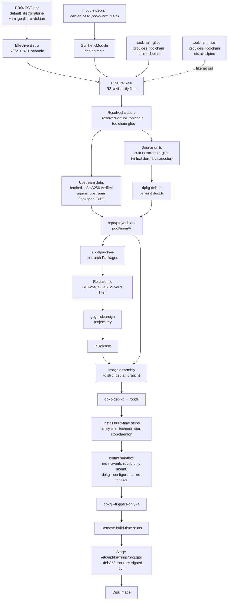

# feat: Debian backend — module-debian, glibc toolchain, apt-on-target

## Summary

Implement the Debian backend as 23 units across 9 phases: format-named Go
internals (`internal/dpkg/`, `internal/deb/`, `internal/repo/deb_emitter.go`),
the `distro` cascade + per-unit visibility filter that R20a/R21/R21a defined,
on-disk distro split for `build/` and `repo/`, toolchain relocation that moves
`toolchain-musl` into `module-alpine` and lands `toolchain-glibc` in
`module-debian` (both declaring `provides = ["toolchain"]` so classes depend on
the virtual name and R21a's filter narrows to the right one), the
`debian_feed()` Starlark builtin that mirrors `alpine_feed`, a signed Debian
project-repo emitter via `apt-ftparchive` + `gpg --clearsign` shell-out with
mirror-time SHA256 verification (R15), image assembly that runs
`dpkg --configure -a` inside a no-network / rootfs-only-mount binfmt sandbox
(R18) with the standard `policy-rc.d` + `ischroot` + `start-stop-daemon` stubs,
deb822 `sources.list` with `signed-by=` HTTPS-only, and a new `module-debian`
sibling git repo holding the bootstrap Debian keyring and committed `Packages`
snapshots.

Sourced from the spec at `docs/specs/2026-05-25-module-debian.md` as revised
2026-05-27 (commit `00eba6d`, post-ce-doc-review). Three project-context
memories anchor the framing: module-debian is exploratory, apt-on-target serves
the iterate-deploy-update dev workflow, and the dev workflow targets open
systems initially with production-threat-model security concerns out of scope.

---

## Problem Frame

yoe's dev deployment workflow centers on the iterate-deploy-update loop — build
a project, sign a repo, point devices at it, push updates via the device's
native package manager. The APK side already ships (`internal/feed/server.go`,
`cmd/yoe/deploy.go`, `docs/specs/2026-04-30-feed-server-and-deploy.md`). This
plan brings the same shape to the Debian side. Full motivation, trust model,
actor map, flows, and acceptance examples live in the origin spec; this plan
covers HOW the implementation executes — file boundaries, library choices,
sequencing, integration points, test scenarios — without re-litigating product
shape.

The hard prerequisite — feeds-as-modules — has landed (commit `cbdf...` per
SPEC_PLAN_INDEX; `internal/apkindex/`, `internal/feeds/alpine/`,
`internal/starlark/synthetic_module.go`, `yoe update-feeds`, recursive module
walking, closure-walk visibility hooks all in place, and `module-alpine`'s
`MODULE.star` is two `alpine_feed()` calls). This plan consumes that machinery
and adds the format-named Debian sibling.

---

## Requirements

This plan implements all 29 requirements of the origin spec (R1–R26 plus the
add-on R14a, R20a, R21a). The unit listing under "Implementation Units"
attributes each unit to specific R-IDs.

- R1–R5 (module surface, `debian_feed`, synthetic modules, `module-debian` repo,
  format-agnostic internals) → Phases 5, 8
- R6–R7 (internal dpkg/apt machinery, resolver dep-syntax) → Phase 1
- R8–R9 (`toolchain-glibc` container, virtual-`toolchain` dispatch via
  `provides` + R21a) → Phase 4
- R10–R11 (in-tree `Packages` storage, `yoe update-feeds` dispatch) → Phase 5
- R12–R14 (`.deb` build, repo emitter, project repo layout split) → Phases 3, 6
- R14a (on-disk `build/<distro>/...` split) → Phase 3
- R14b (in-memory catalog by `(module, name)` with distro-filtered views) →
  Phase 3 (emerged from R21a integration; see U6b)
- R15–R17 (mirror-verbatim with mirror-time SHA256 verify, InRelease signing,
  signed-by= keyring) → Phases 6, 7
- R18–R19 (image-build `dpkg --configure -a` under binfmt, package-driven
  service enablement) → Phase 7
- R20 (sources.list deb822 + `signed-by=`) → Phase 7
- R20a (project `default_distro` fallback) → Phase 2
- R21 (image effective-distro cascade) → Phase 2
- R21a (per-unit `distro` compatibility tag, closure-walk visibility filter) →
  Phase 2
- R22 (foreign-arch via QEMU/binfmt) → Phase 7 (reuses existing machinery)
- R23 (documentation) → Phase 9
- R24 (`Valid-Until` emit + validate with tradeoff acknowledged) → Phases 6, 5
- R25 (bootstrap keyring + allow-list) → Phases 5, 8
- R26 (HTTPS-only repo URL with build-time validation) → Phase 7

**Origin actors:** A1 (module maintainer), A2 (project user), A3 (resolver), A4
(image assembler), A5 (packager), A6 (apt-tools on target). **Origin flows:** F1
(resolve units), F2 (refresh feed), F3 (image assembly), F4 (project deb
publish), F5 (target install/upgrade). **Origin acceptance examples:** AE1–AE10
plus AE5a (default_distro cascade) and AE5b (untagged-unit build-twice +
tagged-unit invisible).

---

## Scope Boundaries

- Synthetic-module infrastructure (loader, lazy materialization, on-disk
  parsed-index cache, TUI filter-first, cross-feed providers): delivered by
  feeds-as-modules and already shipped. This plan consumes it.
- `alpine_feed()` builtin and `module-alpine`'s migration off `alpine_pkg.star`:
  also already shipped via feeds-as-modules.
- `module-ubuntu` and `ubuntu_feed()`: design accommodates them; separate
  spec/plan. Ubuntu carveouts named in origin Scope Boundaries
  (Phased-Update-Percentage, rotating keyring, snap-stub packages, PPA signing,
  debhelper differences, restricted/multiverse licensing).
- `debsig-verify` per-`.deb` signature path: Debian doesn't use it (origin Key
  Decisions); not in trust chain.
- Production threat-model security work (key rotation procedures for baked-in
  keys, postinst-as-hostile-actor mitigations, downgrade-attack defenses on
  `verify-peer=no`, closed-network HTTPS escape hatches): out of scope per
  `project_apt_dev_workflow_open_systems` memory. The standard baselines
  (`InRelease` signing, per-package SHA256, `signed-by=` scoping, HTTPS
  mandatory at image-build time) stay in.
- Pure-Go replacement for `apt-ftparchive`: shell-out is fine for v1.
- Zstd compression for `.deb` payloads: xz default; zstd is a follow-up once
  dpkg minimum on consuming devices supports it.
- Cross-suite project support: one Debian suite per project enforced; origin
  Scope Boundaries.
- A `pulling-debian-packages` Claude skill modeled on `pulling-alpine-packages`:
  recommend after v1 stabilizes.
- Reproducible-builds `.buildinfo` emission: yoe's content-addressed cache
  provides functional reproducibility; bit-exact `.buildinfo` deferred.
- Per-image "no-scripts" / stripped-maintainer-script mode (origin Outstanding
  Question): deferred.
- Migrating the existing `RepackAPK` re-sign path: covered by
  `docs/specs/2026-05-18-mirror-alpine-keep-keys.md`, not this plan.

### Deferred to Follow-Up Work

- Pure-Go `apt-ftparchive` replacement: revisit only if shell-out hermeticity
  becomes a real concern.
- Zstd `.deb` compression: revisit when consuming devices ship dpkg ≥ 1.21.18
  broadly.
- Per-image no-scripts mode: revisit if a real customer asks.
- `pulling-debian-packages` skill: write after the manual workflow stabilizes.
- Registry-based lookup for all hardcoded toolchain image references: any
  remaining hardcoded `toolchain-musl:15` strings in image-assembly code paths
  get unblocked by U5 (virtual-container resolution) but the broader cleanup is
  its own follow-up.
- Refactoring `cache/go/<distro>/` and other language caches: origin's
  Outstanding Question; revisit if cross-distro Go builds cross-pollute module
  caches.

---

## Context & Research

### Architectural reference

[**docs/catalog.md**](../catalog.md) — The in-memory unit catalog,
synthetic-module lazy materialization, working-set sizes, hash gating, and the
catalog-by-distro evolution motivating U6b. Read this before reviewing U4a, U4b,
U6, U6b, or U4a-fix; their design rationale lives there, not in this plan.

### Relevant Code and Patterns

**Format internals (Alpine analogs — canonical reference for the Debian sibling
layout):**

- `internal/apkindex/parse.go`, `deps.go`, `provides.go`, `verify.go`,
  `materialize.go` — text-format parser, dep tokens, virtuals table, pure-Go
  signature verification, index-entry-to-`*Unit` materialization. The Debian
  parallel is `internal/dpkg/` (U1) with structurally identical files but
  thinner — `pault.ag/go/debian` does the parsing heavy lifting.
- `internal/feeds/alpine/builtin.go`, `tarstream.go`, `peek.go`, `update.go`,
  `crossfeed_test.go` — Starlark builtin registration, fetch + decompress,
  `yoe update-feeds` driver, cross-feed providers wiring. The Debian parallel is
  `internal/feeds/debian/` (U11, U12).
- `internal/starlark/synthetic_module.go` — `SyntheticModule` type. Already
  names `debian_feed` as a future consumer. The Debian builtin calls
  `Engine.RegisterSyntheticModule` with a Debian-shaped `Lookup`/`Names` closure
  pair — no new type-system work.
- `internal/repo/index.go`, `local.go` — APK repo emitter (`GenerateIndex`,
  `RepoDir`, `Publish`, `WritePublicKey`). The Debian sibling is
  `internal/repo/deb_emitter.go` (U13) and `RepoDir` gains a `<distro>` subdir
  per R14 (U7).
- `internal/artifact/apk.go` — `CreateAPK`, `RepackAPK`,
  `materializeServiceSymlinks` (services baking). The Debian sibling is
  `internal/deb/writer.go` (U2) with a parallel
  `materializeSystemdServiceSymlinks` baking systemd `wants/` symlinks into the
  staged destdir before `dpkg-deb --build`.
- `internal/artifact/sign.go` — RSA-SHA1 `Signer` for apk. The Debian sibling is
  `internal/deb/sign.go` (U2) wrapping `gpg --clearsign` for `InRelease`.

**Container unit pattern (toolchain-musl as exact template for
toolchain-glibc):**

- `modules/module-core/classes/container.star` — `container()` class.
- `modules/module-core/containers/toolchain-musl.star` — 6-line `container()`
  invocation. U8 moves this to `module-alpine` and adds
  `provides = ["toolchain"]` plus `distro = "alpine"`.
- `modules/module-core/containers/toolchain-musl/Dockerfile` — bootstrap Alpine
  toolchain.
- `internal/build/executor.go:819-840` —
  `resolveContainerImage(unitName) → yoe/<container>:<version>-<arch>`. U5
  extends this to dereference virtual container names
  (`container = "toolchain"`) through the closure.

**Starlark builtin registration (where `debian_feed` plugs in):**

- `internal/starlark/builtins.go:13-46` — builtins map. U11 adds
  `yoestar.WithBuiltin("debian_feed", debian.Builtin)` to `cmd/yoe/main.go`
  parallel to the existing `alpine.Builtin` registration.
- `cmd/yoe/main.go:91-92, 188-235` — `update-feeds` subcommand dispatch. U12
  extends this to detect Debian feed declarations and route to
  `internal/feeds/debian.UpdateFeeds`.

**Unit struct + closure walk (where `distro` field lives):**

- `internal/starlark/types.go:196-260` — `Unit` struct. U4 adds the `Distro`
  string field (image-driver semantics for class=`image`, compatibility-tag
  semantics for everything else per R21a).
- `internal/starlark/types.go` — `Project` struct. U4 adds `DefaultDistro`
  string field per R20a.
- `internal/starlark/builtins.go:215-228` — `reservedUnitKwargs`. U4 adds
  `distro` as a typed kwarg.
- `internal/starlark/closure.go` — closure walker. U4 adds the R21a visibility
  filter: a unit is reachable iff `unit.Distro == ""` or
  `unit.Distro == effectiveDistro`.

**Resolver and provides table (where R9's `provides`-based dispatch lives):**

- `internal/resolve/runtime.go:25-59` — `RuntimeClosure(proj, roots)`. The
  closure walker consults the provides table to follow virtual deps; this
  already works for apk virtuals and Alpine feed cross-providers, so R9's
  `provides = ["toolchain"]` declaration plugs in without resolver changes.
- `internal/apkindex/provides.go` — provides table shape used by Alpine feeds.
  The Debian parallel in `internal/dpkg/provides.go` (U1) mirrors it.

**Hash gating (CLAUDE.md rule):**

- `internal/resolve/hash.go:73-77` (gated `src_state`), `:117-121` (gated
  `Extra`) — pattern for adding `distro:` line conditionally. The image's
  effective distro IS hashed (it drives toolchain selection and packaging); the
  unit's compatibility tag is NOT hashed (visibility-only, no output effect). U4
  gates the `effective_distro:%s\n` line on non-empty per the pattern.

**Build dir and Repo dir (R14, R14a migration targets):**

- `internal/build/sandbox.go:283-289` —
  `UnitBuildDir(projectDir, scopeDir, unitName) → build/<unit>.<scope>/`. U6
  grows a `distro` parameter and threads it through every caller (executor x5,
  sandbox x3, bootstrap x2, tui x16, plus `internal/dev.go`'s `devSrcDir()`
  which duplicates the path construction).
- `internal/repo/local.go:15-23` —
  `RepoDir(proj, projectDir) → repo/<project>/`. U7 grows a `distro` parameter
  and emits `repo/<project>/<distro>/`. Touches `image/rootfs.go`,
  `tui/feed.go`, `bootstrap/bootstrap.go` (3 sites), `build/executor.go` (3
  sites), `cmd/yoe/main.go`, `cmd/yoe/deploy.go`, `cmd/yoe/serve.go`.
- `internal/clean.go:11-23` — `RunClean` constructs the per-unit build path
  manually (`filepath.Join(buildDir, arch, r)`) rather than via `UnitBuildDir`,
  and its current shape doesn't match today's layout either — likely a
  pre-existing bug. U6 reroutes it through `UnitBuildDir` and verifies the prior
  behavior.

**Image assembly and binfmt:**

- `internal/image/rootfs.go:16-179` — `Assemble`, `installPackages`,
  `applyConfig`. U16 branches `Assemble` on distro: apk extract path stays; the
  deb extract path calls `internal/deb.ExtractDataTar` and follows with
  `dpkg --configure -a` (U17).
- `internal/container.go:212-260` — `CheckBinfmt`, `RegisterBinfmt`. U17 reuses
  these verbatim; the no-network/rootfs-only-mount stance is expressed via the
  bwrap arguments passed to the dpkg invocation.
- `internal/container.go:156-206` — `containerRunArgs` with
  `--platform linux/<arch>`.

**Source fetch (reusable for upstream `.deb` mirroring):**

- `internal/source/fetch.go` — handles HTTP/git, SHA256 verification. U15
  threads the upstream-Packages-listed SHA256 through this path so the
  fetch-side comparison happens on bytes already being hashed for
  cache-addressing.

**External-module sync (how `module-debian` cache lands in projects):**

- `internal/module/fetch.go:30-80` — `Sync(modules, w)`;
  `git fetch && git checkout FETCH_HEAD`. No changes needed; `module-debian`
  slots in as a normal external module.

### Institutional Learnings

- **No `docs/solutions/` directory in this repo yet** — institutional learnings
  are inferred from spec history, `docs/apk-passthrough.md`, and the
  SPEC_PLAN_INDEX. U22 captures the more interesting ones in
  `docs/module-debian.md` as a future-proofing artifact.
- **noarch routing four-part fix** (`docs/apk-passthrough.md` lines 110-140) —
  applies directly to `Architecture: all` debs: file location, index location,
  cache-validity directory lookup, per-arch reindex-on-publish. U13 plans for it
  up front.
- **Services follow packages** (CLAUDE.md, supersedes
  `docs/specs/2026-04-07-unit-services.md`) — `services=[...]` on units bakes
  symlinks/postinst into the package at package time. U2's writer bakes systemd
  `wants/` symlinks into `data.tar` exactly like Alpine's
  `materializeServiceSymlinks` does for OpenRC.
- **Content-addressed-cache gating rule** (CLAUDE.md,
  `internal/resolve/hash.go`) — gate every new `fmt.Fprintf` in `hash.go` on a
  non-empty check. U4 gates the new `effective_distro` hash line.
- **`one unit, one .apk` carveout list now includes libc family** — `CLAUDE.md`
  updated 2026-05-27 to list libc family alongside kernel defconfig and
  bootloader target. This plan's R14a build-twice posture has a canonical home
  in the rule.
- **Pre-1.0: clean over preservation** — accept rebuilds, hash invalidations,
  back-compat breaks for clean implementation. U6 and U7 apply this to the
  in-place `build/` and `repo/` layout migrations.

### External References

- Debian repository format — <https://wiki.debian.org/DebianRepository/Format>
- apt deb822 sources —
  <https://manpages.debian.org/bookworm/apt/sources.list.5.en.html>
- apt-secure (`Valid-Until`, `InRelease`) —
  <https://manpages.debian.org/bookworm/apt/apt-secure.8.en.html>
- apt-ftparchive —
  <https://manpages.debian.org/bookworm/apt-utils/apt-ftparchive.1.en.html>
- dpkg-deb — <https://manpages.debian.org/bookworm/dpkg/dpkg-deb.1.en.html>
- Debian Policy 4.6.2 —
  <https://www.debian.org/doc/debian-policy/ch-controlfields.html>
- debian-archive-keyring (bookworm) —
  <https://packages.debian.org/bookworm/all/debian-archive-keyring/filelist>
- `pault.ag/go/debian` — <https://pkg.go.dev/pault.ag/go/debian> (control,
  dependency, version, deb-read)
- `ProtonMail/go-crypto` — <https://github.com/ProtonMail/go-crypto> (OpenPGP
  clearsign verify)
- `policy-rc.d` build-time stub spec —
  <https://people.debian.org/~hmh/invokerc.d-policyrc.d-specification.txt>
- Foreign-arch debootstrap under binfmt — <https://wiki.debian.org/Arm64Qemu>,
  <https://muxup.com/2024q4/rootless-cross-architecture-debootstrap>

### isar as stuck-reference

A local clone of [isar](https://github.com/ilbers/isar) lives at
`/scratch4/yoe/isar`. When stuck on Debian-specific mechanics — chroot setup,
mount discipline, apt configuration, dpkg behavior in foreign-arch chroots,
preset/divert patterns, repo emission, maintainer-script quirks — grep through
that tree **before re-deriving from manpages**.

Highest-leverage files:

- `meta/recipes-core/isar-mmdebstrap/files/chroot-setup.sh` — divert-based stub
  setup/cleanup. Reference for U17's chroot hygiene.
- `meta/classes-recipe/rootfs.bbclass` — mount discipline,
  `ROOTFS_POSTPROCESS_COMMAND` chain, apt config baked into image. Reference for
  U16, U17, U18.
- `meta/classes-recipe/dpkg-raw.bbclass` — destdir-to-deb path (closest isar
  analog to yoe's project-deb model). Reference for U2 + U14.
- `meta/classes-recipe/repository.bbclass` — apt-ftparchive shell-out patterns.
  Reference for U13.
- `scripts/mount_chroot.sh`, `scripts/umount_chroot.sh` — mount/unmount
  ordering. Reference for U17.

**Caveats:** do NOT copy isar's architecture (BitBake recipes, BBCLASSEXTEND,
debootstrap-based bootstrap, schroot-based package builds). Borrow tactical
solutions; reject the surrounding metadata model.

### Sibling specs (must coordinate)

- `docs/specs/2026-05-13-feeds-as-modules.md` — **already implemented** (commit
  2026-05-26). U4–U5 plug into the already-shipped synthetic-module
  - closure-walk machinery without modifying it.
- `docs/specs/2026-05-18-mirror-alpine-keep-keys.md` — Alpine's mirror-verbatim
  posture. This plan adopts the analog for Debian (mirror-verbatim,
  project-key-signs-index-only).
- `docs/specs/2026-05-20-starlark-unprivileged-only.md` — moves image+container
  assembly off Starlark into Go. This plan designs the Debian rootfs assembly as
  Go from day one (Phase 7).
- `docs/specs/2026-03-31-cross-arch-qemu-usermode.md` — foreign-arch under QEMU
  user-mode + binfmt. U17 reuses this verbatim.
- `docs/specs/2026-04-04-container-units.md` — `container()` class pattern. U8,
  U9 follow it verbatim.

---

## Key Technical Decisions

- **Toolchain dispatch via `distro` + `provides`, not via class-evaluation
  context.** Each toolchain unit declares `provides = ["toolchain"]` and a
  `distro` compatibility tag (R21a). Classes (`autotools`, `cmake`, `go_binary`,
  etc.) depend on the virtual name `toolchain` and set `container = "toolchain"`
  as a virtual reference. The resolver follows the existing provides table to
  find candidates; R21a's visibility filter narrows to the one matching the
  consuming image's effective distro. By construction one candidate per closure.
  Considered and rejected: threading effective distro through a new
  `ctx.distro`-style class context — would have added a new mechanism just for
  distro-aware classes.
- **On-disk distro split happens one level down from the top, in `build/` and
  `repo/`.** `build/<distro>/<unit>.<scope>/` and `repo/<project>/<distro>/...`
  parallel each other. Considered and rejected: suffix-on-unit-name
  (`build/<unit>.<scope>.<libc>/`) — smaller code-touch but shape-asymmetric
  with the repo split, harder to reset surgically, noisier visually.
- **Catalog: storage is module-keyed, lookup is distro-filtered + module-
  prioritized.** Distro is a visibility filter; module is the priority axis; the
  catalog separates them so cross-distro same-name collisions coexist instead of
  overwriting at the catalog level. See [docs/catalog.md](../catalog.md) for the
  full architecture — storage shape, lazy materialization contract, working-set
  sizes, invariants the resolver depends on, and the rejected alternatives
  (walker-side per-lookup probe attempted in 45b6f6b and reverted same-day after
  the working set grew past 23 GB; distro-keyed storage with untagged- first
  fallback which inverts today's `module-core`-wins semantics; composite-key
  flat map). U6b is the implementation unit. R14a's build-twice-along-libc
  property is wired separately via U4a-fix at the hash layer; the catalog
  supplies the right `*Unit` definition, the hash key disambiguates the binary
  outputs.
- **`distro` field semantics: driver on images, compatibility tag on non-image
  units.** Same field name, two semantics by context. On a `class = "image"`
  unit, `distro` drives toolchain, packaging, repo subtree, build-dir prefix. On
  any other unit, `distro` filters closure-walk visibility — nothing else. The
  hash key includes effective distro (driven by image) but NOT the unit's
  compatibility tag (visibility-only; no output effect). This keeps adding the
  field to existing units cache-neutral.
- **Effective-distro cascade includes a per-developer override.** The resolution
  order is
  `image.distro → local.DefaultDistroOverride → proj.DefaultDistro → error`.
  PROJECT.star (checked in) carries the project-wide default; `local.star`
  (per-developer, not committed) carries an optional override that wins over the
  project default but loses to an explicit image-level declaration. Mirrors the
  existing QEMU-settings local-override pattern. U23 wires the TUI surface that
  picks the local override from a list of distros sourced dynamically from the
  loaded modules' synthetic-feed parents (no hardcoded enum in yoe core).
- **Internal code lives under `internal/dpkg/`, `internal/deb/`,
  `internal/feeds/debian/`, named by format.** Mirrors the Alpine layout
  (`internal/apkindex/`, `internal/feeds/alpine/`). Future `module-ubuntu`
  imports these unchanged.
- **Go dependencies added (only two):**
  - `pault.ag/go/debian` — BSD-3 / MIT; the de-facto Go Debian toolbelt. Used
    for `Packages` parsing, dep-syntax, version comparison, deb-read.
  - `github.com/ProtonMail/go-crypto/openpgp/clearsign` — BSD-3; the canonical
    replacement for archived `golang.org/x/crypto/openpgp`. Used for in-process
    `InRelease` verification at `yoe update-feeds` time.
- **Shell out for everything else:** `dpkg-deb -b/--contents/--info`,
  `apt-ftparchive`, `gpg --clearsign`, `dpkg --configure -a`. All available in
  `toolchain-glibc`. Matches yoe's posture of shelling to `apk-tools`, `bwrap`,
  `mkfs`, etc.
- **Mirror-verbatim, project-key-signs-index-only, with mirror-time SHA256
  verification (R15).** Each downloaded `.deb`'s computed SHA256 (already
  computed for source-cache addressing) is compared against the upstream-signed
  `Packages` entry; mismatch refuses to publish a project `InRelease`. No extra
  HTTP requests, no extra disk reads — rides on bytes already being hashed.
- **`signed-by=`-scoped key on device, not `/etc/apt/trusted.gpg.d/`.** Project
  key lives at `/etc/apt/keyrings/<project>.gpg` and is referenced from the
  deb822 `.sources` file's `Signed-By:` field, scoping its trust to the project
  source only.
- **`dpkg --configure -a` under binfmt at image build with no-network /
  rootfs-only-mount sandbox.** R18. The container invocation uses
  `containerRunArgs --network=none` (docker/podman) for the no-network primitive
  — bwrap's `--unshare-net` isn't reachable on the foreign-arch path. Mounts:
  staging rootfs writable, toolchain-glibc base read-only, ro-bind `/proc`,
  `/dev/null`, `/dev/urandom`, plus a `tmpfs` at `/tmp` for postinst scratch
  (`update-ca-certificates`, `man-db` both need it). Capability set is container
  default minus `CAP_NET_ADMIN`, `CAP_NET_RAW`, `CAP_SYS_ADMIN`,
  `CAP_SYS_MODULE`, `CAP_SYS_RAWIO`, `CAP_SYS_BOOT`, `CAP_SYS_TIME` — the
  configure pass needs filesystem ownership ops (`CAP_CHOWN`, `CAP_FOWNER`,
  `CAP_DAC_OVERRIDE`) but not networking, kernel-module, or raw-device access.
  `--privileged` is NOT used. Build-time stubs (`policy-rc.d` returning 101,
  `ischroot` → `/bin/true`, `start-stop-daemon` no-op wrapper) installed before,
  removed at finalize. Reproducibility property: postinsts that reach out to the
  network produce different output depending on what's reachable when, which
  breaks the content-addressed cache. The narrow set of postinsts that need
  network (cloud-init, telemetry agents, license-prompt downloaders) is not
  appropriate for embedded images and is excluded from `artifacts` lists;
  replace with a from-source `module-core` unit if needed.
- **`dpkg --configure -a --no-triggers` first, then `dpkg --triggers-only -a`
  once at the end.** Deduplicates trigger work; matches debian-installer
  convention.
- **`Valid-Until` default leans toward dev workflow (30 days),
  project-configurable, tradeoff acknowledged in R24.** Embedded fleets may need
  shorter (security cadence) or longer (offline tolerance); configure
  per-project.
- **xz compression for project `.deb` data and control tars** (Debian bookworm
  default). Zstd deferred.
- **One Debian suite per project** — enforced at evaluation by the resolver.
  Multi-suite support requires a suite axis in the toolchain cache key; out of
  scope.
- **`yoe update-feeds` Debian dispatch reuses the existing CLI surface.**
  `cmd/yoe/main.go` already routes `case "update-feeds"` to
  `internal/feeds/alpine.UpdateFeeds`; U12 adds detection of `debian_feed`
  declarations and routes to `internal/feeds/debian.UpdateFeeds` with the same
  flag surface (`--arch`, `--module-dir`) and same write-but-don't- commit
  contract.
- **toolchain-musl moves from `module-core` to `module-alpine`, toolchain-glibc
  lands in `module-debian`.** Both are distro-specific build infrastructure;
  their natural home is the matching module. `CLAUDE.md`'s reference to
  toolchain-musl's location updates in the same commit.

---

## Open Questions

### Resolved During Planning

- **Toolchain dispatch mechanism** — `distro` + `provides` per the spec's R9
  rewrite, not class-evaluation-context injection.
- **`distro` field scope on Unit** — single field, image=driver semantics,
  non-image=visibility-tag semantics per R21.
- **`default_distro` field on Project** — added per R20a; required-or-cascade
  with image's own `distro`.
- **Go libraries** — `pault.ag/go/debian` + ProtonMail clearsign; everything
  else shell-out.
- **`InRelease` only vs `Release` + `Release.gpg`** — `InRelease` only (apt has
  preferred it since 1.1, 2015).
- **Hash algorithms in `Release`** — SHA256 + SHA512 (matches modern Debian;
  SHA256 is minimum apt accepts).
- **v1 arch matrix** — amd64 + arm64.
- **toolchain locations** — `toolchain-musl` → `module-alpine`,
  `toolchain-glibc` → `module-debian`.
- **`build/` / `repo/` split shape** — per-distro subtree at one level down from
  top.

### Deferred to Implementation

- Exact `Filename:` rewriting strategy in `Packages` (rewrite in-memory at index
  emit time vs pre-rewrite during mirror copy). Implementer picks.
- Whether to ship `apt-utils` on device (provides `apt-ftparchive`) or only in
  build container. v1 default: build-container only.
- Exact GPG key generation invocation for project's `InRelease` signing key.
  Implementer decides; likely
  `gpg --batch --quick-generate-key default default 0` plus exporting the
  ASCII-armored public key.
- Project GPG key at-rest location: `~/.config/yoe/keys/<project>.gpg` (parallel
  to existing RSA path).
- Whether `module-debian` ships `keys/debian-archive-keyring.gpg` by convention
  or via a `keyring_path` field on `debian_feed`. Lean toward convention.
- In-memory vs on-disk cache for parsed `Packages` files. Defer to U1
  implementation; on-disk follows if `Packages` size becomes a build-time parse
  cost.
- Whether mirror tool emits `by-hash` directories alongside canonical
  `Packages.{gz,xz}` paths. Lean toward yes; v1.0 skip acceptable.
- Where the gated `effective_distro` line lands in `internal/resolve/hash.go`'s
  formatting order. Implementer picks during U4.

---

## Output Structure

The plan creates these new top-level directories/files (greenfield surface):

```
# In the yoe repo (this tree):
yoe/
└── internal/
    ├── dpkg/                            # U1 — Debian format parser
    │   ├── packages.go
    │   ├── deps.go
    │   ├── version.go
    │   ├── provides.go
    │   ├── verify.go                    # InRelease clearsign verify
    │   └── *_test.go
    ├── deb/                             # U2 — .deb reader/writer/sign
    │   ├── reader.go
    │   ├── writer.go
    │   ├── extract.go
    │   ├── control.go
    │   ├── sign.go                      # gpg --clearsign for InRelease
    │   └── *_test.go
    ├── feeds/
    │   └── debian/                      # U11, U12 — debian_feed builtin
    │       ├── builtin.go
    │       ├── packages_stream.go
    │       ├── update.go
    │       └── *_test.go
    └── repo/
        └── deb_emitter.go               # U13 — Debian-format emitter
# Plus cross-cutting touches in starlark/, build/, image/, cmd/, dev.go, clean.go.

# In the module-alpine repo (external sibling, not yoe in-tree):
module-alpine/                           # gains the toolchain-musl files (U8)
└── containers/
    ├── toolchain-musl.star              # provides=["toolchain"], distro="alpine"
    └── toolchain-musl/Dockerfile

# In the module-debian repo (external sibling, not yoe in-tree):
module-debian/                           # populated by U9, U19
├── MODULE.star                          # 2-3 debian_feed() calls (post-U11)
├── LICENSE
├── README.md
├── feeds/
│   ├── main/{amd64,arm64}/Packages
│   ├── main-security/{amd64,arm64}/Packages
│   └── main-updates/{amd64,arm64}/Packages
├── keys/
│   ├── debian-archive-keyring.gpg       # bootstrap, fingerprint-pinned
│   └── allowed-fingerprints             # R25 allow-list
└── containers/
    ├── toolchain-glibc.star             # provides=["toolchain"], distro="debian"
    └── toolchain-glibc/Dockerfile
```

The implementer may adjust directory shape if implementation reveals a better
layout. Per-unit `**Files:**` sections remain authoritative.

---

## High-Level Technical Design

> _This illustrates the intended approach and is directional guidance for
> review, not implementation specification. The implementing agent should treat
> it as context, not code to reproduce._

**Build-time flow (Debian path):**



**Trust chain at device install time:**

```
sources.list.d/<project>.sources
  ├── Signed-By: /etc/apt/keyrings/<project>.gpg
  └── URIs: https://feeds.example.com/.../<project>/debian

apt fetch InRelease
  → gpg verify against /etc/apt/keyrings/<project>.gpg
  → REJECT if Valid-Until expired
apt fetch Packages
  → SHA256 verified against InRelease
apt fetch <pkg>.deb
  → SHA256 verified against Packages
  → install + run maintainer scripts via dpkg
```

**On-disk layout (post-R14, R14a):**

```
testdata/<project>/
├── PROJECT.star                         # default_distro = "alpine"
├── build/
│   ├── alpine/
│   │   └── openssl.x86_64/              # built with toolchain-musl
│   └── debian/
│       └── openssl.x86_64/              # built with toolchain-glibc
├── cache/
│   ├── sources/                          # flat, SHA256-keyed (unchanged)
│   └── modules/
│       ├── module-alpine/                # houses toolchain-musl (post-U8)
│       └── module-debian/                # houses toolchain-glibc (post-U9)
└── repo/<project>/
    ├── alpine/                          # APK tree (moved from repo/<project>/)
    │   ├── keys/
    │   ├── noarch/
    │   └── <arch>/APKINDEX.tar.gz
    └── debian/                          # NEW
        ├── keys/<project>.gpg
        ├── dists/
        │   └── bookworm/
        │       ├── InRelease
        │       ├── Release
        │       └── main/binary-<arch>/Packages.{gz,xz}
        └── pool/main/o/openssl/openssl_*_<arch>.deb
```

---

## Implementation Units

Units organized by 9 phases. Each phase is shippable independently and earns its
own CHANGELOG entry.

### Phase 1 — Format-named Go internals

#### U1. `internal/dpkg/` — Debian format parser

> **Status:** Landed in a10c883 (Phase 1+2 commit, 2026-05-27). `internal/dpkg/`
> package exists with `ParseIndex`, dep parsing, and InRelease clearsign verify
> wired against `pault.ag/go/debian` + ProtonMail/go-crypto.

**Goal:** Wrap `pault.ag/go/debian` into a yoe-shaped `internal/dpkg` package
covering `Packages` parsing, dpkg dep-syntax, version comparison, virtual
provides, and `InRelease` clearsign verification.

**Requirements:** R6, R7, R11 (verify side), R25 (verify side).

**Dependencies:** None.

**Files:**

- Create: `internal/dpkg/packages.go` —
  `ParsePackagesIndex(r io.Reader) ([]PackageEntry, error)`.
- Create: `internal/dpkg/deps.go` — `ParseDependency`, `SatisfyDependency` with
  provides-table integration; handles `:any`/`:native`/`:<arch>` and the
  alternative-bar `|`.
- Create: `internal/dpkg/version.go` — `Compare`, `Parse` wrapping
  `pault.ag/go/debian/version`.
- Create: `internal/dpkg/provides.go` — `BuildProvidesTable`, mirrors
  `internal/apkindex/provides.go`.
- Create: `internal/dpkg/verify.go` —
  `VerifyInRelease(release []byte, keyring []byte) ([]byte, error)` using
  `ProtonMail/go-crypto/openpgp/clearsign`. Returns the cleartext body on
  success.
- Modify: `go.mod`, `go.sum` — add `pault.ag/go/debian`,
  `github.com/ProtonMail/go-crypto`.
- Test: `internal/dpkg/{packages,deps,version,provides,verify}_test.go`.

**Approach:** Thin wrapper layer; don't re-implement parsing. Pull a small slice
of real `bookworm` `Packages` (saved as a testdata fixture) and assert counts
plus known fields. The library handles all the dep-syntax cases yoe needs; the
wrapper produces yoe-friendly types and the cross-feed provides table that
mirrors the Alpine shape.

**Patterns to follow:**

- `internal/apkindex/` — canonical structural sibling. Match its file layout,
  test fixture pattern, and naming conventions.
- `internal/source/fetch.go` — for "small library wrapping an external concern
  with yoe-friendly types" pattern.

**Test scenarios:**

- Happy path: parse a real `bookworm` binary-arm64 `Packages` slice (saved as
  `testdata/`) and assert entry count + known package (openssl, libc6).
- Happy path: parse `libssl3 (>= 3.0.0) | libssl1.1` and assert AST: 1 Relation,
  2 Possibilities, version constraint on first. Covers AE4.
- Edge case: parse `Depends: libc6:any (>= 2.31)` and confirm arch qualifier
  preserved.
- Edge case: parse `Provides: libfoo-abi-1 (= 1.0)` and confirm versioned
  virtual.
- Edge case: `version.Compare("1.0~rc1", "1.0") == -1` (tilde sorts before
  nothing); `Compare("1:1.0", "99.0") == +1` (epoch dominates).
- Integration: `BuildProvidesTable` over a small entry set with one virtual
  provider; `SatisfyDependency` resolves it correctly.
- Happy path (verify): valid `InRelease` against the in-tree
  `debian-archive-keyring` returns the cleartext.
- Error path (verify): `InRelease` signed by an unknown key returns a
  signature-failure error naming the key fingerprint. Covers AE10 verify step.
- Error path (verify): `InRelease` missing `Valid-Until` returns a
  `Valid-Until missing` error. Covers R24 + R11.
- Error path (verify): `InRelease` with passed `Valid-Until` returns a
  `Valid-Until expired` error.
- Error path: malformed `Packages` stanza (missing `Package:`) returns a clear
  error naming the failing position.

**Verification:**

- `go test ./internal/dpkg/...` passes.
- `go.mod` declares only `pault.ag/go/debian` and `ProtonMail/go-crypto` as new
  direct dependencies.

---

#### U2. `internal/deb/` — `.deb` reader, writer, extract, control, sign

> **Status:** Landed in a10c883. `internal/deb/` shells `dpkg-deb` for
> build/extract/info and `gpg --clearsign` for InRelease signing. Pure-Go read
> path uses `pault.ag/go/debian`.

**Goal:** Read and write `.deb` files. Reader: extract `data.tar` for image
assembly and `control.tar` for indexing. Writer: build a `.deb` from a staged
destdir + control metadata. Sign: shell `gpg --clearsign` for `InRelease`.

**Requirements:** R6, R12, R15, R16 (sign side).

**Dependencies:** U1.

**Files:**

- Create: `internal/deb/reader.go` — `ReadDeb(path string) (*Deb, error)` using
  `pault.ag/go/debian/deb`.
- Create: `internal/deb/extract.go` —
  `ExtractDataTar(deb *Deb, destRoot string) error`.
- Create: `internal/deb/writer.go` —
  `BuildDeb(destDir, controlFile, output, compression string) error` shells
  `dpkg-deb --build`.
- Create: `internal/deb/control.go` —
  `WriteControl(w io.Writer, c Control) error`.
- Create: `internal/deb/services.go` —
  `materializeSystemdServiceSymlinks(destDir string, services []string) error`.
- Create: `internal/deb/sign.go` —
  `SignInRelease(releaseBytes []byte, gpgKeyID string) ([]byte, error)` shells
  `gpg --clearsign`.
- Test: `internal/deb/{reader,extract,writer,control,services,sign}_test.go`.

**Approach:**

- Reader uses `pault.ag/go/debian/deb`; library handles `ar` framing and per-tar
  compression (gz/xz/zst).
- Writer shells `dpkg-deb --build` — pure-Go alternatives are immature.
- `BuildDeb` accepts a staged destdir, adds `DEBIAN/control` + `DEBIAN/md5sums`
  (sorted by path for determinism), bakes per-unit `services=[...]` symlinks via
  `materializeSystemdServiceSymlinks` parallel to Alpine's
  `materializeServiceSymlinks`, then invokes `dpkg-deb --build`.
- `WriteControl` emits required fields (Package, Version, Architecture,
  Maintainer, Description) plus optional (Section, Priority, Installed-Size,
  Depends, Pre-Depends, Provides, Replaces, Breaks, Multi-Arch).
- No `preinst`/`postinst` generation for project debs in v1 — service enablement
  is baked as direct `data.tar` symlinks. If a unit needs a custom maintainer
  script, it ships one in its destdir at `DEBIAN/postinst` and the writer copies
  verbatim.
- `SignInRelease` shells `gpg --clearsign --local-user <keyID>` with the
  configured project keyring.

**Patterns to follow:**

- `internal/artifact/apk.go:CreateAPK` — overall shape.
- `internal/artifact/apk.go:materializeServiceSymlinks` — service baking
  pattern.

**Test scenarios:**

- Happy path: round-trip — synthetic destdir (`/usr/bin/hello`) → `BuildDeb` →
  `ReadDeb` → control fields and `data.tar` listing match.
- Happy path: build a `.deb` from a unit shipping
  `/lib/systemd/system/foo.service` with `services=["foo"]`; `data.tar` contains
  `./etc/systemd/system/multi-user.target.wants/foo.service` →
  `/lib/systemd/system/foo.service`. No `DEBIAN/postinst` generated.
- Edge case: `Architecture: all` deb confirmed by `dpkg-deb -I` as no-arch.
- Edge case: empty `services=[]` produces no service symlinks.
- Error path: missing `Package` control field returns a clear error before
  invoking `dpkg-deb`.
- Error path: `dpkg-deb` not on PATH returns `dpkg-deb missing`.
- Integration: deb carrying service symlink in `data.tar`, installed via
  `dpkg -i` and followed by `systemctl daemon-reload`, results in `foo.service`
  enabled on next boot. Covers AE8.
- Determinism: same destdir + same `SOURCE_DATE_EPOCH` produces byte-identical
  `.deb` output.
- Happy path (sign): `SignInRelease` over a Release file produces an `InRelease`
  that `internal/dpkg.VerifyInRelease` accepts.

**Verification:**

- `go test ./internal/deb/...` passes.
- A `.deb` built by `BuildDeb` passes `dpkg-deb -I` and `dpkg-deb --contents`
  without warning.
- A round-trip read of `coreutils_9.1-1_arm64.deb` from `bookworm` exposes the
  same control fields as `dpkg-deb -I` reports.

---

### Phase 2 — Distro selector, cascade, and visibility

#### U4a. Distro fields + cascade + hash gating

> **Status:** Partially landed in a10c883. Type fields and cascade (`Distro`,
> `DefaultDistro`, `DefaultDistroOverride`, `EffectiveDistroForImage`) all in
> `internal/starlark/types.go`. The hash-gating sink in
> `internal/resolve/hash.go` accepts an `effectiveDistro` parameter and emits it
> into the hash when non-empty — but the executor calls
> `ComputeAllHashes(..., "")` at `internal/build/executor.go:176`, so no
> consumer actually supplies a distro today. The "build module-core's openssl
> twice along the libc axis" property R14a relies on does NOT work yet; alpine
> wins the cache and debian reads back the musl binary. Completion of U4a needs
> **U4a-fix** (below).

**Goal:** Land the `distro` field on Unit, `default_distro` on Project, the
effective-distro cascade (R20a + R21), and the hash-key gating for
`effective_distro` per CLAUDE.md. Closure-walker visibility filtering (R21a)
lands separately in U4b.

**Requirements:** R20a, R21; hash-key change for R9 dispatch.

**Dependencies:** None. Foundational for U4b, U5, U6, U7, U10, U11.

**Files:**

- Modify: `internal/starlark/types.go` — add `Distro string` to `Unit`,
  `DefaultDistro string` to `Project`.
- Modify: `internal/starlark/builtins.go` — add `distro` to `reservedUnitKwargs`
  (typed string). Add `default_distro` to project-level declarations
  (project()/PROJECT.star top-level).
- Modify: `internal/starlark/loader.go` — resolve effective distro per image at
  evaluation time using the cascade: image's own `distro` if set, else
  `local.DefaultDistroOverride` if set (the per-developer override from
  `local.star`, wired by U23), else `proj.DefaultDistro` from PROJECT.star, else
  evaluation error naming the offending image. The local override field exists
  on Project but stays empty in U4a; U23 lights it up via the TUI surface and
  the local.star load path.
- Modify: `internal/resolve/hash.go` — add gated `effective_distro:%s\n` line
  per the CLAUDE.md hash-gating rule (only emit when non-empty). Drives the
  toolchain choice via U5's virtual-container resolution; the cache key must
  reflect it so alpine-built and debian-built versions of the same source unit
  don't collide.
- Modify: `internal/feeds/alpine/builtin.go` — set `Distro = "alpine"` on every
  synthesized `*Unit`.
- Test: `internal/starlark/loader_test.go` — cover R20a/R21 cascade.
- Test: `internal/resolve/hash_test.go` — confirm hash gating: untagged unit's
  hash unchanged when field is absent; tagged unit's hash changes when effective
  distro changes.

**Approach:**

- Visibility filter is closure-walk-local: feed it the image's effective distro
  at walk start, drop candidates whose `Distro` is set and ≠ effective.
- Cascade order: image.distro → local.DefaultDistroOverride → proj.DefaultDistro
  → error. The local override is empty in U4a (the field exists but no surface
  writes to it yet); U23 wires the TUI surface that populates it via
  `local.star`. Match origin's AE5a behavior exactly: removing both
  `default_distro` from PROJECT.star AND any local override, for a project whose
  images don't set their own `distro`, produces an evaluation error pointing at
  the offending images, not a silent fall-through.
- Two failure modes to preserve: untagged unit collides with tagged unit of the
  same name in the same distro → existing `prefer_modules` rules apply; tagged
  unit invisible to the wrong distro → "unit not found" error path (same shape
  as any other missing-unit error). No "distro mismatch" special-case error.
- Hash-key gating: only emit `effective_distro:%s\n` when non-empty. Per
  CLAUDE.md, this keeps the field's introduction cache-neutral for any existing
  untagged unit until it's actually picked up by a distro-aware closure walk.

**Patterns to follow:**

- `internal/resolve/hash.go:73-77, :117-121` — hash gating template.
- `internal/starlark/synthetic_module.go` — visibility hook already exists for
  synthetic modules; the new filter extends to real units too.

**Test scenarios:**

- Happy path (R20a/R21): project declares `default_distro = "alpine"`, image A
  has no distro field, image B has `distro = "debian"`. Image A's effective
  distro = "alpine", image B's = "debian". Covers AE5a.
- Error path (R21): project without `default_distro` and image without `distro`
  → evaluation error naming the image.
- Happy path (R21a): untagged unit visible to both alpine and debian closures.
  Covers AE5b.
- Happy path (R21a): tagged `apk-tools` (distro="alpine") visible to alpine
  closure, invisible to debian closure. Reference to it from a debian closure
  raises "unit not found `apk-tools`". Covers AE5b.
- Collision: tagged `package-mgr` (distro="alpine") + tagged `package-mgr`
  (distro="debian") both in module set → each visible only to its matching
  distro; no collision.
- Collision: untagged `foo` + tagged `foo` (distro="alpine") in same module →
  for alpine closure, tagged wins (existing tagged-wins-inside-its-distro rule);
  for debian closure, untagged is the only visible candidate.
- Feed inheritance: an `alpine_feed`-materialized `openssl` unit carries
  `Distro = "alpine"` automatically.
- Hash gating: a unit with no Distro and no effective-distro context has the
  same hash as today (cache-neutral).
- Hash gating: same source unit hashed with `effective_distro = "alpine"` vs
  `"debian"` produces different hashes.

**Verification:**

- `go test ./internal/starlark/... ./internal/resolve/...` passes.
- A test project with `default_distro = "alpine"` + a debian image evaluates
  without error; removing `default_distro` produces the named evaluation error.
- An existing alpine project's unit hashes are unchanged when no effective
  distro flows through (cache-neutral field introduction; hash flips once U4b
  lands and the walker supplies `effective_distro = "alpine"`).

---

#### U4b. Closure-walk visibility filter (R21a)

> **Status:** Landed in a10c883 as the simple `visibleToDistro` filter in
> `internal/starlark/closure.go`. An attempt to extend the walker with
> cross-distro tagged-wins probing landed in 45b6f6b and was reverted in the
> same session after it caused a multi-GB memory blow-up during normal alpine
> dry-runs (each lookup re-allocated `*Unit` structures via
> `dpkg.MaterializeUnit` for names it would discard). The current code matches
> this unit's intent; the proper fix for cross-distro name collisions is U6b
> (catalog-by-distro), not a walker probe.

**Goal:** Apply R21a's per-unit visibility filter at every closure-walk entry
point. A unit is reachable from a closure iff `unit.Distro == ""` OR
`unit.Distro == effectiveDistro` (the consuming image's effective distro from
U4a). The filter runs at walk-time, NOT at materialization — synthetic units
register globally in `e.units`, so filtering at materialization would persist a
tagged unit into the wrong-distro walk's catalog.

**Requirements:** R21a.

**Dependencies:** U4a.

**Files:**

Enumerate every closure-walk entry point. Each takes `effectiveDistro string` as
a new parameter and applies the filter before recursing/returning candidates.

- Modify: `internal/starlark/closure.go` —
  `(e *Engine).closure(roots, effectiveDistro)`,
  `lookupOrMaterialize(rawName, effectiveDistro)`. Synthetic-module
  materialization still registers into `e.units` but the walker filters
  per-walk.
- Modify: `internal/resolve/runtime.go:25` —
  `RuntimeClosure(proj, roots, effectiveDistro)`.
- Modify: `cmd/yoe/deploy.go:103` — pass image's effective distro.
- Modify: `internal/tui/deploy.go:90` — pass image's effective distro.
- Modify: `internal/tui/app.go:5103` — pass image's effective distro (the unit's
  parent image context).
- Modify: `internal/tui/query/closure.go:54` — query path; pass the selected
  image's effective distro, or panic if the query lacks image scope (R21a
  requires per-image walking).
- Test: `internal/starlark/closure_test.go` — R21a visibility filter exercises
  every entry point with tagged + untagged unit fixtures.

**Approach:**

- Visibility filter is closure-walk-local: feed the image's effective distro at
  walk start, drop candidates whose `Distro` is set and ≠ effective.
  Feed-materialized units inherit their feed's distro automatically (set in the
  synthesized `*Unit` by `alpine_feed`/`debian_feed`).
- Two failure modes to preserve: untagged unit collides with tagged unit of the
  same name in the same distro → existing `prefer_modules` rules apply; tagged
  unit invisible to the wrong distro → "unit not found" error path (same shape
  as any other missing-unit error). No "distro mismatch" special-case error.
- The walker treats `effectiveDistro == ""` as a programmer error and panics —
  every caller must pass a real distro. The single place where a closure walk
  legitimately has no image scope is `yoe init`-style bootstrap, which doesn't
  walk a closure at all.

**Patterns to follow:**

- `internal/starlark/synthetic_module.go` — visibility hook already exists for
  synthetic modules; U4b extends it to real units too.
- `internal/feeds/alpine/builtin.go:200-273` — `archState.lookup` pattern;
  filter happens at lookup time.

**Test scenarios:**

- Happy path (R21a): untagged `openssl` unit visible to both alpine and debian
  closures. Covers AE5b.
- Happy path (R21a): tagged `apk-tools` (distro="alpine") visible to alpine
  closure, invisible to debian closure. Reference to it from a debian closure
  raises "unit not found `apk-tools`". Covers AE5b.
- Collision: tagged `package-mgr` (distro="alpine") + tagged `package-mgr`
  (distro="debian") both in module set → each visible only to its matching
  distro; no collision.
- Collision: untagged `foo` + tagged `foo` (distro="alpine") in same module →
  for alpine closure, tagged wins (existing tagged-wins-inside-its-distro rule);
  for debian closure, untagged is the only visible candidate.
- Feed inheritance: an `alpine_feed`-materialized `openssl` unit carries
  `Distro = "alpine"` automatically and is filtered out of debian closures even
  though it registered globally in `e.units`.
- Error path: walker called with `effectiveDistro == ""` panics.

**Verification:**

- `go test ./internal/starlark/... ./internal/resolve/...` passes for every
  walker entry point exercised by an R21a fixture.
- A mixed-distro test project resolves the same untagged unit twice (once per
  closure) with no cross-distro leakage.

---

#### U5. Virtual-container resolution in executor

> **Status:** Landed in a10c883. `internal/build/executor.go`
> `resolveContainerImage` calls `proj.ResolveProvidesForDistro` and picks the
> matching toolchain unit's container reference.

**Goal:** Allow `Unit.Container = "toolchain"` (a virtual reference) to
dereference through the closure to the resolved concrete unit's container image
at build time. Container units themselves (`toolchain-musl`, `toolchain-glibc`)
keep `Container` as a literal docker image. Mechanism for R9's `provides`-based
dispatch.

**Requirements:** R9.

**Dependencies:** U4a (Distro field), U4b (closure walk filter must run before
executor consults the resolved closure).

**Files:**

- Modify: `internal/build/executor.go:819-840` —
  `resolveContainerImage(proj, unit, arch)`: if `unit.Container` matches a
  unit-name-or-virtual in the resolved closure, look up that resolved unit's
  literal `Container` and return `yoe/<that>:<version>-<arch>`. Falls through to
  literal interpretation otherwise.
- Modify: `internal/build/sandbox.go` — pass effective distro and resolved
  closure to `resolveContainerImage` so the virtual dereference has the right
  scope.
- Test: `internal/build/executor_test.go` — virtual-container dereference paths.

**Approach:**

- The resolver already builds a name → resolved-unit map for each closure (via
  the provides table). `resolveContainerImage` consults this map: if
  `unit.Container` is in it AND that resolved unit's class is `container`, use
  the resolved unit's literal `Container` as the docker image. Else treat
  `unit.Container` as a literal (today's behavior).
- A virtual `toolchain` declared by `provides = ["toolchain"]` on
  `toolchain-musl` (distro=alpine) and `toolchain-glibc` (distro=debian)
  resolves uniquely per closure thanks to R21a's visibility filter (U4): exactly
  one candidate visible per closure.
- The literal-fallback path preserves backward compat: every existing
  `container = "toolchain-musl"` reference keeps working unchanged — _in alpine
  closures_. Literal-container lookup honors R21a's visibility filter (U4b); a
  literal `container = "toolchain-musl"` referenced from a non-alpine closure
  fails with "unit not found `toolchain-musl`" (same error path as any other
  missing unit, not a separate distro-mismatch error). A one-line
  evaluation-time migration warning surfaces when a literal `toolchain-musl`
  reference is reached from a non-alpine closure, so third-party module authors
  see the cause and the migration path (switch to `container = "toolchain"` +
  `deps = [..., "toolchain"]`).
- Hardcoded `toolchain-musl:15` strings in `internal/image/disk.go` (7 call
  sites at lines 94, 165, 189, 209, 242, 263, 345) plus `internal/clean.go:82`
  become **load-bearing** on the debian path during this work — image assembly
  for a `distro = "debian"` image cannot continue invoking a musl container. U5
  includes the dereference for these too: replace each literal
  `yoe/toolchain-musl:15` with
  `resolveContainerImage(proj, virtualToolchainUnit, arch)` where
  `virtualToolchainUnit` is a placeholder Unit with `Container = "toolchain"`
  resolved through the closure. (This was disclaimed as "pre-existing" in
  earlier plan drafts; correcting that — debian image assembly fails without
  it.)

**Patterns to follow:**

- `internal/build/executor.go:819-840` — current `resolveContainerImage`
  implementation. Extend it conservatively.

**Test scenarios:**

- Happy path: unit with `container = "toolchain"`, alpine effective distro,
  closure contains `toolchain-musl` (distro=alpine, provides=["toolchain"]) →
  resolves to `yoe/toolchain-musl:<v>-<arch>`. Covers AE5.
- Happy path: same unit, debian effective distro → resolves to
  `yoe/toolchain-glibc:<v>-<arch>`. Covers AE5.
- Happy path: unit with `container = "toolchain-musl"` (literal, not virtual) —
  still works unchanged (literal fallback).
- Error path: virtual `container = "toolchain"` but no candidate visible in
  closure → clear error pointing at the unresolved virtual reference.

**Verification:**

- `go test ./internal/build/...` passes.
- A test unit built with `container = "toolchain"` inside an alpine image
  context runs in `toolchain-musl`; inside a debian image context, in
  `toolchain-glibc`.

---

### Phase 3 — On-disk distro split

#### U6. `build/<distro>/<unit>.<scope>/` layout migration

> **Status:** Pending. Today every unit builds under `build/<unit>.<scope>/`
> regardless of consuming distro, so a source unit consumed by both alpine and
> debian images clobbers its own destdir between builds. Blocks R14a
> effective-distro disambiguation at the disk layer (the cache-key half is
> handled by U4a-fix).

**Goal:** Implement R14a's on-disk build-dir split. `UnitBuildDir` gains a
`distro` parameter; threaded through every caller and through the
manually-duplicated path constructions in `internal/dev.go` and
`internal/clean.go`.

**Requirements:** R14a.

**Dependencies:** U4.

**Files:**

- Modify: `internal/build/sandbox.go:287-289` —
  `UnitBuildDir(projectDir, scopeDir, unitName, distro string) string` emits
  `build/<distro>/<unit>.<scope>/`. An empty `distro` is a programmer error —
  `UnitBuildDir` panics. No transitional fallback; every caller threads the
  value through in the same atomic landing as the signature change, and
  `RunClean`'s restructure (route through `UnitBuildDir`, verify pre-existing
  per-unit behavior) ships in the same PR. The panic-on-empty stance eliminates
  the semantic collision with R21a's `distro = ""` ("untagged, visible to all
  distros") at the Unit level: at the closure walker, empty `Unit.Distro` is
  legitimate; at `UnitBuildDir`, the value passed in is always the consuming
  image's effective distro, never empty.
- Modify: callers — `internal/build/executor.go` (5 sites),
  `internal/build/sandbox.go` (3 sites), `internal/bootstrap/bootstrap.go` (2
  sites), `internal/tui/app.go` (16 sites), `internal/tui/sourceprompt.go` (1
  site). Each threads effective distro through.
- Modify: `internal/dev.go:190-194` — `devSrcDir` grows the same parameter and
  emits the matching path.
- Modify: `internal/clean.go:11-23` — `RunClean` reroutes through `UnitBuildDir`
  instead of constructing the path manually. Restore per-unit clean to actual
  working state (likely a pre-existing bug; verify prior behavior).
- Test: `internal/build/sandbox_test.go`, `internal/build/executor_test.go`,
  `internal/dev_test.go`, `internal/clean_test.go`.

**Approach:**

- Add `distro` parameter at the bottom of the existing signature: every call
  site adds a distro argument in the same atomic PR. Empty distro is a
  programmer error; `UnitBuildDir` panics so any missed caller is loud
  immediately, not silently using a legacy path.
- Pre-1.0 rule applies (CLAUDE.md): no compat shim. Existing on-disk
  `build/<unit>.<scope>/` directories are not preserved across the rename; next
  `yoe build` rebuilds units as they're referenced under each distro.
- `RunClean`'s manual path construction (`filepath.Join(buildDir, arch, r)`)
  probably never matched today's `build/<unit>.<scope>/` shape — verify whether
  per-unit clean ever worked; if it didn't, fix it as part of this unit and note
  in CHANGELOG.

**Patterns to follow:**

- `internal/build/sandbox.go` current `UnitBuildDir` — extend conservatively.

**Test scenarios:**

- Happy path: `UnitBuildDir(projDir, "x86_64", "openssl", "alpine")` →
  `<projDir>/build/alpine/openssl.x86_64`.
- Happy path: same call with `distro=""` → `<projDir>/build/openssl.x86_64`
  (transitional fallback).
- Happy path: `RunClean` for a specific unit removes
  `build/<distro>/<unit>.<scope>/` and not any cross-distro variant.
- Happy path: `devSrcDir(projDir, "x86_64", "openssl", "debian")` →
  `<projDir>/build/debian/openssl.x86_64/src`.
- Edge case: mixed-distro project, untagged unit reached from both alpine and
  debian images → two on-disk directories exist (`build/alpine/foo.x86_64/` and
  `build/debian/foo.x86_64/`) with different content. Covers AE5b.

**Verification:**

- `go test ./internal/...` passes.
- An end-to-end `yoe build` of the e2e-project's alpine image (the only current
  image) produces `build/alpine/...` directories.
- `yoe clean <unit>` removes `build/alpine/<unit>.<scope>/` for the alpine
  closure and leaves any debian closure intact.

---

#### U6b. Catalog by distro (module-keyed storage, distro-filtered views)

> **Status:** Pending — design captured in this plan during 2026-05-28 session
> after the reverted tagged-wins probe (commit 45b6f6b) blew memory to 23+ GB.
> No code changes yet. Today's `Project.Units` is still flat single-keyed;
> cross-distro name collisions silently overwrite at the catalog level.
> Workaround until landed: `prefer_modules` pins for the colliding names, or
> build the alpine and debian images in separate `yoe build` invocations.

**Goal:** Implement the module-keyed storage + per-distro views design
documented in [docs/catalog.md](../catalog.md#storage-shape). Cross-distro
same-name registrations (alpine.main's `libcap2` and debian.main's `libcap2`)
coexist; the closure walker disambiguates by a single precomputed-view lookup
with no per-call probing.

Note: `docs/catalog.md` describes the system as it will be after this unit lands
— `UnitsByModule`, `DistroViews`, `LookupUnit`, and `AllUnits` are the target
API surface, not the current code shape. U6b's job is to make the catalog match
the documented design.

**Design reference:** [docs/catalog.md](../catalog.md) — read this first for the
storage shape, resolution rules, invariants, and rejected alternatives
(walker-side probe, distro-keyed-with-untagged-fallback, composite-key flat
map).

**Requirements:** R14b (in-memory catalog by `(module, name)` with
distro-filtered views), R21a (provides the Distro field used as a filter), R5
(module priority ordering applied during view construction).

**Dependencies:** U4a (Distro field exists on Unit), the loader's existing
prefer_modules + module-priority resolution.

**Files:**

- Modify: `internal/starlark/types.go` — change `Project.Units` to nested
  storage and add view + accessors:
  - `UnitsByModule map[string]map[string]*Unit` — `[module][name]*Unit`. Primary
    storage; every registration lands here keyed by the unit's source module.
  - `DistroViews map[string]map[string]*Unit` — `[distro][name]*Unit`.
    Precomputed at load time after all registrations and `prefer_modules` pins
    have settled. Read-only after construction.
  - `LookupUnit(distro, name string) *Unit` — single map access into
    `DistroViews[distro][name]`. Returns nil on miss.
  - `AllUnits() iter.Seq2[string, *Unit]` — range-over-func iteration over
    `UnitsByModule`, yielding `(name, unit)` pairs. Same-named units across
    modules yield separately. Callers that don't care about distro use this.
  - Delete the flat `Units map[string]*Unit` field. Callers either pass distro
    context through to `LookupUnit` or migrate to `AllUnits()` iteration.
- Modify: `internal/starlark/engine.go` —
  - `Engine.units` mirrors the new shape (`map[string]map[string]*Unit` keyed by
    module).
  - `Engine.RegisterUnit(u *Unit)` (new helper or callsite-internal) stores into
    `e.units[u.Module][u.Name]`. Same-name same-module collisions error
    (existing rule); cross-module same-name collisions register independently
    (the new behavior).
  - `Engine.Units()` returns the module-keyed map; callers using it for flat
    iteration migrate to `AllUnits()`.
- Modify: `internal/starlark/loader.go` —
  - Move `Project.Units` assignment (~line 512) to construct `UnitsByModule`
    from `eng.Units()` directly (same shape).
  - Add `buildDistroViews(proj)` helper after all units register and
    `prefer_modules` is validated. Walks every unique `name` across
    `UnitsByModule`, gathers candidates per name, and for each distro in
    `proj.SeenDistros()` (untagged + each Distro tag observed in the project),
    runs the (visibility filter → prefer_modules pin → module priority)
    resolution, writing the winner into `proj.DistroViews[distro][name]`.
  - Build-time deps materialization fixpoint loop (~line 612) iterates via
    `eng.AllUnits()` instead of `eng.Units()`.
- Modify: `internal/starlark/closure.go` —
  - `lookupOrMaterialize` collapses to:
    `if u := e.project.LookupUnit( effectiveDistro, name); u != nil { return u }; else walk synthetics`.
    The synthetic walk only fires when no real unit + provides resolution has
    registered the name. The post-walk registration writes into `UnitsByModule`;
    the precomputed `DistroViews` are rebuilt at the next load
    (closure-walk-time mutations don't update views).
  - Remove `visibleToDistro` if no remaining consumer; the filter moves to
    load-time view construction.
- Modify: `internal/starlark/types.go` `ResolveProvidesForDistro` — walks
  `UnitsByModule` instead of `Units`, applies the same distro filter +
  module-priority pick.
- Migrate: callers using `proj.Units[name]` direct access. ~50 sites across
  `internal/build/executor.go`, `internal/resolve/`, `internal/ image/`,
  `internal/tui/`, `internal/source/`, `internal/bootstrap/`, `cmd/yoe/`. Each
  call site either:
  - Has distro context (build executor, image assembler, closure walker) →
    migrate to `proj.LookupUnit(distro, name)`.
  - Has no distro context (TUI list-all, source workspace) → use
    `proj.LookupUnit("", name)` to get the untagged variant, or iterate
    `proj.AllUnits()` if the goal is enumeration.
- Migrate: callers iterating `for name, u := range proj.Units`. ~30 sites. Most
  become `for name, u := range proj.AllUnits()`. Sites that need per-distro
  iteration use `proj.DistroViews[distro]` directly.
- Test: `internal/starlark/catalog_test.go` (new) covers:
  - Same-name across modules → both stored, both retrievable by module.
  - Cross-distro collision (alpine + debian) → both visible in their own
    DistroView, neither in the other's.
  - Module priority within a distro → highest-priority module wins.
  - `prefer_modules` pin honored when pinned module is among survivors.
  - `prefer_modules` pin falls through to default priority when the pinned
    module is filtered out by distro (with a diagnostic).
- Test: existing `internal/starlark/closure_test.go` updates — the walker no
  longer needs the tagged-wins probe paths; replace
  `TestClosure_PointerStability` and `TestClosure_R21a_*` with view-resolution
  coverage.

**Approach:**

- Land the type swap + view construction first, while keeping `Project.Units` as
  a deprecated alias of `DistroViews[DefaultDistro]` for one commit. This lets
  the build + tests stay green while the migration progresses. Remove the alias
  in the same PR before merge.
- Migrate callsites in topological order: `closure.go` first (the closure walker
  is the highest-value consumer), then `resolve/dag.go`
  - `build/executor.go` (the build path), then `image/` + `tui/`, then
    miscellaneous CLI commands.
- Pre-1.0 rule (CLAUDE.md): no compat shim past the temporary alias. Delete the
  flat `Units` field once every caller has migrated.

**Patterns to follow:**

- `Project.ResolveProvidesForDistro` (lands as part of R9 / U4b) already models
  the "filter by distro then resolve" pattern; the view construction is its
  sibling at the unit level.
- The existing `Diagnostics.Shadows` and `Diagnostics.DuplicateProvides`
  population logic in `loader.go` (~line 551) shows the shape of per-name
  aggregate-then-resolve passes; the DistroView builder follows the same
  pattern.

**Test scenarios:**

- Happy path: project with module-core (untagged `openssl`) and module-alpine
  (alpine.main's `openssl`); alpine image's lookup of `openssl` returns
  module-core's variant (priority wins). Coverage: unit + integration via
  test-project fixture.
- Happy path: project with module-alpine's `libcap2` (Distro=alpine) and
  module-debian's `libcap2` (Distro=debian); alpine image's lookup returns
  alpine's, debian image's lookup returns debian's, neither closure contaminates
  the other.
- Happy path: `prefer_modules = {"xz": "alpine.main"}` — alpine image's lookup
  of `xz` returns alpine.main's variant even though module-core has higher
  priority.
- Edge case: `prefer_modules = {"libcap2": "alpine.main"}` in a project with
  both alpine and debian images. Alpine image: pin honored. Debian image:
  alpine.main filtered out, pin falls through to default priority among
  debian-visible candidates; diagnostic emitted.
- Edge case: build-time dep on a name that resolves through Provides rather than
  direct name. View construction picks the right Provides source for the
  consuming distro.

**Verification:**

- `go test ./internal/...` passes.
- `yoe build base-image` (alpine, the only current image) produces identical
  output to pre-U6b (no behavior change for single-distro projects).
- A two-image fixture project (alpine + debian, both referencing `libcap2`)
  builds cleanly without prefer_modules pins for the collision; each image's
  closure picks its own variant.

---

#### U7. `repo/<project>/<distro>/...` layout migration

> **Status:** Pending. Today's repo emitters write to `repo/<project>/<arch>/`
> (apk) and `repo/<project>/debian/` (deb, hardcoded). A multi-distro project
> would have apk and dpkg writing into overlapping subtrees; needs the distro
> segment to coexist.

**Goal:** Implement R14's on-disk repo split. `RepoDir` gains a `distro`
parameter; per-arch APK contents move to `repo/<project>/alpine/<arch>/` and
Debian content lands at `repo/<project>/debian/dists/<suite>/...` +
`pool/<comp>/...`.

**Requirements:** R14.

**Dependencies:** U4.

**Files:**

- Modify: `internal/repo/local.go:15-23` —
  `RepoDir(proj, projectDir, distro string) string` emits
  `repo/<project>/<distro>/` (empty distro falls back to today's
  `repo/<project>/` for transitional callers).
- Modify: callers — `internal/image/rootfs.go`, `internal/tui/feed.go`,
  `internal/bootstrap/bootstrap.go` (3 sites), `internal/build/executor.go` (3
  sites), `cmd/yoe/main.go`, `cmd/yoe/deploy.go`, `cmd/yoe/serve.go`,
  `internal/feed/server.go`. Each threads effective distro through.
- Modify: `internal/feed/server.go` — `Server.URL()` gains a distro argument and
  walks one more directory level (distro then arch). The package-level
  `internal/repo.ArchDirs` becomes `DistroArchDirs() [](distro, arch)` (or a
  thin pair wrapper around the existing `ArchDirs` per-distro); every caller
  (`local.go:75/131/180/239/288`, `tui/feed.go:33`, `cmd/yoe/deploy.go:122`,
  `cmd/yoe/serve.go:32`) updates in the same atomic landing so `alpine`/`debian`
  aren't mistaken for arch names. mDNS schema: advertise one TXT-record entry
  per distro under the project, or a single record whose TXT field lists
  `distros=alpine,debian` with per-distro arch lists — implementer picks based
  on mDNS client ergonomics.
- Test: `internal/repo/local_test.go`, `internal/feed/server_test.go`,
  `cmd/yoe/serve_test.go` (if it exists; add a focused fixture if not).

**Approach:**

- Mirror U6's shape: bottom-of-signature parameter, panic-on-empty (programmer
  error), no compat shim.
- A device's `sources.list` (Debian) points at
  `https://feeds.example.com/<project>/debian`; `/etc/apk/repositories` (Alpine)
  points at `https://feeds.example.com/<project>/alpine`. The feed server's URL
  builder reflects this — `Server.URL(distro, arch)` returns the right subtree
  URL.
- Pre-1.0 rule applies (CLAUDE.md "clean over preservation"): no migration
  helper, symmetric with U6's treatment of `build/`. Existing
  `repo/<project>/<arch>/` directories are left in place for the user to delete;
  the next `yoe build` writes to `repo/<project>/alpine/<arch>/` and leaves the
  old tree alone. CHANGELOG documents the layout change loudly so users with
  external pipelines (feed server URLs, deploy scripts) update their hardcoded
  paths. Optional one-time log line at build start when the old layout is
  detected ("legacy repo layout at X/aarch64 — new layout writes to
  X/alpine/aarch64; delete the legacy tree once your pipelines update").

**Patterns to follow:**

- `internal/repo/local.go` current `RepoDir` — extend conservatively.

**Test scenarios:**

- Happy path: `RepoDir(proj, projDir, "alpine")` →
  `<projDir>/repo/<projName>/alpine`.
- Error path: `RepoDir(proj, projDir, "")` panics — programmer error.
- Happy path: legacy `repo/<projName>/x86_64/APKINDEX.tar.gz` left in place when
  new layout writes to `repo/<projName>/alpine/x86_64/`; one-time log line
  emitted at build start naming the legacy path.
- Happy path: feed server serving a mixed-distro project responds to
  `/<projName>/alpine/x86_64/APKINDEX.tar.gz` and
  `/<projName>/debian/dists/bookworm/InRelease` URLs correctly; mDNS TXT record
  carries the per-distro arch lists.
- Edge case: project with only an alpine image gets `repo/<projName>/alpine/...`
  and no `debian/` subtree.
- Edge case: `DistroArchDirs` over a tree containing both
  `repo/<projName>/alpine/x86_64/` and `repo/<projName>/debian/dists/` returns
  the right (distro, arch) pairs without confusing `alpine` or `debian` for an
  arch name.

**Verification:**

- `go test ./internal/repo/... ./internal/feed/...` passes.
- An end-to-end `yoe build` of the existing e2e-project produces
  `repo/<projName>/alpine/...` (and migrates from the old layout if present);
  `apk add -X http://localhost/<projName>/alpine/x86_64` still works against
  `yoe serve`.

---

### Phase 4 — Toolchain relocation and dispatch

#### U8. Move `toolchain-musl` to `module-alpine` with `provides` + `distro`

> **Status:** Landed in d661acf (Phase 4). `toolchain-musl` lives in
> module-alpine with `provides = ["toolchain"]` and `distro = "alpine"`.

**Goal:** Relocate `toolchain-musl` from `module-core` to `module-alpine`. Add
`provides = ["toolchain"]` and `distro = "alpine"` so the R9 dispatch mechanism
works.

**Requirements:** R9 (toolchain relocation).

**Dependencies:** U4 (`distro` field on Unit), U5 (virtual-container
resolution); also affects U7 (toolchain home shifts post-migration).

**Files:**

- Move (cache-side, then push upstream per CLAUDE.md "External-module fixes go
  in the cached copy and must be pushed"):
  `testdata/e2e-project/cache/modules/module-alpine/containers/toolchain-musl.star`
  (new home), `module-alpine/containers/toolchain-musl/Dockerfile`.
- Delete: corresponding files at the old `module-core` location.
- Modify: the new `toolchain-musl.star` — add `provides = ["toolchain"]`,
  `distro = "alpine"`.
- Modify: any docs referencing toolchain-musl's old path. CLAUDE.md does not
  currently name `toolchain-musl` directly, so no edit there; the relevant
  pointers are in `docs/module-alpine.md`, `docs/build-environment.md`,
  `docs/containers.md`, and `docs/apk-passthrough.md`.

**Approach:**

- This is the "external-module-fix" pattern from CLAUDE.md: edit the file in the
  cache, surface the file path, remind the user to commit and push upstream to
  the real `module-alpine` repo, wait for confirmation before re-running
  anything that triggers a module sync.
- The `provides = ["toolchain"]` + `distro = "alpine"` declarations are what
  wires this into U5's virtual-container dispatch.
- Existing units that hard-code `container = "toolchain-musl"` keep working
  unchanged — U5's literal fallback handles them. The migration to
  `container = "toolchain"` is a separate cleanup (U10) and not load-bearing for
  this unit.

**Patterns to follow:**

- `modules/module-core/containers/toolchain-musl.star` current shape — keep the
  same `container()` invocation, just add the two new fields.

**Test scenarios:**

- Happy path: `yoe build` of an alpine image consumes `toolchain-musl` from
  `module-alpine`. Closure walk filters in `toolchain-musl` (distro=alpine) and
  out anything tagged debian.
- Happy path: a unit with `container = "toolchain"` resolves to `toolchain-musl`
  in an alpine closure (via R21a + provides table).
- Happy path: an existing unit with `container = "toolchain-musl"` keeps working
  (literal interpretation).
- Edge case: a debian image's closure cannot reach `toolchain-musl` (filtered
  out).

**Verification:**

- `yoe build base-image` in `testdata/e2e-project/` succeeds and the toolchain
  step runs in `toolchain-musl`.
- The CLAUDE.md entry referencing toolchain-musl's location matches reality.

---

#### U9. Add `toolchain-glibc` to `module-debian` with `provides` + `distro`

> **Status:** Landed in d661acf. `toolchain-glibc` in module-debian with
> `provides = ["toolchain"]` and `distro = "debian"`.

**Goal:** New container unit `toolchain-glibc` on `debian:bookworm-slim`,
declared in `module-debian` with `provides = ["toolchain"]` and
`distro = "debian"`. Carries Debian-side native toolchain + the shell-out tools
that `internal/deb`, `internal/repo/deb_emitter.go`, and Phase 7 image assembly
call into.

**Requirements:** R8, R22.

**Dependencies:** None (parallel with U8). U10 picks it up.

**Files:**

- Create (in `module-debian` sibling repo): `containers/toolchain-glibc.star` —
  8-line `container()` invocation with `provides = ["toolchain"]`,
  `distro = "debian"`.
- Create: `module-debian/containers/toolchain-glibc/Dockerfile` —
  `FROM debian:bookworm-slim`, `apt-get install --no-install-recommends -y` of
  the bootstrap toolchain (gcc, g++, make, binutils, autoconf, automake,
  libtool, pkgconf, bison, flex, perl, sed, gawk) plus Debian-specific tooling
  (dpkg-dev, apt-utils, debootstrap, gpg, fakeroot, eatmydata) plus yoe-side
  helpers (bubblewrap, dosfstools, mtools, e2fsprogs, util-linux).

**Approach:**

- Mirror `toolchain-musl`'s structure exactly.
- Include `eatmydata` because U17 wraps `dpkg --configure -a` with it to no-op
  `fsync`/`fdatasync` during configure (isar-proven ~10x speedup; the image is
  archived wholesale, so build-time fsync is wasted work).
- Carveout from CLAUDE.md "no installing packages in the container": bootstrap
  toolchain is acceptable in the Dockerfile (matches toolchain-musl); everything
  else must be a from-source unit or an upstream package.

**Patterns to follow:**

- `modules/module-core/containers/toolchain-musl.star` — exact template.
- `modules/module-core/containers/toolchain-musl/Dockerfile` — overall shape;
  swap `alpine:3.21` → `debian:bookworm-slim` and apk → apt.

**Test scenarios:**

- Happy path: `toolchain-glibc` builds locally from its Dockerfile; resulting
  image runs `gcc --version`, `dpkg --version`, `apt-ftparchive --version`,
  `gpg --version` cleanly.
- Happy path: a debian image's closure pulls in `toolchain-glibc` (visible via
  R21a) and not `toolchain-musl` (filtered out).
- Happy path: a unit with `container = "toolchain"` resolves to
  `toolchain-glibc` in a debian closure.

**Verification:**

- `yoe build toolchain-glibc` succeeds.
- A trivial autotools unit built against an debian image runs in
  `toolchain-glibc` and produces a working glibc-linked binary.

---

#### U10. Migrate build classes to `container = "toolchain"` virtual reference

> **Status:** Landed in d661acf. Build classes in `module-core/classes/`
> (autotools, cmake, go_binary, etc.) set `container = "toolchain"`; resolution
> happens via R9 provides dispatch at executor time.

**Goal:** Update `autotools`, `cmake`, `go_binary`, `python_pip`, and any other
distro-aware class to use the virtual `toolchain` reference + a `toolchain` dep,
replacing the hardcoded `container = "toolchain-musl"` literal.

**Requirements:** R9.

**Dependencies:** U5 (executor virtual deref), U8, U9.

**Files:**

- Modify (in `module-alpine` cache, then push upstream): every class file with a
  hardcoded `container = "toolchain-musl"` reference. Change
  `container = "toolchain"` and add `"toolchain"` to the class's `deps` default.
  Likely files (verify via grep): `module-alpine/classes/autotools.star`,
  `module-core/classes/cmake.star`, `module-core/classes/go_binary.star`,
  `module-core/classes/python_pip.star`, `module-core/classes/binary.star`.
- Modify any module-local helper class that hard-codes
  `container = "toolchain-musl"`.

**Approach:**

- Mechanical refactor: replace literal with virtual, add the dep.
- Existing units that override `container` themselves keep working unchanged
  (literal fallback).
- This is the moment when AE5 actually exercises end-to-end: with U8/U9/U10
  landed, the autotools class on a debian image picks toolchain-glibc.

**Patterns to follow:**

- `module-alpine/classes/autotools.star` post-edit — canonical reference for
  other class edits.

**Test scenarios:**

- Happy path: a unit using `autotools` class in an alpine image builds in
  `toolchain-musl`. Covers AE5 (alpine side).
- Happy path: same unit in a debian image builds in `toolchain-glibc`. Covers
  AE5 (debian side).
- Happy path: a class consumer that explicitly sets
  `container = "toolchain-musl"` keeps working unchanged.

**Verification:**

- A test source unit (`zlib` or similar) builds successfully via the `autotools`
  class in both an alpine image and a debian image; the resulting `.apk` is
  musl-linked, the resulting `.deb` is glibc-linked.
- Covers AE5 + AE5b end-to-end.

---

### Phase 5 — `debian_feed` builtin and `yoe update-feeds` dispatch

#### U11. `debian_feed()` Starlark builtin

> **Status:** Landed in 7d5b214. `internal/feeds/debian/builtin.go` registers a
> SyntheticModule per debian_feed call with cross-feed Provides resolution via
> the multi-feed table. Composed name currently embeds the suite
> (`debian.bookworm.main`) — see **U11-fix** below to drop the suite from module
> identity.

**Goal:** Add the `debian_feed(...)` builtin in `internal/feeds/debian/`,
mirroring `alpine_feed`. Materializes one `SyntheticModule` per declared
`(suite, component)` tuple; feed units inherit `Distro = "debian"`
automatically.

**Requirements:** R1, R2, R3, R5, R10.

**Dependencies:** U1, U4.

**Files:**

- Create: `internal/feeds/debian/builtin.go` —
  `Builtin(eng *yoestar.Engine) *starlark.Builtin`;
  `makeDebianFeed(eng) func(...)`.
- Create: `internal/feeds/debian/packages_stream.go` — fetch `InRelease` and the
  referenced `Packages` files for a `(suite, component, arch)` triple.
  (Cross-feed providers wiring lives inside `builtin.go` directly, parallel to
  Alpine's shape — no separate `crossfeed.go` production file; only
  `crossfeed_test.go` exists as a test.)
- Modify: `cmd/yoe/main.go` —
  `yoestar.WithBuiltin("debian_feed", debian.Builtin)` registration.
- Test: `internal/feeds/debian/builtin_test.go`, `packages_stream_test.go`,
  `crossfeed_test.go`.

**Approach:**

- Builtin signature mirrors `alpine_feed` with Debian terminology:
  `debian_feed(name = "main", url = "https://deb.debian.org/debian", suite = "bookworm", component = "main", arches = ["amd64", "arm64"], index = "feeds/main", keyring = "keys/debian-archive-keyring.gpg")`.
- One call materializes one `SyntheticModule` per component, named
  `<parent>.<component>` (e.g. `debian.main`). The `suite` kwarg configures
  which on-disk `Packages` file is parsed but does not appear in the module
  identity — one Debian suite per project (enforced at evaluation), so the suite
  has no disambiguating role at the module level. Mirrors alpine's `alpine.main`
  / `alpine.community` shape.
- Synthesized units carry `Distro = "debian"` (set in the materialization
  closure).
- Cross-feed provides wiring: a `bookworm-security` feed's package depending on
  a `bookworm-main` virtual resolves through the cross-feed table.
- `index` directory layout: one subdir per `arch` containing a decompressed
  `Packages` file (the spec defers compression format to planning; v1 stores
  decompressed for diff-friendliness, accept the size cost).
- Reuse `internal/dpkg/{packages,deps,provides,verify}.go` for all the parsing.

**Patterns to follow:**

- `internal/feeds/alpine/builtin.go` — structural template.
- `internal/starlark/synthetic_module.go` — registration hook.

**Test scenarios:**

- Happy path: declare a `debian_feed(suite="bookworm", component="main")`
  pointing at a fixture `Packages` file; the synthetic module `debian.main`
  registers and its `Lookup("openssl")` returns a materialized `*Unit` with
  `Distro = "debian"`. Covers AE1.
- Happy path: declare three feeds (`bookworm.main`, `bookworm-security.main`,
  `bookworm-updates.main`) and resolve a package with `prefer_modules` selecting
  the security variant. Covers AE3.
- Happy path: cross-feed provides — a `bookworm-security` package depending on
  `libssl3` resolves the dep from `bookworm-main`. Covers AE4.
- Edge case: missing `arch` subdir under `index` returns a clear error naming
  the missing path.

**Verification:**

- `go test ./internal/feeds/debian/...` passes.
- A test PROJECT.star with a `debian_feed` declaration loads cleanly and the
  synthetic module appears in the TUI Modules tab.

---

#### U12. `yoe update-feeds` Debian dispatch

> **Status:** Landed in 7d5b214. `cmd/yoe/main.go` routes update-feeds to
> `internal/feeds/debian.UpdateFeeds` when `debian_feed` declarations are
> detected.

**Goal:** Extend `cmd/yoe/main.go`'s `update-feeds` subcommand to detect which
feed builtins the loaded module declared and route accordingly. Today it always
calls `internal/feeds/alpine.UpdateFeeds`; this unit adds a sibling dispatch to
`internal/feeds/debian.UpdateFeeds`.

**Requirements:** R10, R11, R24, R25.

**Dependencies:** U1 (verify path), U11.

**Files:**

- Modify: `cmd/yoe/main.go:91-92, 188-235` — `cmdUpdateFeeds` peeks at the
  module's MODULE.star (via per-format peek helpers) and dispatches to the
  matching updater(s). A module containing both feed builtins runs both updaters
  in sequence.
- Create: `internal/feeds/debian/peek.go` — parallel to
  `internal/feeds/alpine/peek.go`. Parses MODULE.star raw (no project load
  required) to detect `debian_feed(...)` calls; returns the parsed declarations
  the updater needs.
- Create: `internal/feeds/debian/update.go` —
  `UpdateFeeds(opts UpdateOpts) error`. Fetches `InRelease`, verifies against
  `module-debian/keys/debian-archive-keyring.gpg`, rejects expired or missing
  `Valid-Until` (R24), fetches and decompresses each declared
  `(suite, component, arch)`'s `Packages` file, writes to the in-tree feed
  directory. Does not stage or commit.
- Create: `internal/feeds/debian/keyring_allowlist.go` — read
  `module-debian/keys/allowed-fingerprints` and refuse to install any upstream
  key whose fingerprint isn't on the list (R25).
- Test: `internal/feeds/debian/update_test.go`, `keyring_allowlist_test.go`.

**Approach:**

- Detection: `cmdUpdateFeeds` runs inside a module directory, not a full
  project. It calls the per-format peek helpers (Alpine's existing
  `internal/feeds/alpine/peek.go`, the new `internal/feeds/debian/peek.go`)
  which parse `MODULE.star` raw and return the feed declarations they find — no
  `yoestar.LoadProject` call is needed. The dispatcher then invokes
  `alpine.UpdateFeeds` and/or `debian.UpdateFeeds` accordingly; a module
  declaring both runs both.
- Maintainer-facing flag surface (`--arch`, `--module-dir`) and the
  write-but-don't-stage/commit contract carry over unchanged from the Alpine
  implementation.
- `Valid-Until` enforcement: reject the update with a clear error if the
  upstream `InRelease` has no `Valid-Until` or it's already past. Surface both
  field values in the error message.
- Allow-list check: when the upstream `InRelease` is signed by a new key (key
  rollover), refuse to install the new key into the module's in-tree keyring
  unless the new key's fingerprint is on the `allowed-fingerprints` list.
  Operator updates the list out-of-band after verifying the key via
  `https://ftp-master.debian.org/keys.html`.
- Allow-list scope (closes the keyring-vs-allow-list ambiguity): the allow-list
  is consulted ONLY when installing a NEW key into the in-tree keyring. Keys
  already present in the committed keyring are not re-validated against the list
  on every run — the committed keyring is the trust anchor; the allow-list
  governs additions.
- Rotation discovery: `yoe update-feeds` always probes the upstream `InRelease`
  signing key fingerprint and emits a non-failing "keyring rotation detected,
  allow-list update needed for fingerprint X" log line on first sight of a new
  fingerprint — even before a refresh would otherwise touch the keyring.
  Operators with sleeping projects see the rotation in routine `update-feeds`
  runs rather than only when a hard failure blocks them.
- Authorization shortcut: `yoe update-feeds --allow-key-update=<fpr>` appends
  `<fpr>` to `allowed-fingerprints` in one step (after the operator has verified
  out-of-band), avoiding hand-edited text.

**Patterns to follow:**

- `internal/feeds/alpine/update.go` — structural template.

**Test scenarios:**

- Happy path: `yoe update-feeds` inside a module with `debian_feed` declarations
  fetches `InRelease`, verifies, fetches `Packages`, writes the new file. Diff
  is staged for the maintainer to review. Covers AE10 flow.
- Error path: upstream `InRelease` without `Valid-Until` rejected with clear
  error. Covers R24.
- Error path: upstream `InRelease` with passed `Valid-Until` rejected with clear
  error including both field values.
- Error path: upstream `InRelease` signed by a key whose fingerprint isn't on
  the allow-list refused; error names the fingerprint. Covers R25.
- Happy path: module with both `alpine_feed` and `debian_feed` runs both
  updaters in sequence.

**Verification:**

- `go test ./internal/feeds/debian/...` passes.
- Running `yoe update-feeds` in a `module-debian` checkout fetches and writes
  fresh `Packages` files; `git diff feeds/` shows the expected changes; no
  commit/push is automatic.

---

### Phase 6 — Project repo emission (Debian)

#### U13a. Project GPG key bootstrap + homedir isolation

> **Status:** Landed in 5d8aa80 (Phase 6+7). Project signing key auto-generates
> under `~/.config/yoe/keys/<project>.gpg/`; `gpg --clearsign` invocations use
> explicit `--homedir`.

**Goal:** Generate, store, and isolate the project's GPG signing key — the sole
runtime trust anchor (R16). Every yoe gpg shell-out (U2, U13) uses an explicit
`--homedir` so ambient keyrings can't leak into the build. Mirrors the existing
RSA key bootstrap at `~/.config/yoe/keys/<project>.rsa`.

**Requirements:** R16 (key handling side).

**Dependencies:** U2 (the sign helper U13a wires up).

**Files:**

- Create: `internal/artifact/gpgkey.go` —
  `EnsureProjectGPGKey(projectName string) (homedir string, keyID string, pubKeyPath string, err error)`.
  If the key doesn't exist at `~/.config/yoe/keys/<project>-gpg/`, generate it
  via `gpg --batch --quick-generate-key default default 0` (4096-bit RSA
  primary, no expiry — project key, not per-build). Export the public key
  (binary dearmored) to `~/.config/yoe/keys/<project>.gpg` for U18 to stage into
  the rootfs.
- Modify: `internal/deb/sign.go` (U2) —
  `SignInRelease(releaseBytes, gpgHomedir, keyID string)`. Always invokes
  `gpg --homedir <gpgHomedir> --clearsign --local-user <keyID>`; no fallback to
  ambient `GNUPGHOME`.
- Modify: U13's deb_emitter — call `EnsureProjectGPGKey` once at emitter init,
  pass `(homedir, keyID)` into `SignInRelease`.
- Test: `internal/artifact/gpgkey_test.go` — first-run generates; second-run
  reuses; homedir isolation honored.

**Approach:**

- Generation only runs once per project per workstation. Subsequent runs detect
  the homedir and reuse the key. No yoe-managed rotation in v1;
  `docs/signing.md` documents the manual rotation path (origin
  Dependencies/Assumptions item).
- Public-key export uses binary dearmored format and lands at `<project>.gpg`
  (not `<project>.asc`) so apt's `Signed-By:` field in U18 references the right
  format. (This also closes S4 — keyring format contract.)
- Homedir isolation closes the test-hermeticity gap: a developer's host
  `GNUPGHOME` with a coincidentally-matching key fingerprint can't accidentally
  satisfy a missing-key bug.

**Patterns to follow:**

- `internal/artifact/sign.go:NewSigner` — RSA key bootstrap shape. GPG version
  mirrors the lifecycle: ensure-or-create + cache the identifier in a
  project-scoped location.

**Test scenarios:**

- Happy path: first call for project "demo" creates
  `~/.config/yoe/keys/demo-gpg/` and `~/.config/yoe/keys/demo.gpg`; returns
  valid `(homedir, keyID, pubKeyPath)`.
- Happy path: second call reuses the existing key; no new key generated.
- Happy path (isolation): with `GNUPGHOME=/tmp/empty` in the environment (no
  keys in ambient), `SignInRelease` still succeeds using the explicit
  `--homedir`.
- Error path: homedir directory exists but is corrupt (missing secring) → clear
  error naming the path; recovery is to remove the homedir and rerun.
- Error path (regression for absent key): `SignInRelease` called with a `keyID`
  that doesn't exist in the homedir returns a clear error instead of silently
  producing an unsigned `InRelease`.

**Verification:**

- `go test ./internal/artifact/...` passes.
- An end-to-end `yoe build` of a debian image generates the project key on first
  run, signs `InRelease` cleanly, and verifies via
  `internal/dpkg.VerifyInRelease` against the exported public key.

---

#### U13. `internal/repo/deb_emitter.go` — Debian-format project repo emitter

> **Status:** Landed in 5d8aa80. Pure-Go emitter writes pool, dists, InRelease.
> Mutex-serialized publish (`debPublishMu`) was added during end-to-end
> debugging when parallel builds raced on partial writes.

**Goal:** Emit a signed Debian-format project repo at `repo/<project>/debian/`:
per-arch `Packages.{gz,xz}`, suite-level `Release` + `InRelease`, `pool/` layout
for mirrored + project-built debs. Shells `apt-ftparchive` + `gpg --clearsign`.

**Requirements:** R12, R13, R14, R15 (mirror-time SHA256 verify), R16, R24.

**Dependencies:** U2, U7, U9.

**Files:**

- Create: `internal/repo/deb_emitter.go` —
  `GenerateDebianIndex(repoDir, suite string, components []string, gpgKeyID string, validUntilDays int) error`.
- Create: `internal/repo/deb_publish.go` —
  `PublishDeb(debPath, repoDir, suite, component, arch string) error`. Copies
  the `.deb` into `pool/<component>/<initial>/<src>/` and re-runs
  `GenerateDebianIndex`.
- Modify: `internal/feeds/debian/builtin.go` — record the
  upstream-Packages-listed SHA256 on the synthesized `*Unit` (R15 source side)
  so the source fetch path can compare.
- Modify: `internal/source/fetch.go` — when fetching for a Debian feed unit,
  after computing the SHA256 of the downloaded bytes, compare against the
  upstream value; mismatch produces a clear error before writing into `pool/`
  (no `InRelease` ever emitted with mismatched bytes). Rides on the hash yoe
  already computes for source-cache addressing — zero extra HTTP requests.
- Test: `internal/repo/deb_emitter_test.go`, `deb_publish_test.go`, plus R15
  SHA256 mismatch cases in `internal/feeds/debian/builtin_test.go` and
  `internal/source/fetch_test.go`.

**Approach:**

- `GenerateDebianIndex` and `gpg --clearsign` both run inside `toolchain-glibc`
  via `containerRunArgs` — no host dependency on `apt-utils` or `gpg`. Callers
  (build/executor.go, bootstrap.go) pass the resolved `toolchain-glibc` image
  tag explicitly to the emitter so it doesn't need to consult the closure or run
  U5's virtual-container resolver. (The APK-side `GenerateIndex` runs
  `apk index` host-side today; the Debian side diverges because shell-out via
  container keeps the host slim and matches yoe's "no installing packages in the
  container" stance, just inverted: the toolchain container ships apt-utils +
  gpg precisely so the host doesn't have to.)
- Set `Valid-Until` based on `validUntilDays` arg (default 30 per R24's
  acknowledged tradeoff).
- Hashes: SHA256 + SHA512 in `Release` (matches modern Debian).
- Sign with the project's GPG key (parallel to the APK-side RSA Signer but
  separate code path — they don't share an interface in v1).
- Pool layout: `pool/<component>/<initial>/<src>/<pkg>_<ver>_<arch>.deb`,
  Debian-conventional.
- Mirror-time SHA256 verify (R15): before adding an upstream-mirrored `.deb` to
  `pool/`, verify its computed SHA256 (computed during source fetch) against the
  upstream-signed `Packages` entry. Mismatch refuses to publish the `InRelease`.

**Patterns to follow:**

- `internal/repo/index.go` — APK-side `GenerateIndex` shape.
- `internal/repo/local.go:Publish` — overall publish flow.

**Test scenarios:**

- Happy path: index emit over a `pool/` containing two `.deb`s produces a
  `Packages` file listing both, with correct SHA256/SHA512, plus a `Release`
  with `Valid-Until` set 30 days out, plus an `InRelease` that
  `internal/dpkg.VerifyInRelease` accepts against the project's public key.
  Covers AE6.
- Happy path: `PublishDeb` of a project-built deb copies to
  `pool/main/<initial>/<src>/<pkg>_<ver>_<arch>.deb` and re-runs the index.
- Edge case: mirror an upstream `.deb` and confirm its SHA256 in the project's
  `Packages` matches the upstream byte-for-byte. Covers AE6.
- Error path (R15): upstream `.deb` whose computed SHA256 doesn't match upstream
  `Packages` entry → `GenerateDebianIndex` refuses to write `InRelease`; error
  names the offending package and both hashes.
- Edge case: empty `pool/` produces a valid (empty) `Packages` and `InRelease`.

**Verification:**

- `go test ./internal/repo/...` passes.
- A produced `InRelease` is accepted by `apt-get update` against a throwaway
  `sources.list` entry.
- `apt-get install foo` from the produced repo succeeds in a test chroot.

---

#### U14. `.deb` build path for project units

> **Status:** Landed in 5d8aa80. Executor's `packageDeb` branch shells
> `dpkg-deb --build`; passthrough path for feed-materialized units
> verbatim-copies upstream `.deb`. `.deb` extension wired through
> `internal/source/workspace.go` + `fetch.go` so bare-copy caching works.

**Goal:** When a project-built unit is consumed by a `distro = "debian"` image,
package it as a `.deb` via `internal/deb.BuildDeb` and publish to the project's
debian subtree.

**Requirements:** R12.

**Dependencies:** U2, U7, U13.

**Files:**

- Modify: `internal/build/executor.go` — packaging step branches on effective
  distro: alpine → existing `CreateAPK` path; debian → `internal/deb.BuildDeb` +
  `internal/repo.PublishDeb`.
- Modify: control-metadata derivation from existing unit fields (Name →
  `Package`, Version → `Version`, Architecture from build target, RuntimeDeps →
  `Depends`, Description, Maintainer from `proj.Maintainer` or a project
  default).
- Test: `internal/build/executor_test.go` — Debian publish path.

**Approach:**

- Derive control fields from existing unit fields per R12 ("no new Starlark
  fields required for the common case").
- Service-baking: when the unit declares `services=[...]`, U2's
  `materializeSystemdServiceSymlinks` bakes
  `multi-user.target.wants/<svc>.service` symlinks into the staged destdir
  before `BuildDeb` runs. No `DEBIAN/postinst` generation for the common case.

**Patterns to follow:**

- `internal/build/executor.go` current packaging branch for `.apk` — parallel
  structure for `.deb`.

**Test scenarios:**

- Happy path: a project unit `foo` consumed by a debian image gets packaged as
  `foo_<ver>_<arch>.deb` with correct control metadata, lands in
  `pool/main/f/foo/`. Covers AE6.
- Happy path: a project unit with `services=["foo"]` produces a `.deb` whose
  `data.tar` carries the systemd `wants/` symlink; `dpkg -i` plus
  `systemctl daemon-reload` enables `foo.service`. Covers AE8 (project unit
  path).
- Edge case: a project unit consumed by both an alpine and a debian image builds
  twice (R14a) and produces both `.apk` and `.deb` artifacts.
- Edge case: a `noarch` unit produces an `Architecture: all` deb.

**Verification:**

- `go test ./internal/build/...` passes.
- A test project building a debian image with one project unit produces both the
  unit's `.deb` and the project repo's signed `InRelease`.

---

(U15 merged into U13 — mirror-time SHA256 verification is part of the emitter's
mirror-publish path, not a standalone unit. R15 stays covered; no
incomplete-state window between landing the emitter and landing the verify
step.)

---

### Phase 7 — Image assembly (Debian)

#### U16. Image assembler Debian branch

> **Status:** Landed in 5d8aa80. `modules/module-core/classes/image.star`
> branches on `effective_distro == "debian"` and dispatches to
> `_assemble_debian_rootfs` + `_create_disk_image_debian`. Includes
> `_install_syslinux_debian` for the bootloader path (uses
> `/usr/lib/SYSLINUX/mbr.bin` — Debian-specific path).

**Goal:** Branch `internal/image/rootfs.go:Assemble` on effective distro. For
debian images: extract each resolved deb via `internal/deb.ExtractDataTar`,
chmod/ownership preserved.

**Requirements:** R18 (extract phase), R14 (consume per-distro repo subtree).

**Dependencies:** U2, U7.

**Files:**

- Modify: `internal/image/rootfs.go:16-179` — `Assemble` branches on
  `proj.EffectiveDistroForImage(imgName)`. Alpine path unchanged. Debian path:
  1. Mirror+source units' `.deb`s already in `repo/<projName>/debian/pool/`.
  2. Walk resolved closure; for each unit, locate its `.deb` and extract via
     `internal/deb.ExtractDataTar` into the staging rootfs.
- Modify: `installPackages` analog renamed to per-format (`installApks`,
  `installDebs`).
- Test: `internal/image/rootfs_test.go` — Debian extract path.

**Approach:**

- Mechanical extraction step: U17 then runs `dpkg --configure -a` over the
  populated rootfs to invoke maintainer scripts.
- Dead code from origin Outstanding Questions: the existing `applyConfig`'s
  systemd-symlink loop (rootfs scan + symlink synthesis) remains dead on the
  Debian branch — service enablement comes from maintainer scripts (R19).

**Patterns to follow:**

- `internal/image/rootfs.go:installPackages` — current apk extract loop;
  parallel structure for deb extract.

**Test scenarios:**

- Happy path: a debian image with one mirrored deb (`coreutils`) extracts into
  the staging rootfs; `/bin/ls` is present.
- Happy path: a debian image with one project-built deb extracts alongside the
  mirrored set; service-symlink baking (U2) results in the expected `wants/`
  symlink in the rootfs.
- Edge case: `Architecture: all` deb extracts into the rootfs alongside
  arch-specific ones.

**Verification:**

- `go test ./internal/image/...` passes.
- A test debian image's staging rootfs after extract has all expected files and
  ownership.

---

#### U17. `dpkg --configure -a` under no-network binfmt sandbox

> **Status:** Landed in 5d8aa80. `internal/image/debian_configure.go`
> `ConfigureDebianRootfs` runs configure in toolchain-glibc under
> `--network=none`; installs policy-rc.d / ischroot stubs before, removes after.
> Privileged mode enabled to allow chown after configure rewrites file
> ownership.

**Goal:** After U16's extract, run `dpkg --configure -a --no-triggers` followed
by `dpkg --triggers-only -a` inside a binfmt container with no network access
and the staging rootfs as the only writable mount. Install/remove the standard
`policy-rc.d` + `ischroot` + `start-stop-daemon` stubs.

**Requirements:** R18, R19, R22.

**Dependencies:** U16, plus existing binfmt machinery (`internal/container.go`).

**Files:**

- Create: `internal/image/debian_configure.go` —
  `ConfigureDebianRootfs(rootfsPath, arch string) error`. Installs stubs,
  invokes `dpkg --configure -a --no-triggers`, then `dpkg --triggers-only -a`,
  then removes stubs.
- Modify: `internal/image/rootfs.go:Assemble` — call `ConfigureDebianRootfs`
  after U16's extract pass on the debian branch.
- Test: `internal/image/debian_configure_test.go`.

**Approach:**

- The binfmt container invocation goes via the existing
  `internal/container.go:containerRunArgs` plumbing with these additions:
  - `--network=none` (docker/podman) to deny network access — this is the right
    primitive for the foreign-arch path, where bwrap's `--unshare-net` isn't
    reachable because `internal/build/sandbox.go:50-53` documents that
    cross-arch builds skip bwrap (no user namespaces under QEMU).
  - Drop `--privileged` from `containerRunArgs` for this invocation — the
    configure pass needs filesystem access to the staging rootfs but not root
    host capabilities. Mount the staging rootfs writable via
    `-v <staging>:<staging>:rw`; mount the toolchain-glibc base read-only; bind
    in `/proc`, `/dev/null`, `/dev/urandom`, plus a `tmpfs` at `/tmp` for
    postinst scratch (see test scenarios for the package set that exercises
    these mounts).
  - Capabilities scoped: container default minus capabilities the configure pass
    doesn't need. The full list lives in the Dependencies/Assumptions block so
    reviewers can audit it.
- Stubs:
  - `/usr/sbin/policy-rc.d` returning `exit 101` (prevents services starting
    during configure).
  - `/usr/bin/ischroot` → `/bin/true` symlink (so postinsts detect chroot
    correctly).
  - `/sbin/start-stop-daemon` replaced with no-op wrapper that returns 0 (some
    postinsts invoke it directly).
- `eatmydata` wrap: prefix the `dpkg --configure -a` invocation with `eatmydata`
  to no-op `fsync`. Isar-proven optimization for image-build configure passes.
- Foreign-arch: same machinery yoe uses today for cross-arch `apk-tools`
  invocations under QEMU user-mode + binfmt_misc.

**Patterns to follow:**

- `internal/container.go:containerRunArgs` — bwrap/podman invocation shape.
- isar's `meta/recipes-core/isar-mmdebstrap/files/chroot-setup.sh` — the
  divert-based stub install/cleanup pattern.

**Test scenarios:**

- Happy path: configure a small rootfs with `openssh-server` (ssh.service) and
  `chrony` (chronyd.service, preset=disable). After configure, `ssh.service` is
  enabled (`multi-user.target.wants/` symlink present) and `chronyd.service` is
  not. Covers AE8.
- Edge case: configure a rootfs with a package containing a `Pre-Depends:` chain
  — succeeds because `--configure -a` handles ordering.
- Error path: configure with no network access; a postinst that tries `wget`
  fails — the postinst is in the "should be excluded" set (cloud agents, etc.);
  test confirms the failure mode is clear, not silently ignored.
- Edge case: stubs are removed cleanly after configure; the resulting rootfs has
  no traces of the build-time `policy-rc.d`, `start-stop-daemon` wrapper, or
  diverted `ischroot`.
- Foreign-arch: arm64 rootfs configured from an amd64 host under binfmt_misc +
  QEMU user-mode succeeds.

**Verification:**

- `go test ./internal/image/...` passes.
- An end-to-end debian image with `openssh-server` + `chrony` boots and matches
  AE8's expected service-enablement state.
- The configured rootfs has no `/usr/sbin/policy-rc.d`, no
  `/sbin/start-stop-daemon.wrapper`, and `ischroot` is whatever the package
  shipped (not the `/bin/true` symlink).

---

#### U18. APT trust staging: keyring + deb822 sources + HTTPS guard

> **Status:** Landed in 5d8aa80. Project keyring staged at
> `/etc/apt/keyrings/<project>.gpg`; deb822 `.sources` file with `Signed-By:`
> scope. HTTPS-only validation at evaluation per R26.

**Goal:** After U17, stage `/etc/apt/keyrings/<project>.gpg` and write
`/etc/apt/sources.list.d/<project>.sources` (deb822) with `Signed-By:`
referencing the keyring. Error at image-build time if the configured project
repo URL is HTTP.

**Requirements:** R17, R20, R26.

**Dependencies:** U16, U17.

**Files:**

- Create: `internal/image/debian_apt_trust.go` —
  `StageProjectAPTSource(rootfsPath, projKeyPath, repoURL, suite string, components []string) error`.
- Modify: `internal/image/rootfs.go:Assemble` — call after
  `ConfigureDebianRootfs` on the debian branch.
- Test: `internal/image/debian_apt_trust_test.go`.

**Approach:**

- Copy project GPG key (ASCII-armored public key) into
  `<rootfs>/etc/apt/keyrings/<project>.gpg`.
- Write `<rootfs>/etc/apt/sources.list.d/<project>.sources` in deb822 format:
  ```
  Types: deb
  URIs: <repoURL>/debian
  Suites: <suite>
  Components: main
  Signed-By: /etc/apt/keyrings/<project>.gpg
  ```
- Validate `repoURL` is HTTPS at image-build time; HTTP returns an error.
- Phased updates disabled: `<rootfs>/etc/apt/apt.conf.d/99-yoe.conf` with
  `APT::Get::Never-Include-Phased-Updates "true";`.

**Patterns to follow:**

- isar's `meta/classes-recipe/rootfs.bbclass` apt config baking pattern.

**Test scenarios:**

- Happy path: a debian image with HTTPS repo URL gets the keyring file + deb822
  `.sources` with correct `Signed-By:`. Covers AE7.
- Error path (R26): a project configured with `http://` repo URL fails at
  image-build time with a clear error.
- Happy path: phased-updates disable config is present after staging.
- Edge case: `apt-get update` against the staged sources inside the finished
  rootfs succeeds and `apt-get install` of a project package works without
  `--allow-unauthenticated`. Covers AE7.

**Verification:**

- `go test ./internal/image/...` passes.
- A booted debian image runs `apt-get update` cleanly against its baked-in
  project source and installs a package via `apt-get install`. Covers AE7, AE9
  (the upgrade flow end-to-end exercises the staging built here).

---

### Phase 8 — `module-debian` sibling repo bootstrap

#### U19. `module-debian` sibling repo skeleton

> **Status:** Landed in d661acf and tracked at
> `testdata/e2e-project/cache/modules/module-debian/`. MODULE.star, debian_feed
> wiring, toolchain-glibc unit, bootstrap keyring all populated.

**Goal:** Create the `module-debian` sibling git repo at the path the spec named
(`/scratch4/yoe/module-debian/`). Populate `MODULE.star` with the initial
`debian_feed()` calls, the bootstrap Debian release keyring, the fingerprint
allow-list, the README with maintainer playbook, and the `toolchain-glibc` files
from U9.

**Requirements:** R4, R5, R25.

**Dependencies:** U9 (toolchain-glibc files), U11 (`debian_feed` builtin), U12
(`yoe update-feeds` Debian dispatch).

**Files (in the new `module-debian` repo, not in this repo):**

- Create: `MODULE.star` —

  ```
  module_info(name = "debian", description = "Debian backend feeds and infrastructure")

  _DEBIAN_MIRROR = "https://deb.debian.org/debian"
  _DEBIAN_SUITE = "bookworm"

  debian_feed(
      name = "main",
      url = _DEBIAN_MIRROR,
      suite = _DEBIAN_SUITE,
      component = "main",
      arches = ["amd64", "arm64"],
      index = "feeds/main",
      keyring = "keys/debian-archive-keyring.gpg",
  )

  # Optional: add bookworm-security, bookworm-updates per project need.
  ```

- Create: `LICENSE`, `README.md` (with maintainer playbook + key fingerprints).
- Create: `keys/debian-archive-keyring.gpg` (bootstrap, committed as bytes;
  fingerprints documented in README; user verifies out-of-band).
- Create: `keys/allowed-fingerprints` — text file listing the fingerprints
  `yoe update-feeds` will accept on key-rollover (R25).
- Create: `feeds/main/{amd64,arm64}/.gitkeep` (populated by first
  `yoe update-feeds` run).
- Create: `containers/toolchain-glibc.star` and Dockerfile (from U9).

**Approach:**

- This is external-module work. Follow CLAUDE.md's external-module pattern:
  scaffold in `testdata/e2e-project/cache/modules/module-debian/` for testing,
  but the canonical home is a sibling git repo. User pushes upstream.
- README maintainer playbook mirrors `docs/module-alpine.md`'s playbook: how to
  run `yoe update-feeds`, when to update the fingerprint allow-list, how to
  verify a Debian key rotation out-of-band.

**Patterns to follow:**

- `testdata/e2e-project/cache/modules/module-alpine/MODULE.star` — template.
- `docs/module-alpine.md` — README maintainer playbook template.

**Test scenarios:**

- Happy path: a project including
  `module = "https://github.com/.../module-debian"` loads cleanly; the
  `debian_feed` declaration registers a synthetic module; `yoe update-feeds`
  inside the module fetches and writes `feeds/main/{amd64,arm64}/Packages`.
- Edge case: the `keys/debian-archive-keyring.gpg` verifies a real upstream
  `bookworm` `InRelease`.

**Verification:**

- The `module-debian` repo's first commit exists and is pushed to the origin.
- A test project including `module-debian` successfully runs `yoe update-feeds`
  and the result diff is sane.

---

### Phase 9 — Templates, fixtures, and docs

#### U20. Add Debian fixture to `testdata/e2e-project/`

> **Status:** Landed in d12c0d5 originally; the `debian-base-image.star` fixture
> was deleted during 2026-05-28 debugging to isolate alpine regression testing.
> Re-adding it is part of **U24** (boot verification). PROJECT.star already
> lists module-debian under `modules = [...]`.

**Goal:** Extend `testdata/e2e-project/PROJECT.star` with
`default_distro = "alpine"` and (gated by Debian-module availability) a test
Debian image so e2e validates the full Debian path end-to-end.

**Requirements:** R20a (default_distro template), R23 (e2e per CLAUDE.md rule).

**Dependencies:** U4, U8, U9, U11, U13, U14, U16, U17, U18, U19.

**Files:**

- Modify: `testdata/e2e-project/PROJECT.star` — add `default_distro = "alpine"`.
- Add a Debian image (e.g. `debian-base-image`) declaring `distro = "debian"`
  with a small `artifacts` list pulling a handful of packages from
  `debian.main`.

**Approach:**

- Per CLAUDE.md's "Test builds for new/changed units always go in
  `testdata/e2e-project`" rule, this is the home for the Debian fixture. Per the
  same rule, U21 propagates `default_distro` into `internal/init.go`'s template.

**Patterns to follow:**

- `testdata/e2e-project/PROJECT.star` current shape — extend conservatively.

**Test scenarios:**

- Happy path: `yoe build` of the existing alpine `base-image` still succeeds
  with `default_distro = "alpine"` (no image-level distro field needed). Covers
  AE5a.
- Happy path: `yoe build` of the new `debian-base-image` succeeds end to end
  (build, package, image-assemble, configure-a) when module-debian is cached.
- Edge case (CI): when module-debian isn't available, the Debian image is
  skipped without failing the build.

**Verification:**

- `yoe build base-image` and `yoe build debian-base-image` both succeed in
  `testdata/e2e-project/` with the new fixture.

---

#### U21. `internal/init.go` template mirrors e2e-project

> **Status:** Landed in d12c0d5. `yoe init` generates a PROJECT.star matching
> the e2e fixture (module list, default_distro, prefer_modules).

**Goal:** Per CLAUDE.md's "yoe init mirrors the e2e-project template" rule,
update `internal/init.go`'s generated `PROJECT.star` to include `default_distro`
field (defaulting to `"alpine"`).

**Requirements:** R20a, R23.

**Dependencies:** U4a (adds the `default_distro` field), U20.

**Files:**

- Modify: `internal/init.go` — add `default_distro = "alpine"` to the generated
  `PROJECT.star`.
- Test: `internal/init_test.go` — confirm the generated PROJECT.star is
  syntactically valid and contains the new field.

**Approach:** mechanical mirror of U20's e2e-project changes.

**Test scenarios:**

- Happy path: `yoe init` in a fresh directory produces a `PROJECT.star`
  containing `default_distro = "alpine"`.

**Verification:**

- `go test ./internal/...` passes.
- Generated PROJECT.star evaluates without error.

---

#### U23. TUI Setup: Default Distro picker (local.star override)

> **Status:** Pending. `DefaultDistroOverride` field on Project exists (lands in
> U4a); TUI surface to set it from a picker is not yet wired.

**Goal:** Add an interactive "Default Distro" row to the TUI Setup screen.
Choices populate from the loaded modules' synthetic-feed distros (no hardcoded
enum); selection persists to `local.star` as a per-developer override over
`PROJECT.star`'s `default_distro`. Operator can pick `(none)` to clear the
override.

**Requirements:** R20a (operator-facing surface).

**Dependencies:** U4a (Distro/DefaultDistro fields), U11 (debian_feed populates
synthetic modules so debian shows up as a choice), U20 (e2e project demonstrates
the override).

**Files:**

- Modify: `internal/starlark/types.go` — add `DefaultDistroOverride string` to
  the `Project`'s local-override state (or wherever `local.star`-driven fields
  land today; mirror `Memory`, `Display`, `Ports` shape).
- Modify: `internal/starlark/loader.go` — effective-distro cascade gains one
  step at the top: image's own `distro` → `local.DefaultDistroOverride` if set →
  `proj.DefaultDistro` → evaluation error. `(none)` in the TUI clears the
  override (stores empty string).
- Modify: `internal/tui/setup.go` (or wherever the QEMU-settings row registered)
  — add a "Default Distro" row. Choices: `(none)`, plus one entry per distinct
  distro found in `proj.SyntheticModules` (via the parent module's name —
  `alpine_feed` → "alpine", `debian_feed` → "debian"). Selection writes to
  `local.star` via the same path QEMU-settings uses.
- Test: `internal/tui/setup_test.go` (or equivalent) — choice population,
  selection persistence, override-cascade respected.

**Approach:**

- Mirror the QEMU-settings TUI shape: sub-screen reachable via `s` → Enter on
  "Default Distro"; choices listed; arrow keys select; Enter confirms;
  local.star updated; live preview updates the rest of the TUI to reflect the
  new effective distro.
- Choice population is dynamic — a project that includes only `module-alpine`
  shows `(none)` and `alpine`; a project that includes both `module-alpine` and
  `module-debian` shows `(none)`, `alpine`, and `debian`. No new enum lives in
  yoe core; the source of truth is the modules themselves.
- `(none)` choice means "no override; honor PROJECT.star's default_distro" —
  which itself may be unset and produce R21's evaluation error per existing
  behavior.
- The TUI displays both the PROJECT.star default and the current local override
  so the operator sees what's effective (e.g.
  `Default Distro: debian (overrides PROJECT.star: alpine)`).

**Patterns to follow:**

- `internal/tui/setup.go` (QEMU-settings sub-screen, landed in v0.10.15) — same
  shape of sub-screen, choice list, and `local.star` write.
- `internal/starlark/types.go` Project-local-override fields — same field-shape
  pattern as `Memory`, `Display`, `Ports`.

**Test scenarios:**

- Happy path: project includes only `module-alpine`; Setup screen shows two
  choices: `(none)`, `alpine`. Selecting `alpine` writes
  `default_distro_override = "alpine"` to `local.star`; effective distro for an
  image with no `distro` field becomes "alpine".
- Happy path: project includes both `module-alpine` and `module-debian`; Setup
  screen shows three choices: `(none)`, `alpine`, `debian`.
- Happy path: cascade — PROJECT.star has `default_distro = "alpine"`, local.star
  has `default_distro_override = "debian"`. Effective distro for an image with
  no own `distro` becomes "debian" (override wins).
- Happy path: selecting `(none)` clears the override; effective distro falls
  back to PROJECT.star's value.
- Edge case: project has neither PROJECT.star default nor local override; image
  has no own `distro` → R21 evaluation error unchanged.
- Edge case: project includes a module that declares no feeds (e.g. a
  hand-written `module-core` clone) → that module contributes no distros to the
  choice list; only feed-providing modules do.

**Verification:**

- `go test ./internal/tui/... ./internal/starlark/...` passes.
- In `testdata/e2e-project/`, run `yoe tui`, navigate to Setup → Default Distro,
  switch from `alpine` to `debian`, confirm `local.star` gains
  `default_distro_override = "debian"` and a subsequent `yoe build` of an image
  with no own `distro` builds against `toolchain-glibc`.

---

#### U22. Docs + CHANGELOG + SPEC_PLAN_INDEX

> **Status:** Landed in 76da6e4. `docs/module-debian.md` written, CHANGELOG
> entries added, SPEC_PLAN_INDEX updated. Will need a follow-up pass once
> U4a-fix, U6, U6b, U7, U11-fix, U23, and U24 land.

**Goal:** Land all documentation R23 names: a `docs/module-debian.md` companion
to `docs/module-alpine.md`, the `distro` / `default_distro` field docs, the
Debian sibling section in `docs/apk-passthrough.md` (or a new sibling doc), the
CHANGELOG entry leading with user-visible win, and the SPEC_PLAN_INDEX row flip.

**Requirements:** R23.

**Dependencies:** Everything else (docs lag implementation).

**Files:**

- Create: `docs/module-debian.md` — companion to `docs/module-alpine.md`.
  When-to-reach-for-it, Debian release coupling, `debian_feed` declaration,
  maintainer playbook for `yoe update-feeds`, key rotation notes pointing at the
  R25 allow-list mechanism.
- Modify: `docs/module-alpine.md` — note the toolchain-musl relocation.
- Modify: `docs/apk-passthrough.md` — add a Debian section (or create
  `docs/deb-passthrough.md` sibling — implementer picks based on length).
- Modify: `CHANGELOG.md` — under `[Unreleased]`, lead with user-visible wins:
  "Build Debian images with `distro = \"debian\"` on any image",
  "`apt-get install` and `apt-get upgrade` work offline on deployed devices
  against the project repo", "Project repos now host Debian-format signed
  package archives alongside the existing APK tree". Each bullet per the
  CLAUDE.md changelog-style rule (user-benefit-first, no mechanism leak).
- Modify: `docs/SPEC_PLAN_INDEX.md` — flip the module-debian row from "Spec only
  — unblocked, ready to plan" to "Partial" once the first phase lands; mark this
  plan as the active plan; mark the old plan (`2026-05-25-001`) as superseded.

**Patterns to follow:**

- `docs/module-alpine.md` — structural template.
- `CHANGELOG.md` — voice and brevity rules per CLAUDE.md.

**Test scenarios:**

- Happy path: `docs/module-debian.md` exists and matches the module-alpine
  companion's structure (when-to-reach-for-it, release coupling, declaration,
  maintainer playbook).
- Happy path: CHANGELOG entry leads with user-visible win, no internal paths or
  symbols.
- Happy path: SPEC_PLAN_INDEX has the new plan row, the old plan marked
  superseded with link to new plan.

**Verification:**

- All docs render cleanly in any markdown renderer.
- No internal file paths / symbol names in CHANGELOG.

---

### Phase 10 — Wiring fixes and verification (added 2026-05-28)

This phase captures four work items surfaced after Phase 1–9 landed but before
module-debian is genuinely "done." The done criterion is: a Debian-distro image
built by yoe boots in QEMU and accepts an SSH session. Paper-plan landing isn't
done; bootable rootfs accepting SSH is.

#### U4a-fix. Thread effective distro from executor through to `ComputeAllHashes`

> **Status:** Pending. U4a as landed gives `UnitHash` an `effectiveDistro`
> parameter but the executor passes `""` at `internal/build/executor.go:176`.
> The "build module-core's openssl twice — once musl-linked for alpine, once
> glibc-linked for debian" property R14a relies on cannot work in the current
> state.

**Goal:** Make R14a real at the cache layer. Source-built units consumed by both
an alpine and a debian image must produce two distinct cache entries; today they
collapse to one because the consumer's distro doesn't reach the hasher.

**Requirements:** R14a.

**Dependencies:** U4a (mechanism), U4b (closure walker supplies distro context).
Naturally precedes U6 (which wants the matching disk-layer split) and U6b (which
wants the matching catalog split).

**Files:**

- Modify: `internal/build/executor.go` —
  - `BuildAll` (or its image-loop equivalent) derives the consuming image's
    effective distro via `proj.EffectiveDistroForImage(name)` once per image,
    then passes it into `ComputeAllHashes`.
  - For multi-image builds in one invocation, hash table is rebuilt per
    image-effective-distro (cheap; same DAG).
  - `cmd/yoe/build.go` or similar single-unit-build entry points derive distro
    from `proj.EffectiveDistro()` (no image scope) and pass that.
- Test: `internal/resolve/hash_test.go` already covers the gate; add an
  integration test that builds the same source-unit name under two effective
  distros and asserts different cache keys.

**Approach:**

- One-line change at the existing `ComputeAllHashes` callsite, plus the
  derivation that gathers the right effective distro per image.
- Mechanical; no design choices. Verifies via `yoe build base-image` (alpine)
  producing the same hash it produced before, and an alpine + debian project
  producing two distinct hashes for the same source unit.

**Test scenarios:**

- Happy path: alpine-only project — same hash as today (no behavior change for
  single-distro projects).
- Happy path: mixed project — source unit's cache key differs between alpine and
  debian closures.
- Edge case: single-unit deploy with no image scope — falls back to
  `proj.EffectiveDistro()` (DefaultDistroOverride → DefaultDistro); errors
  loudly if both are empty.

**Verification:**

- `go test ./internal/...` passes.
- Inspect a build's cache layout after a mixed-distro build: two entries under
  `cache/build/` (or wherever U6 lands them) with matching unit name and
  divergent hash suffixes.

---

#### U11-fix. Drop suite from `debian_feed` composed name

> **Status:** Pending. `internal/feeds/debian/builtin.go:96` builds the
> synthetic module name as `parent + "." + args.suite + "." + args.name`,
> embedding `bookworm` into module identity. Plan-level naming was updated in
> this commit (debian.bookworm.main → debian.main). Code + in-tree docs not yet
> aligned.

**Goal:** Align debian_feed module naming with alpine_feed: one segment after
the parent (`debian.main`, `debian.contrib`, `debian.non-free`). Suite stays as
a feed configuration parameter (it picks which on-disk `Packages` file to parse)
but does not appear in the module's identity.

**Requirements:** R1, R5 (module naming convention consistency).

**Dependencies:** None. Standalone.

**Files:**

- Modify: `internal/feeds/debian/builtin.go:96` — change
  `composedName := parent + "." + args.suite + "." + args.name` to
  `composedName := parent + "." + args.name`.
- Modify: `internal/feeds/debian/builtin.go` doc-comments at lines 7–8 and 70
  that reference `<parent>.<suite>.<name>` convention.
- Modify: `testdata/e2e-project/cache/modules/module-debian/MODULE.star`
  doc-comment (line 8) — update the example `prefer_modules` entry from
  `"debian.bookworm.main"` to `"debian.main"`.
- Modify: `docs/module-debian.md` if it references the old convention.

**Approach:**

- Pure code change, no migration needed: nothing in the repo today pins
  `prefer_modules` to a `debian.<suite>.<component>` name.

**Test scenarios:**

- Happy path: `debian_feed(name="main", suite="bookworm", ...)` → registered
  synthetic module is named `debian.main`.
- Happy path: existing alpine-only e2e build still works (no change to alpine
  path).

**Verification:**

- `go test ./internal/feeds/debian/...` passes.
- Manually grep the repo for `debian.bookworm.` — only allowed remaining
  reference is in CHANGELOG/historical notes that describe the rename.

---

#### U24. Verify Debian image boots in QEMU and accepts SSH

> **Status:** Pending. The actual definition-of-done for module-debian per
> `project_module_debian_done_criterion.md`. Today the plan ends Phase 7 at
> "rootfs configured via `dpkg --configure -a`" without closing the loop on
> "does this boot."

**Goal:** Demonstrate end-to-end that a Debian disk image built via yoe boots
under QEMU, brings up the network, starts SSH, and accepts an SSH session. This
is the criterion under which module-debian graduates from "plan landed" to
"works."

**Requirements:** R12, R13, R14, R14a (cache disambiguation), R18 (rootfs
configure), R20, R26, U4a-fix (real cache distro key), U6 (distro build-dir
split), U6b (catalog-by-distro), U11-fix (clean module names).

**Dependencies:** Everything above. This unit is the closing-the-loop
verification, not an isolated piece of work.

**Files:**

- Restore: `testdata/e2e-project/images/debian-base-image.star` — a minimal
  debian image with `distro = "debian"`,
  `artifacts = ["apt", "openssh-server", "linux-image-amd64"]`. The file existed
  in commit d12c0d5 and was deleted during this session; rewrite from scratch
  incorporating any post-fix changes.
- Modify: `cmd/yoe/run.go` (or wherever `yoe run` lives) — confirm it dispatches
  to QEMU with the right machine config for the debian image. May or may not
  need a tweak depending on `effective_distro` pass-through.
- Modify:
  `testdata/e2e-project/cache/modules/module-debian/containers/toolchain-glibc/Dockerfile`
  — ensure `extlinux` and `syslinux-common` remain installed (added during
  2026-05-28 debugging for the bootloader path).
- Add: a documented manual verification procedure in `docs/module-debian.md`
  covering `yoe build debian-base-image` → `yoe run debian-base-image` → SSH
  connection.

**Approach:**

- Build the debian image with U4a-fix, U6, U6b, U11-fix in place. Each earlier
  fix unblocks part of this verification (cache disambiguation for source units
  consumed by both images; clean catalog for cross-distro coexistence; clean
  module names in any `prefer_modules` interactions).
- Boot in QEMU via `yoe run debian-base-image`. Inspect the console for kernel
  boot, init, openssh-server startup.
- From host, SSH to `localhost:2222` (the e2e project's QEMU forward) with the
  project's seeded SSH key. Expect a shell.
- Capture failures in iteration: bootloader misconfigured, missing kernel
  module, openssh-server not auto-enabled, network bring-up fails, etc. Each
  failure becomes a fix in the appropriate adjacent unit (U16 for assembler, U17
  for configure, U18 for sources) or a new unit if it's a genuinely new piece.

**Patterns to follow:**

- Existing alpine boot verification — the e2e project's `base-image` builds and
  runs successfully under `yoe run`; the same contract must hold for
  `debian-base-image`.

**Test scenarios:**

- Happy path: `yoe build debian-base-image` succeeds without `prefer_modules`
  workarounds for cross-distro names (per U6b).
- Happy path: `yoe run debian-base-image` brings the VM up; kernel prints; init
  starts; getty appears.
- Happy path: `ssh -p 2222 root@localhost` accepts the project's SSH key (or
  password if so configured) and yields a working shell.
- Edge case: package's postinst expected network access — should fail loudly per
  U17's no-network sandbox; document if any artifacts need to move to no-scripts
  mode.
- Edge case: missing init script enablement for `openssh-server` — service must
  auto-enable per the package-driven enable mechanism (yoe's `setup-<pkg>`
  analog, R19); if Debian's `openssh-server` package doesn't enable itself, add
  an `openssh-server-enable` unit to module-debian.

**Verification:**

- A run of the above procedure on a clean repo from `main` succeeds end-to-end,
  recorded as a CHANGELOG entry under "Verified."
- The procedure is documented in `docs/module-debian.md` so a future user can
  reproduce.
- Until this unit passes, module-debian is "plan landed but not done"; the
  SPEC_PLAN_INDEX reflects that state.

---

### Known limitations until Phase 10 completes

These are user-visible behaviors today; document in `docs/module-debian.md` so
users have workarounds while the fix pipeline lands.

- **Cross-distro multi-image projects collide on same-named units.** A project
  with both an alpine image and a debian image referencing units with the same
  name (e.g. `libcap2` from both `alpine.main` and `debian.main`) sees the
  second-registered overwrite the first in the flat `Project.Units` map.
  Workaround: pin the colliding name with `prefer_modules` to the module
  appropriate for the dominant image, OR build the two images in separate
  `yoe build` invocations. Resolved by U6b.
- **Source-built units (module-core) shared between alpine and debian closures
  produce wrong-libc binaries.** Without U4a-fix, the cache key for
  `module-core/openssl` collapses to one entry regardless of consuming distro;
  whichever image builds first wins. Workaround: build images separately and
  `yoe clean <unit>` between invocations, OR pin the affected name with
  `prefer_modules` to the distro feed's prebuilt. Resolved by U4a-fix.
- **`debian.bookworm.main` module name lingers in any `prefer_modules` pin
  written before U11-fix lands.** Workaround: write pins as `debian.main` (the
  post-U11-fix shape); they'll start working as soon as U11-fix lands. Until
  then, the suite-embedded form is what the synthetic module is actually named.
- **module-debian is not yet verified to boot.** The image assembler produces a
  configured rootfs but until U24 has been executed end-to-end, "module-debian
  works" is an expectation, not a fact. Treat any production deployment as
  untested until U24 closes.

---

#### U25. Architecture doc refresh post-U6 / U24

> **Status:** Pending. `docs/architecture.md` was partially updated 2026-05-28
> with the typical-modules list, the `.apk`-vs-`.deb` packaging framing, the
> abstract-name resolution distro-filter mention, and the parallel debian
> pipeline + GPG/InRelease signing paragraph. Three more updates were audited
> but deferred because they depend on work that hasn't landed (U6, U24) or
> require non-text-edit changes (diagrams are PNGs whose source files need
> editing first).

**Goal:** Close the remaining `docs/architecture.md` gaps once the debian
backend's prerequisite work has landed and verified — the deployment story for
`apt update` / `apt install`, the build-dir layout reflecting U6, and the three
diagrams that today show only the apk/single-toolchain shape.

**Requirements:** R12, R14a, R18, R20, R26.

**Dependencies:** U6 (build dir layout migration — required before the build-dir
paragraph can be accurate), U24 (boot-and-SSH verification — required so the
deployment paragraph describes a real flow rather than an aspirational one). U7
(repo split) and U6b (catalog-by-distro) are not hard dependencies for this unit
but, if they've landed by the time U25 runs, the doc should reflect them too.

**Files:**

- Modify: `docs/architecture.md` —
  - "Reaching a running device" section (current lines ~187-206): add a parallel
    paragraph for the debian deploy path — the project repo's
    `dists/<suite>/InRelease` + `pool/<comp>/...`, the on-device deb822
    `.sources` file referencing the project keyring via `Signed-By:`, and the
    `apt update` → `apt install` flow that this enables. Same
    one-delivery-mechanism property holds (same project key, same HTTP
    transport, same discovery/orchestration channels) but the on-device command
    surface differs. Remove the implicit "apk-tools only" framing.
  - "Source modifications round-trip" section (current lines ~213-220): update
    the build-dir reference to match U6's layout. "Every unit's build directory
    is a regular git repo" stays true; the path changes from
    `build/<unit>.<scope>/` to `build/<distro>/<unit>.<scope>/`. Update any
    concrete example paths shown in the section or referenced PNGs.
- Modify: `docs/assets/build-environment-tiers.drawio` — show two toolchain
  containers (`toolchain-musl` and `toolchain-glibc`) selected per distro via R9
  `provides = ["toolchain"]` dispatch. Re-export to PNG.
- Modify: `docs/assets/feed-server-topology.drawio` — add the deb822
  `Signed-By:` keyring + `apt` flow as a sibling to the apk path, using the same
  delivery channels (mDNS for discovery, HTTP for pull, SSH for orchestration).
  Re-export to PNG.
- Modify: `docs/assets/provides-resolution.drawio` — show the R21a-shaped flow:
  virtual name lookup filters by the consuming image's effective distro before
  walking `provides`. Re-export to PNG.
- Verify: `docs/architecture.md` cross-links to `module-debian.md` and
  `catalog.md` still resolve and read cleanly after the parallel-paragraph
  rewrites.

**Approach:**

- Bundle all three deferred items into one architecture-doc-refresh commit. Each
  is small individually but they touch overlapping sections (Packaging,
  Deployment, Development) plus the diagram assets — splitting them would create
  churn without review benefit.
- The PNG re-export step lives in the same commit as the `.drawio` edit so the
  doc and image always agree. Follow the draw.io workflow from the user-global
  CLAUDE.md "Diagrams" section: rounded rectangles, color palette (blue
  `#dae8fc`, green `#d5e8d4`, yellow `#fff2cc`, purple `#e1d5e7`, red `#f8cecc`,
  orange `#ffe6cc`), 14pt titles, 900x500 default size.
- For the deployment section: the parallel paragraph should be _short_ — yoe's
  one-delivery-mechanism story is the headline; apk vs apt is implementation.
  Don't double the section length.

**Patterns to follow:**

- The Bucket 2 Packaging-section rewrite from the 2026-05-28 architecture.md
  edit — same parallel-pipeline framing, same experimental-status flagging on
  the debian sibling, same link pattern out to `module-debian.md`.
- The CLAUDE.md global "Diagrams" guidance: composition (no title embedded in
  diagram), style (rounded rectangles, color palette, font sizes), source
  preference (draw.io).

**Test scenarios:**

- Happy path: render `docs/architecture.md` in mdBook (or any markdown viewer).
  All sections read cleanly; no orphan diagrams; all internal links resolve; no
  overstated debian maturity (every debian description either carries
  `(experimental)` flag or links to module-debian.md for current status).
- Happy path: a reader landing on "Reaching a running device" sees both apk and
  deb paths without one feeling like an afterthought. Section length stays close
  to today's word count; the parallel paragraph adds depth, not bulk.
- Happy path: the three updated diagrams render cleanly at the documented
  900x500 default size; PNG and `.drawio` source agree byte-for-byte (no stale
  exports).

**Verification:**

- `docs/architecture.md` reads as one coherent document, not as "today's truth +
  a debian footnote."
- The deferred-documentation section under Phase 10's Known Limitations (this
  section's predecessor) is removed in the same commit; the work is complete,
  not deferred-again.
- A note in CHANGELOG.md under the next version: one-sentence user-facing
  mention that the architecture doc now reflects the debian backend's deployment
  and build flows.

---

## System-Wide Impact

- **Interaction graph:** every consumer of `UnitBuildDir` (U6) and `RepoDir`
  (U7) gets a new parameter. The closure walker (U4) gains a distro filter;
  downstream walkers (the TUI's Modules tab, dry-run printer, hash computer)
  inherit it. The executor's container resolver (U5) gains a virtual-deref path.
- **Error propagation:** R15 mirror-time hash mismatch must surface before
  `InRelease` is written. R26 HTTPS-required validation surfaces at image-build
  time. R24 `Valid-Until` enforcement surfaces in `yoe update-feeds`. R25
  fingerprint allow-list mismatch surfaces in `yoe update-feeds`.
- **State lifecycle risks:** the in-place migration of `repo/<project>/<arch>/`
  → `repo/<project>/alpine/<arch>/` (U7) and `build/<unit>.<scope>/` →
  `build/<distro>/<unit>.<scope>/` (U6) is one-shot. CI pipelines with hardcoded
  paths break silently after upgrade; CHANGELOG must call this out loudly. The
  R18 build-time stubs (policy-rc.d, ischroot, start-stop-daemon) MUST be
  removed cleanly at finalize; partial cleanup leaks build-time behavior into
  the device.
- **API surface parity:** `UnitBuildDir`, `RepoDir`, `resolveContainerImage`,
  `RunClean`, `devSrcDir` all gain `distro` parameters. The Starlark surface
  gains `default_distro` (project-level) and `distro` (unit-level, two semantics
  by class).
- **Integration coverage:** AE5 through AE10 exercise cross-layer behavior that
  unit tests alone don't prove. Phase 9's e2e (U20) is where the full chain
  runs.
- **Existing-project impact:** existing all-Alpine projects continue to work
  without touching any PROJECT.star (U20 + U21 add `default_distro = "alpine"`
  to the templates; explicit-image-distro projects also stay unchanged).
  Existing Alpine images continue to build via `toolchain-musl`, package via
  `CreateAPK`, and serve via `yoe serve`. Caveats — three one-time rebuilds land
  together once U4 + U6 + U7 + U8 ship: (1) the `repo/<project>/<arch>/` →
  `repo/<project>/alpine/<arch>/` layout migration (U7); (2) the
  `build/<unit>.<scope>/` → `build/<distro>/<unit>.<scope>/` layout migration
  (U6); (3) the hash-key flip when `toolchain-musl` gains `distro = "alpine"`
  (U8) and the closure walk supplies `effective_distro = "alpine"` to `hash.go`,
  which shifts every alpine unit's hash and forces a one-time closure rebuild.
  Pre-1.0 rules apply (CLAUDE.md "clean over preservation"); the CHANGELOG calls
  all three out loudly so users with external pipelines update their hardcoded
  paths and budget the rebuild. The `prefer_modules` surface is unchanged;
  tagged/untagged collision rules are additive.

---

## Risks & Dependencies

| Risk                                                                                                                                                   | Mitigation                                                                                                                                                                          |
| ------------------------------------------------------------------------------------------------------------------------------------------------------ | ----------------------------------------------------------------------------------------------------------------------------------------------------------------------------------- |
| Pre-existing `RunClean` bug surfaced during U6 may require a deeper fix than R14a's parameter threading.                                               | U6's verification step explicitly tests per-unit clean against today's behavior; if broken, fix in same unit and document in CHANGELOG.                                             |
| Mass call-site refactor (U6 + U7) touches 50+ sites across 9 files; PR sprawl risk.                                                                    | Land U6 and U7 as separate atomic PRs; each is mechanically clear and reviewable.                                                                                                   |
| `apt-ftparchive` shell-out introduces host dependency on `apt-utils`.                                                                                  | `toolchain-glibc` (U9) bundles `apt-utils`; the project repo's index emission runs inside `toolchain-glibc`, not on the host.                                                       |
| The empty-distro fallback in `UnitBuildDir`/`RepoDir` (U6, U7) is a transitional shim that must be removed before the migration is "complete."         | Each unit's verification step includes a final commit removing the fallback once all callers thread distro through.                                                                 |
| Postinst no-network sandbox (U17) might fail for a Debian `main` package that does need network during configure (uncommon but possible).              | Documented as a known limitation; affected packages get excluded from `artifacts` and replaced with a from-source unit per the CLAUDE.md / `pulling-alpine-packages` skill pattern. |
| External `module-debian` repo work (U19) requires the user to push upstream; if not pushed, every subsequent `yoe build` resets the cache to upstream. | Standard CLAUDE.md external-module workflow; surface the push reminder at end of U19.                                                                                               |
| `eatmydata` is a real runtime dependency; if `toolchain-glibc` Docker base ever drops it, configure-pass duration regresses ~10x.                      | Pin `eatmydata` in the Dockerfile (U9) and verify in U9's verification step.                                                                                                        |
| Refactor of `RepoDir` (U7) breaks `yoe serve` URL contracts for any external HTTP client pinned to the old path shape.                                 | Pre-1.0 rule; CHANGELOG documents the URL change loudly.                                                                                                                            |
| The provides table at resolve time must handle both `alpine_feed`- and `debian_feed`-tagged units in mixed-distro projects.                            | `internal/feeds/alpine/crossfeed_test.go` already covers the Alpine side; U11's `crossfeed_test.go` covers the Debian side; a mixed-distro fixture in U20 covers the union.         |

---

## Documentation / Operational Notes

- **Per-phase CHANGELOG entries** rather than one big batch on first end-to-end
  demo. Each phase is a meaningful user-visible win (e.g. Phase 5 "you can
  declare a Debian feed in a module," Phase 7 "you can build Debian images
  end-to-end"). Lead each bullet with the user benefit per CLAUDE.md rule.
- `SPEC_PLAN_INDEX` row flips from "Spec only" to "Partial" at Phase 1 merge and
  to "Done" at Phase 9 merge. The old plan (`2026-05-25-001`) is marked
  superseded in the same commit as the new plan lands.
- (CLAUDE.md doesn't reference `toolchain-musl` by name today; no edit needed
  there for the relocation. Adjacent docs under `docs/` get updated per U8.)
- `internal/init.go` and `testdata/e2e-project/PROJECT.star` stay in sync per
  the CLAUDE.md rule; U20 and U21 coordinate.
- The CHANGELOG must call out the on-disk migrations loudly so users with
  external pipelines update their hardcoded paths.

---

## Sources & References

- **Origin spec:**
  [docs/specs/2026-05-25-module-debian.md](../specs/2026-05-25-module-debian.md)
- **Prior plan (superseded):**
  [docs/plans/2026-05-25-001-feat-module-debian-debian-backend-plan.md](2026-05-25-001-feat-module-debian-debian-backend-plan.md)
- **Feeds-as-modules prerequisite:**
  [docs/specs/2026-05-13-feeds-as-modules.md](../specs/2026-05-13-feeds-as-modules.md),
  [docs/plans/2026-05-26-001-feat-feeds-as-modules-plan.md](2026-05-26-001-feat-feeds-as-modules-plan.md)
- **Mirror-verbatim posture:**
  [docs/specs/2026-05-18-mirror-alpine-keep-keys.md](../specs/2026-05-18-mirror-alpine-keep-keys.md)
- **Feed server and deploy (APK-side analog):**
  [docs/specs/2026-04-30-feed-server-and-deploy.md](../specs/2026-04-30-feed-server-and-deploy.md)
- **Cross-arch QEMU under binfmt:**
  [docs/specs/2026-03-31-cross-arch-qemu-usermode.md](../specs/2026-03-31-cross-arch-qemu-usermode.md)
- **Container unit pattern:**
  [docs/specs/2026-04-04-container-units.md](../specs/2026-04-04-container-units.md)
- **Starlark unprivileged-only direction:**
  [docs/specs/2026-05-20-starlark-unprivileged-only.md](../specs/2026-05-20-starlark-unprivileged-only.md)
- **CLAUDE.md** — project rules, including the "one unit, one .apk" carveouts
  list updated 2026-05-27 to include libc family alongside kernel defconfig and
  bootloader target.
- **Project memories:** `project_module_debian_experimental`,
  `project_apt_on_target_dev_workflow`, `project_apt_dev_workflow_open_systems`.
- **isar** at `/scratch4/yoe/isar` — stuck-reference for Debian-specific
  mechanics (chroot setup, mount discipline, repo emission patterns).
- **Library docs:** `pault.ag/go/debian` for control/dep parsing,
  `ProtonMail/go-crypto/openpgp/clearsign` for `InRelease` verification.
