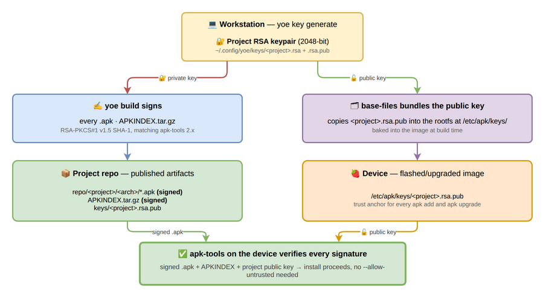

# apk Signing

yoe signs every `.apk` and the `APKINDEX.tar.gz` at build time with an
RSA-PKCS#1 v1.5 SHA-1 signature, matching what apk-tools 2.x verifies. Booted
systems include the matching public key under `/etc/apk/keys/`, so on-target
`apk add`, `apk upgrade`, and image-time package installation all run without
`--allow-untrusted`.



## What you need to know

- yoe auto-generates a 2048-bit RSA keypair on first build and stores it at
  `~/.config/yoe/keys/<project>.rsa` (private) and
  `~/.config/yoe/keys/<project>.rsa.pub` (public).
- The matching public key is published into your local repo under
  `<projectDir>/repo/<project>/keys/<project>.rsa.pub` and into the rootfs at
  `/etc/apk/keys/<project>.rsa.pub` (via `base-files`).
- A different signing key per project is the default. Two projects with the same
  `name` field share keys; use unique project names if that isn't what you want.

## Inspecting the current key

```
$ yoe key info
Signing key: /home/you/.config/yoe/keys/myproj.rsa
Public key:  /home/you/.config/yoe/keys/myproj.rsa.pub
Key name:    myproj.rsa.pub
Fingerprint: 1f3a:c2:e0:9d:42:8c:b6...
```

Use the fingerprint to confirm two systems are talking about the same key
without printing the full public key.

## Generating a key explicitly

`yoe key generate` is a no-op when the configured key already exists; if not, it
creates a fresh 2048-bit RSA pair at the configured path. The build pipeline
does the same auto-generation lazily, so most users never need to run this.

```
$ yoe key generate
Signing key: /home/you/.config/yoe/keys/myproj.rsa
Public key:  /home/you/.config/yoe/keys/myproj.rsa.pub
Key name:    myproj.rsa.pub
Fingerprint: 1f3a:c2:e0:9d:42:8c:b6...
```

## Pinning a key path explicitly

Override the default by setting `signing_key` on `project()` in `PROJECT.star`:

```python
project(
    name = "myproj",
    version = "0.1.0",
    signing_key = "/secrets/myproj.rsa",
    ...
)
```

The configured path is treated the same way as the default — yoe loads it if it
exists, generates a new keypair there if it doesn't.

## Key rotation

When you replace a key, every existing rootfs becomes unable to verify new
packages until the new public key is shipped. The recommended flow is:

1. Generate the new key (`yoe key generate` after deleting the old
   `~/.config/yoe/keys/<project>.rsa.pub`, or by setting `signing_key` to a
   fresh path).
2. Run `yoe build --force` so every cached apk gets re-signed with the new key.
   The build cache is content-addressed and doesn't include the signing key in
   its hash, so a fresh build after a key swap will otherwise replay cached apks
   signed with the old key.
3. Build a new image so `base-files` carries the new public key.
4. Flash or upgrade devices with the new image.
5. Once every device is rotated, retire the old key.

Because both keys can coexist under `/etc/apk/keys/` on-target, you can also
stage a rollover: drop both `.rsa.pub` files into the rootfs (e.g., via an
overlay), let devices upgrade onto the new key over a period, and then strip the
old one in a later release.

## What's signed and what isn't

**Signed:**

- Every `.apk` produced by `yoe build`. The signature covers the SHA-1 of the
  gzipped control stream; data integrity flows through the PKGINFO `datahash`
  field that the control stream carries.
- The per-arch `APKINDEX.tar.gz` regenerated on every publish.

**Not signed:**

- Bootstrap apks emitted by `yoe bootstrap`. These exist only inside the build
  container and are never installed on a target.
- Source archives, docker images, intermediate build artifacts. Only the final
  `.apk` and the index are signed.
