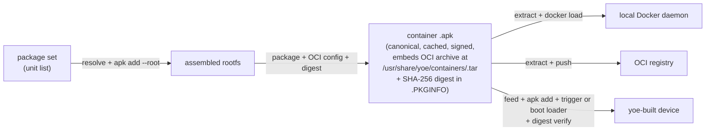

# Deployable Containers

## Summary

A new container-output mode that assembles the same `.apk` set yoe already
builds into a runtime OCI container, with the `.apk` as the canonical cached
artifact and the OCI image a deterministic projection of it. The same artifact
ships to embedded yoe images via the existing apk feed / OTA path, or to OCI
registries / local Docker daemons via an extended `yoe deploy`.

---

## Problem Frame

yoe today produces two artifact shapes from a unit set: `.apk` packages and
bootable disk images. A growing class of workloads doesn't fit either: an app
that depends on a newer library than the host OS provides (canonical example: a
modern-Qt application running on a long-lived embedded base), or an app a team
wants to deploy uniformly across edge devices _and_ cloud servers without
maintaining a parallel build definition.

In both cases, the missing artifact is a _runtime container_ — an OCI image that
bundles the app plus its full closure of libraries. Teams that hit either case
today have two paths, both bad. They can maintain a parallel `Dockerfile` beside
their yoe units (drift, duplicate dependency declarations, two caches, two
signing keys). Or they can re-base the embedded OS to get newer libraries
(touches every device, every test image, every BSP). The cost compounds.

The strategic case is already written in
[`docs/comparisons.md`'s "vs. Container Image Builders" section](../comparisons.md)
— the structural win yoe has over multi-stage Docker, apko, Bazel+rules_oci, and
Nix dockerTools is **one source of truth, one cache, shared across device and
container**. That section is currently marked `(planned)`; this spec is the
producer-side design that lets it ship.

### Alternatives considered (non-container paths in yoe)

For the _library-isolation_ sub-case (Qt-on-old-base specifically), yoe has two
existing primitives that could plausibly solve it without introducing a runtime
container:

- **App+libs bundle `.apk` with private rpath.** Ship the app and its newer
  library closure inside a single `.apk` whose binaries have rpath pointing at a
  private library directory (e.g., `/opt/myapp/lib`). No container daemon, no
  OCI projection. Works for one app at a time and breaks down once two apps want
  different versions of the same library on the same device.
- **`/opt`-overlay unit.** A unit that installs an isolated tree under
  `/opt/<app>/` with its own `LD_LIBRARY_PATH` invocation wrapper. Same cost
  shape as the rpath bundle, slightly more flexible at the cost of a wrapper.

These work for the Qt-on-old-base case viewed _in isolation_. They do **not**
satisfy the server+edge unification case — there is no rpath or /opt-overlay
move that produces an artifact you can also `docker run` on a Kubernetes node.
The container path is the right tool precisely because it is the only one that
delivers both sub-cases from a single artifact. Honest framing: server+edge is
the structural driver; Qt-on-old-base is a secondary beneficiary that the
container path also serves.

---

## Actors

- A1. **Unit author** — writes the Starlark `.star` file that declares a
  container's package set and runtime metadata. Same person who writes image
  declarations today.
- A2. **Build user** — runs `yoe build` / `yoe deploy` on a workstation or in
  CI. Cares about the dev loop being tight and reproducible.
- A3. **On-device runtime** — apk-tools, a yoe-shipped boot-time loader service,
  and a Docker-compatible container runtime, cooperating to materialize
  installed container `.apk`s into running containers.
- A4. **OCI registry** — external service the container is pushed to for
  server-side consumption.
- A5. **Local container daemon** — the docker daemon on the dev workstation; the
  target of the inner dev loop.

---

## Key Flows

- F1. **Author and build a container.**
  - **Trigger:** unit author writes a container declaration referencing a
    package set; runs `yoe build`.
  - **Actors:** A1, A2.
  - **Steps:** packages resolve via the existing DAG → rootfs is assembled from
    the resolved `.apk` set (same machinery as `image()`) → the result is
    packaged as a single `.apk` whose payload contains the OCI archive at a
    known sub-path (`/usr/share/yoe/containers/<name>.tar`) plus container
    config metadata and a SHA-256 digest of the OCI archive in `.PKGINFO` → the
    `.apk` lands in the per-project feed and the content-addressed cache.
  - **Outcome:** one cached `.apk` exists, addressable by the same hash
    machinery as every other unit.
  - **Covered by:** R1, R2, R4, R5, R6, R7.

- F2. **Deploy to an OCI registry.**
  - **Trigger:** build user runs `yoe deploy <container> --registry <url>`.
  - **Actors:** A2, A4.
  - **Steps:** yoe locates the cached `.apk` → extracts the OCI archive from
    `/usr/share/yoe/containers/<name>.tar` → hands it to a host OCI client tool
    for the push → tag mapping defaults to
    `<registry>/<project>/<name>:<version>` with a `:latest` sibling tag unless
    overridden.
  - **Outcome:** the registry holds an image any standards-compliant runtime can
    pull and run.
  - **Covered by:** R8, R10, R12.

- F3. **Deploy to local Docker (dev loop).**
  - **Trigger:** build user runs `yoe deploy <container> --docker`.
  - **Actors:** A2, A5.
  - **Steps:** yoe builds the container if stale → extracts OCI archive from the
    `.apk` → `docker load`s it into the local daemon.
  - **Outcome:** the container is immediately runnable with `docker run`.
  - **Covered by:** R8, R11.

- F4. **Install on a yoe-built embedded image (OTA-eligible).**
  - **Trigger:** the container's name appears in an `image(...)` artifact list,
    OR the device runs `apk add <container>` against the project feed.
  - **Actors:** A1, A3.
  - **Steps:** standard apk install drops the OCI archive at the loader's
    well-known on-disk location → the container `.apk`'s apk-install /
    apk-upgrade trigger script invokes the loader immediately (runtime install
    path), or on an image build the loader runs at boot before any user-facing
    container service starts (image-time install path) → the loader re-verifies
    the SHA-256 digest in `.PKGINFO` against the on-disk archive, refuses to
    load on mismatch, then `docker load`s the archive into the runtime daemon →
    the container's `services = [...]` declaration controls start/stop/restart
    via the same mechanism every other yoe unit uses.
  - **Outcome:** the device runs the container with no manual setup; updates
    arrive via the same `yoe deploy --device` path as any other `.apk`, and
    runtime installs take effect immediately without requiring a reboot.
  - **Covered by:** R8, R9, R13, R14, R15, R16.

---

## Pipeline diagram

---

## Requirements

**Container declaration**

- R1. yoe's Starlark surface gains a way to declare a runtime container as a
  unit, parallel to `image()`, taking a package list and producing a single
  build artifact.
- R2. Container declarations carry the OCI image-spec metadata needed for a
  runnable image: entrypoint, command, environment, labels, working directory,
  exposed ports, user. In addition — because containers run as services on the
  device (see R15) and the docker-run flag set is not expressible as OCI
  image-spec config — container declarations also carry the runtime fields
  needed to materialize a service script: volumes, network, restart policy,
  container name, additional `docker run` flags as needed. These are first-class
  Starlark fields, not a free-form map. yoe generates the
  `/etc/init.d/<container>` service script from these fields; this is a
  deliberate exception to CLAUDE.md's "no intermediate code generation" rule,
  justified because (a) the generated script is a thin wrapper around
  `docker run` whose every input is a declared Starlark field, and (b) the
  alternative (hand-written init.d per container) erodes the "containers are
  just yoe units" usability story that R15 promises.
- R3. _(Extracted to a prerequisite spec.)_ Today's `container()` builtin and
  its `container=` / `container_arch=` kwarg surface across `autotools()`,
  `cmake()`, `go()`, and `image()` are renamed to free the user-facing name for
  the runtime concept introduced here. The rename is a precondition for this
  spec — the producer pipeline below assumes the post-rename tree, where
  `container()` and `container=` refer to the runtime concept. The rename spec
  lives separately so it can land and propagate independently, and so reviewers
  of this work see a clean producer surface rather than a name migration in
  flight. (See companion spec: rename `container()` builtin and kwargs across
  module-core classes.)

**Producer pipeline**

- R4. Building a container produces exactly one `.apk` as the canonical cached
  artifact. The `.apk` participates identically in yoe's existing feed, signing,
  hashing, and OTA machinery — no parallel artifact storage, no parallel signing
  key, no parallel cache namespace.
- R5. The OCI archive bytes embedded inside the cached `.apk` (at the path
  `/usr/share/yoe/containers/<name>.tar` per R7) are deterministic: given the
  cached `.apk` bytes, any host extracting the embedded archive recovers
  identical bytes. The registry-side OCI manifest digest after push may depend
  on the host OCI client tool used (each tool's layer-packing and metadata
  choices differ); cross-host registry-digest equality is not part of this
  spec's guarantee. Determinism scopes to the `.apk`-internal archive, which is
  the surface yoe controls.
- R6. v1 emits a single-layer OCI image per container. The container's full
  assembled rootfs is one layer; cross-container layer dedup is not provided.
- R7. The container `.apk`'s payload embeds the OCI archive at the well-known
  sub-path `/usr/share/yoe/containers/<name>.tar` and carries a SHA-256 digest
  of that archive in its `.PKGINFO`. The sub-path commitment avoids the
  root-namespace collision between apk metadata (`.PKGINFO`, `.SIGN.RSA.*`,
  `.scripts.tar.gz`) and the flat tarball layout `docker load` expects; the
  digest in `.PKGINFO` carries the apk signing chain's trust forward to the
  loader's read point (see R14).
- R7b. Container input hashing follows the existing content-addressed cache
  rules; container-specific fields are gated on non-empty/non-zero per the
  `Extra` pattern in `internal/resolve/hash.go`, so units that do not declare
  container output stay cache-neutral.

**Deploy command surface**

- R8. `yoe deploy` accepts a container unit plus a destination selector.
  Supported destinations in v1: an existing device (via the apk feed / OTA
  path), an OCI registry, and a local Docker daemon. Raw OCI-archive-to-disk
  output is deferred to Scope Boundaries — the underlying extraction step is the
  same.
- R9. Deploying a container to a device uses the identical command path as
  deploying any other unit. A build user does not learn a container-specific
  verb or flag.
- R10. Deploying to a registry delegates the registry protocol to a
  battle-tested host OCI client (e.g., `oras`, `crane`, `skopeo`); yoe does not
  reimplement registry HTTP. Credentials are read from the host's existing OCI
  client configuration; yoe does not maintain a credential store. yoe
  additionally guarantees that (a) it invokes the OCI client as a subprocess and
  does not log, capture, or store the credentials it reads; (b) registry-push
  errors do not echo credential material in yoe's output (including stderr from
  the delegated client); (c) credential helpers are the preferred credential
  source, and plaintext `~/.docker/config.json` is documented as a known weaker
  path that yoe accepts but does not recommend.
- R11. Deploying to the local Docker daemon is build-if-stale: a single command
  produces a freshly-loaded image whether or not `yoe build` ran first. The
  result is immediately consumable by `docker run`.
- R12. Default registry tag mapping is `<registry>/<project>/<name>:<version>`
  with a `:latest` sibling tag. The mapping is overridable per-invocation.

**Embedded-image install**

- R13. A yoe image declared with a container in its `artifacts` list installs
  the container alongside other packages with no new field on the `image()`
  class on the _consumer_ side. The producer-side entry point (how a project
  declares a container unit in the first place) may introduce new surface; R13's
  promise scopes only to the install path consumed in F4.
- R14. The container loader is a dedicated yoe-shipped unit (working name:
  `container-loader`) that every image consuming a container `.apk` pulls in
  transitively. It is a v1 deliverable, not an assumption. Its OpenRC service
  materializes container archives from the loader's well-known on-disk path into
  the runtime daemon via two entry points:
  - **At boot** — runs after the docker daemon is up but before any user-facing
    container service starts; loaded once per archive, not on every reboot, when
    the on-disk archive has not changed.
  - **At runtime** — invoked by each container `.apk`'s apk install/upgrade
    trigger script immediately after install or upgrade, so
    `apk add <container>` on a running device makes the container available
    without waiting for the next reboot.

  Before invoking `docker load`, the loader re-verifies the SHA-256 digest in
  `.PKGINFO` against the on-disk archive bytes; on mismatch it refuses to load
  and surfaces the failure via standard service-failed signaling. The loader's
  failure contract: (a) explicit OpenRC `depend()` declaring it runs after
  `docker` and before any container service; (b) corrupted on-disk archive →
  skip with a prominent log message, leave the container un-started, do not
  block the boot; (c) partial `docker load` failure → all-or-nothing: remove any
  partial images then skip; (d) loader-failure → container's own init.d service
  fails fast with a clear "archive not loaded" message rather than running a
  stale or absent image.

- R15. Container start / stop / restart on-device is driven by the unit's
  standard `services = [...]` mechanism — the same machinery every other yoe
  unit uses to ship init.d scripts. The container's `.apk` ships its own service
  script, generated by yoe from the runtime fields declared in R2 (entrypoint,
  env, volumes, restart policy, network, name, etc.). The script is a thin
  `docker run` wrapper; the codegen exception to CLAUDE.md's "no intermediate
  code generation" rule is justified in R2.
- R16. v1 targets the Docker runtime on-device. A container `.apk` declares the
  runtime as a `runtime_deps` entry; the existing `_resolve_runtime_deps()`
  machinery in `image.star` automatically pulls the runtime into the image's
  rootfs artifact set when the container is declared in an image's `artifacts`
  list. The user does not need to list the runtime explicitly for it to land on
  the device.

---

## Acceptance Examples

- AE1. **Covers R4, R5.** Given a container unit built and cached. When a
  developer on a second machine `git pull`s the project and runs
  `yoe build <container>`, the OCI archive bytes inside the resulting `.apk` are
  identical (same SHA-256 digest) to those produced on the first machine,
  without either machine re-running the source build. Note: this assertion is
  about the `.apk`-internal archive bytes; the registry-side digest after push
  depends on the host OCI client (see R5).

- AE2. **Covers R9, R13.** Given an image declared with
  `artifacts = [..., "my-qt-app"]` where `my-qt-app` is a container unit. When
  the image is built, the on-device rootfs contains the container archive at the
  loader-watched path, and `apk info my-qt-app` on the device reports it as
  installed — no special image-class field, no special build flag.

- AE3. **Covers R11.** Given a stale or unbuilt container. When the developer
  runs `yoe deploy my-container --docker`, yoe builds the container (or reuses
  the cache when fresh), loads it into the local daemon, and exits with the
  image tag printed. `docker run` against that tag works without a follow-up yoe
  command.

- AE4. **Covers R14.** Given a fresh boot of a device with a newly-installed
  container `.apk`. When the boot completes, the loader has verified the archive
  digest against `.PKGINFO`, `docker load`ed it once, and the docker daemon's
  image list includes the container's tag exactly once. A second reboot (with no
  archive change on disk) does not re-load the archive.

- AE5. **Covers R16.** Given a project image whose `artifacts` list contains a
  container unit (e.g., `my-qt-app`) but does not explicitly list `docker`. When
  the image is built, the runtime-deps resolver auto-includes the Docker runtime
  declared by `my-qt-app`'s `runtime_deps`, and the resulting image rootfs
  contains a working Docker stack — the user does not need to list the runtime
  themselves.

- AE6. **Covers R8.** Given a built container unit. When the build user runs
  `yoe deploy <container> --registry <url>`,
  `yoe deploy <container> --device <addr>`, and
  `yoe deploy <container> --docker`, each command succeeds at its respective
  destination (or fails with a destination-specific error message) — the
  destination selector is the only surface that differs between invocations.

- AE7. **Covers R10, R12.** Given a container unit at version `1.0.0` declared
  in a project named `kiosk`. When the build user runs
  `yoe deploy my-app --registry ghcr.io/acme`, the pushed image carries tags
  `ghcr.io/acme/kiosk/my-app:1.0.0` and `ghcr.io/acme/kiosk/my-app:latest`. When
  the user passes `--tag ghcr.io/acme/kiosk/my-app:dev`, only that tag is
  pushed.

- AE8. **Covers R15.** Given a container unit declared with
  `services = ["my-qt-app"]` and the runtime fields necessary for a working
  `docker run`. When the container's `.apk` installs, the rootfs contains
  `/etc/init.d/my-qt-app` (generated by yoe from the unit's R2 fields), and the
  script is wired into the appropriate runlevel. After the loader runs, the
  service can be started by name and the container process appears in
  `docker ps`.

---

## Success Criteria

- The Qt-on-old-base use case (when isolation specifically is the load-bearing
  requirement — not merely "newer libs than the base") can be expressed
  end-to-end: a unit author declares a container with `qt6-base` + the app, the
  image author lists the container in its `artifacts`, and a build user can
  OTA-update just the container (`yoe deploy --device`) without re-flashing the
  device or rebuilding the base image. When isolation is not load-bearing, the
  Alternatives subsection above documents the simpler non-container paths.
- The server+edge case can ship one cached `.apk` to both targets: the container
  image bytes pulled from the registry and the container image bytes loaded
  on-device have the same OCI digest at the `.apk`-internal archive level, and
  `docker run <tag>` produces a process with identical environment, entrypoint,
  cmd, and mounted rootfs in both contexts. Orchestration-layer parity
  (Kubernetes Deployments, Helm charts, OpenRC service composition) is
  explicitly out of scope — teams may still maintain parallel deploy specs even
  with one identical artifact; this spec eliminates the Dockerfile, not the
  orchestration spec.
- A developer iterating on a container unit gets a `yoe deploy --docker` inner
  loop comparable to `docker build .` for speed, with yoe's per-package cache
  making library churn cheaper than Docker's layer cache makes it.
- The comparisons.md "vs. Container Image Builders" section can drop its
  `(planned)` marker once the producer side ships _and_ the v1 trust-posture
  statement (see Scope Boundaries) is documented for registry consumers.

---

## Scope Boundaries

- **Multi-layer OCI / cross-container layer dedup.** Single layer per container
  in v1. Adding layer dedup is the obvious upgrade target the day a fleet of
  containers with overlapping dependencies makes the cost real. See
  Dependencies/Assumptions for the migration cost when dedup eventually lands.
- **OCI as the canonical rootfs intermediate.** A more radical reframe in which
  both disk images and containers consume the same OCI artifact is deliberately
  not part of this work and deserves its own decision.
- **`yoe deploy --oci-archive <path>`.** Raw OCI-archive-to-disk output is not
  v1. It shares the underlying "extract OCI archive from cached `.apk`" path
  with `--docker` and `--registry`, so adding it later is a trivial follow-on
  once a concrete use case (e.g., air-gapped CI artifact handoff) surfaces.
- **Deploy destinations beyond Docker.** Podman, containerd / `ctr`, `nerdctl`,
  and Kubernetes-native paths are follow-ons that share the underlying "extract
  OCI archive from cached `.apk`" path.
- **Registry-side hardening features in v1.** Sigstore signatures, SBOMs,
  in-toto attestations, cosign integration — apko ships these today and the gap
  is acknowledged in comparisons.md. The v1 trust posture is therefore explicit:
  **registry-pushed OCI images in v1 carry no OCI-layer signature or
  attestation; consumers pulling from the registry must treat them as they would
  any unsigned third-party image.** Documenting this posture visibly for
  registry consumers is a precondition for the comparisons.md section dropping
  its `(planned)` marker.
- **Container workload orchestration.** Declarative workload definitions, health
  checks, OTA-aware pull/restart — out per `docs/containers.md`. This spec ships
  the producer + delivery, not the workload manager.
- **Read-only rootfs + A/B updates on the host image.** Tracked separately in
  `docs/containers.md`'s "What is not yet shipped" section.
- **Source-built Docker / containerd / runc replacing Alpine apk passthrough.**
  Separate roadmap item.
- **Coupling to the 2026-04-06 starlark-packaging refactor.** Approach 3 from
  the brainstorm (composable task lists) would be the natural shape _once_ that
  refactor lands. Not blocking on it.

---

## Key Decisions

- **`.apk` as canonical, OCI as derived projection.** Reuses the entire existing
  delivery pipeline (feed, signing, OTA, cache, `apk add` install). Cost is
  on-device storage doubling (the `.apk`-resident archive plus the loaded daemon
  layers); accepted, with optional post-load cleanup as a follow-on config knob.
  See Deferred / Open Questions for the size-budget measurement commitment.
- **Single-layer OCI v1.** Confirmed in dialogue. Dedup is YAGNI until a
  concrete fleet of overlapping containers exists; see Dependencies for the
  scheduled fleet-wide reload cost when dedup eventually lands.
- **Producer entry point on the existing `image()` class (or close-shaped
  equivalent).** Exact field-vs-class shape (e.g., `format="oci"` mode vs a
  sibling `container_image()` class) decided in planning. Rootfs assembly stays
  shared; only the emit step branches.
- **OCI archive embedded at a known `.apk` sub-path.** Resolves the
  root-namespace collision between apk metadata and `docker load`'s flat-tar
  expectation. Sub-path: `/usr/share/yoe/containers/<name>.tar`.
- **SHA-256 digest in `.PKGINFO`; loader re-verifies before `docker load`.**
  Carries the apk signing chain's trust forward to the loader's read point
  without introducing a second signing key.
- **Today's `container()` builtin renamed in a separate prerequisite spec.** The
  rename touches the builtin and the `container=` / `container_arch=` kwarg
  surface across every class. Splitting it out keeps this spec's producer
  pipeline coherent — the runtime-container work lands into a tree where the
  rename has already settled.
- **Docker as v1 on-device runtime.** Lowest-friction landing because
  `docker-image` and `selfhost-image` already ship the Docker stack;
  podman/containerd are follow-ons.
- **Registry protocol delegated to an existing OCI client.** Avoids reinventing
  well-trodden infrastructure. yoe orchestrates; the OCI client speaks HTTP.
- **No yoe-managed credential store; no credential leakage into yoe output.**
  Credentials live in the host's OCI client config (helpers preferred over
  plaintext); yoe never logs, captures, or echoes them.
- **Tag mapping defaults to `<registry>/<project>/<name>:<version>` plus
  `:latest`.** Overridable per-invocation.
- **v1 OCI registry images are unsigned at the OCI layer.** Apk signing protects
  the device delivery path; registry consumers get an unsigned image and must
  treat it accordingly. Sigstore-style attestation is deferred but the v1
  posture is explicit, not implicit.

---

## Dependencies / Assumptions

- The Alpine apk passthrough remains the runtime source for the on-device Docker
  stack (`docker`, `docker-engine`, `containerd`, `runc`, `tini`). Source-built
  runtime is not a v1 dependency.
- The renamed `container()` builtin and `container=` / `container_arch=` kwargs
  (per the prerequisite rename spec referenced by R3) have landed before this
  work starts. The producer pipeline below assumes the post-rename tree.
- `yoe deploy`'s existing device-targeting semantics
  ([feed-server-and-deploy spec](2026-04-30-feed-server-and-deploy.md)) carry
  forward unchanged.
- The host running `yoe deploy --registry` has a working OCI client tool (`oras`
  / `crane` / `skopeo`) installed and authenticated. Missing or unauthenticated
  clients produce a clear error, not a silent failure.
- The host running `yoe deploy --docker` has a running Docker daemon reachable
  via the standard socket.
- The OCI image specification version targeted is what current Docker daemons
  consume; no special handling for spec versions or schema migrations.
- The `container-loader` unit (per R14) exists as a v1 deliverable and is pulled
  in transitively by any image that consumes a container `.apk`.
- **Future fleet-wide reload cost when dedup lands.** Adopting multi-layer OCI
  in a later version will change container archive hashes fleet-wide, triggering
  a one-time reload of every container on every device at the next OTA boot.
  This is acceptable as long as the loader handles repeat-load correctly (R14's
  failure contract is the relevant surface), but the operational cost should be
  named explicitly when the dedup decision is made.

---

## Deferred / Open Questions

### From 2026-05-25 review

- **[Affects Key Decisions / Success Criteria] Storage doubling budget.** The
  on-device `.apk`-resident archive plus loaded daemon layers double the
  effective storage of a container. The spec accepts this without a number;
  before v1 ships, measure the delta on a representative Qt container and decide
  whether optional post-load archive cleanup belongs in v1 or as a follow-on
  config knob. Likely budget: explicit minimum eMMC requirement for
  container-using images, stated alongside the Docker-runtime requirement.

- **[Affects R14 / F4 / Dependencies] Loader terminology and shape.** The
  current draft uses "loader service" in flows/requirements and "loader unit" in
  Dependencies for the same component. The terminology choice depends on the
  loader's final shape (a single `container-loader` Starlark unit that ships an
  OpenRC service is the likely answer). Settle in planning, alongside the unit's
  idempotency contract (digest-diff vs `.loaded` marker file).

- **[Affects R14 / R15] On-device loader privilege level.** The loader must call
  `docker load`, which requires root or docker-group membership (the latter is
  effectively passwordless root on Linux). Requirements-level decisions still
  owed: (a) does the loader run as root or as a dedicated user in the docker
  group, and why? (b) what filesystem ownership and permissions does the
  loader's watched path require? (c) is the loader's init script and any helper
  binary documented as a security-relevant component the planning phase must
  treat accordingly? Resolve before implementation, not at it.

### Open Questions deferred to Planning (technical)

- [Affects R2][Technical] Exact set of OCI image-spec config fields and
  docker-run runtime fields surfaced as first-class Starlark fields. The spec
  names the categories; planning lands the schema.
- [Affects R8][Technical] Flag shape for the deploy-destination selector (one
  `--target=device|registry|docker` flag vs three destination flags vs
  destination-as-positional-arg).
- [Affects R14][Technical] Loader idempotency mechanism — digest-diff against
  `.PKGINFO` (preferred, since the digest is already there for integrity
  verification) or `.loaded` marker file. The integrity-verification requirement
  (R14) makes digest-diff a natural reuse.

### Open Questions deferred to Planning (research)

- [Affects R14][Needs research] Multi-arch registry push from a single dev host
  (separate per-arch builds vs manifest-list assembly). Not addressed in this
  spec; needs a planning-stage investigation against how `oras`/`crane`/`skopeo`
  handle manifest lists for multi-arch tags.
- [Affects R15][Needs research] Container `apk del` story — when a container
  `.apk` is removed, does anything `docker rmi` the loaded image, or do orphan
  images accumulate in `/var/lib/docker`? The cleanest answer probably involves
  an apk pre-remove trigger script that mirrors the install/upgrade trigger from
  R14.
- [Affects R12][Needs research] Tag-collision behavior across projects on the
  default `<registry>/<project>/<name>:latest` tag — device-side docker doesn't
  see project scope, so two projects pushing different containers with the same
  name produce a `:latest` collision. Needs a planning-stage recommendation
  (project-prefixed tags by default? collision-detection warning at deploy
  time?).
